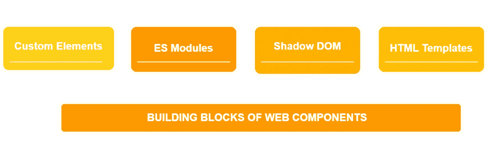
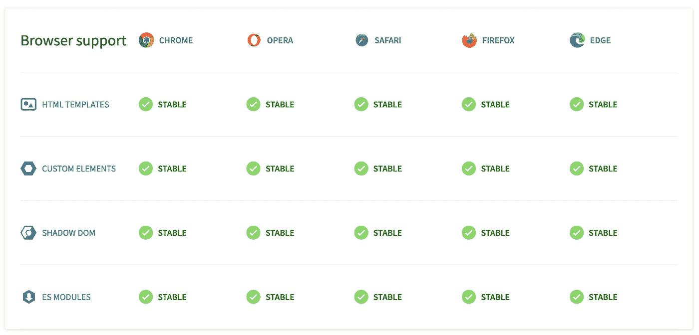
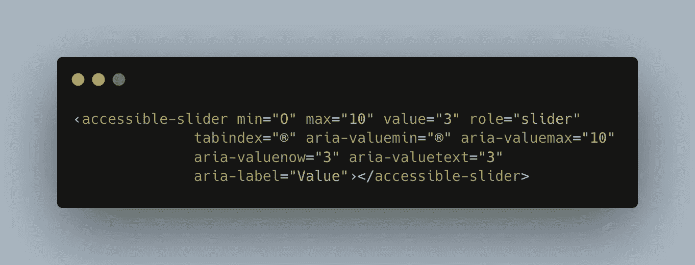

# 在设计系统中使用 web 组件的 5 个理由

> 原文：<https://levelup.gitconnected.com/5-reasons-to-use-web-components-in-your-design-system-bff59d066cbf>

了解为什么 web 组件是构建设计系统的好选择

最大的问题是:[为什么这些 IT 巨头专注于 web 组件](https://arewebcomponentsathingyet.com/)？它们真的那么重要吗？在过去的十年中，web 组件的使用飞速增长，它们已经成为最流行的新 web 平台技术之一。事实证明，Web 组件在广泛的应用程序中非常有价值。

# 为什么要使用 web 组件构建设计系统？

Web 组件可以在框架和库之间互换，因为它们与各种技术栈兼容。他们提供跨平台开发，并确保品牌一致性。Web 组件允许我们将一个复杂的 web 应用程序分解成可重用的部分，这些部分将具有相同的外观和功能，而不管它们与什么共享一个页面。它们提供了一种一致的方法，通过它们的属性与它们交互，它们主要专注于做好一件事。web 组件的另一个优势是，当构建在浏览器 APIs 标准而不是框架之上时，设计系统的 JavaScript 足迹要轻得多，这是网站性能的关键。

## 易于定制和标准化样式

web 组件的一个主要特征是能够创建定制的部分，这些部分可以被调整并整合到[设计系统](https://backlight.dev/mastery/what-is-a-design-system)中。任何设计都可以使用 web 组件进行风格化和定制。我们可以使用 HTML/CSS/JS 构建一个可定制的 UI 组件库来满足品牌标准。

## 由现代浏览器支持

所有常青树浏览器 Chrome、Opera、Safari、Firefox、Edge 都支持 web 组件标准。这意味着 API 自定义元素、HTML 模板、Shadow DOM 和 es 模块功能齐全，并为这些浏览器提供全面支持。这使得开发人员和设计人员的生活变得更加容易，因为他们可以在可定制的 HTML 标签上进行编写，而不用担心框架和库。

## 独立于框架

在大公司里，不同的团队为一个项目的不同领域做出贡献。这些团队基本上是独立的，这意味着他们使用自己的工具和框架构建应用程序。然而，作为一个企业，你会希望确保用户体验在整个产品中是一致的，不管每个团队决定使用什么。建议创建一个独立于任何框架的 web 组件库。在这样做的时候，这些组件可以被团队互换使用，不管他们使用的是什么框架。

然而，在 React 和 Angular 等框架中使用 web 组件需要注意一些问题。使用 React 的主要问题是 React 无法绑定来自 web 组件的自定义事件，并且由于缺少到自定义元素的属性绑定，React 无法传递丰富的数据。另一方面，Angular 框架依赖于它自己的 web 组件库，这在导入和配置包时会导致很多问题。

## 易接近

Web 组件可以被访问。对于要交互的 web 组件，例如任何 UI 控件，它应该是键盘可聚焦的。 [WAI-ARIA 创作实践](https://www.w3.org/TR/wai-aria-practices/)可以在这方面有所帮助。交互控件的状态包括焦点、悬停和活动。他们都应该很容易被看到，理想情况下，每一个都有独特的外观。

由辅助技术控制的页面帮助用户使用键盘、鼠标等与 web 组件进行交互。

使定制元素更易访问的另一种方法是使用适当的 aria 属性；我们要做的就是遵循 WAI-ARIA 定义。让我们看一个例子，一个使用 web 组件构建的可访问的滑块组件:

用 web 组件构建的可访问滑块组件

影子 DOM 并不总是有助于实现可访问性，有时它会使事情变得更困难。

通过像`aria-describedby`和`aria-labelledby`这样的属性的 ARIA 引用有一个代表它们描述或标记的元素的`id`的值。如果在`id`和通过`aria-`引用它的元素之间有一个阴影边界，那么这个引用基本上被破坏了，不起作用。要解决这个问题，您可以将元素投影到 Light DOM 中，例如使用 slots。

再比如`<form>`和自定义输入元素。如果在本机表单和自定义元素所包装的本机输入元素之间存在阴影边界，则输入不会参与表单。表单参与 API 旨在解决这个问题，但 Firefox 和 Safari 尚未提供。现在，这个问题可以用与上一个问题类似的方式解决，将原生输入投射到 Light DOM 中。

> *💡看看* [*制作一个 web 组件的所有方法*](https://backlight.dev/blog/5-reasons-to-use-web-components-in-your-design-system) *。*

## 包装

所有的样式封装都由影子 DOM 提供。它通过为组件提供自己的 DOM，将组件与文档的其余部分分离开来。这意味着全局样式(不包括 CSS 自定义属性/变量和继承的样式)对它没有影响，并且它自己的样式对父文档中的其他元素没有影响。我们不必再担心 CSS 泄漏或命名约定，因为影子 DOM 中的 HTML 和 CSS 代码对主 DOM 是不可见的。例外情况如下:

*   [CSS 自定义属性](https://developer.mozilla.org/en-US/docs/Web/CSS/--*)
*   [继承风格](https://developer.mozilla.org/en-US/docs/Web/CSS/inheritance#inherited_properties)
*   [::零件(阴影零件)](https://developer.mozilla.org/en-US/docs/Web/CSS/::part)

影子 DOM 的目的与全局样式表相反。如果我们要创建一个可重用的组件，需要使用像 Tailwind 或 Bootstrap 这样的全局样式表，我们可以关闭 Shadow DOM。但是，通过封装，开发人员可以完全控制 API 以及哪些特性可供用户使用。使用 Shadow DOM，开发人员还可以通过将 DOM 节点公开为[阴影部分](https://developer.mozilla.org/en-US/docs/Web/CSS/::part)来从外部对它们进行样式化。

## 结论

Web 组件提供的不仅仅是上面提到的特性。它们已经可以生产了，因为像 GitHub 这样的公司正在使用开源 web 组件。这里可以阅读更多[。](https://github.blog/2021-05-04-how-we-use-web-components-at-github/)

从头开始编写可访问的组件是很昂贵的，不是所有的公司都能负担得起。多亏了 web 组件，我们可以将现有的开源组件库整合到我们的[设计系统](https://backlight.dev/mastery/what-is-a-design-system)中，或者使用像[狮子](https://lion-web.netlify.app/)这样的基于白色标签的层来构建我们自己的组件库。这里有一个精选的[最重要的开源组件库](https://backlight.dev/mastery/best-open-source-component-libraries-for-your-design-system)，你可以用它作为你的[设计系统](https://backlight.dev/mastery/what-is-a-design-system)的基础。另外，请查看[为什么您应该在您的设计系统中使用开源组件库](https://backlight.dev/mastery/why-you-should-use-open-source-component-libraries-in-your-design-system)。

*原载于*[*https://back light . dev*](https://backlight.dev/blog/design-system-documentation-best-practices)*作者:*[@ soniasinglas](https://twitter.com/soniasinglas)[@ jorenbroekema](https://twitter.com/jorenbroekema)*2022 年 5 月 19 日。* [*背光*](https://backlight.dev/) *是一个在 dev 端运送设计系统的协作平台。*