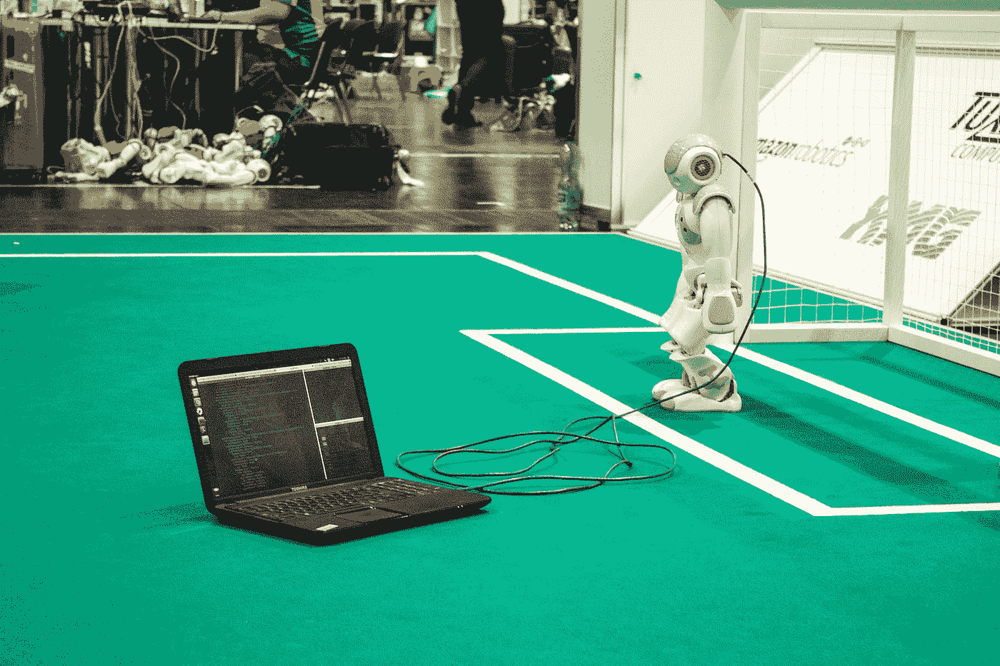

# 你应该把 C 作为第一语言学习的 5 个理由

> 原文：<https://levelup.gitconnected.com/5-reasons-why-a-you-should-learn-c-as-your-first-language-7db054620bc0>

## 从 C 开始有助于你很好地理解基本概念

[C M](https://unsplash.com/@ubahnverleih?utm_source=medium&utm_medium=referral) 在 [Unsplash](https://unsplash.com?utm_source=medium&utm_medium=referral) 上拍照

当你开始学习编程时，你问“我应该学习哪种语言？”。世界上有几种语言，你应该选择哪一种作为你的第一语言。

如果你想从事计算机科学的职业，你应该学习的第一门语言是:

> c 编程语言

c 语言已经成为大学计算机科学课程的一部分，但是新时代的开发者并不太重视这门语言。像 *Java、Python、Javascript、Ruby 和 C#* 这样的高级语言越来越受大学学生的欢迎。

嗯，我不怪他们不学习 C 语言，因为新时代的高级语言很容易学习，有丰富的框架，与 C 语言相比，你需要写的代码要少得多。

即使在当今世界，学习 C 编程语言也有很多好处。我们将讨论其中的几个:

# c 让你思考

不像高级语言给你方法和 API 来操作数组、栈、队列等。，您需要自己实现这样的功能。

这需要对系统级的事情如何发生有很好的洞察力，比如

*   变量、数组等。存储在存储器中
*   你如何操纵变量。
*   你可以处理所有棘手的案子。

因为思考先于编程，所以用 C 实现算法和数据结构需要你在实现之前思考，然后再思考。

# 理解基本概念的好方法

用 C 语言开发软件可以让你实现/理解计算机科学的概念，比如—

*   互斥（体）…
*   旗语
*   原子操作
*   进程间通信
*   共用存储器

有许多开源代码库可能会对您有所帮助。但是查看源代码可以帮助你真正理解这些概念以及它们是如何实现的。

# 与硬件互动的机会

现在有各种各样的语言帮助你交互和控制硬件，比如 Python，但是大多数 SDK 和平台都支持 c。

c 语言在嵌入式软件领域被广泛使用。它用于固件、中间件，甚至用于操作系统。有许多可用的 c 语言编写的 RTOS

汇编语言在这方面是 C 的替代，但是写汇编要花很多时间和精力。

如果你想制造一个电子产品或者想用微控制器来自动化你的日常工作，C 语言是一个不错的选择。

# 帮助您理解内存管理

当我们第一次看到 C 语言中的指针时，大多数人都会害怕它们。在理解了指针的概念后，我开始喜欢上了它们。我不是每天都用 C 写代码，但是当我写 C 代码的时候，我经常使用指针。

在用 C 编写代码时，内存管理、分配空间和释放空间是您需要注意的事情。与有垃圾收集器的高级语言不同，C 没有垃圾收集器，您需要注意内存。

# 让你成为更好的程序员

在我职业生涯的前 5-6 年，我在嵌入式系统领域工作，编写固件和中间件。一旦我转向 Java、Python 和 Ruby 这样的高级编程语言，我意识到我从 C 语言中学到的概念让我成为了一名更好的程序员，也帮助我在其他语言中很好地编码。

在用 C 写代码的时候，你需要自己管理一切，你写更多的代码，你从 Linux 内核中获得灵感，你学到很多关于编程的方法。

信不信由你，C 让你成为更好的程序员。

# 包扎

我已经面试新生很多年了。我看到大多数大学毕业生都具备 Java、Python、Javascript 和其他高级语言的知识。我并没有说这是错误的。我注意到的是这些天基本概念的知识缺失了。

学习 C 对一个程序员有好处，不一定是作为第一语言。但是学了高级语言之后写 C 代码就变得很难了。我可以为此担保。

 [## 每当 Amrit Pal Singh 发布内容时，您都会收到一封电子邮件。

### 每当 Amrit Pal Singh 发布内容时，您都会收到一封电子邮件。通过注册，您将创建一个中型帐户，如果您还没有…

singhamrit.medium.com](https://singhamrit.medium.com/subscribe)