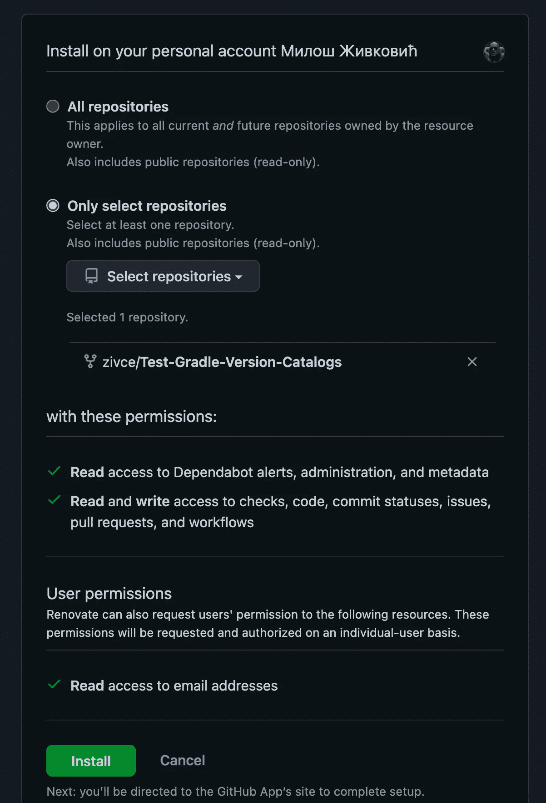
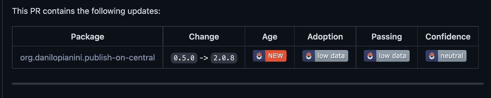

# 有经验的开发人员使用梯度版本目录的 5 个原因

> 原文：<https://levelup.gitconnected.com/5-reasons-why-experienced-developers-use-gradle-version-catalogs-54902605b8c1>

## 如何使用分级版本目录实现更简单、更灵活、更安全的依赖管理


Lexica.art

***大多数 Java 开发人员都乐于使用 Gradle 或 Maven。***

***但是依赖管理还有什么其他的选择呢？*** 一个是 Gradle 版本目录。大多数人忽视了这个工具的好处。

这里有 5 个你应该使用 Gradle 版本目录的理由。

# 您可以自动更新依赖关系

正如你所看到的，很多前端仓库都有自己的**依赖机器人**为它们更新库。 ***我们可以对后端进行同样的操作吗？***

如果我们研究一下相关问题，我们会发现**依赖机器人**不支持分级版本目录。

***为什么？*** **GitHub 喜欢 C#，所以没有 Java。玩笑归玩笑，**dependent bot**目前不支持 Gradle 版本目录。虽然有意志力来支持这个特性，但是没有人开始研究这个。**

那么，有什么别的方法可以获得自动更新呢？

我们可以检查[翻新](https://github.com/apps/renovate)。你需要安装这个应用程序。这是安装屏幕。



在回购的根中，您还需要下面的`renovate.json`。

```
{ "$schema": "https://docs.renovatebot.com/renovate-schema.json", "extends": [ "local>DanySK/renovate-config" ], "baseBranches": [ "master", "minimal" ], "automerge": false}
```

拉取请求将开始滚滚而来。

为什么我们甚至需要这些自动更新？ 手动更新没什么不好。

但是你损失了很多时间，这是一项繁重的工作。而翻新的另一点是 ***安全*** 。你将获得全新的更新并消除安全问题。



你将拥有类型安全的依赖访问。

没有版本目录，向所有子项目添加一个依赖项是一件麻烦的事情。对于版本目录，这与导入一个新类是一样的。

安全型保证了易用性。随着我们获得了自动完成特性，我们在添加新的依赖项时会加快速度。

对于 IntelliJ，您可以在 `[build.gradle](https://youtrack.jetbrains.com/issue/IDEA-279603/Code-completion-for-Gradle-Version-Catalogs-in-groovy-build-files#focus=Comments-27-6109308.0-0)`中添加一个构建脚本[，以实现自动完成。](https://youtrack.jetbrains.com/issue/IDEA-279603/Code-completion-for-Gradle-Version-Catalogs-in-groovy-build-files#focus=Comments-27-6109308.0-0)

```
buildscript { dependencies { classpath files(libs.class.superclass.protectionDomain.codeSource.location) } }
```

在`settings.gradle`中，您需要添加以下内容:

```
dependencyResolutionManagement { versionCatalogs { create("libs") { from("com.test:test-gradle-dependencies:1.0-SNAPSHOT") } } }
```

# 您将拥有一个灵活的单一依赖源

如果您将版本目录放在一个单独的 repo 中，您将有一个地方来更改依赖关系。

如果你和巴泽尔一起工作过，这和`WORKSPACE`文件是一样的。您将在那里定义所有的依赖项，并在 monorepo 中进行更改。

类似于版本目录，尽管如果需要，您可以覆盖子项目中的依赖关系。覆盖的灵活性仍然可用。 ***但在未来版本目录将是依赖关系的唯一来源。***

这里有一个教程可以启用单独的版本目录回购:[集成版本目录|介质](https://umang91.medium.com/integrating-a-version-catalog-c5c7d45516db)

***单一依赖源解决什么？***

*   跨项目更快更新
*   更轻松的版本更新
*   更容易添加新的依赖项

要更新到较新的依赖版本，您只需要在一个地方进行更新。更新版本目录条目后，您需要打包一个新的版本目录。并在相关项目中使用它。

没有版本目录，您需要更新每个项目。当处理多个项目时，这可能会慢一些。

如果您需要添加一个新的依赖项，您将只在版本目录中添加它。在所需的依赖项目中，您将添加一个新条目。

***如何从目录中移除依赖关系？*** 您在`toml`文件中删除它，并更新相关项目中的目录。在编译时，你会得到一个错误指出删除的依赖。

依赖项目不知道版本的变化。您只需将版本目录更新到最新版本，然后继续前进。 ***每一个属地都会马上得到收拾。***

版本目录的另一个优点是什么？库更改监控。

您将很容易跟踪依赖性的变化。因为它们都在一个地方，所以你知道什么时候发生了什么变化。

***否则，你会用代码 PR 偷偷修改依赖关系。***

有了版本目录，每个版本目录 PR 只更新依赖项。如果需要，您可以退回到旧版本目录并继续前进。

# 这不是解决依赖性问题的灵丹妙药

使用版本目录也有缺点。本质上不是缺点，但不是目录版本的用例。

您需要将版本目录仅仅视为愚蠢的库版本声明。

***所以不能做依赖排除的事情。*** 你只能把它们当神器用，知道自己需要什么版本。没有什么智能内置，因为这不是版本目录的用例。

> 这不是版本目录的目的。我们不应该鼓励使用排除，而是相反。目录是关于不可知论的库声明:它们不关心调用位置，从某种意义上说，它们不关心它们的用途。特别是，他们应该使用什么变体:这是关于坐标的。— [投稿人](https://github.com/gradle/gradle/issues/20274#issuecomment-1078802201)

***版本目录回购的另一个骗局是什么？*** 你也需要维护这个回购。如果你有很多项目，有时这可能是一个问题。YMMV，但是版本目录对您的团队来说可能是一个很好的依赖管理工具。

***同样，你也不能为插件定义版本。***

这样做是出于一致性问题，但是现在[你只能拥有无版本插件](https://melix.github.io/blog/2021/03/version-catalogs-faq.html#_can_i_use_a_version_catalog_to_declare_plugin_versions)。不是一个大的交易破坏者，但你不希望这种行为。

# 您可以捆绑常见的依赖项

如果有共同的依赖项，可以将它们捆绑在一起。这样你可以用更少的语法做更多的事情。

包在库文件`toml`的包部分声明。

```
[bundles]
testDependencies = ["junit-jupiter", "junit-engine"]
```

在依赖项目中，您可以像使用任何其他依赖项一样使用它们。

```
testImplementation libs.bundles.testDependencies
```

使用捆绑包从您的`build.gradle`中移除了许多样板文件。但是另一件好事是这是一个共享的依赖包。您可以在所有项目中使用包。

***只捆绑共同的或相关的依赖关系。*** 正如你不能把依赖从捆绑中分割出来。

***那么到底需要设置什么版本目录呢？*** 你可以在下面的 repo 中找到设置:[GitHub—zone 84—examples/version—catalog—consumer—Demo:共享 Gradle 版本目录的演示项目](https://github.com/zone84-examples/version-catalog-consumer-demo)