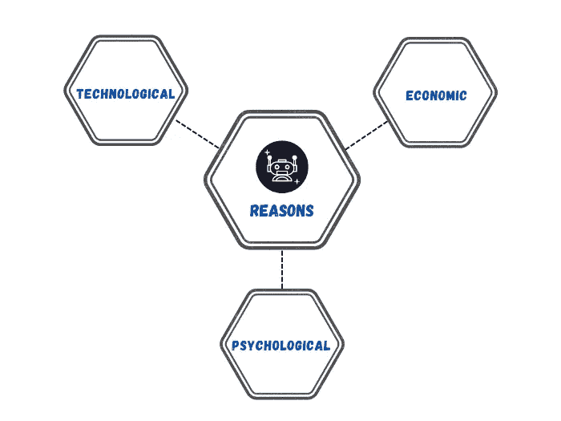
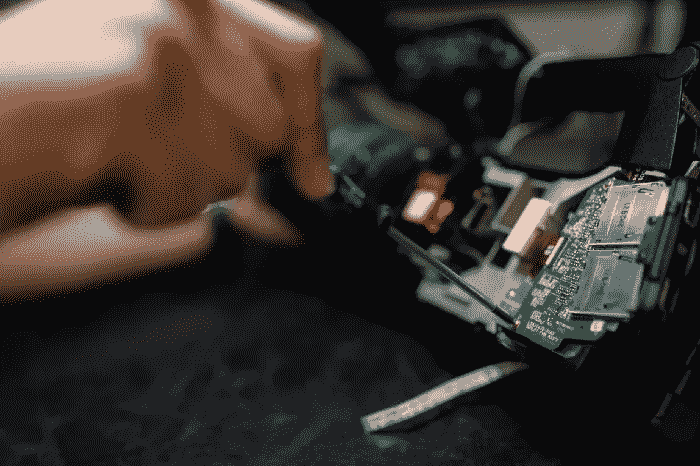
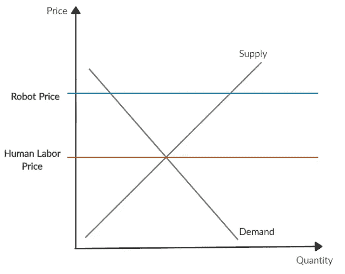

# 机器人技术尚未成熟的 5 个原因

> 原文：<https://levelup.gitconnected.com/5-reasons-why-robotics-is-yet-to-mature-e10ae0483d06>

## 为什么特斯拉人形机器人仍然不能行走？

奥其尔-额尔德尼·奥云梅格在 [Unsplash](https://unsplash.com/) 上拍摄的照片

一些专家声称机器人技术是一项颠覆性的技术。我们许多人都知道，在未来的某一天，机器人将成为我们生活中不可或缺的技术，就像今天的智能手机一样。

> 机器人将能比我们做得更好。——埃隆·马斯克

你可能认为机器人应该是一个有利可图的行业。但实际上，对于今天的大多数情况来说，这可能并不正确。

尽管对机器人的宣传和兴奋，我们仍然可以在今天的新闻中看到许多机器人初创公司的失败:[沃尔玛终止了与波沙·诺瓦机器人公司的合同](https://www.cnbc.com/2020/11/02/walmart-ends-contract-with-robotics-company-bossa-nova-report-says.html#:~:text=Walmart%20has%20cut%20ties%20with,robots%2C%20according%20to%20the%20report.)， [Rethink Robotics 关闭](https://www.asme.org/topics-resources/content/rise-fall-of-rethink-robotics#:~:text=They%20suffered%20because%20Rethink%20prioritized,robots%20to%20improve%20their%20performance.)，以及 [Anki 停止运营](https://www.failory.com/cemetery/anki)。

我们还没有准备好迎接另一场技术革命吗？严酷的事实表明，我们可能还没有准备好。

与 SaaS 和金融科技行业相比，**机器人公司往往需要更长的时间才能盈利**。

在我看来，成熟时间长可归结为三个主要原因:

# A.技术原因

## 1.技术上困难

照片由[本工程图](https://unsplash.com/@thisisengineering)在 [Unsplash](https://unsplash.com/) 上拍摄

造一个机器人底盘没那么简单。在机箱内部用电缆连接硬件也不是件容易的事。开发和实现机器人软件相当具有挑战性。而**整合所有这些就更复杂了**。

想象一下你的团队完成了一个机器人底盘的制造。但是后来，你的软件工程师发现由于软件的限制，需要改变摄像机的位置。机械团队需要重新设计传感器支架。软件工程师必须暂停他们的测试，直到硬件准备好。

这种迭代过程在机器人开发中非常常见。你可以想象硬件和软件工程师之间的沟通失误可能会相当昂贵。

此外，与软件应用相比，在机器人中调试问题甚至更难。大多数时候，工程师必须进行一系列测试来确定问题是来自软件还是硬件。

**机器人开发最棘手的部分之一是硬件**,因为大多数机器人公司都外包硬件。换句话说，你并不知道每一个硬件细节。当出现硬件问题而数据表没有多大帮助时，您知道您的工程师内心在哭泣。

## 2.各种技术的改进空间

照片由[娜娜杜瓦](https://unsplash.com/@nanadua11)在 [Unsplash](https://unsplash.com/) 上拍摄

尽管机器学习算法在过去十年中有所改进，但企业要开发全面的智能机器人还有很长的路要走。

甚至埃隆·马斯克也表示，现有的特斯拉人形机器人“擎天柱”在 2022 年特斯拉人工智能日(T9)仍然“缺少一个大脑”。你可以知道开发机器人的大脑需要多少努力。

**机器人的智能水平也高度依赖硬件**。机器人需要高性能的 CPU 和 GPU 来实时进行复杂的计算。尽管这些年来硬件已经有了很大的改进，但要充分发挥人工智能的潜力，仍有很大的改进空间。

更不用说**传感器仍然需要在精确度和一致性方面进行一些升级**以满足软件功能。

[Vitaliy Goncharuk](https://medium.com/u/58b75f6d1f53?source=post_page-----e10ae0483d06--------------------------------) 在他的文章——**模块化人工智能软件系统**和**中还提到机器人产业缺少两个组成部分[需要能够集成并以低价运行的硬件](https://vactivity.medium.com/when-do-robotics-and-drones-companies-stop-failing-c5ab06cf5abc)**。

# B.经济原因

## 3.需求< Supply

From an economic point of view, the market demand for the robot is lower than the supply. The main factor is it is expensive compared to its **主要竞争对手** —人力。

如果你能雇佣花费少得多的人，谁会收养一个昂贵的机器人呢？人形机器人和[机器人厨师](https://robbreport.com/gear/electronics/moley-robotics-robot-kitchen-uk-for-sale-1234590791/)更是如此。人类劳动者可以轻松胜过机器人，因为他们能够完成几十项任务。感谢我们大脑中最复杂的“神经网络”。

虽然工业和清洁机器人在大多数发达国家都很常见，但在不发达国家却不是这样，那里的人力比机器人便宜得多。

用机器人代替人类工人当然会带来不确定的风险。例如，机器人的维护可能会妨碍生产效率，或者机器人可能会随着时间的推移而不按预期执行。这些风险使得人们选择不采用机器人，导致需求减少。

## 4.昂贵的事情

由[乔希·阿佩尔](https://unsplash.com/@joshappel)在 [Unsplash](https://unsplash.com/) 上拍摄的照片

我不能强调制造一个机器人产品是多么昂贵。昂贵永远是机器人创业公司成功的主要障碍。

开发机器人的成本随着其漫长的开发时间、意想不到的费用和其他不确定性而呈指数增长，导致企业家和投资者的进入壁垒很高。

与其他商业产品不同，机器人业务的启动成本过高，通常花费在昂贵的硬件和工程师更高的工资上。

最具挑战性的阶段通常是原型阶段。该公司不产生利润，但需要投入大量资金来制造原型。长期的负现金流通常会导致失败。

听完这些，你觉得机器人行业对你接下来的创业想法或者新的投资选择来说是否有利可图？可能还有更好的选择。

# C.心理原因

## 5.社会认可度低

安迪·凯利在 [Unsplash](https://unsplash.com/) 上的照片

**社会不容易接受机器人的原因有一个——不确定性**。人们倾向于回避他们不知道的事情。在心理学中，这种现象被称为[不确定性回避](https://culturematters.com/what-is-uncertainty-avoidance/)。

他们中的一些人害怕机器人的能力。即使几家领先的机器人公司承诺不支持他们的机器人武器化，一些国家发展军用机器人仍然是不可避免的。谁知道呢？黑客可能会瞄准你可靠的 Roomba **来监视和攻击你**。

假设我们可以解决机器人武器化和网络安全问题，但几个问题仍然存在。

由 Issac Asimov 提出的[机器人三定律](https://www.britannica.com/topic/Three-Laws-of-Robotics)试图为机器人发展创造一个伦理规则。然而，有一个问题是法律没有合理解决的——**电车问题**,这涉及到是否牺牲一个人来拯救更多人的伦理困境。( [Tanay Jaipuria](https://medium.com/u/e6743095a27b?source=post_page-----e10ae0483d06--------------------------------) 在他的[文章](https://medium.com/@tanayj/self-driving-cars-and-the-trolley-problem-5363b86cb82d)中很好地讨论了这个话题，请查看以了解更多信息。)

另一个更相关的话题是**无人机坠落问题**。人们担心一架有故障的无人机从天而降可能会伤人。这也是今天很多国家很多政策限制无人机飞行的原因。换句话说，这些规则限制了自主无人机行业的发展。

# 我们走在正轨上

尽管经济低迷，机器人领域显示出未来造福人类的前景。随着技术的发展和硬件成本的降低，这些年来机器人变得越来越容易接近。

一个人类和机器人共同生活的世界是多么令人兴奋和恐惧？