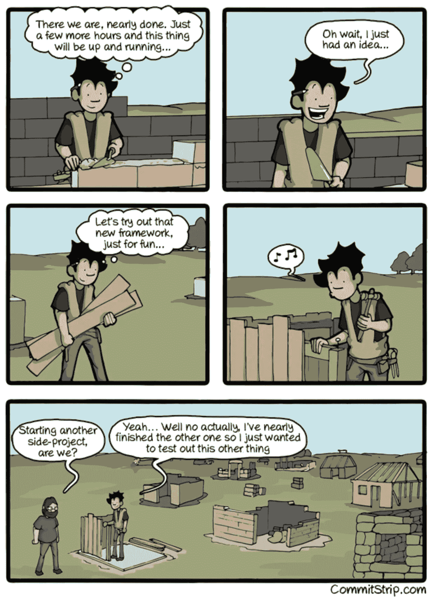
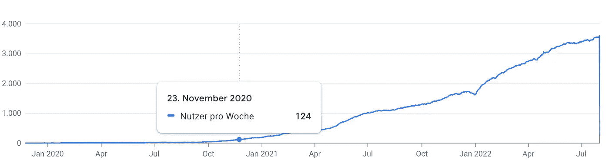

# 副业永远无法完成的 5 个原因

> 原文：<https://levelup.gitconnected.com/5-reasons-why-side-projects-never-get-finished-1a765aabe35b>

## 以及如何回到正轨的提示！

从[像素](https://www.pexels.com/de-de/foto/man-ripping-finish-line-strap-2524739/)运行 4 个 FFWPU 的照片

> **你是程序员吗？**
> 
> 很有可能 9 月 10 日你有积极的副业。
> 
> **你发表过副业项目吗？**
> 
> 你很可能没有

## **为什么会这样？**

这似乎是一件简单的事情。你只需要继续努力直到完成，对吗？显然不是。

> 开发人员平均每周花 7 个多小时在编码上。— [StackOverflow](https://insights.stackoverflow.com/survey/2015#profile-sideprojects)

即使是最积极的人似乎也无法完成他们的项目想法，原因有很多，但好消息是有办法解决这个问题。如果你目前陷入这种情况，这里有一些关于如何回到正轨的提示！

 [## 网络亮点- PDF 和网络荧光笔

### Web Highlights 是一个在 Web 上突出显示文本的工具，可以更有效地组织您的研究。提升你的…

web-highlights.com](https://web-highlights.com/) 

# 1.闪亮物体综合征

闪亮物体综合症是一个术语，描述了从一个任务很快转移到另一个任务的趋势。事情是这样的:你开始一个项目，对你正在做的事情感到兴奋——但是几天或几周后，你意识到这个项目进展得并不快(或者甚至根本没有进展)。因此，你没有加倍努力并在项目上取得进展，而是变得沮丧并转向其他事情——任何事情！

就像一个小孩追逐发光的物体一样。一旦他们到了那里，看到对象是什么，就立刻失去兴趣，开始追逐下一个东西。对你来说，闪亮的对象可能是次要项目、技术或编程语言，而不是字面上的闪亮对象。

发光物体综合症(图片来源:[Commitstrip.com](https://www.commitstrip.com/en/2014/11/25/west-side-project-story))

“闪亮物体综合症”与业余项目特别相关，因为，正如你可能已经注意到的，**我们可以做很多事情，而不是去做它们**。

我们都可能被闪亮的新项目创意分散注意力，结果是放弃当前的努力。虽然有些人可能打算回到这个项目，但这很可能会导致它变得陈旧，并保持这种状态。

拥有多个项目会让人感到不知所措。当你脑子里有这么多好主意的时候，很难专注于一件事。

> "专注就是决定哪些事情你不会去做."—约翰·卡马克

防止这种情况发生的一个好方法是一次专注于一个项目。

这不仅对项目负责人来说是必要的，对一般有创造力的人来说也是必要的:**如果我们不专注于我们的目标和优先事项，我们将永远无法实现它们！**

# 2.你没有做你喜欢的事情

> "如果你做你喜欢的事，你一生中一天也不会工作。"——[**马克·安东尼**](https://www.brainyquote.com/authors/marc-anthony-quotes)

***为什么做自己喜欢的事很重要？***

当你做自己热爱的事情时，它会变得更容易、更有趣、压力更小。通常，你会进入一种**心流状态**，这种状态会给你动力，让你觉得所有的任务都毫不费力且容易完成。

心流状态是一个心理学术语，指完全沉浸在你正在做的事情中。当你活在当下时，专注于手头的任务，不去想其他任何事情。你忘记了时间，觉得你可以永远做那个活动，因为感觉太好了。

作为一个程序员，你很可能经历过一个**“流”**。你忘记了时间和计划，直到深夜，感觉你可以永远做那个活动，因为感觉太好了。你只是不能停下来，直到你解决完手头的问题。

相比之下，从事你不感兴趣的任务会阻止你进入“心流”因此，早上起床并投入工作会很有挑战性。相应的，一个你没有火起来的副业注定要失败。如果一个项目对你来说工作量太大或者太痛苦，很可能它不会让你开心。

# 3.你越来越无聊了！

假设你找到了一个你热爱的项目。直接进入实现并构建应用程序的主要功能部分是很有趣的。

但是，你不可避免地会遇到一些你不想做的事情。

这时，帕累托原则会给你很大的打击:

> 帕累托原则指出，80%的工作需要 20%的时间。

例如，我喜欢构建我的 [Web Highlights Chrome 扩展](https://web-highlights.com/)的主要功能。实现一些功能，让用户可以在网站上选择文本，这很有趣。用当时全新的框架 Vue.js 构建一个 web 应用程序也是非常令人愉快的。此外，尝试将 Nest.js 作为服务器是一种新的体验，从中我学到了很多东西。但是，一旦实现了应用程序的主要功能，其他任务也随之而来，如:

*   支付
*   创建预览图像
*   辅导的
*   搜索引擎优化
*   写作测试

还有很多任务，虽然感觉不到是应用程序的一半，但却占用了一半以上的时间。

我并没有开始构建我的 [Chrome 扩展](https://chrome.google.com/webstore/detail/web-highlights-pdf-web-hi/hldjnlbobkdkghfidgoecgmklcemanhm)来处理 Chrome 网络商店的预览图片或者写关于这个扩展的博客文章(这里我是:D)。我这样做是因为我想创建一个符合我需求的 web highlighter 高效地突出显示信息并重新找到它。

长时间做许多微小但耗时的任务，却看不到多少进展或结果，这可能是真正的动力杀手。一开始所有的热情和兴奋都消失了。

> "对成功的最大威胁不是失败，而是厌倦。"—詹姆斯·克利尔

完成一个兼职项目的关键是坚持下去，即使它变得艰难。

> 当他们感到有动力时，任何人都可以努力工作。当工作不令人兴奋时，坚持下去的能力才是最重要的。—詹姆斯·克利尔

这就是成功的兼职骗子和不成功的人的区别:**即使他们厌倦了，他们也会继续下去。**

 [## 我的第一个 9.99 美元之旅与我的副业

### Chrome 扩展带来的被动收入

medium.com](https://medium.com/@mariusbongarts/my-journey-to-the-first-9-99-with-my-side-project-3edc13dd1f2d) 

# 4.缺乏勇气

当你正在努力完成一个项目时，很容易让恐惧战胜你。你不想失败，不想看起来糟糕，不想让人失望，不想看起来愚蠢。

> *只有在我们愿意失败的事情上，我们才能真正成功。如果我们不愿意失败，那么我们也不愿意成功。—马克·曼森*

问题是许多开发人员继续开发他们的副业项目很多年了。他们花了几个小时创造了一个产品，但从未发布过。为什么？因为尽管梦想通过他们的产品赚钱，但推出一个没人喜欢的产品的真正潜力远比开发一个没人听说过的产品更可怕。

发布一个兼职项目可能会让人害怕。但问题是，没有什么是完美的。你必须从某个地方开始，释放一些东西，即使它并不完美。否则，你将一事无成。

我记得 2019 年 11 月我第一次推出我的 [Web Highlights Chrome 扩展](https://web-highlights.com/)的时候。一个月后，我有了四个用户——我、我哥哥、我妈妈和一个朋友。

> "如果你不为你的第一次发布感到尴尬，那你的发布就太晚了."—雷德·霍夫曼(领英创始人)

两个月后，我有了八个用户——我、我哥哥、我妈妈和五个朋友。我哥哥过去是(现在仍然是)一个“bug 猎人”，总是给我发截图来修复东西，我的朋友们或多或少都用它来帮我一个忙。但是，我记得 2020 年 3 月 12 日这一天——第一个未知用户注册了。我再高兴不过了！

一年后，我自豪地成为一个拥有 123 名活跃用户的扩展开发者。同时，有 3.553 个活跃用户。

这仍然不是一个巨大的数目。但对我来说更重要的是，许多用户和我一样喜欢这个应用程序。

每周用户数[网页集锦](https://chrome.google.com/webstore/detail/web-highlights-pdf-web-hi/hldjnlbobkdkghfidgoecgmklcemanhm)

# 5.**很难对次要项目进行优先排序。**

对大多数人来说，副业不是优先考虑的事情。他们首先需要处理工作和其他责任。兼职项目可以很好地分散工作的注意力，但它们永远不应该是你整天都在做的事情，因为它并不总是值得的。

对我帮助很大的是把工作分成非常小的任务，并设定具体的时间来做项目或写文章。有时这只是开始，因为当你开始采取行动时，动力随之而来。

> *“你不必一开始就变得伟大，但你必须开始变得伟大。”* —金克拉

例如，我每天上班前尝试写 30 分钟，下班后，我尝试为我的 [Web Highlights](https://web-highlights.com/) 扩展开始一个小任务。通常，这足以让我真正有动力，有时我会编程到深夜，因为我进入了“心流”。

# 最后的想法

我希望我已经让你对为什么次要项目被放弃有了一些了解，这样如果你发现自己处于同样的情况，你就可以想出一个解决方案。

我希望你喜欢阅读这篇文章。我总是乐于回答问题，并乐于接受批评。随时欢迎联系我！通过**[**LinkedIn**](https://www.linkedin.com/in/marius-bongarts-6b3638171/)**，**关注我**[**Twitter**](https://twitter.com/MariusBongarts)或 [**订阅**](https://medium.com/subscribe/@mariusbongarts) 通过电子邮件获取我的故事。****

****[**这里是无限制访问媒体**](https://medium.com/@mariusbongarts/membership) 上每一个内容的链接。如果你注册使用这个链接，我会赚一小笔钱，不需要你额外付费。****

**** [## 通过我的推荐链接加入 Medium-Marius bong arts

### 作为一个媒体会员，你的会员费的一部分会给你阅读的作家，你可以完全接触到每一个故事…

medium.com](https://medium.com/@mariusbongarts/membership)**** 

## ****关于作者****

****我是埃森哲软件工程分析师宋。我们一直在寻找最好的开发人员，所以如果你有兴趣加入我们，请随时联系我们！****

****最驱动我的是我想创造一些对他人有帮助和改变生活的东西的冲动🙌比如你是否厌倦了浏览自己的历史来寻找前几天看到的信息？我的 [**网站重点介绍 Chrome 扩展**](https://chrome.google.com/webstore/detail/web-highlights-%20-bookmark/hldjnlbobkdkghfidgoecgmklcemanhm) 覆盖了你，并且将通过以结构化和高效的方式组织你的研究来提高你的生产力。就像你在书和文章上做的那样，突出显示任何网页或 PDF 上的文本。你的精彩片段会直接同步到 web-highlights.com 的网络应用上，你可以在任何地方找到它们。****

**** [## Web 亮点— PDF 和 Web 荧光笔

### 在每个网站或 PDF 上创建亮点、书签、标签和文件夹。以结构化的方式组织您的想法和研究…

chrome.google.com](https://chrome.google.com/webstore/detail/web-highlights-pdf-web-hi/hldjnlbobkdkghfidgoecgmklcemanhm)**** 

## ****进一步阅读****

**** [## 我的第一个 9.99 美元之旅与我的副业

### Chrome 扩展带来的被动收入

medium.com](https://medium.com/@mariusbongarts11/my-journey-to-the-first-9-99-with-my-side-project-3edc13dd1f2d)  [## Web 组件会取代前端框架吗？

### 它们是为解决不同的问题而构建的。

medium.com](https://medium.com/@mariusbongarts/will-web-components-replace-frontend-frameworks-535891d779ba)  [## Web 组件死了吗？

### 最近，我发表了一篇关于类似主题的不同问题的文章:Web 组件会取代前端吗…

levelup.gitconnected.co](/are-web-components-dead-12e404e0f4b0) 

感谢您成为我们社区的一员！在你离开之前:

*   👏为故事鼓掌，跟着作者走👉
*   📰查看[升级编码出版物](https://levelup.gitconnected.com/?utm_source=pub&utm_medium=post)中的更多内容
*   🔔关注我们:[Twitter](https://twitter.com/gitconnected)|[LinkedIn](https://www.linkedin.com/company/gitconnected)|[时事通讯](https://newsletter.levelup.dev)

🚀👉 [**加入人才集体，找到一份令人惊喜的工作**](https://jobs.levelup.dev/talent/welcome?referral=true)****