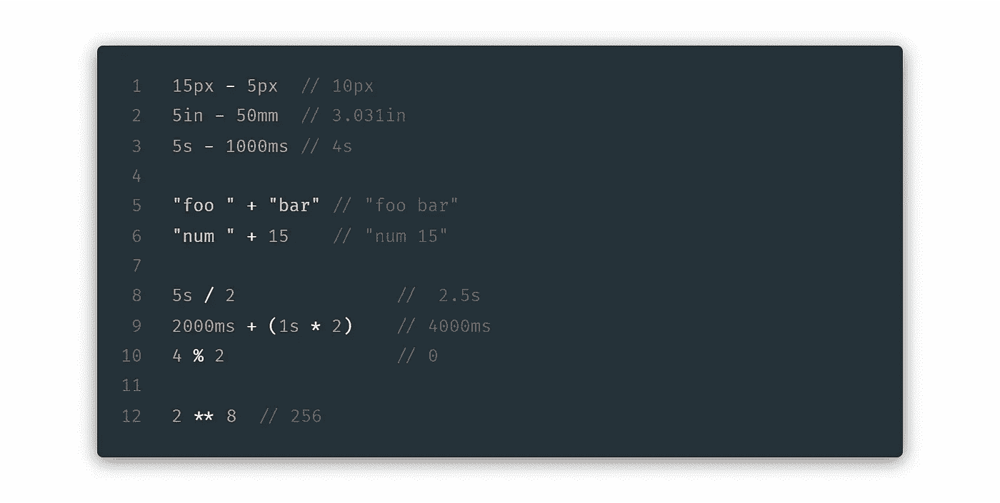

# 为什么 Stylus 是最好的 CSS 预处理器的 5 个理由

> 原文：<https://levelup.gitconnected.com/5-reasons-why-stylus-is-the-best-css-preprocessor-in-2020-6957e8ae8577>

CSS 预处理程序可以节省你无数的时间，如果你使用它的权利(🤭)，因此选择“正确的”预处理器至关重要。🕵️‍♂️

请允许我向您介绍 Stylus，它是编写 CSS 的最灵活、高效、动态和富于表现力的方式。以下是手写笔应该成为你从 10 行代码笔演示到 1 万行大型项目首选的 5 个原因

# #1 手写笔非常灵活🤘🏼

*   不喜欢分号，括号，冒号？ ***省略它们。***
*   喜欢他们？ ***使用它们。***

一切都是可选的

缺少括号？想从 StackOverflow 复制粘贴一些 CSS 而不用担心缩进吗？（🤫)**手写笔也支持 CSS 语法**！

CSS 是有效的手写笔

我更喜欢最干净的，没有括号，没有冒号，没有分号。本文的其余部分遵循该语法—所以要小心。

# #2 手写笔更干净🌈

*   不需要给变量加上前缀`$`。但是你喜欢他们吗？嗯，你可以用它们！
*   `$`对手写笔来说没什么特别的。你可以给任何你想要的符号加前缀，因为手写笔不需要任何前缀，任何加前缀的符号只是变量名称的一部分(酷❄️)

$是可选的

无需使用`@mixin`或`@function`。Stylus 足够聪明，可以弄清楚🧐什么是函数，什么是 mixin(函数在后面讨论)

唱针混音

如您所见，您还可以为参数提供默认值，这些参数也可以是其他参数。

这是你如何使用这个混音

呼唤混音

不过牛逼的部分来了，你也这样称呼 mixin！

在手写笔中调用 mixin

这叫做**透明混合**🤩“透明”是因为……它看起来不像 mixin 调用，而更像 CSS 属性

更不用说你还可以通过以下任何一种方式调用 mixin！

手写笔中有效的 mixin 调用样式

现在你知道了包括或省略逗号、冒号之类的东西也是有效的，从现在开始我不会再提这个了😅

> 如果我们将 mixin 命名为与现有 css 属性相同的名称会怎么样？**那也行！**

mixin 可以与属性同名

注意，**边框 mixin** 里面的**边框**指的是实际的`border` CSS **属性**。但是 Stylus 怎么知道某个东西是 mixin 还是 property 呢？

答案很简单，如果你在名为 x 的 mixin 中，任何名为 x 的东西本身都不能是 mixin，因为那意味着无限循环🌌

## 先说函数！

*   函数的声明方式与 mixins 相同
*   唯一的区别是函数返回一些值
*   让我们看看如何在手写笔中定义一个函数

触笔中的功能

但是**返回**关键词在哪里呢？你也可以省略 return 关键字！

但如果你想用它，就去用吧。

手写笔中的返回关键字

一个函数也可以返回不止一个东西！🐙

这会产生以下 CSS:

函数当然比返回值更强大，你可以在函数中加入各种逻辑

# #3 手写笔具有属性查找功能👀

如果你想**相对于属性 Y 的值**设置属性 X，这就是你需要的东西！

一如既往，这里是演示🙊：

属性查找

# #4 手写笔有许多参考类型🍭

## 部分引用🍩

我听说你喜欢筑巢？如果你在嵌套的第 4 层，你想把目标放在第 2 层的父节点上呢？

好吧，手写笔已经覆盖了你！

部分引用

*   `**^[N]**`瞄准第 n 层的选择器
*   根(此处为`.a`)被认为是在第**0 层**
*   **负值**目标选择器来自**当前父**
*   当前父代(`.c`)可以通过传统的`&`选择器定位
*   **祖父母**可以通过使用`**^[-1]**`比父母高一级来选择

## 相对参考🎂

不喜欢数数？你更像是双点型的人吗？

你也可以使用它，只是要确保你使用了一个正斜杠🚀

## 根引用🍬

选择根的最短方法？一个正斜杠！

根引用

还有更多…

# #5 手写笔富有表现力🍁

Stylus 中的一切都是富有表现力的，为了做到这一点，Stylus 使用了大量的操作符、关键字和甜言蜜语的语法，让您有宾至如归的感觉。

有些操作符非常有用，你会奇怪为什么它们不在其他的预处理程序中。

手写笔中的运算符按优先级从高到低排列

手写笔有如此多的高级功能，以至于我要花很多时间来解释每一个人😅，但是这里有一点让手写笔成为一个完整的电动工具的所有东西的味道！

基于另一个属性块 mix 的存在的有条件定义的属性内置 Globbing 支持

有用的内置函数

列表和元组

范围选择器

有意义的数学

表达逻辑

还有这么多！查看[手写笔文档](http://stylus-lang.com/)了解更多信息。

快乐黑客👨🏻‍💻！

你对手写笔有什么想法？喜欢收到你的来信，请在下面留下你的评论~💩