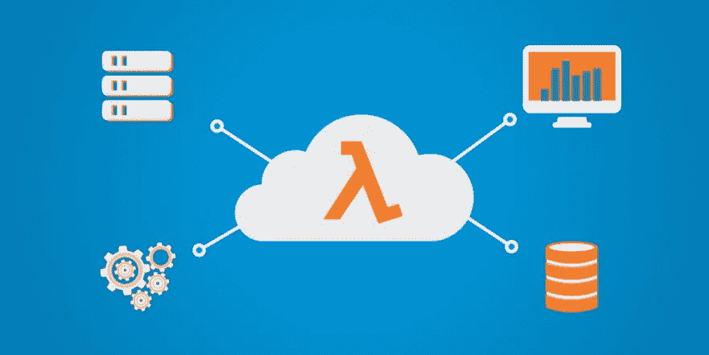

# AWS Lambda 的 5 个无服务器架构最佳实践

> 原文：<https://levelup.gitconnected.com/5-serverless-architecture-best-practices-with-aws-lambda-a707206c098c>

*作者:* [*奥斯洛夫莱斯*](https://www.linkedin.com/in/austin-loveless/)*—2020 年 1 月 18 日*

**订阅**AWSMeetupGroup YouTube 频道:[https://www.youtube.com/channel/UCG3Si_vP2tijvvyE5xr7lbg](https://www.youtube.com/channel/UCG3Si_vP2tijvvyE5xr7lbg)

**加入 Meetup.com 上的**AWSMeetupGroup:
[https://www.meetup.com/AWSMeetupGroup/](https://www.meetup.com/AWSMeetupGroup/)

在这篇博客中，我们将从高层次上讨论什么是无服务器，并深入探讨围绕 [AWS 良好架构的框架](http://d0.awsstatic.com/whitepapers/architecture/AWS_Well-Architected_Framework.pdf)构建无服务器应用时的一些最佳实践。

# 什么是无服务器？

无服务器应用程序是不需要供应或管理任何服务器的应用程序。您的应用程序代码仍然在服务器上运行；你不需要担心管理它。你可以只写代码，让 AWS 处理剩下的事情。

Lambda 代码存储在 AWS S3 中，当一个函数被调用时，代码被下载到 AWS 管理的服务器上并被执行。

AWS 还涵盖了代码的可伸缩性和可用性。当您接收到 lambda 函数的流量时，AWS 将根据应用程序的请求数量进行伸缩。

这种应用程序开发方法使得快速构建和扩展应用程序变得更加容易。你不用担心服务器，你只需要写代码。

# AWS 架构良好的框架

AWS 架构良好的框架是一种帮助您审查和改进云架构的结构。它分为五个不同的组成部分，定义为“支柱”。这些支柱包括卓越运营、安全性、可靠性、性能效率和成本优化。

我们将使用这些支柱作为我们 5 个无服务器最佳实践的指南。

# 1.卓越运营

卓越运营的支柱是准备、运营和发展的能力。

使用无服务器应用程序，您可以消除许多操作挑战。这意味着您可以缩小关注范围，实现更高水平的卓越运营。

# 记录

默认情况下，当您创建 Lambda 函数时，会提供一种机制来将日志传递给 CloudWatch 日志。建议您利用 Lambda 环境变量来创建一个 LogLevel 变量，供函数参考，以确定在运行时创建了哪些日志语句。您可以使用这些日志来通知您函数的行为，这使得日志的使用变得非常重要。

# 监控和指标

AWS Lambda 直接提供了 CloudWatch 指标，包括函数收到的调用次数和函数的执行持续时间。

最佳实践是通过 CloudWatch 为所有提供的指标上的每个 lambda 函数创建警报阈值。这可以通过监控一个函数执行多长时间来诊断您的架构中的潜在问题。

监控 Lambda 函数可以让您分配适当的内存量，并帮助您设计应用程序来满足业务需求。

# 部署

与管理服务器的传统架构不同，使用无服务器设计，您可以轻松地对代码进行新的迭代。你所要做的就是上传新版本的代码，发布新版本，并更新你的别名。也就是说，这些步骤应该只是 Lambda 部署过程的一部分。为了避免对您的用户产生潜在的负面影响，您应该考虑:

*   **并行版本调用**

当你更新你的 Lambda 函数时，会有一小段时间现有的函数仍然包含以前的代码。确保您的应用程序在此过渡期间继续按预期运行是非常重要的。

*   **部署时间表**

建议将部署安排在低流量时段，以尽量减少冷启动次数。冷启动发生在第一次请求你的函数时。

*   **回滚**

如果您做了一个部署，并且这个部署有问题，那么您的应用程序回滚到以前的函数版本是至关重要的。

拥有一个合适的开发周期对于确保您可以在不对最终用户产生负面影响的情况下对代码进行更新是至关重要的。

# 负载测试

加载测试 Lambda 函数将帮助您确定应该分配的内存量和最佳超时值。您可能在一个无服务器的环境中有一个复杂的应用程序，并且不知道您的应用程序中的依赖项可能无法大规模运行。

捕捉这样的潜在问题对于维护高可用性应用程序至关重要。

# 2.安全性

无论是传统架构还是无服务器架构，在应用程序中实现安全性都应该是重中之重。安全是第一位的！区别在于您没有任何服务器需要保护。

您需要通过编写安全的应用程序代码、允许最小特权和 API 授权来确保安全最佳实践。

*   **最少特权**

每个 Lambda 函数都应该与 IAM 角色有 1:1 的关系。即使某些功能有完全相同的启动策略，也要始终分隔 IAM 角色，以确保最小权限策略。

*   **API 授权**

通常，您会使用 API Gateway 作为 Lambda 函数的事件源。保护 API 网关端点是非常必要的。API Gateway 提供了几个选项来保护您的 API。您可以使用[自定义授权器](https://aws.amazon.com/blogs/compute/introducing-custom-authorizers-in-amazon-api-gateway/)、 [AWS IAM](https://aws.amazon.com/premiumsupport/knowledge-center/iam-authentication-api-gateway/) 和 [Cognito](https://docs.aws.amazon.com/apigateway/latest/developerguide/apigateway-integrate-with-cognito.html) 。

*   **VPC 安全**

如果您的 Lambda 函数需要访问 VPC 内的资源，您应该确保通过使用最低特权安全组、特定子网内的 Lambda、NACLs 和路由表来应用网络安全最佳实践。允许来自 Lambda 函数的流量只到达其预定目的地。

# 3.可靠性

[Amazon.com](http://Amazon.com)首席技术官沃纳·威格尔说:“任何事情都会失败。”当测试无服务器应用程序的可靠性时，这可能意味着在代码中引入逻辑错误。如果您了解如何构建您的应用程序，并且知道实现高可用性和容错的薄弱区域和安全区域，那将是最好的。

# 高可用性

Lambda 函数的可用性取决于它可以在其中执行的可用性区域的数量。默认情况下，当您创建一个 Lambda 函数时，它会自动在该区域的所有可用性区域中执行。当您在自定义网络环境中运行 Lambda 函数时，您需要确保在多个可用性区域中设计子网。以便在可用性区域中断的情况下，您可以保持您的应用程序运行。

# 容错

在开发多区域架构时，理解并转移到另一个 AWS 区域是非常必要的。包括 Lambda 函数、事件源和依赖项。

# 恢复

如果您的功能无法执行，您应该设计无服务器应用程序来提供可行的用户体验，直到您的功能可以再次成功执行。

例如，如果您使用 API Gateway 作为事件源，您应该向最终用户提供有用的错误消息。

# 4.性能效率

为了优化性能，我们需要了解如何选择最佳的内存大小、正确的语言以及监控应用程序的性能。

# 优化内存大小

Lambda 允许你调高或调低分配给你的函数的内存量。RAM 的数量也会影响您的函数接收的 CPU 时间和网络带宽。AWS 建议您在每个可用资源级别测试 Lambda 函数，以确定您的应用程序所需的最佳性价比级别。仅仅选择运行速度足够快的最小 RAM 是一种反模式。这是因为 Lamdba 功能是以 100 毫秒为增量计费的。选择最小的数量可能会增加应用程序的延迟，如果增加的延迟超过节省的 RAM 成本，可能会使整体成本更高。

# 优化语言运行时

AWS Lambda 支持 C#、Java、Go、Python、Ruby、Node.js 和 PowerShell。

使用您最熟悉的语言是非常重要的，但是如果性能是应用程序最关心的问题，那么有一些关键的事情需要考虑。编译语言(Java 和 C#)的初始启动时间最长。解释语言有更快的初始启动时间。

如果您的应用程序用例对延迟非常敏感，容易受到非常尖锐或非常罕见的流量的影响，您应该使用一种解释型语言，Python 或 Node.js

如果您的应用程序没有遇到尖峰流量，并且您知道，一般来说，您的流量看起来像什么。你可以使用任何你觉得最舒服的语言。

# 监控性能

为了在组件级别监控您的应用，AWS 建议使用 [AWS X 射线](https://aws.amazon.com/xray/)。X-Ray 允许您在整个执行过程中跟踪应用程序的生命周期。您可以更深入地查看应用程序的组件，显示延迟和其他指标。

# 5.成本优化

Lambda 函数有两个维度，即成本、执行时间和分配的资源(RAM)。

# 资源配置优化

正如我们前面所说的，选择函数可用的最小资源大小是一种反模式。您需要为您的功能选择合适的 RAM 容量，同时牢记相关的成本。

# 异步架构

如果您可以将您的体系结构设计得更加异步，您可能会发现，与等待同步请求响应的紧密耦合组件相比，您的函数中的组件执行工作所需的计算时间更少。分离的功能可以产生更具成本效益的解决方案。

# 选择事件源

根据您的用例，您可能有一些事件源可以满足您的业务需求。为您的应用程序选择最具成本效益和性能的事件源非常重要。

# 概述

用无服务器架构开发应用程序是应用程序开发的现代方法。你不必担心服务器和修补操作系统。您可以开始编写代码，开箱即可满足业务需求。无服务器只是让您构建得更快。

你可以在这里找到更多关于无服务器应用的信息[或者在这里](https://aws.amazon.com/serverless/)看到无服务器架构的例子[。](https://github.com/aws-samples/aws-serverless-workshops)

要观看正在构建的无服务器应用程序的视频教程，你可以在这里观看我们过去的[聚会](https://www.youtube.com/watch?v=Gpp7NS1ngmA&t=1504s)或 1 月 29 日的[聚会](https://youtu.be/V451xs5OccA)。

AWS“采用 AWS Lambda 的无服务器架构:概述和最佳实践”(2017)，从[此处](https://d1.awsstatic.com/whitepapers/serverless-architectures-with-aws-lambda.pdf?did=wp_card&trk=wp_card)检索。