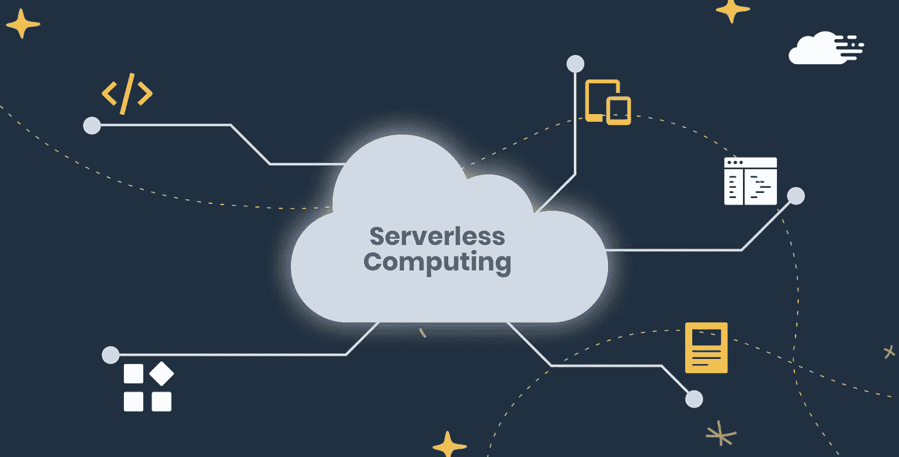

# AWS Lambda 的 5 个无服务器开发最佳实践

> 原文：<https://levelup.gitconnected.com/5-serverless-development-best-practices-with-aws-lambda-183aba92b538>

*作者:* [*奥斯洛夫莱斯*](https://www.linkedin.com/in/austin-loveless/)*—2020 年 1 月 19 日*

**订阅**AWSMeetupGroup YouTube 频道:[https://www.youtube.com/channel/UCG3Si_vP2tijvvyE5xr7lbg](https://www.youtube.com/channel/UCG3Si_vP2tijvvyE5xr7lbg)

**加入 Meetup.com 上的**AWSMeetupGroup:
[https://www.meetup.com/AWSMeetupGroup/](https://www.meetup.com/AWSMeetupGroup/)

随着新的无服务器技术的出现，应用程序开发也在不断变化和改进。当您使用无服务器模型时，您可以缩短编写所需的代码量，并减少或消除与传统的基于服务器的模型相关的问题。但是对于这种开发模型，有一些关键的事情需要关注，以确保您构建的是健壮的应用程序。

我们将讨论作为代码的基础设施、本地测试功能、管理代码、测试和持续集成/持续交付(CI/CD ),并对什么是无服务器做一个高度概括。

# 什么是无服务器？

无服务器应用是一种不需要配置或管理任何服务器的应用。您的应用程序代码仍然在服务器上运行；你只是不需要担心管理它。你可以只写代码，让 AWS 处理剩下的事情。

Lambda 代码存储在 S3，当一个函数被调用时，代码被下载到服务器上，由 AWS 管理并执行。

AWS 还涵盖了代码的可伸缩性和可用性。当您接收到 lambda 函数的流量时，AWS 将根据应用程序的请求数量进行伸缩。

这种应用程序开发方法使得快速构建和扩展应用程序变得更加容易。你不用担心服务器，你只需要写代码。

# 1.基础设施作为代码

在创建你的基础设施时，你可以使用 [AWS CLI](https://aws.amazon.com/cli/) 、 [AWS 控制台](https://aws.amazon.com/)，或者作为[代码](https://aws.amazon.com/cloudformation)。基础设施即代码是 AWS 推荐的开发新应用程序的最佳实践。

当您以代码的形式构建您的基础设施时，您可以在可听化、自动化和可重复性方面对您的环境有更多的控制。您可以使用我们的基础设施作为代码创建一个开发环境，并完全为 stage 或 prod 复制该环境。而另一种选择是，您增加了不正确地做某事的可能性，并且不复制环境。测试应用程序时，复制 prod 中的内容很重要，这样可以确保您的代码按照您的意图运行。

传统上，当使用 AWS 时，您会编写 [CloudFormation](https://aws.amazon.com/cloudformation/) 模板。CloudFormation 模板可能会变得很长，很难阅读，所以如果你正在编写一个无服务器的应用程序，AWS 提供了一个解决方案。可以使用 [AWS SAM](https://aws.amazon.com/serverless/sam/) (无服务器应用模型)。这些模板可以用 JSON 或 YAML 格式编写，AWS SAM 有自己的 [CLI](https://docs.aws.amazon.com/serverless-application-model/latest/developerguide/serverless-sam-cli-install.html) 来帮助你构建应用程序。SAM 是建立在云层之上的。旨在缩短构建无服务器基础设施所需的代码量。

# 2.本地测试— AWS SAM 本地

在对您的应用程序进行部署和更新之前，您应该测试一切，以确保您得到了想要的结果。

[AWS SAM Local](https://github.com/awslabs/aws-sam-cli) 提供了命令行工具，您可以使用这些工具在将无服务器应用程序部署到 AWS 之前对其进行测试。SAM Local 在幕后使用 [Docker](https://medium.com/analytics-vidhya/intro-to-docker-1855b825de5e) ，使您能够测试您的功能。

在 API Gateway 中创建 API 之前，可以在本地测试在 SAM 模板中定义的 API。您可以验证您创建的模板，以确保您的部署没有问题。使用这些工具有助于降低应用程序出错的风险。您可以在本地查看日志并调试您的代码，这样您就可以快速无忧地迭代更改。

# 3.优化代码管理

理想情况下，Lambda 函数不应该过于复杂和耦合在一起。关于如何编写和组织代码，有一些具体的建议。

**编码最佳实践**

*   从处理程序中分离业务逻辑

当编写 Lambda 函数时，应该从“处理程序”中接收参数。这是 Lambda 函数的根。例如，如果您有一个 API 网关端点作为事件源，那么您可能有传递到该端点的参数值。您的处理程序应该获取这些值，并将它们传递给另一个处理业务逻辑的函数。这样做使您能够拥有解耦的代码。让测试你的代码更加容易，因为代码更加独立。此外，这允许您通过应用程序重用业务逻辑。

*   快速失败

为您的函数配置短超时。您不希望函数在等待依赖项响应时无助地旋转。Lambda 是基于你的函数执行时间的持续时间来计费的。当您的函数依赖项没有响应时，没有理由收取更高的费用。

*   修剪相关性

为了减少[冷启动](https://mikhail.io/serverless/coldstarts/aws/)的次数，你应该在运行时将所包含的依赖项精简为基本要素。Lambda 函数代码包在运行时环境中提取时，最多允许压缩 50 MB 和 250 MB。

**代码管理最佳实践**

编写好的代码是唯一的战斗，现在你需要正确地管理它。如前所述，无服务器应用程序的开发速度通常比典型环境快得多。对于 Lambda 代码的源代码控制和管理，拥有一个好的解决方案将有助于确保安全、高效和平稳的变更管理过程。

AWS 建议在 Lambda 函数和代码库之间建立 1:1 的关系，并且将您的环境组织得非常细粒度。

如果你正在为你的 Lambda 代码、Dev 和 Prod 开发多个环境，将它们分离到不同的发布分支是有意义的。以这种方式组织代码的主要目的是确保每个环境都有自己独立的、解耦的环境。您不希望致力于开发一个现代应用程序，结果只剩下一个整体耦合的代码库。

# 4.测试

在开发无服务器架构时，测试代码是确保质量的最佳方式。

*   **单元测试**

AWS 建议您对 Lambda 函数代码进行全面的单元测试，主要关注处理函数之外的业务逻辑。您的大部分逻辑和测试应该使用模拟对象和函数，您可以在代码库中完全控制这些对象和函数。

您可以使用 AWS SAM Local 创建本地测试自动化，它可以作为您的功能代码的本地端到端测试。

*   **集成测试**

对于集成测试，AWS 建议您创建 Lambda 函数的较低生命周期版本，其中您的代码包通过示例事件进行部署和调用，您的 CI/CD 管道可以触发这些事件并检查其结果。

# 5.持续集成/持续交付(CI/CD)

AWS 建议您通过 CI/CD 管道以编程方式管理所有无服务器部署。因为无服务器架构的开发速度会快很多。创建手动部署和更新以及需要更频繁地部署会导致瓶颈和错误。

AWS 提供了一套工具来设置 CI/CD 管道。

*   [**AWS 代码提交**](https://aws.amazon.com/codecommit/)

CodeCommit 相当于 AWS 的 GitHub 或 BitBucket。提供私有 Git 存储库和创建分支的能力。允许通过细粒度的访问控制实现代码管理的最佳实践。

*   [**AWS 代码管道**](https://aws.amazon.com/codepipeline/)

每次有代码变更时，CodePipeline 都会自动执行发布过程的构建、测试和部署阶段。CodePipeline 与 CodeCommit 或其他第三方服务(如 GitHub)集成。

*   [**AWS CodeBuild**](https://aws.amazon.com/codebuild/)

CodeBuild 可用于管道的构建阶段。您可以使用它来执行单元测试并创建一个新的 Lambda 代码包。将它与 AWS SAM 集成，将您的代码推送到亚马逊 S3，并通过 CodeDeploy 将新包推送到 Lambda。

*   [**AWS 代码部署**](https://aws.amazon.com/codedeploy/)

CodeDeploy 用于将新代码自动部署到 Lambda 函数中。消除了容易出错的手动操作的需要。CodeDeploy 有不同的部署首选项，您可以根据自己的需要来使用。例如，您可以创建一个“Linear10PercentEvery1Minute”部署。在 10 分钟内，每分钟将 10%的功能流量转移到新版本的功能。

*   [**AWS CodeStar**](https://aws.amazon.com/codestar/)

CodeStar 是一个统一的用户界面，允许您使用已经实现的最佳实践创建新的应用程序。当您创建 CodeStar 项目时，它从一开始就创建了一个完全实现的 CI/CD 管道，并且已经定义了测试。CodeStar 是开始构建应用程序的最简单的方法。

# 无服务器架构示例

现在我们已经介绍了开发无服务器应用程序的一些最佳实践，您应该获得了一些构建应用程序的实践经验。[这里的](https://github.com/aws-samples/aws-serverless-workshops)是示例无服务器应用程序的教程库。

# 概述

无服务器应用程序消除了管理服务器的限制，让您可以专注于您的应用程序代码。您可以比以往更快地开发满足业务需求的应用程序。AWS 提供了一整套无服务器技术和工具来帮助您维护和部署应用程序。

要观看正在构建的无服务器应用程序的视频教程，您可以在 1 月 29 日[这里](https://www.youtube.com/watch?v=V451xs5OccA&feature=youtu.be)观看我们过去的[聚会](https://www.youtube.com/watch?v=Gpp7NS1ngmA&t=1504s)或未来的聚会。

AWS“采用 AWS Lambda 的无服务器架构:概述和最佳实践”(2017)，从[此处](https://d1.awsstatic.com/whitepapers/serverless-architectures-with-aws-lambda.pdf?did=wp_card&trk=wp_card)检索。