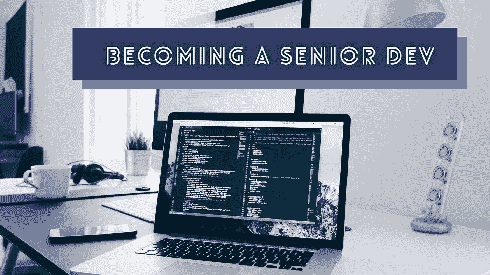
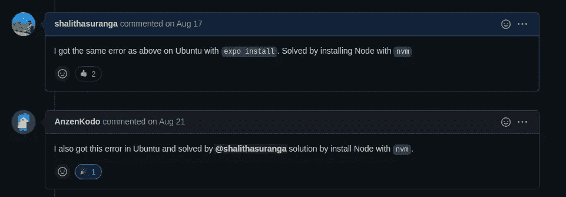

# 成为高级开发人员的 5 个简单步骤

> 原文：<https://levelup.gitconnected.com/5-simple-steps-to-become-a-senior-developer-9412c70d8802>

## 作为一名高级开发人员，按照以下步骤开始构建软件

克里斯多夫·高尔在 [Unsplash](https://unsplash.com/s/photos/coding?utm_source=unsplash&utm_medium=referral&utm_content=creditCopyText) 上拍摄的照片，由 Canva 编辑。

每个高级软件开发人员都是从初级开发人员开始软件开发生涯的。初级开发人员通常在使用生产级软件系统之前完成实习项目。自学成才的开发人员也在准备好企业级软件开发的时候进入软件行业。

每个软件开发人员都通过在日常编程生活中进行各种活动来努力成为高级开发人员。一些公司通过提供职业发展计划来支持开发人员促进他们的职业发展。即使你在一家初创公司、自由职业客户或社区开源项目中工作，你无疑有一天要跨越初级开发人员和高级开发人员思维模式之间的桥梁。

大约十年前，我进入了软件开发行业。我从我的软件开发经验中发现，以下步骤有助于任何开发人员成为高级开发人员。

# 专注于你的项目，而不是任务

软件开发团队遵循各种软件开发方法来跟踪他们的里程碑。为了更好的可管理性/可追溯性，每种软件开发方法通常将里程碑分成更小的任务。这些任务定义了一个里程碑的完成，但是一个任务本身就是一个孤立的开发任务；它没有给出项目的整体情况。

大多数初级开发人员通常专注于任务。他们往往认为完成更多的编码任务就能快速成为高级工程师。过度工作确实不能成为高级开发人员。高级开发人员不仅仅是一个角色，而是当你开始看到你的项目的全貌时，你会得到的一种心态。

当你在一个特定的开发任务上工作时，思考它如何影响项目，你为什么要实现它，做它的替代方法(你可能会找到一个比规范中解释的更好的方法)，以及最终用户将如何使用它。

# 帮助其他开发者，让他们帮助你

软件开发是一项协作任务。即使您是软件项目的唯一作者，用户群通常也会提出想法、改进点和报告错误。所有开发人员文档并不包括我们面临的每个问题的解决方案。因此，开发人员相互支持，为他们与开发相关的阻碍因素找到解决方案。

例如，我在 Linux 电脑上设置 Expo CLI 时遇到了麻烦。后来我注意到一个开发者[已经向 Expo](https://github.com/expo/expo-cli/issues/3613)报告了同样的问题，但是这个问题没有任何答复就被关闭了。我自己找到解决方法后，贴到了 GitHub 问题上，如下图:

如果我们没有在线论坛和社区，软件开发任务会变得非常耗时。帮助其他开发人员是在公司内部建立良好声誉的一个好方法。试着像在网络社区中一样帮助其他开发者。通过解释别人可能不知道的事情，努力成为每个人的导师。此外，当你面临软件开发问题时，让其他开发人员帮助你——这将激励他们像你一样帮助他人。

# 始终遵循良好的工程实践

开发人员处理用各种技术栈、架构模式和设计模式构建的软件项目。每个技术栈或架构模式都有一些优点和缺点。高级开发人员总是试图通过遵循良好的工程实践来减少他们的架构模式和技术栈的缺点。此外，他们经常试图用可管理的、有效的、简单的和长期的解决方案来解决软件工程问题。

完成一个特定的编程任务有两种方法:写一个暂时解决问题的代码，写一个长期解决问题的代码。高级开发人员总是选择第二种方法。

下次将代码放入存储库之前，考虑一下干燥、亲吻和 YAGNI(有助于避免过度工程化)原则。良好的工程实践是每个成功软件项目背后的秘密。因此，每个软件工程团队都会记录好的工程实践。例如，谷歌用他们的工程实践维护着一个[开源项目](https://github.com/google/eng-practices)。看看如何通过下面的故事编写干净的代码:

 [## 每个软件项目的 5 个干净代码实践

### 提高前端、后端、CLI、桌面或移动应用程序代码库质量的想法。

better 编程. pub](https://betterprogramming.pub/5-clean-code-practices-for-every-software-project-479443b31c3c) 

# 掌握软件架构和解决方案设计

每个软件工程角色都走向软件架构角色。软件架构师通常建立软件系统的基础，并让其他软件开发人员在最初的基础上工作。软件架构师设计软件，决定技术栈和架构模式，启动内部工程实践，并指导其他软件开发人员。

软件开发人员通常进入软件架构师角色的路线图——当他们开始为高级开发人员角色工作时。高级工程师经常从事高级软件开发任务。当他们从事软件开发活动时，他们倾向于超越编码。

如果你需要看到编码以外的东西，你需要变得擅长软件架构和解决方案设计。学习[十二因素 App](https://www.12factor.net/) 模型，通用云计算[组件](https://betterprogramming.pub/10-must-know-concepts-of-modern-web-architecture-9ecbefef8bc)，设计模式，微服务，无服务器计算，DevOps，Unix 或 GNU/Linux 操作系统内部，以及流行的架构模式。

# 当你知道如何使用它时，学习它是如何工作的

如果你仔细观察非常有经验的软件开发人员，你会注意到他们对系统内部而不是外部系统感兴趣。大多数现代初级开发人员都使用 Flutter——但他们不知道 Flutter 是如何工作的。几乎所有的开发人员每天都输入 Git 命令——但是很少有人知道 Git 是如何工作的。现在，你正在通过电脑设备阅读这个故事——你知道你的电脑设备是如何在屏幕上呈现这个页面的吗？

我们经常会遇到 Java 专家、[地鼠](https://go.dev/blog/gopher) (Golang 开发者)、JavaScript 专家等。我们使用不同的技术体系，但基本的计算原理是相同的。你的软件系统的架构不是独一无二的(如果你没有发明新的东西)。你可以用你已经知道的计算机科学原理来研究任何软件系统。

即使您使用的是大型软件系统的一小部分，也要花些时间学习其他模块。研究你最喜欢的工具和框架是如何工作的，接下来，学习你的软件系统是如何内部工作的。当你开始看到你的软件系统的大图时，你可以认为自己是一个高级开发人员。首先，从学习计算机如何工作开始。

 [## 每个程序员都应该知道的 5 个计算机硬件概念

### 多亏了这些概念，你的计算机执行了你编写的程序。

levelup.gitconnected.com](/5-computer-hardware-concepts-that-every-programmer-should-know-32711c759dc0)