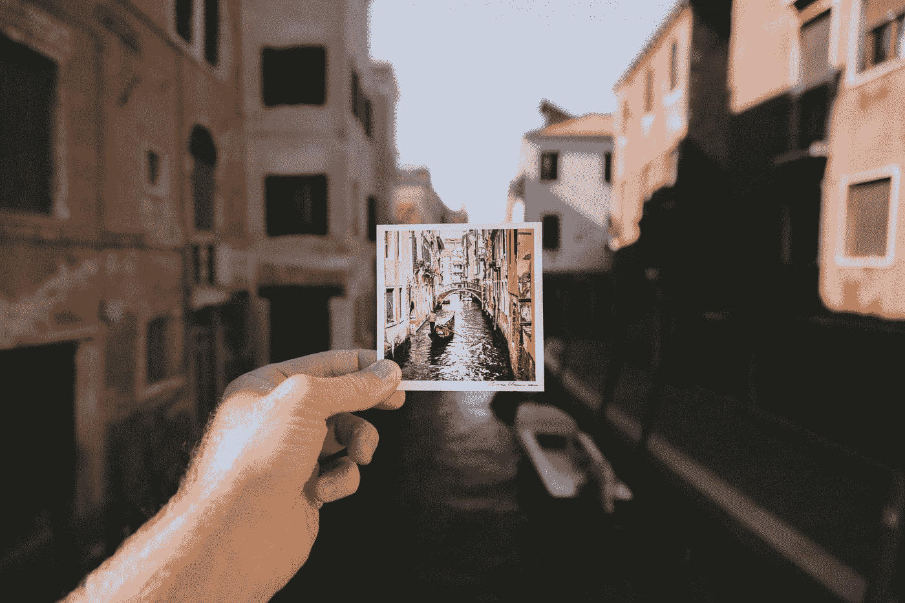
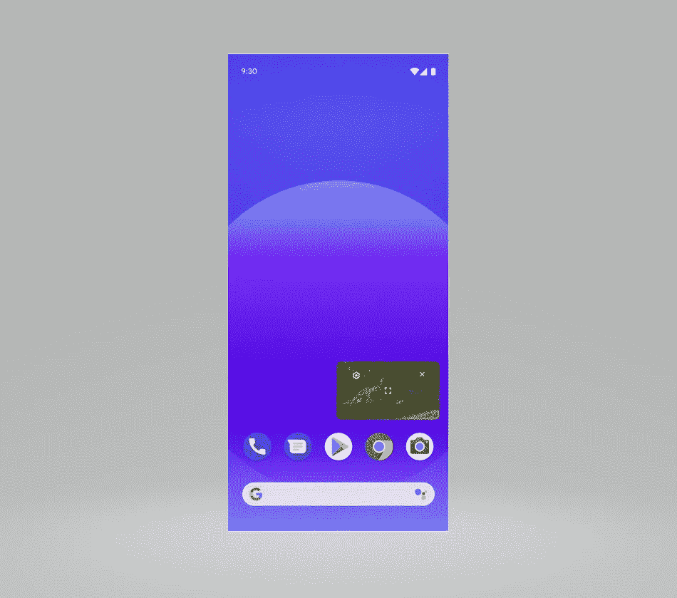

# 在 Android 中实现画中画模式

> 原文：<https://levelup.gitconnected.com/5-simple-steps-to-implement-picture-in-picture-mode-in-the-android-app-65b7ee09587d>

## 通过 5 个简单的步骤在 Android 上实现画中画模式

P 画中画(PiP)模式将 android 应用程序内容缩小到一个小的浮动窗口中，这样用户就可以在使用设备上的其他应用程序的同时，继续从 PiP 窗口中使用应用程序的内容



雅各布·欧文在 [Unsplash](https://unsplash.com?utm_source=medium&utm_medium=referral) 上拍摄的照片

## 简要概述

PiP 利用 Android 7.0 中提供的多窗口 API 来提供固定的视频叠加窗口。画中画窗口出现在屏幕的最顶层，在系统选择的角落。查看下面的截图:



资料来源:https://developer.android.com

## 履行

要为应用程序添加 PiP 支持，您需要在 build.gradle 文件中将 **minSdk** 版本设置为 **API 26** 。我将 PiP 的实施分成了 5 个简单的步骤。让我们来看看下面这些:

## 1.为您的活动启用 PiP 支持

通过在 Manifest 文件中将属性`android:supportsPictureInPicture`设置为`true`，为您的活动启用 PiP 支持。此外，指定您的活动处理布局配置更改，以便在发生 PiP 模式转换时您的活动不会重新启动。

```
<activity android:name="MainActivity"
    android:supportsPictureInPicture="true"
    android:configChanges=
        "screenSize|smallestScreenSize|screenLayout|orientation"/>
```

## 2.在活动中设置 PictureInPictureParams 值

`PictureInPictureParams`用于配置画中画窗口的各种属性，如纵横比、`sourceRectHint`、自定义动作等。然后我们可以使用`setPictureInPictureParams`方法将这些参数设置为活动

*   使用`Rational`类设置自定义纵横比。参见下面的代码
*   当用户使用手势导航向上滑动到主屏幕时，使用`setAutoEnterEnabled`提供更平滑的 PiP 过渡。

**注意:**当`setAutoEnterEnabled`使能时，不需要在`onUserLeaveHint`中显式调用`enterPictureInPictureMode`。还有，这个方法只有 Android 12 及以上版本才有

```
val aspectRatio = Rational(16, 9)// Rational(1, 1) for square window
setPictureInPictureParams(new PictureInPictureParams.Builder()
    .setAspectRatio(aspectRatio)
    .setAutoEnterEnabled(true)
    .build());
```

## 3.切换到画中画模式

调用`enterPictureInPictureMode(android.app.PictureInPictureParams)`方法会将您的活动切换到画中画模式。此方法可以在单击按钮或任何其他类型的用户操作时调用。

如果希望您的活动切换到 PiP 模式，而不是进入后台，那么您可以覆盖方法`onUserLeaveHint()`,该方法在活动根据用户选择将要进入后台时被调用。

```
override fun onUserLeaveHint() {
    if (shouldShowPip()) {
        enterPictureInPictureMode()
    }
}
```

**注意:** 根据我在测试中观察到的情况，`onUserLeaveHint()`方法似乎有一点问题，因为它被调用，即使当活动由于一些系统对话框出现在它上面而进入暂停状态时

安卓文档说:

> `onUserLeaveHint()`只有当用户的动作导致活动即将在后台运行时才被调用。

这里需要注意的关键是，只有当某个活动由于某些用户操作而将要在后台运行时，系统才应该调用该方法。但是即使我们触发了一些隐含的意图或者启动了一个应用程序选择器，它还是会被调用。所以需要一些额外的检查来忽略对`onUserLeaveHint()`方法的无效调用(如果有的话)

## 4.画中画切换时处理用户界面

当活动进入或退出画中画模式时，您可能希望修改应用程序的 UI。为了实现这一点，我们可以覆盖活动或片段的`onPictureInPictureModeChanged(boolean, android.content.res.Configuration)` 方法。我们可以检查应用程序的当前状态，如果它是在画中画或全屏，并做出用户界面的修改

```
override fun onPictureInPictureModeChanged(isInPictureInPictureMode: Boolean, newConfig: Configuration) {
    if (isInPictureInPictureMode) {
      // Hide elements which are not needed in PiP
    } else {
        // Restore the full-screen UI.
    }
}
```

## 5.在画中画窗口上添加自定控制

PiP 窗口可以显示用户可以与之交互的自定义控件。当应用程序处于画中画模式时，您可以使用`RemoteAction`设置用户可用的自定义操作列表

远程动作由以下属性定义:
**—图标
—标题
—内容描述
—待定意向**

以下是我们如何添加构建远程操作的示例:

```
val remoteAction = RemoteAction(
    Icon.createWithResource(context, R.drawable.icon),
    "Previous", "Previous Song",
    PendingIntent.getBroadcast(context, requestCode, Intent("com.myapp.customcotrol.action124"), PendingIntent.FLAG_IMMUTABLE))
```

您也可以根据应用程序的当前状态动态更改控件。这意味着我们可以根据应用程序的业务逻辑隐藏或添加控件。为了实现这一点，我们可以用一组新的远程动作调用`setPictureInPictureParams`

```
val actions: ArrayList<RemoteAction> = ArrayList()
actions.add(remoteAction)
val params = PictureInPictureParams.Builder()
    //Set the list of actions to the params
    .setActions(actions)
    .build()
setPictureInPictureParams(params)
```

**处理点击自定义控件:**

当用户点击我们在 PiP 窗口添加的自定义控件时，Android 系统将发送广播。这个广播将具有我们在上面的`RemoteAction`对象中添加的相同动作。

因此，为了在用户点击自定义控件时获得回调，您必须注册一个 BroadcastReceiver 并检查您在`RemoteAction`实例中添加的动作

现在我们已经涵盖了在 android 应用程序中实现 PiP 模式的所有方面。此外，请查看下面列出的最佳实践和要点

## 要注意的要点和要遵循的最佳实践

1.  在您的应用程序使用 PiP 之前，请通过调用`hasSystemFeature(PackageManager.FEATURE_PICTURE_IN_PICTURE)`来检查以确保它可用
2.  Android 12 增加了`setSeamlessResizeEnabled`标志，当调整 PiP 窗口中非视频内容的大小时，它提供了更加平滑的交叉渐变动画。以前，在 PiP 窗口中调整非视频内容的大小会产生不和谐的视觉假象。
    为了向后兼容，默认情况下`setSeamlessResizeEnabled`标志被设置为`true`。对于视频内容，将此设置保留为`true`，对于非视频内容，将其更改为`false`。
3.  画中画窗口上的自定义控件总是以白色背景显示。使用不同颜色的图标不会有任何效果

这是一个如何在 Android 中实现画中画模式的简要总结，因为你已经到达了页面的底部，不要忘记点击拍手图标

## 参考资料:

[https://developer . Android . com/develop/ui/views/画中画](https://developer.android.com/develop/ui/views/picture-in-picture#declaring)