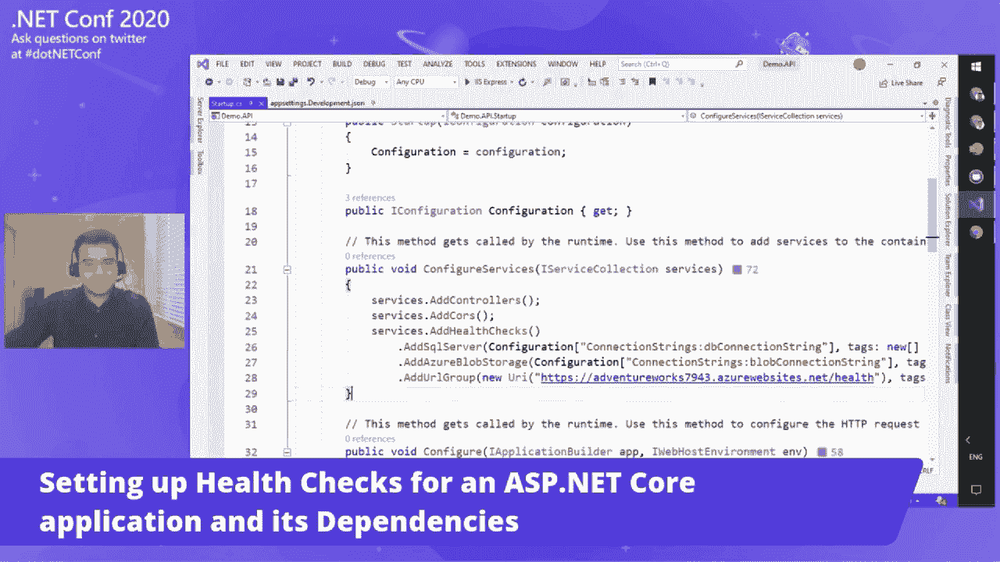
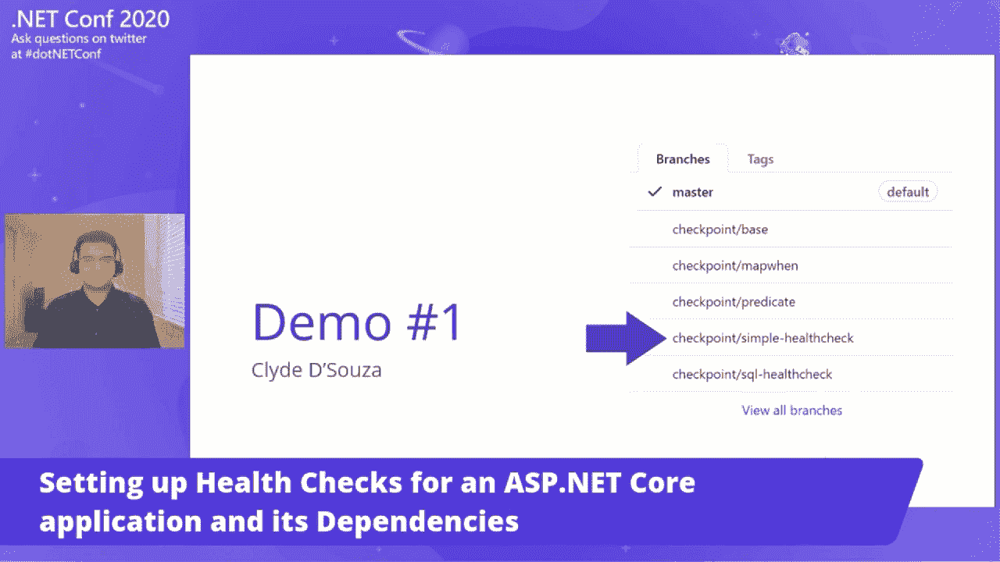

# 5 节简单的技术演示课

> 原文：<https://levelup.gitconnected.com/5-simple-technical-presentation-lessons-e697ca46747b>

## 第一课:不要过度

离线演示。图片由作者提供。

# 介绍

今年 11 月是我上次演讲的一年。网络会议。所以，我想花点时间回顾一下，看看我们能从那次活动经历中学到什么，并与大家分享一些演示技巧。

[我的会话来自。网络大会 2020](https://www.youtube.com/watch?v=cFslS0b_2dg)

虽然我对公开演讲并不陌生，但这是我第一次在一个大型会议上发言，至少对我们来说是这样。NET 开发人员。这也将是一个现场虚拟活动，所以一切都必须顺利进行，显然是在一个单一的采取。

自从我被确认要在这个活动上发言的那天起，我有大约一个月的时间来准备。因此，我基本上是根据我在征集演讲者期间提交的摘要制作了最初的粗略幻灯片。这给了我一个大致的框架，一个可以使用的框架结构。现在，在那个阶段，我必须对每个主题进行更多的充实，对我的笔记进行优先排序，并且只把我认为最重要的部分放在幻灯片上。

# **第一课:不要做过头**

本次会议的大部分会议持续时间被限制在 30 分钟，所以我工作的总方针是大约 20 分钟的演示和 10 分钟的现场问答。

图片来源:[我的会话来自。净大会 2020](https://www.youtube.com/watch?v=cFslS0b_2dg)

当然，这不是一成不变的，因为我必须考虑任何技术设置时间、故障、过渡期间的时间损失或任何其他不确定性。

当我开始计时并练习我所做的事情时，我已经超过了 20 分钟的记录。这意味着万一出了问题，我不得不仓促行事，这是你想不惜一切代价避免的事情。基于这一点，我在最后的陈述中漏掉了一个概念，这使我回到了 20 分钟的标记之下。

所以，第一课是不要过度。覆盖的内容少一些，节奏要快一些，而不是覆盖很多东西，草草了事。不要在你的会议中打包太多的东西，相反，只保留几件你想关注的事情。你的听众可能是第一次听这些概念，所以他们可能无法以你讲述的速度理解。

作为一个演讲者，如果你保持你的演讲节奏和有规律的停顿，压力也会小一些。对听众来说，听起来你很冷静沉着。这个策略也有助于减少说话时的拐杖单词数量。

# **第二课:演示流程**

既然我已经提炼了我要讲的内容，那么以流畅的方式组织演示就很重要了。我的会议是幻灯片和代码演示的混合，所以我必须确保我没有在 PowerPoint、Visual Studio、GitHub 和我的浏览器之间不停地快速切换，否则观众会感到非常困惑。

图片来源:[我的会话来自。网络大会 2020](https://www.youtube.com/watch?v=cFslS0b_2dg)

至于演示，除了向演示神祈祷让现场演示顺利进行之外，我还以将现场编码保持在最低限度的方式来计划演示。相反，我使用 Git 来存储检查点的版本——每个演示一个——这样我就可以在当天轻松地在它们之间切换。

图片来源:[我的会话来自。网络大会 2020](https://www.youtube.com/watch?v=cFslS0b_2dg)

每一个概念都是逐步引入的，并建立在先前引入的代码之上。这样，每一步都展示了新的东西，但又不会太陌生。

这里的教训是尝试并逐渐增加演示的复杂性，以便您的观众可以轻松地进入会话。此外，除非必要，否则不要在应用程序之间切换，如果你必须这样做，要么花时间创造一个听觉暂停，以便你刚才传递的信息可以消化，要么解释你为什么要进行这种转换，慢慢进行——否则你的观众可能会在这种转换中迷失。

# **第三课:大局**

既然我知道了我将如何组织我的会议，我以一张幻灯片开始了我的演讲，解释了我如何划分我的会议——为什么，什么和如何——并简要提到了每个部分下的主要谈话要点。可以把它想象成一本书的高级目录页。

我发现这很有用，因为现在我的观众确切地知道从会议中期待什么，并且可以期待它。

在视频的结尾，我还添加了一个高层架构图，展示了所有组件是如何组合在一起的。这很重要，因为观众中所有好奇的成员都已经在问这个问题了——这在整体计划中处于什么位置？如果这对您的会议有意义，我强烈建议提供一个高层次的图表。

上面的两个步骤——在开始时设定期望，并提供一个关于所有事情如何组合在一起的大图——允许我的观众缩小一点，看到大图以及我在会议中涉及的细节。

# 第四课:练习，练习，练习

在一个月的时间里，我几乎每天都重复练习。这些练习不仅包括我正在讲的内容，还包括我正在演示的代码以及不同应用程序之间的转换。这给了我信心，即使在潜意识里，我也知道那天要说什么，即使我忘记了排练过的台词，我也知道它的要点，这应该允许我在再次回忆起确切的单词之前争取几秒钟。

所以，不管你对一个概念有多了解，总是练习，练习，再练习。

# **第 5 课:回顾**

快结束时，在我完成代码演示后，我将跳回到幻灯片中，然后转向一些额外的材料。但在此之前，我想在演示和剩余幻灯片材料之间放一张回顾幻灯片。

一位德国研究人员曾[向](https://fs.blog/2018/12/spacing-effect/)展示，在间隔时间内重复接触信息为更好地回忆和学习信息提供了最有力的方法。相对于会议的持续时间，在一段时间后总结一下所讨论的内容应该有助于总结和巩固所讨论的概念。

根据本课的精神，即尝试在合适的检查点进行回顾，我想现在就付诸实践。让我们快速回顾一下本文中所涉及的内容。

*   **第一课**:不要过度。有时候少可以多。
*   第二课:密切关注演示的流程，让你的观众慢慢融入其中。
*   第三课:尽可能向你的观众展示全局。
*   第四课:不断练习，练习，再练习。
*   **第 5 课**:在合适的检查点进行回顾。

说了这么多，重要的是要记住，不是每个事件都是完美的，但重要的是要尝试在这样的事件中发言，每次都尽自己最大的努力。

就是这样。感谢阅读！