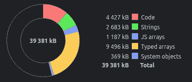

# 每个前端开发人员都应该提高的 5 项技能

> 原文：<https://levelup.gitconnected.com/5-skills-that-every-frontend-developer-should-improve-8b613752fa34>

## 用这些技能构建更好的网络应用程序并促进你的职业发展


卡斯帕·卡米尔·鲁宾在 [Unsplash](https://unsplash.com/s/photos/web-programming?utm_source=unsplash&utm_medium=referral&utm_content=creditCopyText) 上拍摄的照片，由 Canva 编辑。

程序员从事各种软件开发项目。现在，大多数程序员通过为 web 应用程序编写代码来从事基于云的软件开发项目。Web 应用程序架构通常带有两个相互连接的组件:服务器(通常称为 API)和客户端(浏览器)。众所周知，web 应用程序的客户端决定了需要向用户显示什么内容。

早先，大多数 web 应用程序都是瘦客户机。换句话说，过去的 web 应用程序在客户端执行的应用程序逻辑较少。但是，现在我们使用称为单页应用程序(SPA)的胖客户端，它在客户端拥有复杂的应用程序逻辑，就像服务器端的业务逻辑一样。

因此，现代 web 开发行业雇佣更多的前端开发人员来处理客户端开发活动。现代前端开发人员通常通过编写 JavaScript 或类型脚本代码来使用前端框架，如 React、Angular、Vue 和 Svelte。同时，一些程序员使用基于不同架构模式构建的内部框架，比如微前端。

大约十年前，我开始从事 web 应用程序的工作。我发现以下技能有助于任何前端开发人员促进职业发展。

# 使用前端框架的 MVVM 模式

现在我们生活在一个使用用户计算机的计算能力来执行 web 应用程序的业务逻辑和呈现交互式 web 内容的时代。早期，web 开发人员在服务器端执行所有的业务逻辑，仅在客户端进行渲染。如今，许多 web 应用程序通过在 web 浏览器上保存大约 90%的整个业务逻辑来离线工作。

现代前端框架为前端开发者提供了不同的开发环境。但是，所有流行的框架都是通过允许开发人员使用通用的模型-视图-视图模型模式(MVVM)来实现的。Angular 将 View 和 ViewModel 分成两个文件:一个 HTML 文件和一个 TypeScript 文件。同时，React 将视图和视图模型组件嵌入到一个 JSX 文件中。

通用的 MVVM 模式知识可以帮助你快速上手任何前端框架，编写简洁的 UI 操作代码，并编写可测试性好的代码。一些开发人员可能会争辩说，React 既不是 MVVM，也不是 MVC，它只是一个操纵视图的库。然而，它让开发人员编写代码的方式无疑是 MVVM。因此，MVVM 大师，学习你应该添加哪些代码到视图和控制器中。

# 遵循通用可用性原则

一些公司雇佣 UI 工程师和 UX 工程师进行前端开发，如果他们关心可用性因素的话。一些公司甚至维持一个独立的 UX 团队来提高他们产品的可用性。UI/UX 开发人员通常与原型、可用性测试、CSS 和 HTML 密切合作。然而，在大多数公司中，前端开发人员也经常不得不使用 CSS 和 HTML。

因此，了解通用的可用性原则对所有前端工程师都有帮助——不管团队中是否存在 UI/UX 工程师。例如，你不需要问 UI/UX 团队应该把 OK 按钮放在哪一边。基本的可用性原则有助于我们使 web 应用程序对用户来说更加高效、用户友好和一致。

当你处理下一个前端开发任务时，考虑设计一致性、组件分组、元素排序、颜色、文本大小、文本样式、动画、响应设计。大多数应用程序原型总是没有定义所有与用户体验相关的行为。因此，花一些时间学习可用性原则。

# 编写清晰的异步代码

我们可以用 JavaScript 编写同步和异步代码。众所周知，JavaScript 是一种单线程编程语言。看看下面的 for 循环如何将浏览器标签(JavaScript 线程)冻结几秒钟。

```
for(let i = 0; i < 10000000000; i++);
```

因此，我们需要高效地处理保留的 JavaScript 线程。由于这个原因，大多数浏览器 API 都遵循基于事件或基于承诺的异步设计模式。例如，一旦连接到 WebSocket 服务器，JavaScript 就不会等待，直到连接建立，如下所示。

```
let ws = new WebSocket('ws://localhost:80');
//ws.send('Hello') will failws.addEventListener('open', () => {
  ws.send('Hello') // works
});
```

因此，我们的 JavaScript 代码经常变成一个复杂的地方，在这里我们订阅不同时间发生的各种浏览器 API 事件。用异步编程编写干净的代码是困难的。一些初级程序员倾向于使用随机的 setTimeout 延迟来同步事件，而不使用适当的事件处理程序。因此，他们的用户可能会在不同的浏览器、慢速网络连接和低端设备上遇到各种意外行为。

如果可能，将事件处理程序注册到一个隔离的函数中，避免由于随机超时而延迟事件回调，当应用程序退出上下文时清理事件处理程序，不要使用带有现代异步/等待模式的遗留回调风格代码(如果您需要使用遗留代码， [promisify](https://www.npmjs.com/package/es6-promisify) it)，避免在内联事件处理程序中添加应用程序逻辑来编写清晰的异步代码。

练习编写清晰的代码是编写清晰的同步代码背后的秘密。下面的故事解释了每个开发人员都可以实践的干净代码实践。

[](https://betterprogramming.pub/5-clean-code-practices-for-every-software-project-479443b31c3c) [## 每个软件项目的 5 个干净代码实践

### 提高前端、后端、CLI、桌面或移动应用程序代码库质量的想法

better 编程. pub](https://betterprogramming.pub/5-clean-code-practices-for-every-software-project-479443b31c3c) 

# 了解 Web 应用程序经常需要的浏览器 API

过去的浏览器版本带有基本的 DOM 操纵 API。后来，由于 JavaScript 的流行，W3C 引入了许多现代 web APIs。现在，我们有了客户端存储、原生 HTTP 客户端、文本到语音、用于构建用户友好的 web 应用程序的通知 API。此外，所有现代浏览器都支持智能 DOM APIs 来执行我们以前用黑客方法解决的任务。

例如，以前，我们没有有效的解决方案来检测 DOM 元素调整事件。但是，现在我们可以使用 [ResizeObserver](https://developer.mozilla.org/en-US/docs/Web/API/ResizeObserver) API。此外，现在我们可以使用极简的 [Fetch](https://developer.mozilla.org/en-US/docs/Web/API/Fetch_API) API 来进行 RESTful 请求，甚至不需要使用第三方遗留的基于 XHR 的库(是的，Axios 是基于 XHR 的)。

在对用户说“这在网络浏览器中是不可能的”之前，先看看最新的浏览器 API。现在，您可以使用 WebAssembly APIs 运行 CPU 密集型作业。此外，您可以使用 web workers 编写多线程 JavaScript 操作。没有人再使用 IE11 浏览现代 web 了，不要再犹豫使用生产就绪(非实验性)的 web APIs。

# 了解前端的限制

你有没有注意到缓慢而臃肿的 web 应用程序？由于各种原因，Web 应用程序经常变得缓慢和臃肿，例如沉重的 UI 元素、非 CDN 静态资产加载和臃肿的库/框架。如果您试图在前端实现后端逻辑，Web 应用程序也会运行得太慢。在客户端对一些数据记录进行排序和过滤是没问题的。但是，不要通过排序和过滤许多数据记录来阻塞 JavaScript 线程。相反，将排序和过滤操作交给后端/数据库。

JavaScript 通过非阻塞操作提供了一种伪并行性。浏览器选项卡实例不会同时执行两个 JavaScript 操作。因此，大型数据操作会降低 web 应用程序的速度。

过多的事件处理程序也会降低应用程序的速度。确保有效地使用事件处理程序，并在应用程序退出上下文时清理它们。与您的云计算后端相比，客户端资源是有限的。现在的人还是用中低端设备浏览互联网。因此，一旦您在前端实现了一个相当繁重的特性，一定要检查您的 web 应用程序的内存配置文件。例如，以下内存配置文件给出了视频播放期间 YouTube web 应用程序的概要。只需将下面的内存使用统计数据与您正在构建的 web 应用程序的内存使用进行比较。



YouTube 的内存使用情况汇总，作者截图。