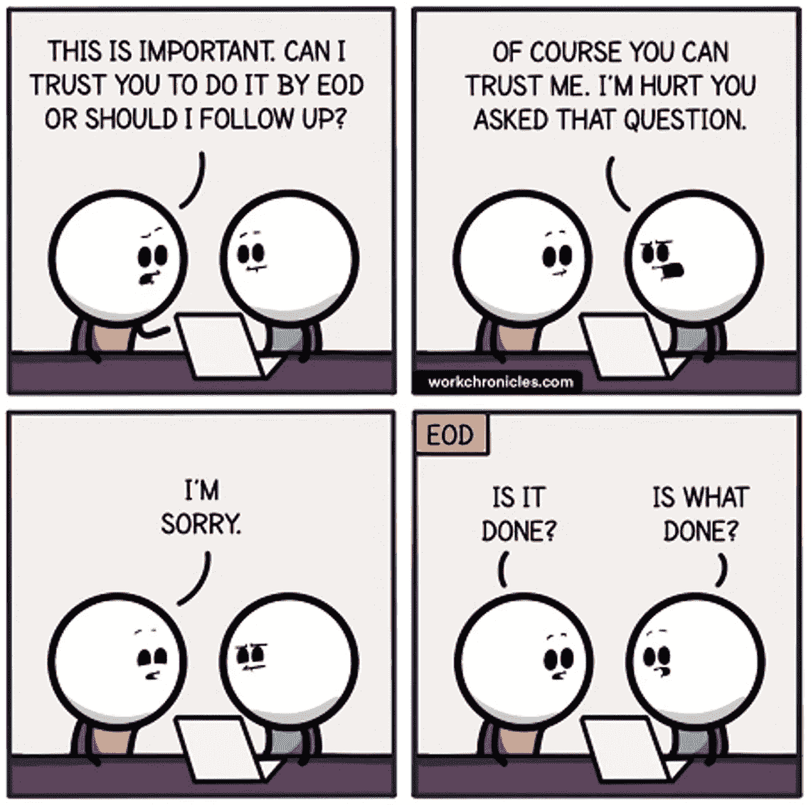

# 作为一个普通程序员，要有非凡的成长，需要掌握的 5 个技能

> 原文：<https://levelup.gitconnected.com/5-skills-to-master-as-an-average-programmer-to-have-an-extraordinary-growth-512dbbe3f7b4>

## 即使你不是一个优秀的程序员，这些技能也能帮助你脱颖而出


来自 [Pexels](https://www.pexels.com/photo/cheerful-man-sitting-at-table-in-workshop-3844524/?utm_content=attributionCopyText&utm_medium=referral&utm_source=pexels) 的 Andrea Piacquadio 的照片

每个开发人员都想在职业生涯中成长。但不幸的是，并不是每个人都有非凡的编程技能。包括我在内的大部分开发人员，编码一般，尤其是涉及数据结构和算法的复杂实现。

这是否意味着一般的开发人员没有机会拥有成功的软件职业生涯？他们必须接受自己的命运，在接下来的职业生涯中从事一份平凡的工作吗？

绝对不会。

软件开发涉及的不仅仅是编码技能。即使你不是一个不可思议的程序员，也有很多方法可以让你的职业道路变得出众。而且，作为一个普通的程序员，你可以掌握这些技能，通过晋升来实现非凡的成长。

让我们来看看你可以掌握的五种实用技能，即使你的编码技能一般，你也可以超越你的同龄人，成为一名成功的软件开发人员。

# 1.提高你的情商

情商对任何个体来说都是一种极其宝贵的特质。它使开发人员能够保持控制，建立协作的工作场所关系，并在其职业生涯中实现非凡的发展。

而且，情商和你编码有多好没有关系。一个普通的开发人员可以掌握他们的情商，并拥有一个非凡的职业生涯。

通常情商低的人在工作场所会因为一些小事而失去冷静。他们要么试图掩饰自己的无能，要么通过自大来炫耀自己的才华。他们会感到沮丧或对不舒服的情况反应激烈。

当这种情况经常发生时，团队往往会远离这样的开发人员。他们更喜欢和一个编程技能稍差但态度更好的人一起工作。

当然，软件开发不是人气竞赛，但也无助于惹怒人。从本质上来说，我们都倾向于喜欢和优秀的人一起工作。

因此，要想成为一名优秀的软件开发人员，你应该同样重视你的编程和行为技能。理解你的情绪，学会如何更好地应对压力。如果你能提高你的情商，你会有更好的前景来实现你的职业目标。

# 2.主动更新你的状态

告诉我你遇到这种情况的频率——你给某人分配任务。开发商同意在要求的时间内完成。但是你不知道他们是否能及时完成，因为你从他们那里绝对得不到任何更新。



信用:[工作时间](https://workchronicles.com/)

人们隐姓埋名令人沮丧，你不知道他们是否在为此努力。

开发人员经常会带着最后一分钟的约束或者一堆为什么他们不能达到目标的理由回来。然而，他们不喜欢你向他们要求地位。他们会认为这是微观管理。

这样的开发人员在他们的职业生涯中不会走得很远，因为没有人喜欢分配严肃的职责。

经理不能将重要的项目分配给在提供状态更新或满足最后期限方面缺乏主动性的开发人员。

因此，养成定期分享更新的习惯。让你的利益相关者了解进展，并主动指出任何障碍。不要等着别人跟你跟进。

有许多方法可以更新您的工作分配状态。您可以在聊天中提供更新，通过电子邮件发送，通过电话进行更新，或者将其放入您的任务跟踪工具中。你可以选择任何适合你的团队的媒体。但是，请确保您至少按照商定的时间表提供状态。

# 3.了解如何对请求进行优先级排序

在一个软件团队中，开发人员每天都会收到来自四面八方的请求。产品所有者、团队成员、您的经理、联锁、QA，甚至您公司中的某个人都希望您优先考虑他们的请求。

一些请求可以通过一个正式的流程得到优先处理。但是其中许多都是临时的，直接提供给开发人员。在这种情况下，程序员经常发现很难用适当的优先级来安排他们的工作。

尽管你可以拒绝任何临时任务，但这样做会妨碍你建立人际关系网或在工作中引人注目。

要想在同龄人中脱颖而出，你需要学会如何分清主次。在决定优先顺序时，有许多因素要考虑。我通常会判断请求的紧急程度、谁在请求、请求是否是我的职责的一部分、我能否委派它，以及我不参与的后果。

如果你对采购订单或经理的每一个请求都要做出决定，决定你应该做什么或不应该做什么，那么你将很难在一个更广泛的论坛上确立自己作为一名有能力的软件工程师的身份。

如果人们每次需要完成一项工作时都通过别人，你很快就会变得隐形。而这恰恰是职业世界的成长杀手。

因此，即使是特别的请求也要开始计划，并学会区分它们的优先次序。有了一个好的优先级计划，你可以比团队中的其他人表现得更好，更有效率。

# 4.学习如何管理你的承诺

渴望给人留下好印象的开发人员经常会做出超出他们能力范围的承诺。他们高估了自己的能力，结果手上有几个半生不熟的项目。

在接受任务时，许多程序员没有做必要的基础工作来做评估。

不幸的是，无论你多么擅长编码，你都不能同时做几件事并按时完成。质量和数量之间总是有所取舍。

并且，理解您可以交付什么并相应地提交什么并不需要出色的编程技能。

在工作中过度投入会影响你的工作生活平衡，损害你的职业声誉。当你接受超出你能力范围的事情，却搞砸了一半，人们会对你失去信任。他们会怀疑你的诚意。

因此，对你能做什么做一个现实的估计。如果这是你能及时完成的全部任务，那就接下一个任务，并尽你最大努力高质量地完成它。

管理承诺的很大一部分是确保你让你的利益相关者知道你是否觉得你要错过它。如果情况紧急，请尽快通知。在软件领域，从来都不是孤注一掷的局面。如果你尽早通知他们，你的经理可以找到解决办法。

# 5.为您的应用付出更多努力

软件开发至少包括与人平等的互动，如果不比与机器互动更多的话。

作为一名软件开发人员，你也应该对这个职业的非编码方面感兴趣。为你的工作感到自豪，确保你为你的利益相关者提供最好的东西。

开发人员通常过于关注编码技能。他们忘记了重要的是你是否能交付一个满足你的涉众期望的应用程序。

作为一名成功的普通程序员，你需要超越你的应用程序，让它们比预期的更好地工作。你可以通过选择创新的方法来解决用户的问题。您可以提出不涉及复杂编码的更简单、更有效的解决方案。

除此之外，您还可以主动确保您的应用程序平稳运行。花时间监控你的应用的健康状况，在问题变得更严重之前发现问题。

与您的用户交谈，了解他们在使用应用程序时面临的挑战。有没有什么东西稍微修改一下就能让他们的生活变得更轻松？一旦完成，你会惊讶地发现小小的改变可以极大地改善用户体验。

超越你的日常职责将会使你成为一个优秀的程序员，而不是一个还没有准备好挑战极限的人。这将帮助你在同龄人中脱颖而出，并有更好的职业发展。

# 最后的想法

这些动作都不需要你在编程方面很优秀。你可能是一个普通的程序员，但仍然可以采取上述所有措施来拥有一个杰出的软件职业生涯。

事实上，如果你能始终如一地执行这些动作，你就能保证自己比那些拥有扎实的编码能力但缺乏上述技能的人更快地获得专业成长。

```
Thanks for the read. If you like my articles, [you can become a Medium member by visiting this link](https://lokajit-tikayatray.medium.com/membership) to support my writing.
```

**您可能也想阅读:**

[](/this-is-why-most-programmers-fail-to-become-senior-developer-143bc8c1342d) [## 这就是为什么大多数程序员没能成为高级开发人员

### 5 个习惯可以证明你还没有为下一个角色做好准备

levelup.gitconnected.com](/this-is-why-most-programmers-fail-to-become-senior-developer-143bc8c1342d) [](/10-hilarious-programming-jokes-for-the-programmers-f4daa750c686) [## 程序员的 10 个无聊编程笑话

### #1.JDK-20 的特点:低代码来到 Java

levelup.gitconnected.com](/10-hilarious-programming-jokes-for-the-programmers-f4daa750c686) [](/5-signs-of-a-highly-mature-software-developer-a23285e5cf1b) [## 高度成熟的软件开发人员的 5 个标志

### 这些特征很容易识别，但很难实践

levelup.gitconnected.com](/5-signs-of-a-highly-mature-software-developer-a23285e5cf1b)