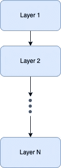
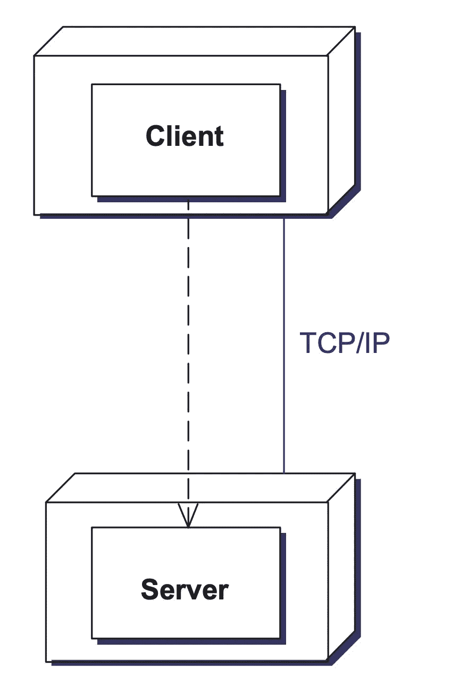
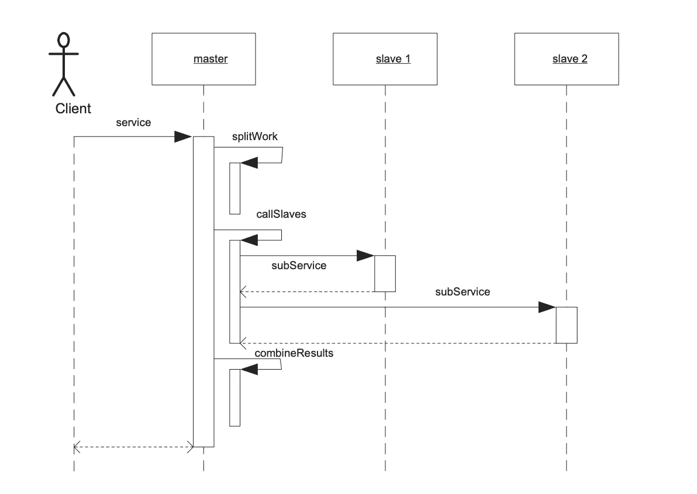
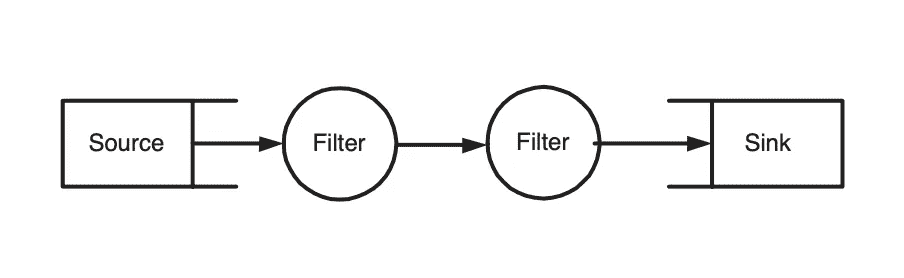
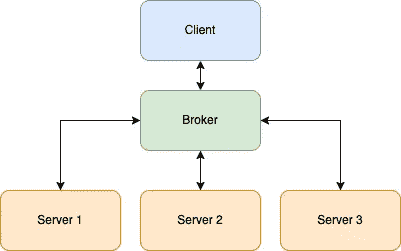

# 5 种软件架构模式

> 原文：<https://levelup.gitconnected.com/5-software-architectural-patterns-871e2705c998>

## 它们是什么&为什么你应该关心

杰里米·贝赞格在 [Unsplash](https://unsplash.com?utm_source=medium&utm_medium=referral) 上的照片

软件架构模式在每个产品的可伸缩性中扮演着重要的角色。

在本文中，我们将涵盖其中的 5 种模式，并讨论它们作为开发生命周期的一部分的重要性。

# 为什么？

*   提前计划并遵循一种模式或风格可以让开发人员更好地了解每个组件的职责，并让开发人员能够专注于较低层次的细节。
*   熟悉许多软件架构模式并理解每种模式的优缺点，对于选择最适合特性需求的模式是必不可少的，并且最终，很可能，将导致更好和更容易的实现。

# 什么？

根据我关于软件架构模式的病毒式推文，它们本质上是被社区广泛接受的解决方案，用来解决重复出现的设计问题。

# 例子

## 图层模式

Layers 模式有助于构建可以分解成子任务组的应用程序。

每一层都向上一层提供服务。
一个层中的服务是使用下一个较低层的服务实现的。

本质上，这种模式意味着不同的问题被分别实现，并且较高抽象级别的层使用较低抽象级别的层。

## 客户机-服务器模式

在客户机-服务器模式中，一个服务器组件向多个客户机组件提供服务。

客户端组件向服务器组件请求服务。

服务器永远处于活动状态，监听客户端。

您可以将客户机-服务器模式看作是分层模式的变体，它跨越了进程或机器的界限:客户机构成了较高的层次，而服务器构成了较低的层次。

## 主从模式

主从模式支持容错和并行计算。

主组件在相同的从组件之间分配工作，并根据从组件返回的结果计算最终结果。

## 管道过滤模式

管道过滤器模式为产生数据流的系统提供了一种结构。

每个处理步骤都封装在一个过滤器组件中。数据通过管道传递。

管道可用于缓冲或同步。

## 经纪人模式

Broker 模式用于构建具有解耦组件的分布式系统，这些组件通过远程服务调用进行交互。

代理组件负责协调组件之间的通信。

服务器向代理发布它们的功能。

客户端向代理请求服务，然后代理将客户端从其注册中心重定向到合适的服务。

使用代理模式意味着除了代理之外，没有其他组件需要关注底层的进程间通信。

如果你觉得这很有帮助，并希望支持我，你可以通过我的[推荐链接](https://eliran9692.medium.com/membership)获得一个中级会员，并在平台上阅读我和其他伟大作家的所有文章(不增加你的费用，我有佣金)。

 [## 通过我的推荐链接加入 Medium-Eliran turge man

### 阅读 Eliran Turgeman(以及媒体上成千上万的其他作家)的每一个故事。您的会员费直接支持…

eliran9692.medium.com](https://eliran9692.medium.com/membership)