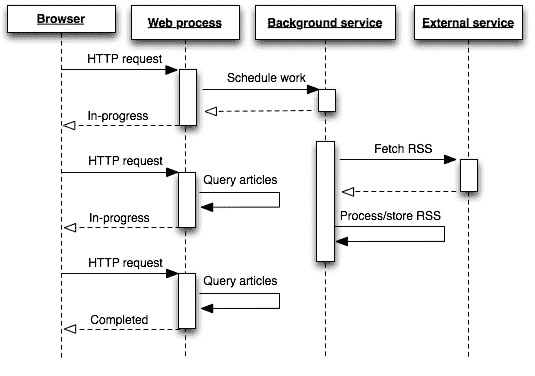
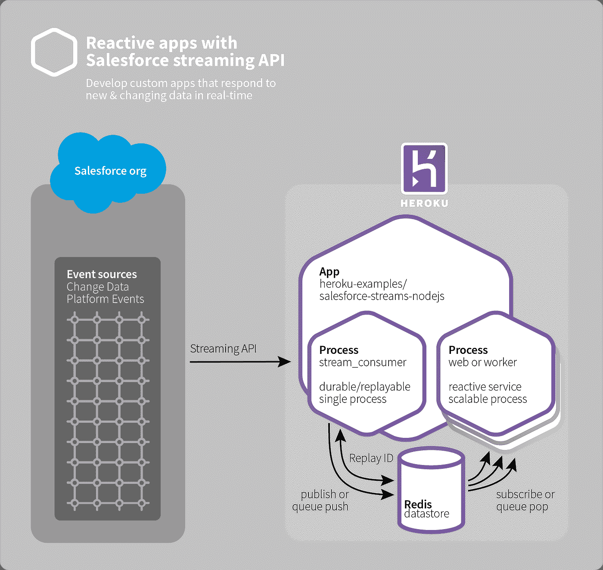
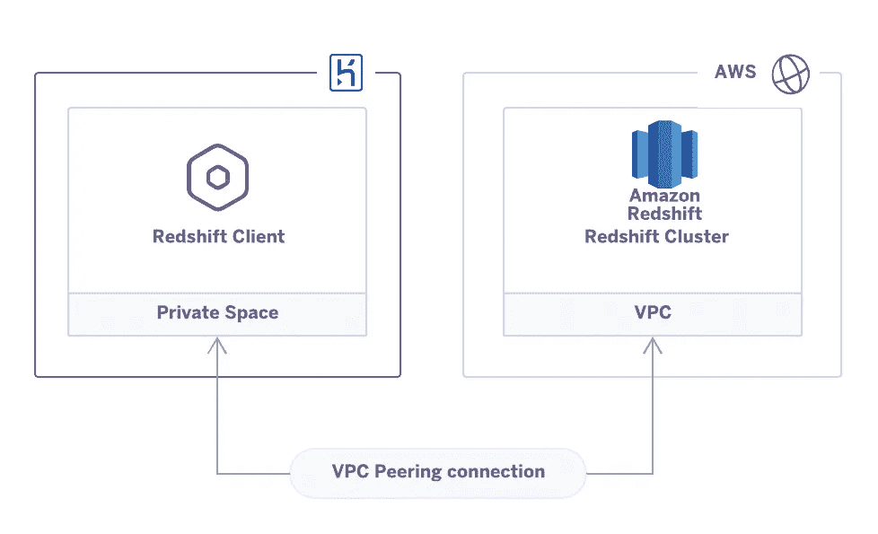

# 您可以在 PaaS 上快速原型化 5 种软件架构

> 原文：<https://levelup.gitconnected.com/5-software-architectures-you-can-quickly-prototype-on-paas-285414140a26>

有时，作为一名架构师或开发人员，您想尝试一种新的技术堆栈或技术解决方案，但似乎找不到时间来安装、配置、调试和理解一个全新的概念。实验是一项繁重的工作，项目截止日期排在第一位，新技术通常是你最后的优先事项之一。

然而，平台即服务(PaaS)可以提供帮助。PaaS 的优势之一是预配置部署的速度和简单性。您可以滚动选项列表，单击一两个按钮，在几分钟内就可以部署、运行参考体系结构或示例项目，并为实验做好准备。

在本文中，我们将回顾五种可以使用 PaaS 快速尝试的架构。大多数 PaaS 平台都支持原型开发。对于我们的例子，我们将使用 Heroku 及其“[一键式部署](https://elements.heroku.com/buttons/)和[地形](https://www.terraform.io/intro/index.html)脚本，因为它们易于使用。你需要一个 Heroku 账户来开始，尽管基本的免费计划适用于这些例子中的大多数(我会注意你哪里需要更多)。

## **1。使用平均堆栈的 RESTful 应用**

平均堆栈已经成为现代网络开发的基石。这个堆栈由 [MongoDB](https://www.mongodb.com/) 、 [Express.js](https://expressjs.com/) 、 [AngularJS](https://angularjs.org/) 和 [Node.js](https://nodejs.org/en/) 组成，具有可伸缩性和可扩展性。它通常是云托管应用的首选堆栈。

对于初学者来说，MEAN stack 也是一个很好的起点，因为这些技术在能够提供帮助和支持的活跃社区中很受欢迎。额外的好处是，您只需要知道客户机和服务器的一种语言——JavaScript。

[使用这个一键部署](https://devcenter.heroku.com/articles/mean-apps-restful-api)来部署一个简单的“联系人列表”应用。此部署:

*   在 Express 和 Node.js 中创建 RESTful API 服务
*   将 MongoDB 数据库连接到 API 服务器
*   使用 Angular 创建丰富的 web 应用程序

或者，从同一个链接，您可以一步一步地完成教程，自己创建和部署应用程序。

## **2。异步网络工人**

长时间运行的服务器请求会降低应用程序的性能和可伸缩性。处理这些问题的标准方式是使用[异步 web workers 来完成任务](https://devcenter.heroku.com/articles/background-jobs-queueing)。将长时间运行的任务转移到后台工作人员可以释放资源并保持应用程序的响应速度。

*为任务使用后台服务的示例架构*

实现异步 web workers 的一种流行方式是使用队列。队列从客户端获取工作请求，存储它们，并保证移交给一群工作人员。[这个参考架构](https://devcenter.heroku.com/articles/asynchronous-web-worker-model-using-rabbitmq-in-java)使用 Java、 [Spring MVC](https://spring.io/guides/gs/serving-web-content/) 、 [RabbitMQ](https://www.rabbitmq.com/) 和 [AMPQ](http://www.amqp.org/) 实现了这个设计。

为了开始，你可以很容易地[克隆这个项目](https://github.com/heroku/devcenter-java-web-worker/)用于你自己的实验。该项目创造了:

*   Web——一个 Spring MVC 应用程序，它接收 web 请求并在 RabbitMQ 中对它们进行排队
*   worker——一个独立的 Java 应用程序，使用 Spring AMPQ 来读取和处理来自 RabbitMQ 的消息

参考架构还包括项目中关键类的演练。

对于队列的另一个快速部署示例，[查看这篇关于使用 RSMQ 和 Reddis 创建队列的文章](https://dev.to/heroku/scale-your-apps-with-an-easy-message-queue-on-redis-4glp)。

## **3。与 Salesforce 的反应式集成**

Salesforce 在技术社区中无处不在。它的工具和平台被用于各种各样的目的，远远超出了基本的 CRM。联系 Salesforce 生态圈来观察事件或对事件做出反应是一种常见的需求。

[此参考架构](https://github.com/heroku-examples/salesforce-streams-nodejs)利用 Salesforce 平台事件和变更数据捕获来创建响应 Salesforce 活动的应用程序。

该应用程序有一个基于 web 的用户界面和两个服务器端进程:

*   stream-consumer . js-sales force 流 API 消费者
*   server.js 向 web 浏览器提供帐户更改的 web 应用程序和 API

以下是部署的基本架构:

*与 Salesforce 的反应式集成概述*

由于 Salesforce 设置可能非常复杂，因此这一部署不仅仅需要单击一下。但是，该示例应用程序应该为您提供一种快速、简单的方法来理解和测试 Salesforce 集成。

## **4。事件驱动的微服务**

如果您是一名企业架构师，您可能听说过并使用过微服务架构。虽然您过去可能使用 REST 作为您的服务通信层，[越来越多的项目正在转向事件驱动架构](https://dev.to/heroku/best-practices-for-event-driven-microservice-architecture-2lh7)。事件驱动在以下情况下很受欢迎:

*   您有大量需要异步通信的微服务。
*   您希望您的微服务是解耦的、可替换的和独立维护的。
*   您有一个或多个产生事件的服务，这些事件需要由许多服务来处理。
*   您希望使用比典型的 HTTPS 方法更具解耦性的微服务通信模式。

[有了这个参考架构](https://devcenter.heroku.com/articles/event-driven-microservices-with-apache-kafka),您可以部署一个完整的事件驱动的 Apache Kafka 架构的工作实现，它由客户端、生产者、消费者和仪表板组成。您需要首先在您的环境上做一些准备工作，但是一旦设置好了，您就可以使用一个单击式 Terrascript 来部署整个示例项目。

要更详细地了解这个参考架构，[查看这篇关于流处理的文章](https://dev.to/heroku/how-stream-processing-makes-your-event-driven-architecture-even-better-5ehg)。

*注意:您将需要一个[标准计划](https://www.heroku.com/pricing)来部署此参考架构。

## **5。私有云通信**

如果你运行的是 AWS 服务，比如亚马逊 VPC 的 Redshift 或 RDS，你可能正在寻找一种方法通过私有连接将你的应用程序连接到这些服务。这个示例项目实现了私有的多云通信，因此您的应用程序可以与您的 AWS 服务进行私有通信，而无需穿越公共互联网。

如果您使用 Amazon 红移集群来分析数据，这可能会很有用。您可以将 VPC 连接到您的应用程序，并将数据从 Postgres 数据库安全地传输到 Redshift 集群进行分析。

[这个 Terraform 脚本](https://devcenter.heroku.com/articles/peering-aws-rds-aws-redshift-with-heroku)易于部署，创建了一个简单的私有云通信实现。当您运行脚本时，它会:

*   创建亚马逊 VPC 和亚马逊红移集群
*   同行的 [Heroku 私人空间](https://www.heroku.com/private-spaces)和 VPC，并设置相应的安全组
*   将一个红移客户端应用程序部署到 Heroku，该应用程序连接到红移数据库

*私有云通信*

设置有几个步骤，您需要熟悉 VPCs 的管理，但是您将很快启动并运行安全连接。

*注意:你需要一个[企业计划](https://www.heroku.com/enterprise)来部署这个例子(为了有一个 Heroku 私人空间)

**结论**

PaaS 不仅简化了部署和开发工作，还提供了一种快速、高效的方法来测试新的架构和技术。