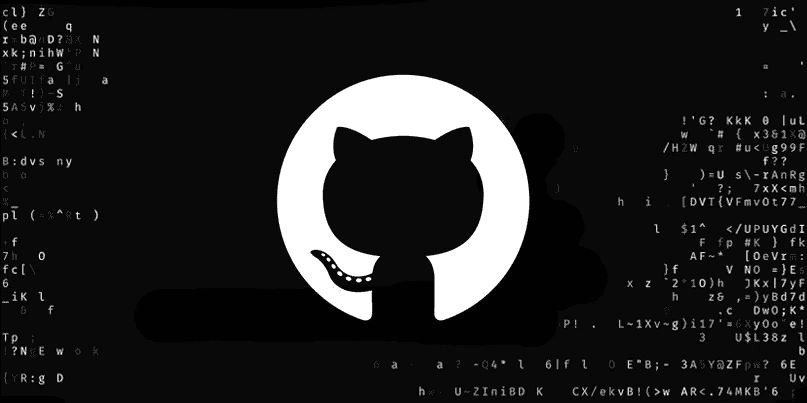
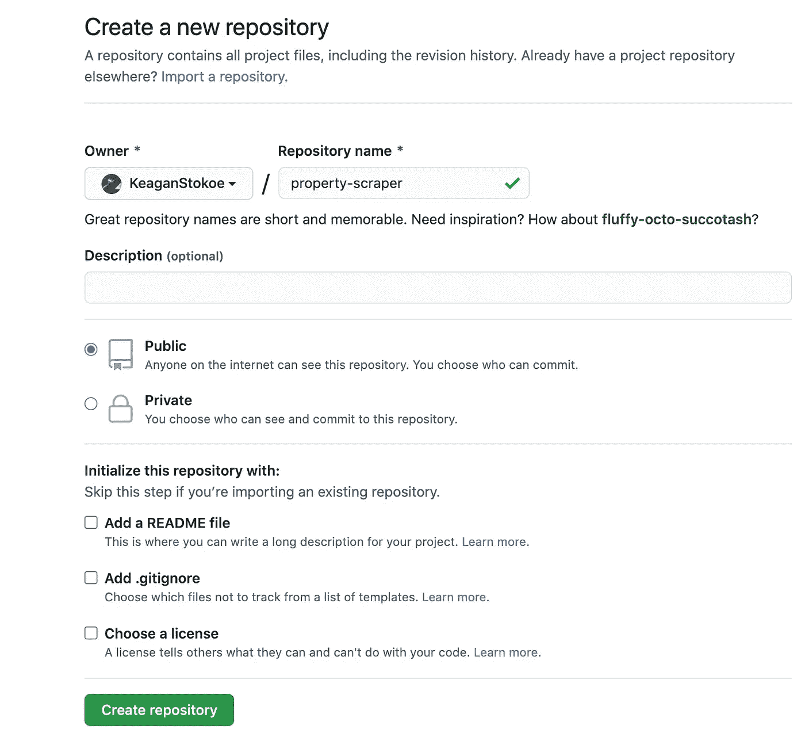
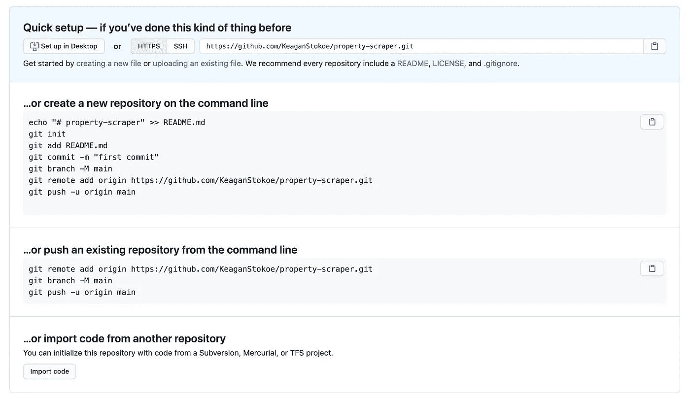
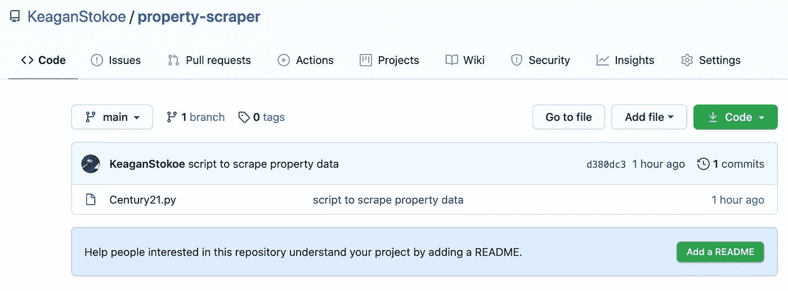

# 导航 Git 和 GitHub 的 6 步指南

> 原文：<https://levelup.gitconnected.com/5-step-guide-to-git-and-github-3ca4e63a95ba>



如果你正在学习编码，你会经常听说你的 GitHub 概要文件有多重要。它就像程序员的社交网络——一个展示你的工作、寻找有趣的项目和与有才华的人联系的地方。

我记得听到这句话时，我决定是时候建立一个 GitHub 档案了。我要坚持不懈地编写代码，建立自己的档案。然后我在第一个障碍上绊了一下:**我实际上如何将代码推送到 GitHub？**

在这篇文章中，我将解释 Git 和 GitHub 之间的区别，并规划您可以用来将代码推送到 GitHub 的工作流。

# Git vs GitHub

Git 是一个版本控制系统，可以让你管理和跟踪你的源代码历史。 **GitHub** 是一个基于云的托管服务，可以让你管理你的 **Git** 库。换句话说， **Git** 是一个跟踪项目文件随时间变化的系统， **GitHub** 是一个管理它的平台。

# 工作流程——将您的代码发布到 GitHub

## 步骤 1:初始化存储库

> git 初始化

如果你使用 Git 和 GitHub 来管理一个项目，你需要做的第一件事就是初始化一个存储库。执行此操作时，请确保导航到正确的目录。在这个例子中，我在调用`git init.`之前导航到了‘GitHub Tutorial’文件夹。下面的代码块显示了您期望的输出。

```
keaganstokoe@Keagans-Mac GitHub Tutorial % git initInitialized empty Git repository in /Users/keaganstokoe/Desktop/GitHub Tutorial/.git/
```

## 步骤 2:检查 Git 状态

> git 状态

当位于终端的项目文件夹中时，键入‘git status’来检查您的存储库的状态。这个命令向您显示哪些文件已经被更改，哪些文件被跟踪，以及哪些文件仍然需要添加到**暂存区**(我很快就会谈到这一点)。

```
keaganstokoe@Keagans-Mac GitHub Tutorial % git statusOn branch masterNo commits yetUntracked files:(use "git add <file>..." to include in what will be committed)Century21.pynothing added to commit but untracked files present (use "git add" to track)
```

上面的代码块仅仅意味着名为“Century21.py”的文件还没有添加到我的 git 历史中。如果我对这个目录中的其他文件进行更改，它们也会出现在这里。

## 第三步:Git 添加

> git 添加<filename></filename>

这个例子很简单——它只处理一个文件——但是当您处理一个包含数千个文件和数千个更新的代码库的项目时，该怎么办呢？在大多数情况下，你不会想每次做一个改变就把所有东西都推给 GitHub。

出于这个原因，这个过程被分为阶段化和提交代码。

> 我认为它是一个机场。机场挤满了飞往不同地方的人。为了保持秩序，确保没有人登上错误的飞机，机场为不同的航班设置了不同的候机室。在登机前，每个人都必须到登机口报到。一旦所有人都到了，你就可以开始登机了。Git 的工作原理是一样的。通过调用 `**git add <filename>**` **，你可以让所有你想登机的人到登机口报到。**

```
keaganstokoe@Keagans-Mac GitHub Tutorial % git add Century21.py
```

## 步骤 4: Git 提交

> git commit -m " <commit message="">"</commit>

一旦您确信您想要更新的所有文件都在那里，您就可以调用`git commit -m "<commit message>"`。把这当成登机。输出应该类似于下面的代码块:

```
keaganstokoe@Keagans-Mac GitHub Tutorial % git commit -m "script to scrape property data"[master (root-commit) d380dc3] script to scrape property data1 file changed, 84 insertions(+)create mode 100644 Century21.py
```

## 步骤 5:转到 GitHub 并创建一个新的存储库

访问 GitHub，点击右上角的加号(+)或屏幕左侧的绿色按钮“New ”,创建一个资源库。给它起个名字，然后点击“创建存储库”。你可以想象你的飞机起飞的这一步。



**下一个屏幕很重要，应该是这样的:**



## **第六步:推送到 GitHub**

由于我们已经创建了一个存储库(步骤 1–3)，我们将从命令行推送一个现有的存储库。

要做到这一点，只需从第二个选项中复制代码并粘贴到您的终端中。

```
keaganstokoe@Keagans-Mac GitHub Tutorial % git remote add origin https://github.com/KeaganStokoe/property-scraper.gitgit branch -M maingit push -u origin mainEnumerating objects: 3, done.Counting objects: 100% (3/3), done.Delta compression using up to 8 threadsCompressing objects: 100% (2/2), done.Writing objects: 100% (3/3), 1.00 KiB | 1.00 MiB/s, done.Total 3 (delta 0), reused 0 (delta 0)To https://github.com/KeaganStokoe/property-scraper.git* [new branch]      main -> mainBranch 'main' set up to track remote branch 'main' from 'origin'.
```

**您现在已经将您的代码推送到您的 GitHub 个人资料中。如果您导航回 GitHub 上的存储库，您会看到您的文件在那里。**



# 摘要

*   本文解释了如何初始化 git repo，将文件添加并提交到您的 git 历史中，并将这些更改推送到 GitHub。
*   整篇文章中使用的比喻是在机场登机。在步骤 1 中，您使用了`git init`来启动一个存储库。把这当成订机票。
*   步骤 3 和步骤 4 使用了`git add`和`git commit`将我们的文件添加并提交到本地 git 历史中。把这想象成在允许乘客登机之前，在登机口(临时登机口)聚集乘客。
*   步骤 5 只需要你访问 [GitHub](https://github.com/) 并创建一个新的存储库，然后按照屏幕上的提示操作，直到你获得了将你的更改推送到你的 GitHub 配置文件所需的代码。
*   在第 6 步中，您只需将这段代码粘贴到您的终端中。你可以把这想象成飞机起飞，你的代码安全地装载在飞机上，并被存储在基于云的 GitHub 上。

# 进一步的学习资源

本文是关于如何将您的第一个项目推送到 GitHub 的一个非常基本的概述。GitHub 是一个强大的开源项目协作和工作工具。下面的参考资料是开始学习更多关于 Git 和 GitHub 知识的好地方:

*   柯尔特·斯蒂尔的[15 分钟学会 Git](https://www.youtube.com/watch?v=USjZcfj8yxE)和[20 分钟学会 GitHub](https://www.youtube.com/watch?v=nhNq2kIvi9s)视频。他们还附有详尽的书面指南(这里的[和这里的](https://www.notion.so/Introduction-to-Git-ac396a0697704709a12b6a0e545db049#d5e9c2b6379246a593c1ef74051e7e3c))。
*   要了解更多关于 GitHub 及其强大功能的信息，请查看他们的[帮助页面](https://help.github.com)和[指南](https://guides.github.com/)。
*   另外，查看 GitHub Gist ，这是一个分享你的代码、笔记或其他片段的简单方法。