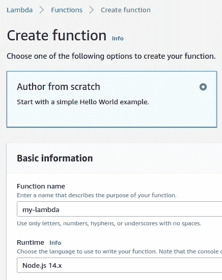
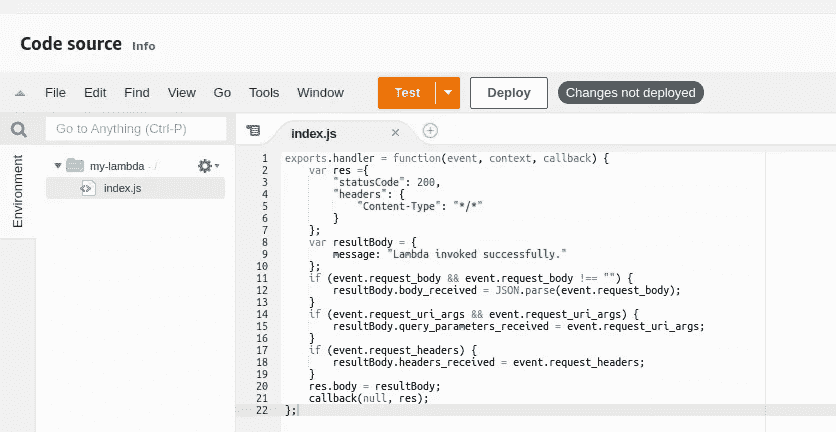
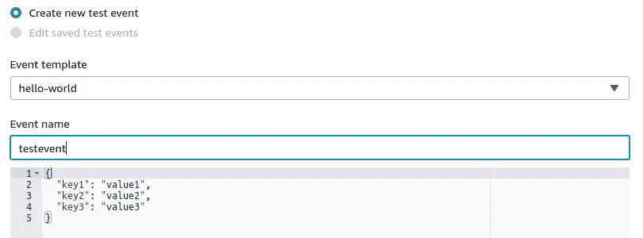
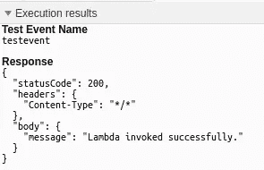
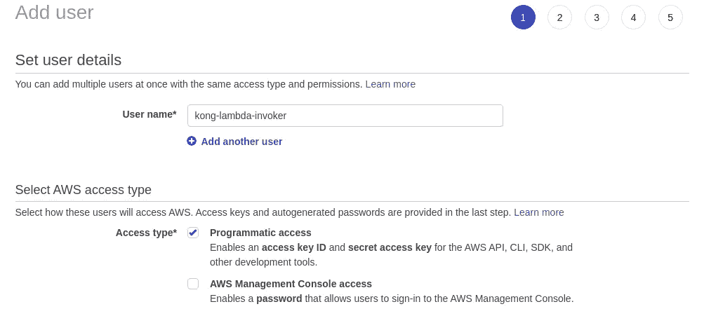
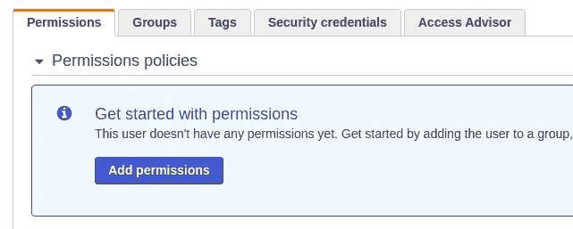
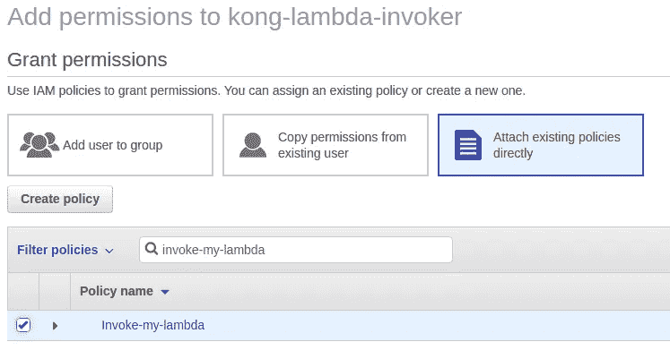
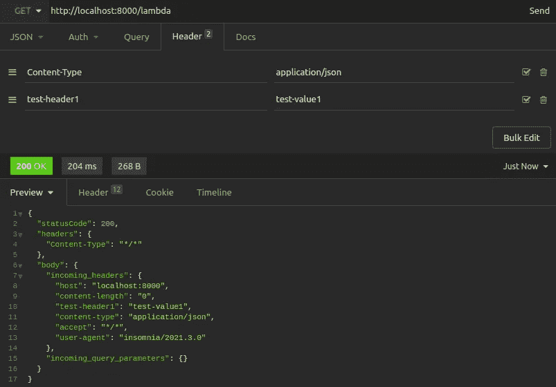
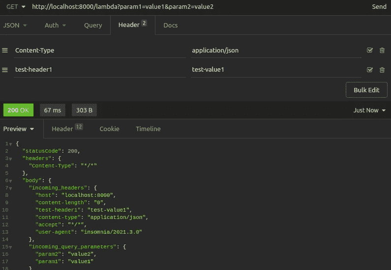
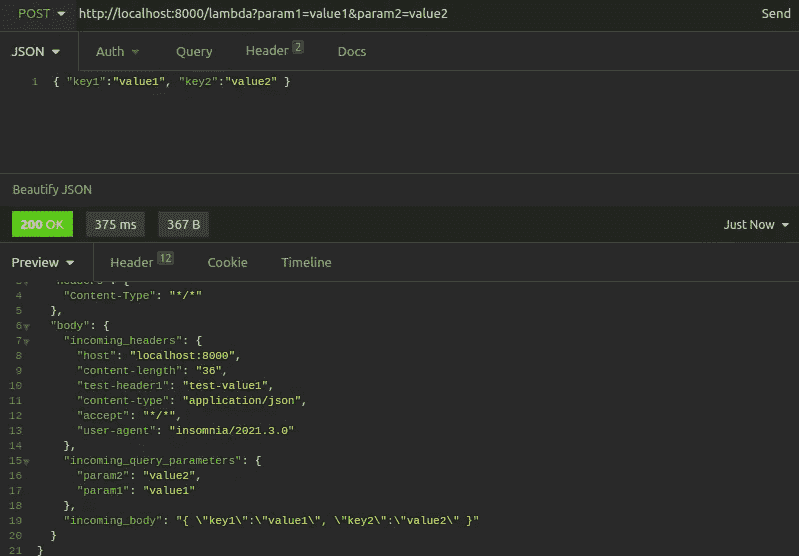

# 使用 Kong 的 AWS Lambda 插件实现无服务器安全的 5 个步骤

> 原文：<https://levelup.gitconnected.com/5-steps-to-serverless-security-with-the-aws-lambda-plugin-from-kong-c8616e47013e>


由 [Unsplash](https://unsplash.com/s/photos/server?utm_source=unsplash&utm_medium=referral&utm_content=creditCopyText) 上的 [Kvistholt 摄影](https://unsplash.com/@freeche?utm_source=unsplash&utm_medium=referral&utm_content=creditCopyText)拍摄

## 如何使用 Kong 的 AWS Lambda 插件进行 Lambda 调用

对于不喜欢开发的开发者来说，lambdas 是天堂。他们可以专注于编写自包含和模块化的代码片段，部署这些功能以按需执行，而无需关心资源管理或基础架构。然而，Lambda 的执行可能很棘手。

AWS API Gateway 的无服务器安全性令人望而生畏，尤其是当您只想调用一个简单的函数作为 API 端点时。对于这一点，有孔的轻松关口。

本文和视频将介绍如何使用 [AWS Lambda 插件](https://docs.konghq.com/hub/kong-inc/aws-lambda)设置 Kong Gateway。我们的小型项目将经历以下步骤:

1.  在 Node.js 中构建一个简单的无服务器函数，该函数处理请求的头部、查询参数和主体，然后用 JSON 进行响应。
2.  将我们的无服务器功能部署到 AWS Lambda。
3.  获取调用 Lambda 所需的凭证。
4.  配置 Kong 网关监听特定本地路径上的请求。
5.  向 Kong 添加 AWS Lambda 插件，以便对该路径的请求调用我们的 Lambda 并返回调用结果。

要走在旁边，你需要以下物品:

1.  一个 [AWS 账户](https://aws.amazon.com/free/)(我们的资源使用可能是自由层)。
2.  基本熟悉 JavaScript 和 Node.js。
3.  安装在本地计算机上的 AWS CLI。
4.  孔网关安装在您的本地机器上。遵循 [Kong 文档](https://docs.konghq.com/)中的入门说明。

# 核心概念

## 自动气象站λ

几年前，AWS Lambda 服务是无服务器的同义词。它代表了功能即服务(FaaS)的首批主流产品之一。有了 AWS Lambda，开发人员只需上传一个函数的代码。

每当您需要执行函数时，AWS Lambda 都会提供执行函数所需的资源，然后在无服务器函数执行完成时取消提供这些资源。开发人员不再需要关心资源管理，因为 AWS Lambda 在幕后处理它。AWS Lambda 目前支持 Node.js、Ruby、Python 和其他几种语言。

## 无服务器安全性

当涉及到部署无服务器代码时，安全性是一个关键问题，AWS 提供了一些需要牢记的[安全最佳实践](https://docs.aws.amazon.com/whitepapers/latest/serverless-architectures-lambda/security-best-practices.html)。虽然不再有需要保持安全的服务器，但是关键的问题是正确地保护无服务器功能代码的调用和更新。

只有那些有适当授权的人，无论是服务还是人类用户，才应该被允许调用或更新无服务器代码。在 AWS 领域，这意味着建立适当的 IAM 策略，并将它们附加到与服务相关的角色或单个用户。对于 AWS Lambda，安全锁定的相关[操作](https://docs.aws.amazon.com/lambda/latest/dg/API_Operations.html)包括`InvokeFunction`和`UpdateFunctionCode`。

## 孔门户

Kong Gateway 是一个轻量级的开源 API 网关，位于您的上游服务之前。Kong Gateway 易于配置和快速部署，充当中央网关守卫，将所有传入请求路由到其预期目的地，无论是上游 API 服务器、第三方服务、数据库，甚至是部署到 AWS Lambda 的功能。

作为你的用户客户端和你的上游服务之间的一个薄薄的层，API gateway 进一步扩展了无数的 [Kong 插件](https://docs.konghq.com/hub/)来处理[认证](https://konghq.com/learning-center/api-gateway/api-gateway-authentication/)、授权、流量控制、安全等等。

# 步骤 1:编写我们的函数

对于我们的迷你项目，我们将使用为 Node.js 编写的基本 Lambda 函数。从关于示例函数代码的 [AWS 文档中获得线索，我们编写了以下代码:](https://docs.aws.amazon.com/lambda/latest/dg/with-android-create-package.html)

```
exports.handler = function(event, context, callback) {
    var res ={
        "statusCode": 200,
        "headers": {
            "Content-Type": "*/*"
        }
    };
    var resultBody = {
        message: "Lambda invoked successfully."
    };
    res.body = resultBody;
    callback(null, res);
};
```

简而言之，我们的函数用一个状态代码、一个简单的头和一个消息体来响应。我们将在后面的步骤中扩展这个函数，利用传入请求的头、查询字符串参数和主体。不过，就目前而言，这已经足够开始了。

# 步骤 2:将功能部署到 AWS Lambda

接下来，我们将功能代码部署到 AWS Lambda。我们在 AWS 控制台中导航到 Lambda services，确保我们已经选择了一个部署区域。对于本例的其余部分，我们将使用`us-west-2 region`。点击创建功能。

我们将从头开始编写我们的函数，为我们的函数选择一个名称(my-lambda)并选择一个 Node.js 运行时(`Node.js 14.x`)。



创建了 Lambda 之后，我们导航到代码源并双击`index.js`。然后，我们粘贴上面的函数代码。



点击部署。

为了确保我们的函数正常工作，我们可以直接在控制台中测试调用。点击测试，然后点击配置测试事件。使用默认的“hello world”模板。命名您的测试事件，保留提供的默认主体。点击创建。



Now, with your `testevent` selected, click on Test. The execution results show the result of our function call 一 a status code, headers, and a body with a message.



既然我们已经部署了简单的 Lambda，我们希望远程调用我们的函数。让我们转到本地机器上的命令行。

# 步骤 3:获取调用 Lambda 的凭证

当然，不是任何人都可以调用你的 Lambda。我们提到了无服务器安全需求，以确保我们正确地锁定了调用函数和更新函数代码的能力。对于我们当前的例子，我们将关注函数调用。

我们需要为有权调用这个 Lambda 的 AWS IAM 用户提供凭证。当我们使用 AWS CLI 尝试在没有任何凭证的情况下调用 Lambda 函数时，这一点很明显:

```
$ aws lambda invoke \
--region=us-west-2 \
--invocation-type=RequestResponse \
--function-name=my-lambda \
response.json Unable to locate credentials. You can configure credentials by running "aws configure".
```

我们的第一步是创建一个 IAM 用户。在 AWS 控制台中，导航到 IAM 服务，然后导航到用户。使用您选择的名称创建一个新的 IAM 用户，并授予该用户编程访问权限。我们称我们的用户为`kong-lambda-invoker`。



逐步浏览权限、标签和审查，使用默认设置。我们将创建一个没有权限的用户，然后从那里开始迭代。点击创建用户。现在，您有了新用户的“访问密钥 ID”和“秘密访问密钥”。

回到命令行，让我们设置这些凭证。我们粘贴来自 IAM 用户创建结果的值，并指定我们的区域(`us-west-2`)和默认输出格式(`json`):

```
$ aws configure
AWS Access Key ID [None]: AKIA5***************
AWS Secret Access Key [None]: hg8o***********************************
Default region name [None]: us-west-2
Default output format [json]: json
```

现在我们已经配置了 AWS 凭证，我们尝试再次从命令行调用我们的函数:

```
$ aws lambda invoke \
--region=us-west-2 \
--invocation-type=RequestResponse \
--function-name=my-lambda \
response.json An error occurred (AccessDeniedException) when calling the Invoke operation: User: arn:aws:iam::95**********:user/kong-lambda-invoker is not authorized to perform: lambda:InvokeFunction on resource: arn:aws:lambda:us-west-2:95**********:function:my-lambda
```

进步！我们仍然无法调用我们的函数，但是这一次，原因不同了。我们的用户`kong-lambda-invoker`没有权限调用我们的函数。让我们提供这些权限。回到 AWS IAM，我们选择我们的用户并单击 Add permissions。



接下来，单击直接附加现有策略，然后创建策略。在策略编辑器中，单击 JSON 并粘贴以下代码。确保用部署 lambda 的区域替换 REGION(`us-west-2`)。此外，用您的 AWS 帐户 ID 替换`AWS-ID`。

```
{
    "Version": "2012-10-17",
    "Statement": [
        {
            "Sid": "VisualEditor0",
            "Effect": "Allow",
            "Action": "lambda:InvokeFunction",
            "Resource": "arn:aws:lambda:REGION:AWS-ID:function:my-lambda"
        }
    ]
}
```

单击其余的策略创建部分，接受所有默认设置。为策略命名(例如，`Invoke-my-lambda`)。既然我们已经创建了 lambda 调用策略，我们将返回到 IAM 用户并为`kong-lambda-invoker`用户添加权限。

我们直接附加现有的策略，然后找到我们刚刚创建的策略。选择策略后，我们单击剩余的步骤，并将权限附加给我们的用户。



有了用户和策略之后，我们可以返回到命令行并再次调用该函数。AWS 可能需要一两分钟来对您的用户进行权限更改。然而，不久之后，我们的结果是:

```
$ aws lambda invoke \
--region=us-west-2 \
--invocation-type=RequestResponse \
--function-name=my-lambda \
response.json
{
    "StatusCode": 200,
    "ExecutedVersion": "$LATEST"
}$ more response.json
{"statusCode":200,"headers":{"Content-Type":"*/*"},"body":{"message":"Lambda invoked successfully."}}
```

有用！我们查看输出文件`response.json`，看到我们的`200` 状态和带有消息的初始主体。部署了 Lambda 函数并获得了凭证后，就该配置 Kong 了。

# 步骤 4:配置开源的 Kong 网关

根据您的无服务器环境，在本地机器上安装 Kong 的步骤会有所不同。一旦安装完成，我们有几个配置步骤要遵循。

## 设置声明性配置

要使用 AWS Lambda 插件，我们可以在[无 db 模式](https://docs.konghq.com/gateway-oss/2.3.x/db-less-and-declarative-config/)下运行 Kong，这意味着我们只需编写一个声明性配置文件，当我们启动 Kong 时，系统会读取该文件。首先，我们将创建一个项目文件夹并生成样板配置文件:

```
~$ mkdir project
~$ cd project
~/project$ kong config init
~/project$ tree
.
└── kong.yml0 directories, 1 file
```

接下来，我们将配置 Kong 的启动行为来使用那个`kong.yml`进行配置。为此，我们需要复制`Kong's kong.conf.default` 模板文件，将副本命名为`kong.conf`，然后编辑它:

```
~/project$ cd /etc/kong
/etc/kong$ sudo cp kong.conf.default kong.conf
/etc/kong$ tree
.
├── kong.conf
├── kong.conf.default
└── kong.logrotate0 directories, 3 files
```

现在，让我们编辑`kong.conf` 来做一些改变。

```
#PATH: /etc/kong/kong.conf# Around line 938, uncomment and set to off
database = off# Around line 1122, uncomment and set to
# absolute path to project's kong.yml file
declarative_config = /PATH/TO/MY/PROJECT/kong.yml
```

有了这两个更改，Kong 知道在启动时以无 db 模式工作，查看我们指定的声明性配置文件。将我们的注意力转回到我们的声明性配置文件，让我们为 Kong 设置一个上游服务和一个路由。粘贴以下代码作为`kong.yml`的全部内容:

```
_format_version: "2.1"
_transform: true
services:
  - name: my-service
    url: https://httpstat.us/200
routes:
  - name: my-lambda-route
    service: my-service
    paths:
      - /lambda
```

上面，我们添加了一个上游服务(名为`my-service`)。这个上游服务简单地指向[一个用于 HTTP 状态代码测试的站点](https://httpstat.us/)，它将返回一个`200`。然后，我们创建一个路由(称为 my-lambda-route ),监听`/lambda`路径上的请求，将这些请求转发给我们的上游服务。

## 启动孔

准备好声明性配置文件后，我们启动 Kong:

```
~/project$ sudo kong start
```

## 使用 Curl 请求进行测试

我们可以使用`curl`发送一个请求，看看 Kong 是否正确地监听了路径，并成功地将请求转发给上游服务:

```
~/project$ curl http://localhost:8000/lambda
200 OK
```

非常好。孔已经起来了。接下来，我们将对我们的`kong.yml`文件做一些修改，添加 AWS Lambda 插件。

# 步骤 5:为 Kong 添加 AWS Lambda 插件

最简单的形式是，AWS Lambda 插件可以在路由上启用，完全不需要将路由与上游服务相关联。Kong 监听该路由路径上的请求，然后使用来自该请求的参数调用远程 AWS Lambda 函数。这就是我们将要采取的方法。

用以下内容替换您的`kong.yml`的内容。确保使用 IAM 用户的访问密钥 ID 和秘密访问密钥。

```
_format_version: "2.1"
_transform: true
routes:
  - name: my-lambda-route
    paths:
      - /lambda
plugins:
  - name: aws-lambda
    route: my-lambda-route
    config:
      aws_key: REPLACE-WITH-ACCESS-KEY-ID
      aws_secret: REPLACE-WITH-SECRET-ACCESS-KEY
      aws_region: us-west-2
      function_name: my-lambda
      forward_request_body: true
      forward_request_headers: true
      forward_request_uri: true
```

你会注意到我们已经移除了上游服务。我们的路由不再与服务相关联，因为请求将转到 Lambda 调用。我们用我们的`aws-lambda plugin`添加了一个插件部分。注意`aws-lambda`不是一个任意的名字，而是特指捆绑在 Kong 中的 AWS Lambda 插件。

我们可以将我们的插件与我们的 route ( `my-lambda-route`)和我们在 AWS 部署的 Lambda 函数相关联。我们包括 IAM 用户的凭证、部署区域和函数名。接下来，我们配置插件将请求的主体、头和 URI 转发给 Lambda 调用，这将在修改函数代码后不久在函数调用的`event`对象中看到。不过，首先，我们将重新启动 Kong 并检查 Lambda 是否被正确调用。

```
~/project$ sudo kong restart~/project$ curl http://localhost:8000/lambda
{"statusCode":200,"headers":{"Content-Type":"*/*"},"body":{"message":"Lambda invoked successfully."}}
```

孔启动了，按预期调用我们的 Lambda。现在，让我们更新 Lambda 函数代码来访问请求头、查询字符串参数和主体。回到`my-lambda`的 AWS 控制台，用以下代码替换`index.js`中的代码:

```
exports.handler = function(event, context, callback) {
    var res ={
        "statusCode": 200,
        "headers": {
            "Content-Type": "*/*"
        }
    };
    res.body = {
      incoming_headers: event.request_headers,
      incoming_query_parameters: event.request_uri_args,
      incoming_body: event.request_body
    };
    callback(null, res);
};
```

单击 Deploy 以部署更新的代码。我们将使用[失眠症](https://insomnia.rest/products/insomnia)来发送请求并检查结果。

首先，我们向 Kong 代理和路径发出一个基本请求，没有参数和主体。我们自己设置了一些额外的头(包括值为`test-value1`的`test-header1`)。我们向`http://localhost:8000/lambda`发送请求，并收到以下响应:



得到的响应体显示了`incoming_headers`，这是失眠客户端发送给我们的 Kong 代理的原始头，现在被转发给 Lambda 调用。这些包括我们在《失眠》中明确设定的价值观。

接下来，我们发送另一个请求，这次将查询字符串参数添加到我们的请求 URL 中。



结果显示我们的查询字符串参数在响应体的`incoming_query_parameters`键中回显给我们。

最后，我们发送一个`POST`请求并附加一个 JSON 主体，验证我们的 Lambda 函数接收了主体数据。



在这个最后的请求中，我们看到`incoming_headers`、`incoming_query_parameters`和`incoming_body`，它们都被正确填充。

我们的 Lambda 函数有效，调用 Lambda 函数的 Kong 插件也有效。这打开了无数可能性和使用模式的大门。

# 其他使用案例

## invocation_type=Event 的异步调用

插件默认将 Lambda 调用的`invocation_type`设置为`RequestResponse`。这是一个同步调用，等待函数执行完成并返回结果。AWS Lambda 函数的另一个常见调用模式是[异步调用](https://docs.aws.amazon.com/lambda/latest/dg/invocation-async.html)，它启动或触发一个流程，而不等待响应。为此，您可以用`invocation_type=Event`配置插件。

# 孔的 AWS Lambda 插件让无服务器安全变得简单

完成这一步后，你就可以通过 Kong 的 AWS Lambda 插件调用你自己的 Lambda 函数了。您的用例可能要求将该插件与其他插件一起使用以实现强大的请求处理，或者您可以将该路由和插件与由 Kong 管理的其他路由和上游服务一起使用。

Kong 的内置插件去除了 Lambda 无服务器函数执行的复杂性。开发人员只需从部署一个功能开始。然后，为了确保遵循无服务器安全最佳实践，他们设置了一个 IAM 用户(或与服务关联的角色),该用户具有调用该功能和更新其代码的适当权限。

有了无服务器安全性，他们就可以写一些配置行来告诉 Kong 使用这个插件来调用这个函数。使用 AWS Lambda 的简单性——这使得开发人员可以轻松愉快地编写和部署模块化代码——得到了提升。

【本文原载[此处](https://konghq.com/blog/serverless-security/)。]