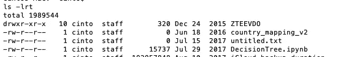

# 每个人都应该知道的 5 个超级方便的 Linux 命令

> 原文：<https://levelup.gitconnected.com/5-super-handy-linux-commands-that-everyone-should-be-aware-of-a70b08d2c635>

## 每个人都必须掌握各种终端命令


亚历克斯·丘马克在 [Unsplash](/s/photos/linux?utm_source=unsplash&utm_medium=referral&utm_content=creditCopyText) 上的照片

Linux 终端是一个非常强大的工具，它很可能是 Unix 中最有趣的部分。在我们的日常生活中，有太多的命令可以帮助我们。

我是硅谷的一名软件工程师，有超过 12 年的工作经验。我完全爱上了 Linux。我在日常生活中经常使用这些命令。[知道](/advanced-unix-commands-to-boost-your-productivity-4af6e9086c04)一些实用的 Linux 命令后，我的生活变得轻松多了。

从开发人员到 QA 到系统管理员，每个人都应该很好地掌握这些 Linux 命令。它肯定会以某种方式帮助你。

# 基拉耳

如果你有一个运行缓慢的谷歌 chrome 浏览器，并且想要终止所有运行和打开的 Chrome 实例，或者如果你有一个没有响应的 Notes 应用程序，kill all 是一个可以帮助你的简单命令。

默认情况下，Killall 与参数名完全匹配，并终止匹配进程。下面是如何使用它


但是请记住，这个命令不会让应用程序保存任何数据，所以如果没有保存，您可能会丢失数据。

默认情况下，killall 命令区分大小写。但是您可以使用-I 选项来忽略这种情况。

```
killall -I notes
```

你可以在这里获得更多细节[。](http://exactly matches the argument name by default, and kills the matching process)

# Ctrl + x + e

如果你想写一个很长的命令，但是由于一些显而易见的原因，你不想在你的终端上输入它，这个快捷方式会有所帮助。

Ctrl + x + e 将打开一个编辑器，您可以在其中键入命令。保存编辑器后，该命令将在终端上运行


使用 Ctrl_x+e 时会打开一个编辑器



运行 ls 命令。作者图片

打开的编辑器称为 Emacs。Emacs 或 EMACS 是一个文本编辑器家族，其特点是具有可扩展性。

有些装置可能没有现成的 emacs。您可以通过运行以下命令来下载

```
brew cask install emacs
```

# 触控

在 Unix 中，Touch 是一个非常有用的命令。在我从事软件行业的 15 年中，我已经使用过无数次了。

该命令最基本的用途是创建一个空文件。

```
touch a
```

上面将创建一个空文件。如果需要，您也可以创建一堆文件。

您可以使用它来更改文件的时间戳。这是我经常使用的一个命令，用来隐藏我在开始我的 IT 生涯时可能不小心做的一些编辑<wink>。</wink>


触摸以修改文件的时间戳。作者图片

您也可以创新，从另一个文件中复制时间戳。

```
touch -r file_name2 file_name1
```

做一个“ *man touch* 来了解更多关于命令的信息。

# 球座

UNIX 中的`tee`命令是一个命令行[实用程序](https://shapeshed.com/unix-tee/#:~:text=What%20is%20the%20tee%20command,T%20splitter%20used%20in%20plumbing.)，用于将标准输入复制到标准输出。它支持从标准输入到标准输出写任何给定的内容，并可选地写到一个或多个文件。当您想要将数据重定向到文件并查看文件中的内容时，这尤其有用。

该命令以管道工程中使用的 T 拆分器命名。

这就是我们如何使用该命令。


tee 命令的用法。作者图片

# 足球俱乐部（Football Club）

假设您想要编辑刚刚发出的一个非常长的命令。使用终端将需要一些努力。“fc”命令解决了这个问题。

在下面的例子中，我运行了一个有拼写错误的 curl 命令。所以我运行了 fc 命令。前面的命令— curl 在编辑器中打开；我修复了命令并保存了文件。curl 命令再次运行并显示结果


fc 命令的用法。作者图片

# **sl**

这是一个附加命令。

如果你想在辛苦工作几个小时后缓解压力，或者你只想盯着别的东西看，“sl”就是给你的命令。Linux 有时会很有趣！！

这就是你安装“sl”的方法

```
brew install sl
```

那我们去参加派对吧。

尝试在终端中键入“sl ”,看看会发生什么。对于那些在亲自尝试之前首先想看看它的人，这里有一个截图:


sl '工作中的命令。作者图片

现在输入“sl -F ”,看它飞起来。

我相信，无论你是像我一样的经验丰富的 Linux 用户，还是刚刚开始涉足 Unix 系统这个奇妙世界的初学者，掌握各种终端命令对每个人来说都是必须的。

我希望你们今天都学到了新东西。在评论区分享你的精彩 Linux 命令。

# 分级编码

感谢您成为我们社区的一员！ [**订阅我们的 YouTube 频道**](https://www.youtube.com/channel/UC3v9kBR_ab4UHXXdknz8Fbg?sub_confirmation=1) 或者加入 [**Skilled.dev 编码面试课程**](https://skilled.dev/) 。

[](https://skilled.dev) [## 编写面试问题+获得开发工作

### 掌握编码面试的过程

技术开发](https://skilled.dev)