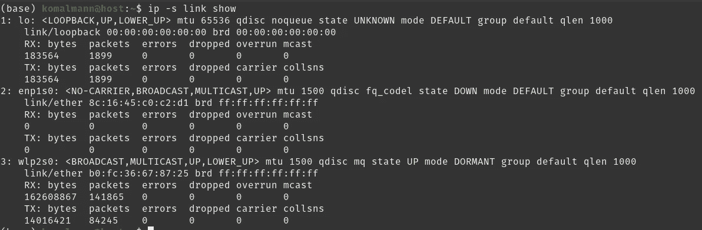
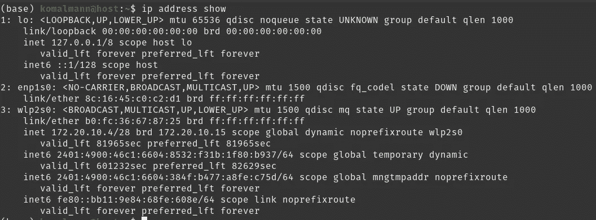
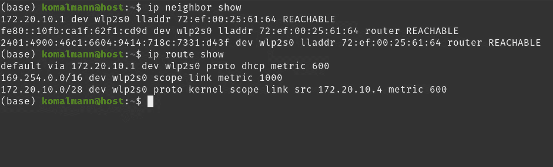
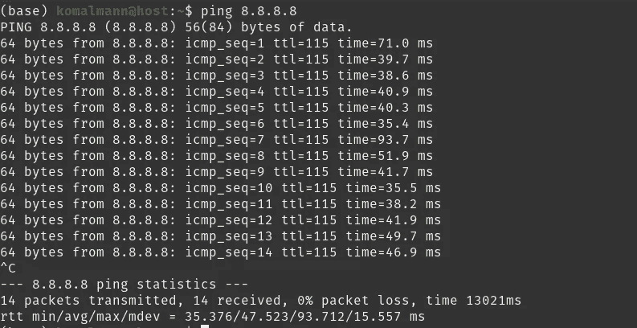
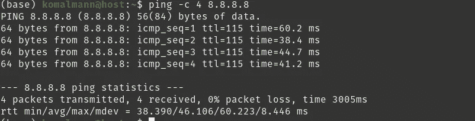
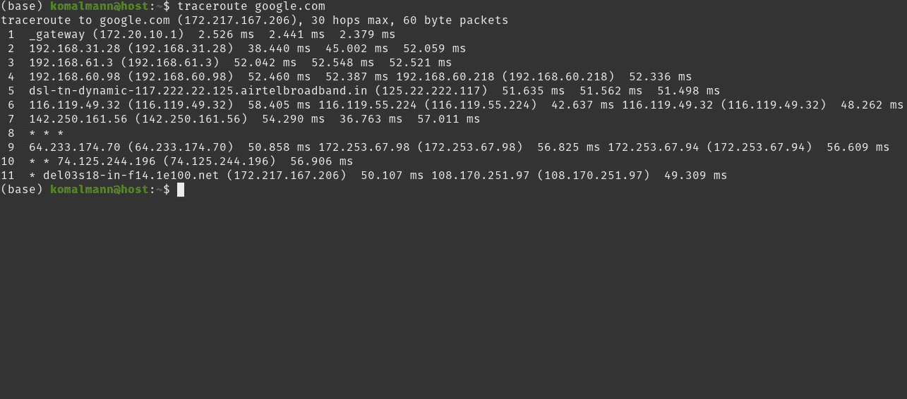
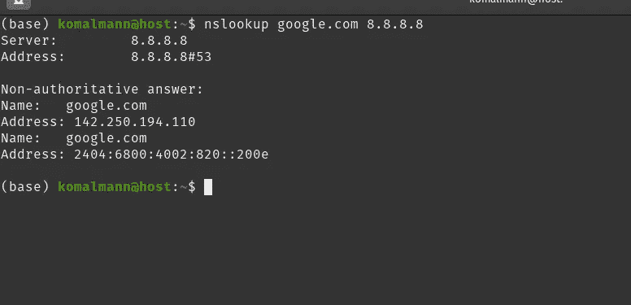

# 5 个非常有用的 Linux 网络故障排除命令

> 原文：<https://levelup.gitconnected.com/5-super-useful-linux-network-troubleshooting-commands-3e0581a20bf9>


# 介绍

从建立最初的通信模式到实现即时的全球连接，计算机网络已经使许多事情成为可能。尽管网络让我们的生活变得更简单，但它们在本质上是复杂的。它们需要配置、维护，最重要的是排除故障。网络是由多个节点互连而成的，存在几个潜在的故障点。在网络连接失败的情况下，了解故障排除工具是一个优势。Linux 支持非常有用的命令行实用程序，可以帮助您缩小网络问题的范围。在这篇博客中，我将解释 5 个 Linux 网络故障排除命令，当事情似乎不工作时，它们可以帮助你。

# ip 命令

`ip`命令是一个一体化的命令，可以用来处理几乎整个系统的网络堆栈。它不仅有助于排除网络故障，还可以配置各种网络设置。使用`ip`命令的一般语法是:

```
ip [ OPTIONS ] OBJECT { COMMAND | help }
```

*   `OPTIONS` 是各种可以用来控制输出外观的标志。最常用的选项有`-s`(显示统计数据)，和 `-br`(显示简要信息)。
*   `OBJECT`是要处理的网络对象，包括链路、地址、路由和邻居。
*   `COMMAND`是对被使用对象进行的操作。让我们看一个例子。

```
ip -s link show
```

你能解释这个命令是干什么的吗？如前所述，`-s` 是选项之一，`link` 是对象，`show`是命令。因此，该命令显示系统所有接口的统计信息和信息。



ip 命令

以类似的方式，`ip` 命令可用于其他对象和命令。让我们看看其他几个例子。

要检查系统的 IP 地址，可以使用如下的 `ip`命令。



ip 命令

要查看一个系统的 ARP 表，使用`ip neighbor show`，为了检查路由表，`ip route show`将完成这项工作。



ip 命令

# ping 命令

Ping 是广泛使用的网络故障排除命令之一。它代表分组因特网路由器，使用 ICMP 网络协议实现。它向目标系统发送 ICMP 回应请求数据包，并等待 ICMP 回应回复数据包。成功的 ping 确认系统之间建立了网络连接。除了检查基本的网络连接，它还能让您测试您的网络接口卡，并验证 DNS 是否工作正常。它可以与 IPv4 地址或 IPv6 地址一起使用。此外，它还可以与域名。下面是它的实际工作。



ping 命令

*   这里`icmp_seq`表示正在传送的数据包的序列号。
*   `ttl` 代表**生存时间**作为跳数计数器工作。它是数据包在被丢弃之前可以经过的跳数的计数。
*   `time`是数据包往返目的地的往返时间的量度。

注意`8.8.8.8` 是 Google 的公共 DNS IPv4 地址。检查“发送 14 个包，接收 14 个包，0%包丢失”结尾的输出。这表示 ping 操作成功，您的网卡工作正常。以下是 ping 不成功的可能情况:

*   **请求超时:**ping 不成功可能有多种原因。您尝试 ping 的服务器/主机可能已关闭。还有一种可能是，在目标系统上有一个防火墙不允许 ICMP 请求数据包通过。
*   **丢包:**不是每次都能得到 0%丢包的输出。由于网络拥塞、硬件故障或电缆损坏，数据包可能会在到达目的地的途中丢失。
*   **目标主机不可达:**当找不到到目标系统的路由时，会出现这种情况。这也可能意味着您的系统没有连接到网络。尝试在 wifi 断开的情况下使用 ping 并检查输出！

在 linux 中，ping 不断向目的地发送 ICMP 回应请求数据包，直到被手动停止。要限制要发送的数据包数量，请使用`-c`标志。



ping 命令

在上面的例子中，ping 与`-c` 标志一起使用，后跟一个`4` ，这意味着“只发送 4 个包到目的地”。因此，只发送和接收了 4 个包。

# traceroute 命令

`Traceroute` 是一个非常有趣和方便的命令，用于跟踪数据包从发送者到目的地的确切路径。当`ping` 命令告诉网络是否有问题时，`traceroute` 命令显示故障的确切点。它的工作原理是在到达目的地的途中 ping 每台路由器。它向每台路由器发送三个数据包，并测量它们的往返时间。通过这种方式，可以计算出源和目的地之间的总跳数/路由器数。让我们追踪从我的系统到`google.com.`的路径



traceroute 命令

从输出中可以推断出，从我的系统发送到`google.com`的数据包经过了 11 个路由器。从上面的结果还能解读出什么？你认为如何确定潜在的故障点？

要得到这个问题的答案，请查看每个条目。在每个步骤中，给出每个路由器的 IP 地址及其域名(如果可用),然后是发送到该路由器的 3 个数据包的 3 次往返时间。往返时间长表示路由器有问题(网络拥塞或网络速度慢)。

为了更好地理解`traceroute`的实现，这里有一个简化的解释。还记得 ping 命令解释里的`ttl` (生存时间)吗？它在`traceroute` 中也起着巨大的作用。在后台，`traceroute` 的工作原理是将 `ttl` 的值设置为 1，以便将数据包发送到第一个路由器。因此，数据包在到达第一个路由器后被丢弃。对于要发送到第二个路由器的数据包，`ttl`值设置为 2，而对于要传输到第三个路由器的数据包， `ttl` 值设置为 3，依此类推。有趣吧？

# nslookup 命令

毫无疑问，没有 DNS 域名解析或其等价物，上网不会更容易。DNS 中的一个问题可以在一段时间内颠覆我们的世界。幸运的是，我们有`nslookup`，一个可以帮助我们解决 DNS 问题的命令行工具。

要获取特定域名的 IP 地址，请使用带域名的`nslookup`作为参数。然后，系统的默认 DNS 配置将用于执行查找。


nslookup 命令

要使用特定的名称服务器执行查找，请在命令末尾提供名称服务器的地址。



nslookup 命令

# netcat 命令

Netcat 是系统管理员最有用的命令行工具之一。它可以用于检查端口连接、发送文件、执行 HTTP 请求等等。使用 netcat 命令的一般语法是

```
netcat [options] host port
```

默认情况下，netcat 使用 TCP 建立与主机的连接。为了使用 UDP，使用`-u` 作为选项。


netcat 命令

上面的命令使用 TCP 在端口 80 连接到 google.com。`-z`选项用于连接到主机，而不向上述端口发送任何数据。`-v`选项告诉`netcat` 命令提供详细的输出。

# 结论

在这篇博客中，我们浏览了 5 个强大的 linux 网络故障排除命令。感谢您的阅读，我真的希望您对 Linux 网络故障诊断有了宝贵的见解。这些命令可以根据问题和要求来使用。请注意，除了这 5 个命令之外，还有其他有效的实用程序，如 netstat、tcpdump、host 等等。要了解更多命令，下面是一些很好的资源。

*   [Techmint](https://www.tecmint.com/linux-network-configuration-and-troubleshooting-commands/)
*   [Devopscube](https://devopscube.com/list-linux-networking-troubleshooting-and-commands-beginners/)