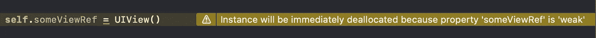
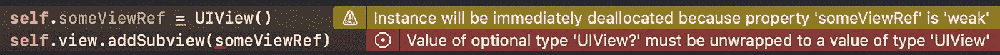
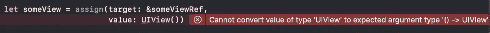
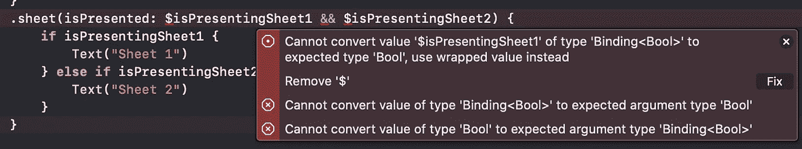

# 5 个 Swift 扩展来编写更智能的代码

> 原文：<https://levelup.gitconnected.com/5-swift-extensions-to-write-smarter-code-7287b86fde68>

一个好的开发人员应该写出具有高度可维护性和可扩展性的优秀代码。更好的开发人员用智能功能扩展了编程语言，使得读写干净的代码更加容易。

让我向您展示我日常使用的 Swift 的 5 个代码扩展。每一个都有详细的解释，并根据其背景故事/原始意图进行了重新创作。

万一你 TL；DR 和只想查看代码，滚动到每个**智能解决方案**标题，查看复制粘贴就绪代码，或查看结论中的链接。


照片由[诺贝特·莱瓦西奇斯](https://unsplash.com/@levajsics?utm_source=unsplash&utm_medium=referral&utm_content=creditCopyText)在 [Unsplash](https://unsplash.com/s/photos/mac?utm_source=unsplash&utm_medium=referral&utm_content=creditCopyText) 上拍摄

# 1.使用自定义下标的安全数组访问

每个开发者都至少经历过一次*【越界】*异常。当您尝试访问某个位置的元素时，如果该位置是负数或大于元素计数，就会出现这种情况。

```
let values = ["A", "B", "C"]
values[0] // A
values[1] // B
values[2] // C
values[3] // Fatal error: Index out of range
```

在访问值之前，我们开始创建绑定检查。这导致了重复的代码，尽管它总是做完全相同的事情:检查索引界限。

```
if 2 < values.count {
    values[2] // "C"
}
if 3 < values.count {
    values[3] // won't be called
}
```

让我们创建一个函数来包装边界检查，将元素索引和元素数组作为参数。为了支持任何种类的元素，我们添加了一个泛型类型`T`。如果索引超出界限，该函数返回一个包装元素或`nil`的`Optional`值。

```
func getValue<T>(in elements: [T], at index: Int) -> T? {
    guard index >= 0 && index < elements.count else {
        return nil
    }
    return elements[index]
}let values = ["A", "B", "C"]
getValue(in: values, at: 2) // "C"
getValue(in: values, at: 3) // nil
```

这工作得很好，但与原来的(例如`values[2]`)相比，它仍然相当冗长而且(简单地说)难看。尤其是因为附加的参数`values`。

首先，我们想要去掉参数`values`，取而代之的是将函数`getValue`与数组相关联。由于 Swift 支持扩展类和协议，我们可以将我们的`getValue`移到`Array`的扩展中:

```
extension Array { func getValue(at index: Int) -> Element? {
        guard index >= 0 && index < self.count else {
            return nil
        }
        return self[index]
    }
}let values = ["A", "B", "C"]
values.getValue(at: 2) // "C"
values.getValue(at: 3) // nil
```

为了使用更多的 Swift 语法功能，将该函数改为一个`subscript`函数。

## 智能解决方案:

```
extension Array { subscript (safe index: Int) -> Element? {
        guard index >= 0 && index < self.count else {
            return nil
        }
        return self[index]
    }
}values[safe: 2] // "C"
values[safe: 3] // nil
```

厉害！我们的访问调用`values[safe: 2]`看起来几乎与原来的调用`values[2]`相同，但是为我们提供了对元素的边界安全访问。

2021 年 5 月 4 日编辑:

感谢丹尼尔·沃罗比耶夫的回应！这里有一个更通用的例子，可以用于任何实现`Collection`协议的类:

```
extension Collection {
   public subscript (safe index: Self.Index) -> Iterator.Element? {
     (startIndex ..< endIndex).contains(index) ? self[index] : nil
   }
}
```

# 2.同等处理零字符串和空字符串

当处理可选值时，我们经常需要将它们与`nil`进行比较，以进行空值检查。有时我们使用一个缺省值，以防这个值实际上是`nil`，来继续下去。

下面是一个示例方法，它在参数为零的情况下返回默认值:

```
func unwrap(value: String?) -> String {
    return value ?? "default value"
}
unwrap(value: "foo") // foo
unwrap(value: nil) // default value
```

但是另一个优势也存在:空字符串。

如果我们将这个`unwrap`方法与一个空字符串`""`一起使用，它将返回相同的空字符串。在某些用例中，我们肯定不希望出现这种行为，而是像对待`nil`一样对待空字符串。

我们必须用长度检查来扩展我们的函数:

```
func unwrap(value: String?) -> String {
    let defaultValue = "default value"
    guard let value = value else {
        return defaultValue
    }
    if value.isEmpty {
        return defaultValue
    }
    return value
}
unwrap(value: "foo") // foo
unwrap(value: "")    // default value
unwrap(value: nil)   // default value
```

对于这样一个简单的回退来说，这是一个非常糟糕的解决方案，对吗？那么，把它压缩成一行代码怎么样？

```
func unwrapCompressed(value val: String?) -> String {
    return val != nil && !val!.isEmpty ? val! : "default value"
}
unwrapCompressed(value: "foo") // foo
unwrapCompressed(value: "") // default value
unwrapCompressed(value: nil) // default value
```

它可以工作，但是无论从哪个标准来看，这个解决方案都是不可读的，也不是“好”的，尤其是当试图避免强制解包`!`(以减少未处理的崩溃的可能性)时。

## 智能解决方案:

将空字符串转换为`nil`并使用`Optional`的内置支持

```
public extension String {
    var nilIfEmpty: String? {
        self.isEmpty ? nil : self
    }
}
```

使用这个智能扩展，您可以使用`if-let`展开来同时检查`nil`和空字符串:

```
var foo: String? = nil
if let value = foo?.nilIfEmpty {
    bar(value) // not called
}
if let value = "".nilIfEmpty {
    bar(value) // not called
}
if let value = "ABC".nilIfEmpty {
    bar(value) // called with "ABC"
}
```

此外，该扩展允许您在字符串为空时使用默认值`??`:

```
"ABC" ?? "123"  // ABC
"" ?? "456      // 456
```

# 3.多赋值运算符

在 iOS 上，接口是使用 UIKit 的`UIView`构建的，嵌套在更多的`UIView`中，由一个`UIWindow`管理，最终形成一个视图层次结构(macOS 上的 AppKit 也是如此)。

当开发人员与 UI 交互时，他们肯定需要对特定视图的引用，这些视图存储在实例变量中。

让我们来看一个视图控制器的例子。

```
class ViewController: UIViewController {

    private weak var someViewRef: UIView?

    override func viewDidLoad() {
        super.viewDidLoad()

        let someView = UIView()
        self.someViewRef = someView
        self.view.addSubview(someView)
    }

    override func viewWillAppear(_ animated: Bool) {
        super.viewWillAppear(animated)

        // Update the background on appear
        someViewRef?.backgroundColor = .red
    }
}
```

首先我们创建`someView`并将其添加到`viewDidLoad`中的视图层次结构中。之后，我们设置一个对`someViewRef`实例属性的`weak`引用，这样我们就可以与`viewWillAppear`中的视图进行交互:

放大我们想要改进的细节:

```
(1) let someView = UIView()
(2) self.someViewRef = someView
(3) self.view.addSubview(someView)
```

我们希望减少这 3 行代码，同时不影响可读性。对于这个小的单一用例来说，这可能看起来过于工程化了，但是想想一个视图控制器，其中创建了 20 个甚至 30 个视图→可以节省 20–30 行代码。

要真正理解发生了什么，您必须了解自动引用计数(ARC)。

## 自动参考计数

ARC 是在 iOS 5 中作为内存管理的一种形式引入 Objective-C 的。

在`(1)`中创建视图时，会为实例分配一些内存(足以容纳一个`UIView`)。在同一步骤中，内部计数器被设置为`1`，因为`someView`是对该实例的引用。在`(2)`中分配`someViewRef`时，计数器加 1。最后一行`(3)`再次增加了它(总计数为`3`)，因为视图层次结构还保存了对特定视图的引用。

在`viewDidLoad`方法结束时，所有的局部变量和引用都被丢弃，包括`someView`。这减少了计数器，并且对于`someViewRef`和`view`层次结构(由于`view.addSubview(...)`)它留在`2`

> UIKit/AppKit 的核心原则之一是让视图层次结构成为唯一拥有对视图的强引用的层次结构。

因此，如果视图从整个视图层次结构中删除，计数器应该递减到`0`并自动从内存中释放。这有助于在浏览应用程序时减少内存泄漏。

为了遵守这一原则，我们总是使用`weak`参考，因为它们**不会增加电弧计数器**。由于视图可以被释放，因此实例不再可用(它变成了`nil`)，所以它需要是可选类型。

在上面的代码示例中，`someViewRef`已经被声明为`weak`，所以在`viewDidLoad`的末尾，我们的计数器值是`1`。

如果我们将前两行合并成一行会发生什么？



分配给弱属性的新实例将被立即释放

编译器已经告诉我们，这条语句将是无用的。我们创建了一个新的实例，但是由于`weak`，没有增加圆弧。因此，在执行完该行代码后，计数器仍然在`0`处，实例被立即释放。

另外`someViewRef`现在是可选的，我们需要打开`UIView`？将其添加到父`view`中。



弱引用需要展开，因为它们是可选的

总结一下我们的要求:

1.  我们想把代码简化成一行
2.  我们需要一个本地实例，所以它不会立即被释放
3.  我们需要一个展开的实例，这样我们可以将它添加到视图层次结构中
4.  我们需要使用`weak`，这样引用计数器就不会递增
5.  它最好能被 ***任何对象*** 重用

似乎是一个棘手的问题，不是吗？
幸运的是，Swift 提供了许多语法功能，因此我们可以构建我们的定制解决方案。

## 带有副作用的赋值函数:

第一步，将`someViewRef`的赋值移动到一个全局函数中(可以是任何地方)。一个参数是弱`inout`引用，我们将实例分配给它，第二个参数是`UIView`的实例。

```
func assign(someViewRef: inout Optional<UIView>, 
            someView: UIView) -> UIView {
    someViewRef = someView
    return someView
}
```

我们的`viewDidLoad`可以转化为以下内容:

```
override func viewDidLoad() {
    super.viewDidLoad()

    let someView = assign(someViewRef: &someViewRef, 
                          someView: UIView())
    self.view.addSubview(someView)
}
```

太好了！一行创建视图并分配`someView`和`someViewRef`🎉

它仍然是高度受限的，因为它只允许`UIView`实例，但是我们可以通过将参数更改为泛型类型来改善这一点:

```
func assign<T>(target: inout Optional<T>, value: T) -> T {
    target = value
    return value
}
```

您可以进一步改进它，将`value`参数改为一个返回值的闭包(这可能会变得有趣，例如，如果您想使用有限的代码范围):

```
func assign<T>(target: inout Optional<T>, value: () -> T) -> T {
    let instance = value()
    target = instance
    return instance
}let someView = assign(target: &someViewRef, value: {
    let view = UIView()
    view.backgroundColor = .orange
    return view
})
```

不幸的是，这打破了我们以前的习惯:



值不能用作闭包参数(默认情况下)

我们通过在`value`的参数类型前加上`@autoclosure`来修复它，两者再次工作🔥

但是你对这些变化有什么感受呢？

```
// we started with
let someView = UIView()
someViewRef = someView// we are now at
let someView = assign(target: &someViewRef, value: UIView())
```

使用`&`作为参考，以及参数名称等。导致一行相当冗长的代码…但至少是一行代码，amirite？！😅

值得吗？可能不会…但幸运的是这甚至不是它的最终形式🤯

## 智能解决方案:

```
infix operator <--

public func <-- <T>(target: inout T?, 
                    value: @autoclosure () -> T) -> T {
    let val = value()
    target = val
    return val
}
```

将函数从`assign`重命名为圆滑的箭头`<--`，并声明为`infix operator`(如果你喜欢冒险，你甚至可以使用表情符号箭头⬅️).这些`infix`操作符的其他例子有`+`和`-`。它们都有两个参数……一个在运算符前面，一个在运算符后面。

我们的最终解决方案在一个简洁的语法中包含了所有的约束:

```
let someView = someViewRef <-- UIView()
```

# 4.数组中的过滤元素计数

你多久计算一次数组中的元素？你的方法是什么？是以下其中一种吗？

```
let array = ["A", "A", "B", "A", "C"]
// 1.
var count = 0
for value in array {
    if value == "A" {
        count += 1
    }
}
// 2.
count = 0
for value in array where value == "A" {
    count += 1
}
// 3.
count = array.filter { $0 == "A" }.count
// 4...
// get creative, there are many more
```

Swift 尽量做到对人类友好，我们的代码也应该尽量反映人类的语言。

所以不用过滤，计数，迭代等等。在代码库中的任何地方，检查这个干净、小巧、普遍适用的`count(where:)`扩展(老实说，默认情况下它应该存在于 Swift 标准库中)。

## 智能解决方案:

```
extension Sequence where Element: Equatable {

    func count(where isIncluded: (Element) -> Bool) -> Int {
        self.filter(isIncluded).count
    }
}
```

通过扩展`Sequence`协议，也支持`Array`以外的其他类，例如`ArraySlice`:

```
["A", "A", "B"]
    .count(where: { $0 == "A" }) // 2
["B", "A", "B"]
    .dropLast(1) // --> ArraySlice<String>
    .count(where: { $0 == "B" }) // 1
```

# 5.SwiftUI 绑定的逻辑运算符

这个扩展很可能不会像其他扩展那样经常使用。尽管如此，它解决了在 SwiftUI 中使用`Binding`时的一个问题。

以下面的例子为例，显示了两个按钮，每个按钮显示不同的工作表:

```
struct ContentView: View {

    @State var isPresentingSheet1 = false
    @State var isPresentingSheet2 = false

    var body: some View {
        VStack {
            Button("Show Sheet 1") {
                isPresentingSheet1 = true
            }
            Button("Show Sheet 2") {
                isPresentingSheet2 = true
            }
        }
        .sheet(isPresented: $isPresentingSheet1) {
            Text("Sheet 1")
        }
        .sheet(isPresented: $isPresentingSheet2) {
            Text("Sheet 2")
        }
    }
}
```

链接`.sheet(isPresented:) {...}`感觉很自然。不幸的是，这实际上并没有工作很长时间，只是在几天前随着 iOS 14.5 的[发布才得到解决(在以前的版本中仍然有问题)。](https://developer.apple.com/documentation/ios-ipados-release-notes/ios-ipados-14_5-release-notes)

由于我想使用`.sheet()`的`isPresented`版本，而不是`.sheet(item:)`(用某种枚举声明每一个可能的工作表)，我试图连接两个`Binding<Bool>`实例:



逻辑运算符不支持绑定

真扫兴。这是意料之中的，但我仍然不高兴。

幸运的是，我们可以通过简单地创建一个同名的全局函数来重载已经存在的中缀操作符`&&`，但是有两个`Binding<Bool>`参数🚀

## 智能解决方案:

```
public func && (lhs: Binding<Bool>,
                rhs: Binding<Bool>) -> Binding<Bool> {
    Binding<Bool>(get: { lhs.wrappedValue && rhs.wrappedValue },
                  set: { _ in fatalError("Not implemented") })                       }
```

`Binding<Bool>`是一个属性包装器，它保存一个`wrappedValue: Bool`。每个绑定都有一个 getter 和 setter 闭包，它返回两个参数的逻辑合取。由于 setter 方法未定义(应该更改哪个参数？)我们暂时不实现它。

# 结论

在互联网的荒野中有更多的智能扩展。这里列出的所有工具都可以在我的工具箱[里找到，并在 GitHub](https://github.com/philprime/Cabinet) 上测试过。

如果你想了解更多，请查看我的其他文章，在[推特](https://twitter.com/philprimes)上关注我，并随时给我发短信。你有具体的话题想让我介绍吗？让我知道！😃

**编辑:**

2021 年 5 月 4 日—增加了对[丹尼尔·沃罗比耶夫](https://medium.com/u/f550ee8e21d3?source=post_page-----7287b86fde68--------------------------------)的回应