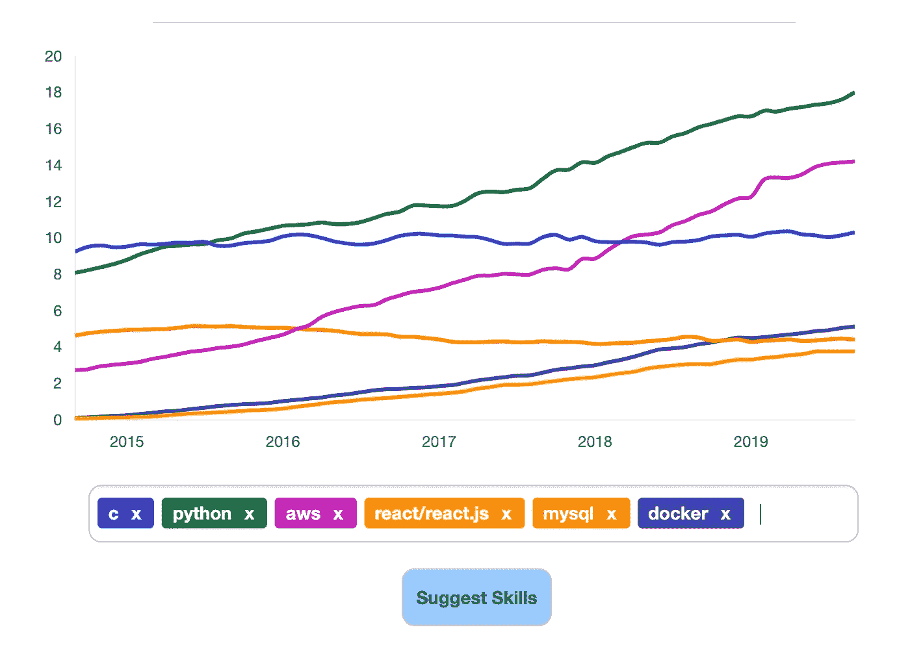
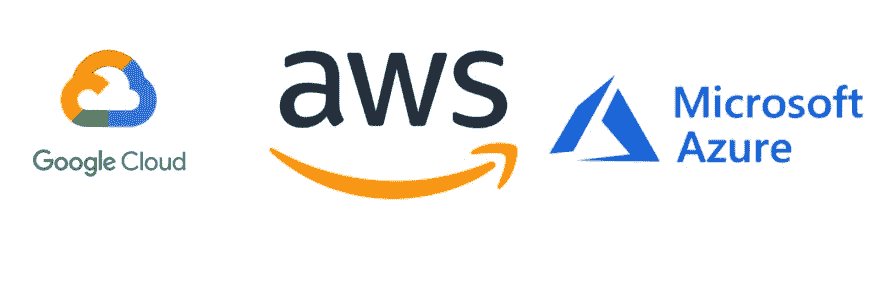
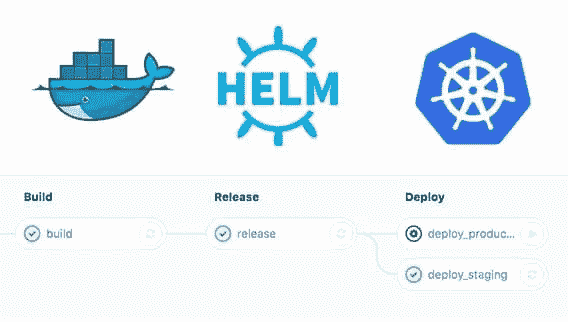
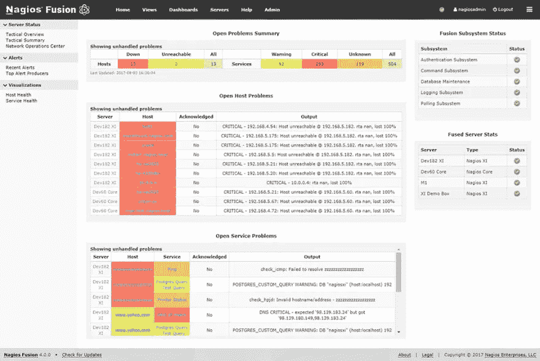
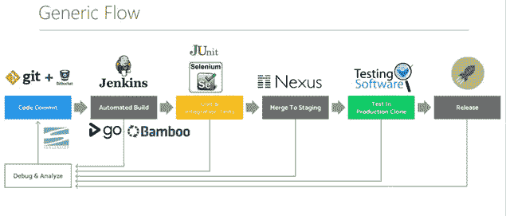
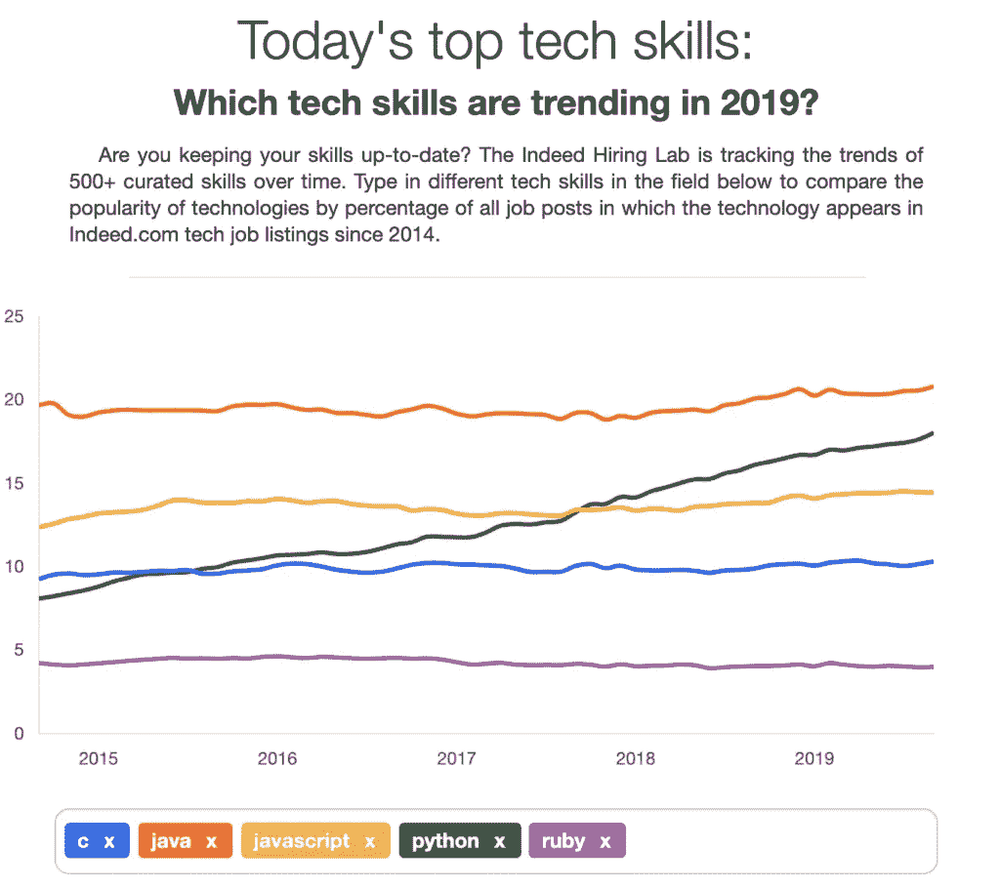
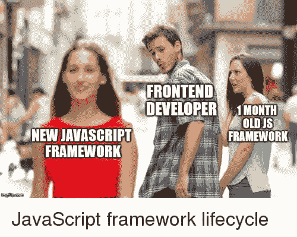

# 2020 年开发人员需要的 5 项技能

> 原文：<https://levelup.gitconnected.com/5-technical-skills-developers-need-in-2020-95960f6c10fb>

## 基于你的普通软件开发人员的工作描述

[来源](https://www.hiringlab.org/2019/11/19/todays-top-tech-skills/)

如果你是 2020 年的一名开发人员，那么你可能会遇到一份包含大量技术技能要求的工作描述。

例如，让我们看看 Indeed.com 真实工作描述中所要求的一系列技能。

*你可能需要在阅读中途休息一下。*

# 加入我们的时事通讯

在继续滚动之前，为什么不加入我们团队的时事通讯，了解数据科学、数据工程和技术的最新动态！[在此了解更多信息](https://seattledataguy.substack.com/)。

## 职位描述

*   Jenkins 和 Terraform 管理的 AWS 基础设施的经验。
*   AWS 服务经验(ECR、Lambda、SQS、CloudWatch、Route53)。
*   用 Elixir、Python 和 Java 进行编程。
*   熟悉支持工具(Docker、Git、Bash、AWS CLI)
*   ETL 和异步管道的生产经验。
*   有使用关系型(Postgres/RDS)和 nosql (DynamoDB)数据库的经验。
*   表现出积极参与复杂系统设计的能力。
*   熟悉生产网络操作者优先。
*   了解 ML 原则和 NLP 经验，有 Kaggle 比赛经验者优先。
*   有数据科学库的经验(Scikit，NLTK，Gensim，TensorFlow，Keras)。

## 这些技能你都有吗？

所以显然这份工作要找的是集软件工程师、数据工程师、机器学习工程师、DevOps 工程师于一身的人。

在某些方面，这有点可笑。

如今软件工程师真的需要所有这些技能吗？

老实说，是的，有点。

说实话，这些技术中有许多是第三方工具，如果您是一名软件工程师，您可能在各种情况下与这些技术或它们的同行进行过交互。

就个人而言，可笑的是招聘经理认为你不能胜任某项工作，因为你使用过 MySQL，但从未在 RDS 上使用过 MySQL。

但总的来说，这些天多亏了 AWS、Docker、Nagios 等技术和服务。设计、开发、部署和监控软件变得简单多了。

所以，是的，2020 年的软件工程师确实需要保持他们的技能。下面是开发人员今年应该开始学习的 5 项技能。

## 云服务

云服务已经从仅被价值数十亿美元的公司使用发展到帮助支持小型企业(我们已经与几家使用 EC2、RDS、S3 等的小型企业合作)。

云服务有助于降低总体运营成本，并且可以帮助您更有效地运营。

然而，随着这项新技术的出现，开发人员需要学习新的技能。要跟上所有的技术以及运行代码、存储数据和托管基础架构的各种方式，可能会让人觉得不可能。

很多时候，感觉就像我们终于了解了一种云服务，却发现现在有另一种替代它，或者只是添加了新功能。

说了这么多，你至少应该对哪些技术有高水平的了解？

AWS、Azure 和 GCP: 就云服务而言，亚马逊网络服务(AWS)在美国拥有最大的市场。它还可以提供最广泛的服务，包括从 laaS、PaaS 到 SaaS 的所有服务。它提供 S3、RDS、[红移](https://www.theseattledataguy.com/building-a-data-warehouse-on-amazon-redshift/)和用于数据存储的 DynamoDB、EC2 和用于计算的 Lamda 等服务，你可以在这里了解到其他一系列服务。

Azure 和 GCP 的使用率都在快速增长，尽管仍落后于 AWS。但这仅仅意味着开发人员需要掌握更多的技能。

如果你想进一步了解这些不同的云提供商，这里有几门课程可以帮助你快速上手。[其中许多在 Coursera 上是免费的。](https://click.linksynergy.com/deeplink?id=GjbDpcHcs4w&mid=40328&murl=https%3A%2F%2Fwww.coursera.org%2Fprofessional-certificates%2Fgcp-cloud-architect)

## 集装箱化

熟悉容器在软件世界变得很重要。对容器作用的一个简单总结是，它们将代码及其依赖项打包，这样就可以在不同的环境中可靠有效地运行。

容器化是指将应用程序与库、依赖项和配置文件捆绑在一起，以便在多个计算环境中高效运行。

无论环境是在本地还是在云上，基于容器的应用程序都可以轻松部署。容器技术的例子有很多，但目前最突出的可能是 Docker。如果你想更多地了解 Docker，以及它上面的许多技术层，如 [Kubernetes](https://www.coriers.com/docker-kubernetes-and-helm-what-are-they-and-why-use-them/) ，那么看看这个 [youtube 视频。](.https://www.youtube.com/watch?v=fqMOX6JJhGo)

## 应用程序和服务器监控(Nagios):

很难监控每个系统、网络和基础设施，尤其是在现代社会，应用程序在许多不同类型的硬件上使用。

Nagios monitoring 是一种开源技术，有助于监控 DevOps 文化中的应用程序和业务流程。Nagios 几乎可以监控一切。HTTP，SSH，SMTP，内存使用，微处理器负载，服务器。凡是你能想到的，都有可能被监控。

2020 年的开发人员将需要致力于像 [Naigios](https://www.youtube.com/watch?v=s5n0j2Nq27I) 这样能够提供全天候监控系统的框架。这意味着你可能需要熟悉像 Naigios 这样的工具才能成为一个有效的开发者。

## **詹金斯，竹 CI/CD**

[来源](http://dev.thinkartha.com/blogs/talend-ci-cd-either-with-jenkins-gocd-or-bamboo/)

许多新晋工程师将永远无法体验一个没有 CI/CD 的世界。这并不是说更传统的部署商店已经不存在了。

然而，使用工具来辅助 CI/CD 的趋势仍在继续增长。

许多公司正在研究或用于 CI 部分工作的两个第三方工具示例是 Jenkins 或 Bamboo。Jenkins 是一个开源工具，Bamboo 是一个商业工具。

Bamboo 提供了一系列的功能，这些功能通常只限于你的预算，并且可以很容易地与吉拉和 Bitbucket 集成(哦，不，还有更多技术需要学习)。但是这三者的结合创建了一个 CI/CD 系统，可以帮助您轻松地部署代码、检测代码中的错误等。

Jenkins 是一个 CI(持续集成)开源服务器，它具有编排和执行一系列动作的能力。Jenkins 可以在 JAVA 的帮助下执行，并且具有监控项目和检测似是而非的错误的能力。Jenkins 的检出率相当高，这也是它迅速流行的原因之一 [y .花点时间多了解一些这些工具](https://click.linksynergy.com/deeplink?id=GjbDpcHcs4w&mid=39197&murl=https%3A%2F%2Fwww.udemy.com%2Fcourse%2Fjenkins-continuous-integration-bootcamp%2F)！

## 数据库

作为一名开发人员，了解数据库和数据存储系统的各种选项是您的技能集的重要组成部分。决定如何在后端支持应用程序会严重影响性能和功能。

在很长一段时间里，大多数应用程序都局限于应用程序端的关系数据库。然而，随着服务器和计算机的存储和性能的增加，许多新型的数据存储系统现在是可能的。

**DynamoDB**

例如，DynamoDB 是一个与标准 MySQL 实例风格非常不同的数据库。DynamoDB 使用它所谓的属性、项目和表作为用户经常使用的核心部分。允许开发人员自由拥有不总是需要相同值的非结构化数据集。

除此之外，还有像 Hadoop/HDFS/Hbase 这样的技术堆栈，它们也允许更少的结构化和更多的分布式数据存储。所有这些只会使开发人员的工具箱更加复杂。

学习 DynamoDB 的一个很好的课程是这个组合类，它教你关于 DynamoDB 和 Lambda 的知识。

## 传统 RDBMS

仅仅因为有这么多新的数据系统，并不意味着你可以忽略传统的 Mysql 和 SQL Server 关系数据库。

使用 [RDBMS](https://click.linksynergy.com/deeplink?id=GjbDpcHcs4w&mid=40328&murl=https%3A%2F%2Fwww.coursera.org%2Flearn%2Fdatabase-management%3Faction%3Denroll) 仍然是为应用程序设计数据层的一种非常流行的方法。所以不要忘记保持 SQL 和数据建模技能。

## 编程语言

当然，作为一名程序员，你仍然需要知道如何编程！但是是哪些呢？

作为开发人员，编程语言仍然是我们的面包和黄油，大多数开发人员在行业中工作几年后就会多种语言。

但是，如果您刚刚开始，那么您可能希望了解 Python 和/或 Javascript“堆栈”。大多数工作都大量使用这两套语言。这并不是说像 Java 和 C++这样的语言没有它们的位置。

但是就工作角色而言，你可以从下面的图表中看到，使用 python 和 javascript 的工作在工作描述中都有所增加。

[来源](https://www.hiringlab.org/2019/11/19/todays-top-tech-skills/)

## 那么为什么是 Python 呢？

每个人都被 python 吸引的原因是它既简单又能很好地处理大多数问题。现在，它通常不允许对 C 或 C++进行微调，也不是一种本地 web 语言。然而，它做得很好，在任何事情上都不可怕

由于谷歌在 Tensorflow 等库上的工作，Python 经常与人工智能和机器学习等新技术联系在一起。

如果你想快速设计一个网站，你可以很容易地使用 Django，Flask 和 __ 作为你的后端。相信我，这比试图配置一个 Spring 框架站点要容易得多。

Python 很容易支持并行计算，这减少了组织数据的麻烦。Pydoop 是 Python 集成的一个库，在这里你可以借助 HDFS 集群处理数据并呈现出来。

随着更多支持 Jupyter notebook 的工具的开发，Python 也在数据分析中找到了一席之地。

Python 的多功能性是它如此受欢迎的原因。

无论你是数据科学家还是开发人员，你都可以用 Python 作为工具来开发网站或者机器学习模型。

根据你想学的内容，有很多免费的课程、书籍和小抄可以帮助你学习。例如，这里有一个很棒的 youtube 播放列表。

## React.js

好了，现在反应呢？

React.js 让前端开发变得“简单”。例如，使用 DOM API 可能是一件痛苦的事情。然而，React 为开发者提供了在虚拟浏览器上开发的能力。这个虚拟浏览器本质上充当了开发者和真实浏览器之间的纽带。

React.js 的另一个众所周知的概念是可重用组件的思想。在 React 中，应用程序是由所谓的组件组成的。有许多不同种类的组件，但目的是[创建代码片段，可以很容易地移植到你的应用程序。](https://medium.com/the-andela-way/understanding-react-components-37f841c1f3bb)

最后，单向数据流非常好，因为 ReactJS 中的组件不允许更改，并且组件中的数据具有相同的属性。

当反应器监听来自上游的数据时，组件平稳运行并保持同步。这个特性实际上使 ReactJS 在构建用户界面方面更加有效。

要了解更多，这里是 Youtube 上免费代码营的另一个[免费课程](https://www.youtube.com/watch?v=DLX62G4lc44)。

## 2020 年你将如何提升自己的技能？

总的来说，2020 年的开发者有很多技能需要保持。说实话，现在大多数软件开发人员的工作描述似乎都要求一个人拥有整个开发团队。从开发运维、数据库管理、后端和前端开发，说实话，还有其他一切。

当你正在寻找你的下一份软件工作时，我们祝你们好运！保持这些技能。

# 分级编码

感谢您成为我们社区的一员！[订阅我们的 YouTube 频道](https://www.youtube.com/channel/UC3v9kBR_ab4UHXXdknz8Fbg?sub_confirmation=1)或者加入 [Skilled.dev 编码面试课程](https://skilled.dev/)。

 [## 编写面试问题

### 掌握编码面试的过程

技术开发](https://skilled.dev) 

# 点击此处阅读更多内容

感谢阅读！如果您想了解更多关于数据咨询、大数据和数据科学的信息，请点击下面的链接。

[成为数据工程师的现实](https://www.youtube.com/watch?v=6RiA_Qur2yo&t=1s)

[转行成为数据工程师|成为数据工程师的途径](https://www.youtube.com/watch?v=f9ngBz7wCGE&t=2s)

[为小型企业和初创企业开发数据分析战略](https://www.theseattledataguy.com/developing-a-data-analytics-strategy-for-small-businesses-and-start-ups/)

[下一次数据科学或数据工程面试前你需要知道的 5 个 SQL 概念](https://www.youtube.com/watch?v=X6-VNKe3XVM&t=6s)

[如何改进您的数据驱动战略](https://www.theseattledataguy.com/17-questions-you-need-to-ask-about-your-data-strategy/)

[什么是数据仓库，为什么使用它](https://youtu.be/VjlzuUzYJYM)

[破坏你的数据驱动战略的错误](https://logitanalytics.com/5-mistakes-that-are-ruining-your-data-driven-strategy-and-costing-you/)

[用 Python 管理大数据的 5 大库](https://www.theseattledataguy.com/5-great-libraries-manage-big-data-with-python/)

[什么是数据工程师](https://www.youtube.com/watch?v=D1V6t--9tt8&t=7s)