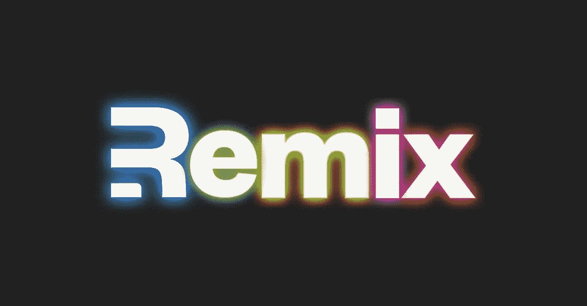
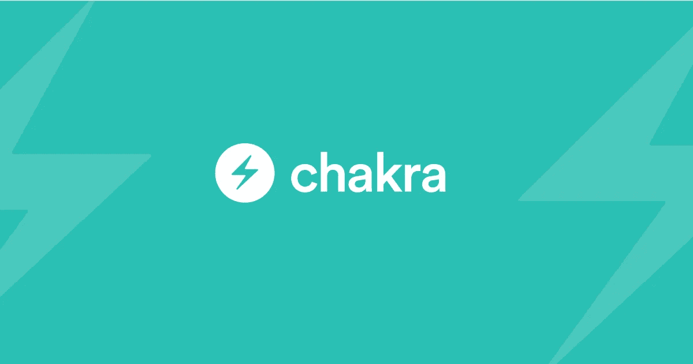
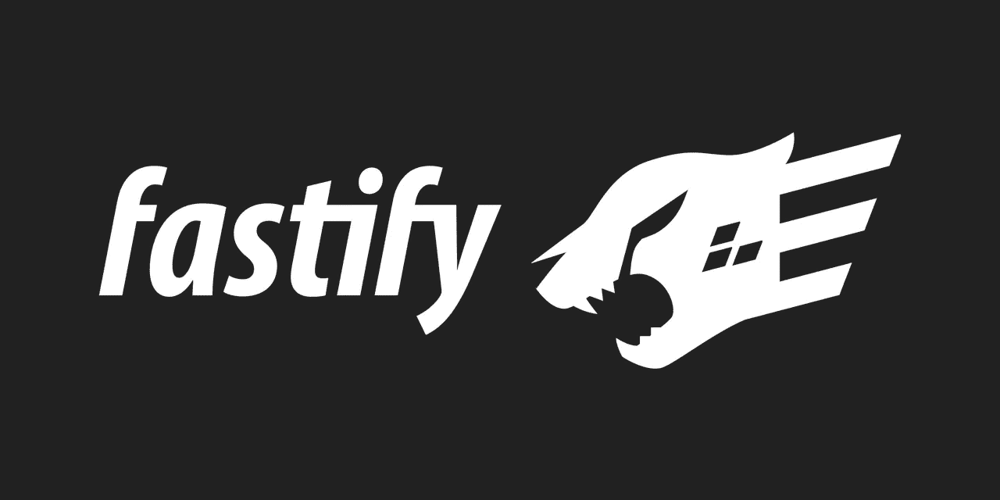

# 我计划在 2022 年学习的 5 项技术

> 原文：<https://levelup.gitconnected.com/5-technologies-i-plan-to-learn-in-2022-b08a245d0393>

我想尝试的技术清单&也许是深入研究的。

来自 [Pexels](https://www.pexels.com/photo/happy-ethnic-woman-sitting-at-table-with-laptop-3769021/?utm_content=attributionCopyText&utm_medium=referral&utm_source=pexels) 的 Andrea Piacquadio 的照片

# 为什么？

在快速增长和快速发展的软件工程世界中，我们需要让自己保持最新和相关。但是我们中的许多人并没有马上意识到这一点，我们从大学或训练营出来时，就抱着这样的心态:我们已经完成了学习的部分，所以现在是工作的部分。

几年后，新的有趣的项目开始出现，但是我们使用多年来一直使用的相同方法，仅仅花费数周时间来构建产品，而使用新的可靠技术，我们可以在几天内完成。

更不用说，框架总是来来去去，就拿 JavaScript 框架来说吧。开发者们似乎每个月都会推出一款新的游戏。

**好处:**

*   学习新的概念或工具，可以提高生产力，用一半的时间完成工作
*   用新概念、语言和标准实践扩展您的工具集，这反过来可以帮助您获得新的项目或客户
*   使用新知识来改进过去的项目，从而降低成本或改进功能

在这里你真的不会出错，但你当然不想走极端&什么都学。你最终只会浪费时间去学习对你没有任何好处的东西。

# 1.再搅拌

再搅拌

[Remix](https://remix.run/) 是[下一个 JS](https://nextjs.org/) 的新竞争对手。他们都提供类似的功能，如基于文件的路由，搜索引擎优化和更多。

我使用 React 已经快 2 年了(我对 web 开发世界还很陌生)，但是我只接触过几次 Next JS &从来没有充分利用或学习过它。

所以随着 Remix 的发布，我不得不在两者之间做出选择。最终，混音似乎是一个不错的选择&我认为这是一个早早跳上火车的好机会，因为我错过了下一班火车。

另外，作为 React 开发人员，了解这些框架中的任何一个都是一个很好的额外工具。

## 链接:

*   [https://remix.run/](https://remix.run/)
*   [https://nextjs.org/](https://nextjs.org/)
*   [https://reactjs.org/](https://reactjs.org/)

# 2.重火力点

重火力点

Firebase 并不是一项相对较新的技术，但在过去几年里，它已经成长起来，并获得了相当多的关注。

在过去的一年里，我使用过几次 Firebase，但是和 Next JS 一样，我没有充分利用它的所有功能。考虑到你在 Firebase 上的成就，这是一种浪费。因此，作为 2022 年的目标，我想学习，掌握&希望能够教授使用 Firebase。

至于学习资源，我肯定会大量使用 [Fireship](https://www.youtube.com/c/Fireship) 的 Youtube 视频&课程。在我的学习计划中，Fireship 是我的得力助手，可以提供所有关于 Firebase 或某个主题的快速速成课程的内容。

## 使用 Firebase 可以实现以下一些功能:

*   主办；主持
*   证明
*   云函数
*   实时数据库
*   Firestore

## 链接:

*   【https://firebase.google.com/ 
*   [https://www.youtube.com/c/Fireship](https://www.youtube.com/c/Fireship)
*   [https://www.youtube.com/playlist?list = pl 0 vfts 4 vzfnj 28 XP 5k mnadiqabnghtzkf](https://www.youtube.com/playlist?list=PL0vfts4VzfNj28Xp5kmNAdIqABNGhTzKF)

# 3.Chakra UI

Chakra UI

[Chakra UI](https://chakra-ui.com/) 已经在列表上有一段时间了，原因是自从我开始 React 开发以来，我一直只使用 [Material-UI](https://mui.com/) 。我开始后悔没有尝试不同的 UI 框架&库。

不要误解我，MUI 已经很棒了&我真的已经习惯了，尤其是在最新的 v5 版本中。但是我从来没有探索过不同的选项，所以当我需要使用不同的 UI 库进行项目工作时，或者一旦提到使用 MUI 之外的东西，我就拒绝遵循 Youtube 教程时，我觉得很困难。

很好，但是为什么是查克拉界面？它使用了我们构建前端所需的可重用、可组合的 React 组件。它的简单性和可访问性使它非常强大&据说可以加快开发时间。

## 链接:

*   [https://chakra-ui.com/](https://chakra-ui.com/)
*   [https://mui.com/](https://mui.com/)

# 4.反应自然

反应

正如我上面提到的，我主要专注于 React 开发。在我最近的课上，我们一直在学习使用 Java 和 Android Studio 等工具进行 Android 开发。然而，与使用 Java 相比，我个人更喜欢使用 React Native 开发移动应用程序。

React Native 可能不是移动开发的最佳选择，但我觉得由于我的主要关注点是 web 开发& React，所以学习 React Native 比将我的关注点分散在两个不同的编程领域对我更有益。

## 链接:

*   [https://reactnative.dev/](https://reactnative.dev/)
*   https://www.java.com/en/download/help/whatis_java.html

# 5.Fastify

Fastify

老实说，在我的老板提到我们可能会在即将到来的项目中使用它之前，我从未听说过 [Fastify](https://www.fastify.io/) 。它基本上是流行的 Node JS 框架 Express 的替代方案。

我对此产生了兴趣，并从 Youtube 上学习了一些速成课程。我最终喜欢上了使用 Fastify 的开发流程&构建了几个 rest APIs 来真正测试它。作为今年的目标，我想真正深入 Fastify &探索它丰富的插件生态系统。

想要记录您的 REST API 吗？你只需要安装插件并连接到你的 Fastify 服务器上。

链接:

*   [https://www.fastify.io/](https://www.fastify.io/)
*   [https://nodejs.org/en/](https://nodejs.org/en/)
*   [https://expressjs.com/](https://expressjs.com/)
*   [https://swagger.io/](https://swagger.io/)
*   [https://github.com/fastify/fastify-swagger](https://github.com/fastify/fastify-swagger)

# 2022 年的目标

*   为我上面列表中的技术创建一条学习路径
*   真正专注并扩展我在网络和移动开发方面的技能
*   从规划到部署构建 3 个主要项目
*   建立 6 个小项目来提高我的技能
*   使用我所学的知识和建立的项目来更新我的在线作品集

# 结论

上面的列表可能不是很长，但我发现通过设定较小的目标，我可以更容易地实现我的目标，并且当我不能建立 20 个项目，每月为我赚取 5 万美元的被动收入时，也不会感到失望: )

祝你今年的学习之旅好运。

考虑通过此链接注册来支持我和其他作者:

 [## 通过我的推荐链接-jrpotodev 加入媒体

### 作为一个媒体会员，你的会员费的一部分会给你阅读的作家，你可以完全接触到每一个故事…

jrpotatodev.medium.com](https://jrpotatodev.medium.com/membership) 

其他一些内容如下:

 [## React JS —令人困惑的部分

### 了解初学者容易遇到的 React 的常见混淆部分。

levelup.gitconnected.com](/react-js-the-confusing-parts-4e9aea20c94c)  [## 7 个 Repos 帮助你掌握 JavaScript

### 帮助成为更好的 JavaScript 开发人员的资源列表。

levelup.gitconnected.com](/7-repos-to-help-you-master-javascript-c7d61792f59c)  [## 7 个回购帮助你掌握前端开发

### 帮助您踏上 web 开发之旅的资源列表。

javascript.plainenglish.io](https://javascript.plainenglish.io/7-repos-to-help-you-master-front-end-development-9b1b9cd065e3)