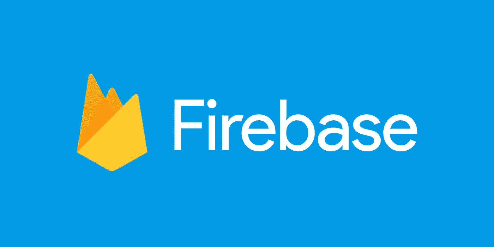

# 隔离期间需要掌握的 5 项技术，提高您的软件工程技能

> 原文：<https://levelup.gitconnected.com/5-technologies-to-pick-up-during-quarantine-and-improve-your-software-engineering-skillset-68bd766bee9c>

在 [Unsplash](https://unsplash.com/?utm_source=unsplash&utm_medium=referral&utm_content=creditCopyText) 上由 [Kinga Cichewicz](https://unsplash.com/@all_who_wander?utm_source=unsplash&utm_medium=referral&utm_content=creditCopyText) 拍摄的照片

至少可以说，过去的几个月很艰难。如果你幸运的话，它造成的损失是可控的。尽管如此，看着这个疫情展开还是令人害怕，而坐下来思考这个问题的充裕时间并没有让它变得更容易。就我个人而言，我发现花一些过多的空闲时间去探索是很有帮助的。

虽然一门全新的语言可能会让人望而生畏(我们都需要留出足够的空闲时间来照顾自己和自己的大脑)，但我还是列出了 5 件事:

1.  不难学(尽管它们在这方面有所不同)，
2.  值得学习(在我看来)，而且
3.  你肯定听过很多谈论的话题，但是如果工作没有给你一个理由，你可能还没有坐下来玩。

因此，现在似乎是选择一个或多个并投入其中的最佳时机。对于每个主题，我将列出一些资源来帮助开始。

# Sass:语法上很棒的样式表

发现萨斯彻底改变了我对 CSS 的看法。我从认为这是一个彻底的痛苦，到绝对热爱它的创作过程。

普通的 CSS 对于一个小的 web 应用程序来说可能是好的，但是你有没有感觉到它开始有点失控了呢？当你不确定哪个 *div* 模块属于你要改变的类时？Sass 消除了这种头痛。

Sass 样式表(module.scss 文件)*中编写的样式只与导入样式表的文件中的代码相关。*这意味着您可以从一个工作表到另一个工作表重复类名，同时改变每个工作表的样式。例如，当我构建一个 React 应用程序时，保持文件间的一致性是很有帮助的。使用 Sass，而不是将类名写成 *homeContainer、aboutContainer、profileContainer、*等。，我可以让每个页面中的顶层 *div* 只是属于类 *container、*，但如果需要，仍然可以定制它们的每个样式。当您使用 Sass 查看浏览器内 HTML 样式时，您可以看到每个样式表单都附加了一个不同的字符串，这样主页中的*容器*就不同于配置文件页面中的*容器*。

Sass 还使得管理变量变得异常简单。您可以创建一个变量文件，使用' $variableName '定义其中的所有变量，然后使用@import 将该文件导入到 Sass 样式表中。使用这种方法，如果你在第 11 个小时决定你选择的绿色阴影不是很正确，用不同的选项来玩的能力不能更容易。

我上面提到的@import 特性是一个 At-Rule——Sass 提供的另一个令人难以置信的特性。其他 At 规则包括调试工具、流控制规则、可重用性等等。

## 资源

*   [Sass 官方文档](https://sass-lang.com/)
*   [初学 Sass 教程——拥有超能力的 CSS](https://www.youtube.com/watch?v=_a5j7KoflTs)

# 重火力点

这套工具简直太神奇了。我已经[写了一篇文章](https://medium.com/swlh/firebase-101-authentication-6aaa874aa7c4)介绍这个平台，并专门讨论了它的认证能力，如果你有兴趣了解更多，我推荐你阅读这篇文章。

Firebase 是一款谷歌产品，为从身份验证(包括社交和无密码登录)到分析、数据库、存储桶、托管、用户管理等一切提供无缝、紧密和强大的解决方案。所有这一切都可以从一个方便的控制面板轻松访问和管理，并附带了完整的实施文档。它基本上提供了构建安全的生产就绪型应用程序所需的一切。

## 资源

*   [Firebase 文档](https://firebase.google.com/docs)
*   [Firebase 101:认证](https://medium.com/swlh/firebase-101-authentication-6aaa874aa7c4)
*   [Firebase 官方 YouTube 频道](https://www.youtube.com/user/Firebase)
*   [Firebase&Firestore master class](https://www.udemy.com/course/firebase-course/)

# 五金器具

我发现随着工程复杂性的增加，我也需要了解运行它的硬件。这在关于效率、尺寸和优化的讨论中尤其相关。

在学习新技术时，背景对我来说一直非常重要。这可能不是每个人的情况，但我喜欢能够完全思考我正在解决的问题，而不仅仅是执行一个解决方案。花时间深入了解处理能力(CPU)、随机存取存储器(RAM)、操作系统、服务器和硬件的其他关键组件，让我有了更深入了解高质量代码的基础。

## 资源

*   [计算机设计基础](https://www.udemy.com/course/the-foundations-of-computer-design/)
*   [如何组装电脑:初学者指南](https://www.udemy.com/course/how-to-build-a-computer-a-beginners-guide/)

# 结构化查询语言

SQL(结构化查询语言)顾名思义是一种用于查询关系数据库的语言。这些原始语句准确地说明了从数据库返回什么数据，允许您将数据插入数据库，等等。

不过，编写原始 SQL 语句并不总是必要的。例如，像 Ruby on Rails 和 Python 的 Django 这样的流行框架将原始的 SQL 查询抽象成方法，这样既更容易编写，也更容易阅读。

从很多方面来说，这种抽象在构建后端时是很棒的，但是我强烈认为这不利于工程师通过抽象或其他方式理解和使用 SQL 查询的能力。我的大部分专业工作包括 PostgreSQL 数据库的快速后端，这需要我编写原始的 SQL 语句。设计复杂的真实应用程序的经历给了我深入了解 SQL 语言的机会*。我学会了编写任何框架都无法提供的复杂的定制查询。现在，当查询关系数据库时，我可以决定对返回值使用定制逻辑的抽象方法是否是最佳选择，或者定制查询是否是最佳选择。*

## 资源

*   [PostgreSQL:SQL 语言](https://www.postgresql.org/docs/9.3/sql.html)
*   [SQLBolt 互动教程](https://sqlbolt.com/lesson/introduction)
*   [SQL 教程:初学者全数据库教程](https://www.youtube.com/watch?v=HXV3zeQKqGY)

# 码头工人

鉴于所有迹象都表明容器是开发和部署的未来，Docker 在这个列表中是显而易见的。不过，我会直截了当地告诉你——Docker 的安装可能会非常麻烦。但我保证这是值得的。如果您曾经在您的最新应用程序上花了很大力气，将每个细节和功能都调整得恰到好处，结果只是部署和构建失败了，那么容器就适合您。

容器的魅力归结于两点——一致性和可伸缩性 Docker 是这两方面的领导者。当使用 Docker 容器时，而不是在一个环境(你的计算机)中开发，然后用另一个环境(Heroku 等)部署。)，*容器永远是环境。*容器与其宿主隔离。*容器*在您的计算机上运行，并且*容器*被部署到生产中。

鉴于容器的性质，它们非常适合扩展。容器可以根据生产需要旋转和拆卸，以应对使用波动。每天都有越来越多的应用程序被容器化，Docker 是这样做的事实选择。

## 资源

*   [Docker 文档](https://docs.docker.com/)
*   [Katacoda:使用基于交互式浏览器的场景学习 Docker &容器](https://www.katacoda.com/courses/docker)
*   [码头工人精通 Kubernetes +来自码头工人队长的蜂群](https://www.udemy.com/course/docker-mastery/)

 [## 编写面试问题

### 一个完整的平台，在这里我会教你找到下一份工作所需的一切，以及…

技术开发](https://skilled.dev)