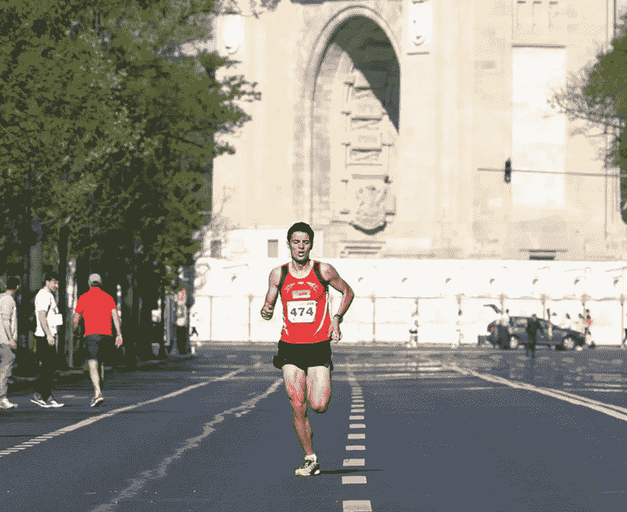
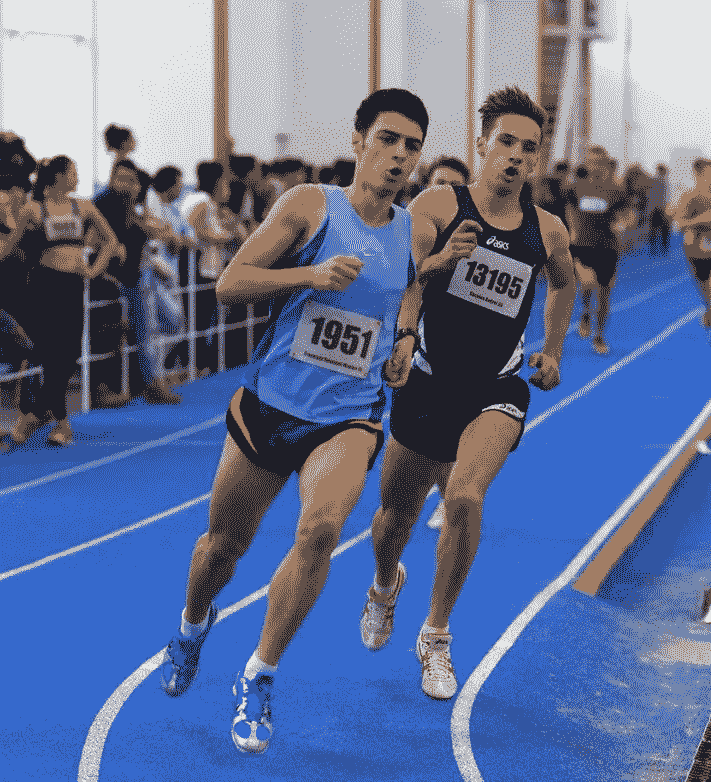
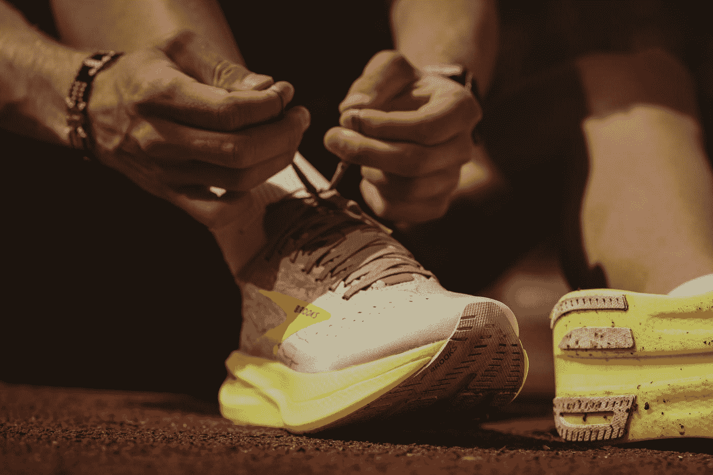

# 我作为运动员学到的 5 件事帮助我成为一名更好的软件开发人员

> 原文：<https://levelup.gitconnected.com/5-things-ive-learned-as-an-athlete-that-helped-me-becoming-a-software-developer-c933207e7d1d>

开始做软件开发之前，我在练长跑。我一直知道，我生命中的这段时间帮助我建立了一个更强大的心态和一个更有组织的学习新事物的方法。

体育锻炼教会了我一些宝贵的经验，这些经验在 IT 行业是必不可少的。在这篇文章中，我将与你分享五件事，你可以从儿童或青少年时期的体育锻炼中学到，这将有助于你的整个职业生涯。

照片由 [CPB 拍摄](https://www.facebook.com/profile.php?id=100063952110393)上[脸书](https://www.facebook.com/profile.php?id=100063952110393)

## 1.要自信

开始学习编程会让人不知所措。有很多你不知道的语言、工具和技术。人们很容易被吓倒。

**尽管如此，在相当高的水平上练习一项运动会给你很高的自信和获胜的心态。**

你知道你能实现什么。你以前做过。你顶着风，顶着太阳，顶着雨，跑了几千公里。你在跑道、公路和山路上奔跑。你不会让 LeetCode 的一个中等难度的 JavaScript 问题阻止你。

照片由 [Nea Dan](http://sportyromania.blogspot.com/) 在[sportyomania](http://sportyromania.blogspot.com/)上拍摄

## 2.努力工作会有回报

跑步是一项你无法假装成功的运动。如果你想打破你的 PB *(个人最好)*时间*，*你需要比前一年更努力地训练。就这么简单。

与时间赛跑让你意识到如果你想进步，你必须投入工作。

当我开始作为一名程序员工作时，这种心态特别有帮助。不仅是为了与工作相关的任务，也是为了获得更多的技术知识和提高工作之外的技能。

## 3.了解您的工具

你练习一项运动越多，你开始收集的装备就越多。如果你愿意投入更多的时间并达到更高的水平，你会发现在给定的环境中，不同的设备可以提供比其他设备更多的优势。

例如，作为一名长跑运动员，我至少同时穿 4-5 双跑鞋。每天，我都在选择一种更适合地形、距离和锻炼强度的方式。

马利克·斯凯兹加德在 [Unsplash](https://unsplash.com?utm_source=medium&utm_medium=referral) 上拍摄的照片

因此，当我作为一名开发人员开始我的旅程时，**我从一开始就明白没有最好的编程语言*这种东西，每种语言或工具都有它的用途。***

## 4.向专业人士学习

当你面对比你强得多的运动员时，你会想从他们身上吸取尽可能多的信息。研究他们的日常训练，并向他们请教如何提高的小技巧会对你有很大帮助。

**所以，刚开始学软件开发的时候，我总是很仰望那些资深开发者，以他们为榜样。**

**此外，我相信如果你关注网上的技术讲座和文章，甚至从你的组织之外找到一位导师，那将会非常有用。**

每个项目都有自己的挑战。看看其他公司的开发人员遇到了什么，他们提出了什么想法，真的可以开阔你的视野。

## 5.提前计划

作为一名长跑运动员，提前计划并有明确的目标至关重要。当我设定年度目标时，我会和我的教练坐下来，分析即将到来的竞争赛季的方方面面。

在没有比赛的情况下，冬季是低强度大运动量训练的理想选择。我试着跑更长的距离，避开跑道和任何速度训练。此外，在此期间，我们增加了许多关于正确跑步技巧的训练。

当天气变好时，我们寻找一些短距离比赛来恢复速度。这些通常是公路 5 公里和 10 公里比赛。他们在为我参加田径赛季的 5 公里和 10 公里比赛增强体能。

最后，当赛道赛季结束时，我们通常会选择一些更长的公路赛，如半程马拉松或马拉松。在此期间，试图保持在赛道季节获得的速度，同时增加距离。

[埃斯特扬森斯](https://unsplash.com/@esteejanssens?utm_source=medium&utm_medium=referral)在 [Unsplash](https://unsplash.com?utm_source=medium&utm_medium=referral) 上拍摄的照片

对我来说，不浪费任何训练总是非常重要的。即使目标在变化，过渡的设计也是为了让我能够始终建立在前一个培训周期的收获之上。

因此，当我学习编程时，我会尽量利用我的学习时间。我通过学习互补的工具和技术实现了这一点，并避免在看起来很酷的领域浪费时间，这些领域与我已经研究过的主题无关——或者它们的替代解决方案。