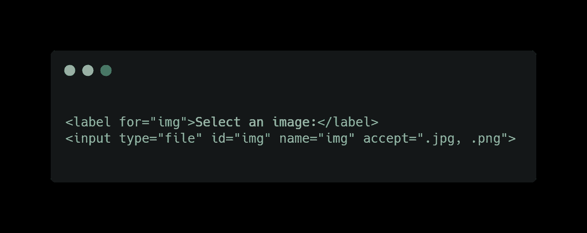
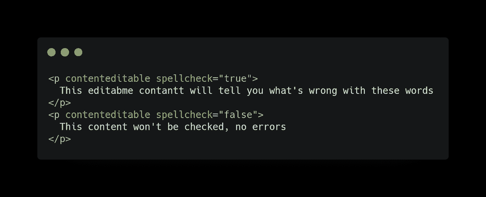
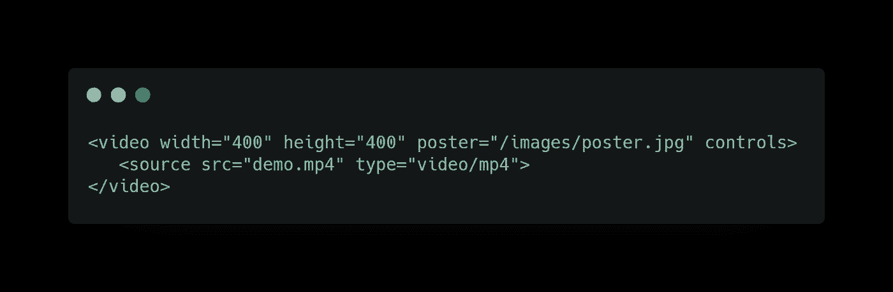
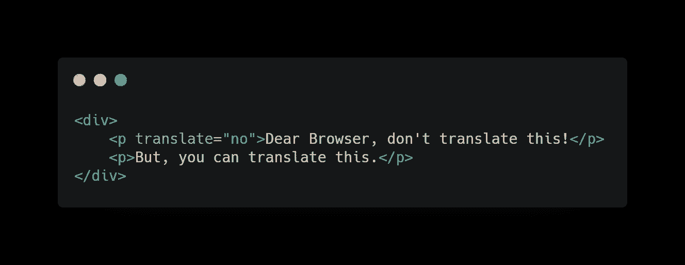
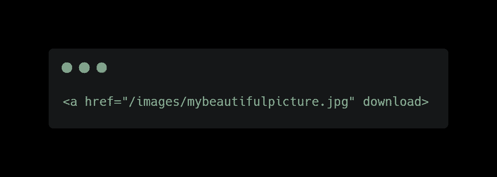

# 开发人员在已经存在的情况下倾向于实现的 5 件事情！

> 原文：<https://levelup.gitconnected.com/5-things-that-developers-tend-to-implement-when-they-already-exist-333b45d4476b>

## 存在而不需要在用户界面中实现的有价值的东西

作者:FAM

本文对 UI/UX 设计师和 BA(业务分析师)也有帮助。有一些前端功能可以通过现有的 web 工具和技术以更低的成本快速完成。

我做过几个项目，大的，小的…等等。我遇到过几次不一致的选择，有时是不一致的执行，这些选择和执行是存在的，不需要执行。因为实现它们会浪费时间和金钱，因为我们需要不断维护它们，并在需要时修复错误。

在这种情况下，开发人员有他们自己的责任，这就是为什么我要分享我迄今为止收集的一些用例！作为开发人员，我们需要与 BAs 合作，提出更有趣、更智能的解决方案。除非客户有特定的需求，否则没有理由浪费时间来实现现有的功能。

这里有一些例子…

# 上传文件的输入

HTML5 中的 accept 属性用于指定用户可以上传的文件类型。他将无法上传除了具有可接受扩展名的文件之外的其他文件。

如何为这个解决方案辩护:

*   不需要实现全部功能。它是内置的，可以被 HTML 识别
*   不需要添加额外的控制(至少在客户端)
*   最佳用户体验，时间就是金钱。你不会浪费用户的时间去选择他们想要的东西，最后得到一个错误。您将在输入的标签旁边显示一个工具提示和一条消息，告诉用户您只接受 PDF。如果用户没有阅读消息(这种情况经常发生)，当上传窗口打开并且只显示。pdf 扩展名。

# 拼写检查

这对我来说是一个罕见的用例。但是，我把它放在这里是为了让你意识到它的存在。我们都会犯拼写错误。拥有拼写检查器使用户体验更加舒适和愉悦。

# 海报

另一个值得注意的选项。当您在 web 应用程序上显示视频，并希望视频之间具有同质性时，一种方法是为每个视频制作一个海报，每次采用相同的设计和不同的标题。

# 翻译

此选项用于告诉浏览器是否要翻译内容。所以这个选项会在页面本地化时翻译文本，或者如果你不想翻译就不翻译。

# 下载

这一选择已经广为人知。当你需要下载文件的时候，知道并牢记这一点是有好处的。

我想说的最后一件事是如果按钮的禁用选项获利。为你的访问者提供一个很好的体验。

> 我今天的故事到此结束，我希望你喜欢它，并从中吸取教训，❤

如果你喜欢看我的文章……♥️

 [## 如果你喜欢看我的文章… ♥️

### 如果你喜欢读我的文章… ♥️，当我的文章发表时，欢迎你第一个得到通知…

famzil.medium.com](https://famzil.medium.com/subscribe) 

> 谢谢你，❤

如果你有兴趣成为付费会员，你可以使用我的推荐链接。下次见

亲爱的读者，感谢你在我生命中的存在。

**让我们在** [**上取得联系**](https://medium.com/@famzil/)**[**Linkedin**](https://www.linkedin.com/in/fatima-amzil-9031ba95/)**[**脸书**](https://www.facebook.com/The-Front-End-World)**[**insta gram**](https://www.instagram.com/the_frontend_world/)**[**YouTube**](https://www.youtube.com/channel/UCaxr-f9r6P1u7Y7SKFHi12g)**或**********

****参见我的关于网络要素和一般文化的电子书。****