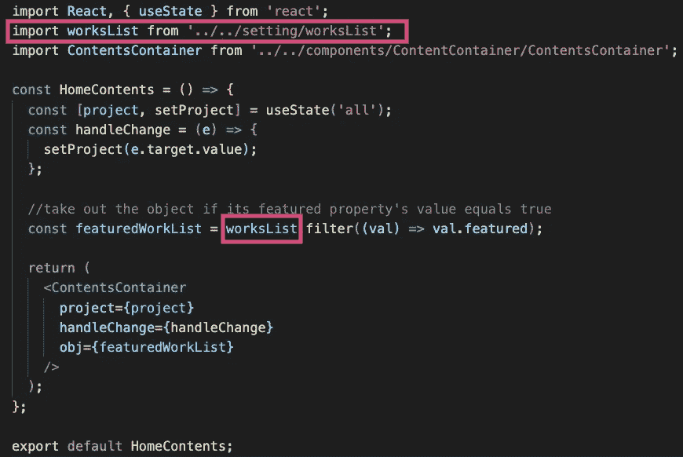

# 我做了 5 件事来升级我的 React 投资组合网站

> 原文：<https://levelup.gitconnected.com/5-things-that-i-did-to-upgrade-my-react-portfolio-website-75d2b8125a7>


当我刚开始学习 React 时，我用它建立了一个作品集网站。当时我以为只要能用就好。然而，我添加的新项目越多，我就越发现代码越来越乱。我开始认为是时候升级了，让它更容易管理。我还认为保持团队项目代码的整洁是一项很好的技能。在这篇文章中，我将分享我为升级我的作品集网站所做的 5 件事。

点击这里查看我的网站！✌️

[](https://marieotaki.com/) [## 玛丽·奥塔基|作品集

### 熟练掌握 JavaScript，React，Redux，jQuery，TypeScript，Node.js，HTML5，CSS3，SaSS，Mongodb，MySQL。我是前端…

marieotaki.com](https://marieotaki.com/) 

# 1.将数据对象更改为模块，使其可重用

在我的作品集里，我在主页和作品页面上以列表的形式展示我的项目，就像这样。


虽然我在主页和工作页面上显示项目，但我将项目作为一个简单的数组来管理，并将其粘贴到每个组件中。真是浪费代码！

所以，我把数组作为一个模块拿出来，让它可以重用。我将其命名为`wokrsList.js`，并将其移入`src/setting`。


现在只需导入它就可以重用了。



# 2.根据旗帜和组件种类显示特色标签

随着我参与的项目数量的增加，我想在主页上只显示特色项目，这样人们就可以看到这个项目是一个“特色”项目。然后，我给每个工作对象添加了特色标志。


在 HomeContents 组件中，我通过 feature 标志进行过滤，只显示有特性的内容。这样，特色标签就贴在了项目上。


# 3.启用根据路径切换要显示的数据

正如我前面提到的，我在主页和 works 页面上都显示了项目列表。我想展示有特色的作品和“查看更多作品”链接到唯一的主页。我该怎么做？

我们可以使用`react-route-dom`的`useLocation`钩子访问当前路径。所以，我添加了如果路径等于`/`则显示“查看更多作品”的条件。


# 4.添加过滤功能

我不仅参与过个人项目，也参与过公司项目，所以我想添加一个过滤功能来区分这两个项目。


我使用 material-ui 创建了一个名为`SimpleSelect`的选择器。我启用这个组件来接收`project props`和`handleChange props`。


让我们看看 SimpleSelect 的内部。属性在选择组件中使用。将`props.project`作为`value`传递，`props.handleChange`作为`onChange`传递。`value`表示选择器的当前值，而`onChange`表示当选择器的值改变时将被调用的函数。


那么到底传什么当道具呢？它是在父组件中定义的。`project`的值为`'all'`，而`handleChange`的值为`handleChange.`

```
const handleChange = (e) => {
  setProject(e.target.value);
};
```


这就是选择器函数的工作方式。原理和“提升状态”的概念一样。

[](https://reactjs.org/docs/lifting-state-up.html) [## 提升状态向上-反应

### 通常，几个组件需要反映相同的变化数据。我们建议将共享状态提升到它们的…

reactjs.org](https://reactjs.org/docs/lifting-state-up.html) 

# 5.添加布局组件

大多数网站都有固定的组件，如页眉、页脚或导航。这意味着无论当前路径如何，这些组件都将一直显示。


在这种情况下，将所有固定组件放在一起作为布局组件是很有用的。您不必将组件命名为“布局”，但通常情况下，它是这样命名的。


在 React 中，父组件可以接收它们的子组件作为`children`道具。使用道具，结构变得简单多了。


对我来说，这是一个复习 React 基础知识的好机会。随着项目的增长，代码变得杂乱无章是很常见的，所以这对我从事未来的团队项目很有用。
我希望这篇文章能帮助那些想从初级水平提升 React 项目的人。

我愿意讨论 web 开发中的新机会！🔥
有兴趣就 Ping 我！
[https://marieotaki.com/](https://marieotaki.com/)

感谢您的阅读！😁