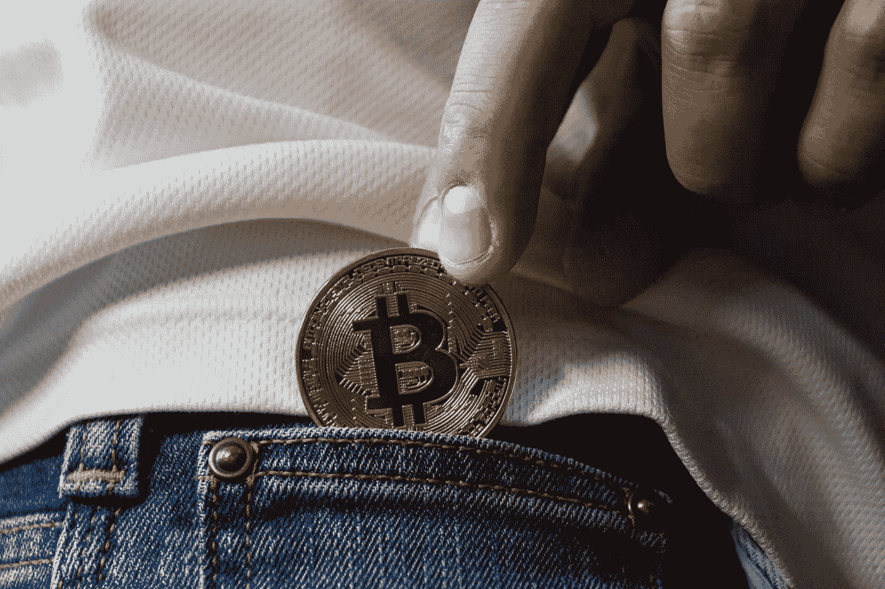
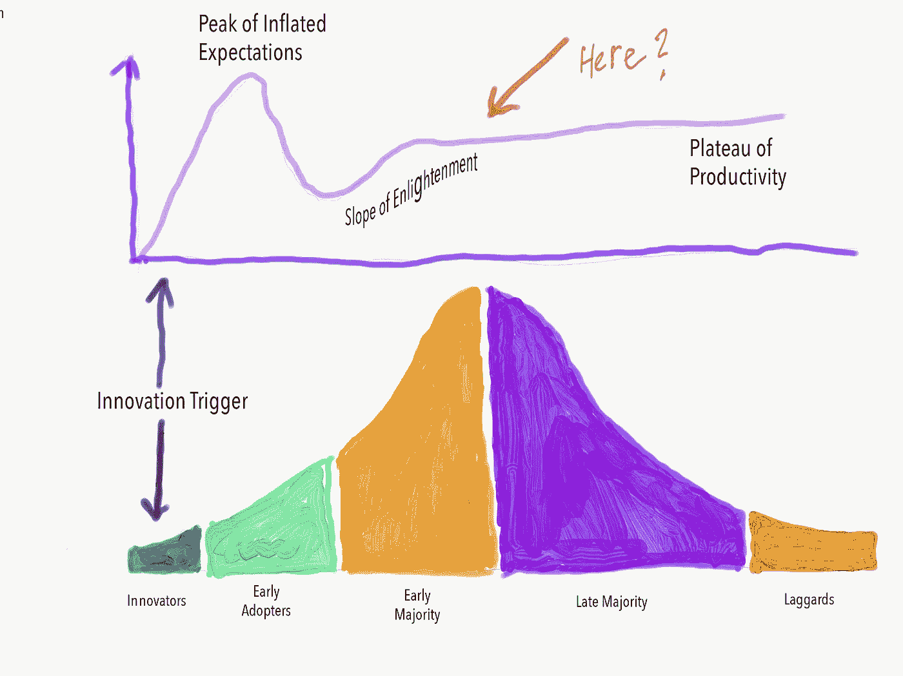

# 购买加密货币前需要考虑的 5 件事

> 原文：<https://levelup.gitconnected.com/5-things-to-consider-before-you-make-that-cryptocurrency-purchase-38f3f312ed38>

## 加密货币 101

## 你对比特币的不了解会伤害到你

照片由 Pixabay 上的 WorldSpectrum 提供

如果你和我一样，你已经从旁观者的角度观察了一段时间，人们“知道”购买、出售和交易各种加密货币。

你和我都听说过比特币价值暴涨时的早期巨额收益的故事，然后，似乎没有任何理由，它又下跌了——只是反弹，但没有那么高。

从外面看，这似乎是一次相对不可预测的过山车之旅。也许是在一片漆黑中，轨道四处移动，所以即使是有经验的车手也不能有效地预测下一次倾斜或转弯。

尽管如此，这并不意味着加密货币没有未来，事实上，这个想法和周围的技术似乎正在加速向前发展。

尽管新冠肺炎事件引发了当前广泛的市场波动，但有足够的理由考虑在某个时候进入加密货币市场，无论是在广泛的市场低迷期间还是之后。

有两个相互关联的原因，为什么你应该考虑投资加密货币，为了本文的其余部分，我们将专注于比特币，因为它是最知名和最常见的形式。

## 投资比特币的第一个理由

技术生命周期+炒作周期。技术采用生命周期最准确的描述是一条钟形曲线，左边的少数人代表创新者，随后是早期采用者，曲线向上倾斜，越过顶部向下，直到后期采用者和落后者最终加入。

眼下，比特币正处于早期采用者都在船上的阶段，早期多数人大多进行了投资。

与此同时，炒作周期看起来有所不同。

炒作周期从产品或服务创新开始，迅速上升到膨胀预期的顶峰，然后在早期幻灭期大幅下降。然后，一个开悟的斜坡出现，逐渐上升到生产力的平台。

当您将两条曲线分层时，看起来有点像这样:

技术采用生命周期与产品宣传周期嵌套在一起。作者插图

我们可以争论细节，但总的来说，我认为我们都同意比特币正处于技术周期的中间，已经过了炒作周期的低点。现在是普通投资者(比如我)上船的最佳时机。

## **投资比特币的第二个理由**

总的来说，随着时间的推移，生产的边际成本开始反映价值。这意味着生产(称为开采)比特币的成本已经与市场价值持平。

这非常重要，因为它表明了一定程度的稳定性和可预测性，尽管新闻报道倾向于关注极端的起伏。

别误会，投资比特币还是很投机的，任何投资都有内在风险。然而，有一个令人放心的事实是，生产成本的相关性已经围绕着商品的价值确定下来了。

就像把一个苹果扔在空中，看到它像我们期待的那样落下来，是很让人放心的。现在，它仍然可能滚到街上，被路过的卡车撞得粉碎。但令人欣慰的是，看到行动如预期般展开。

> 那么，你准备购买比特币(或另一种加密货币)，接下来呢？在你购买之前，有五件主要的事情需要考虑:

## **风险承受能力**

就像上面说的，你对风险的承受能力是多少？比特币的风险至少和购买一家公司的股票一样高。所以，如果你永远不会冒险购买比如说亚马逊的股票，那么你可能就不应该考虑比特币。

如果你更倾向于分散风险的想法，但仍然对加密货币作为一种商品感兴趣，你可以考虑交易所交易基金(ETF)，如灰度比特币投资信托基金(GBTC)，或部分投资于加密货币的基金，如 Bitwise 10 私募指数基金。

## **看护、监护和控制**

不同的比特币交易所提供不同的安全级别、存储比特币的方式(称为钱包)以及不同的隐私级别。找到一家能提供你最想要的功能的交易所是很重要的。

例如，如果您想要使用硬件类型的钱包，您将需要确保您可以成功地将资金从 exchanges 云钱包转移到您的硬件钱包。

## **人为失误**

比特币安全性的另一个方面是保持密钥的私密性。丢失密钥密码通常没有解决办法。有几个例子，人们要么忘记了他们甚至有货币存放在某个地方，要么忘记了存取资金的密码。一个有趣的例子是说唱歌手 50 美分忘记了他在 BBC 的这篇文章中获得了 800 万美元的比特币。

## **新的监管问题**

到目前为止，各国政府尚未巩固围绕加密货币交易的税收和监管政策。请务必注意您所在国家的任何税收法规，以及在外国持有和交易加密货币资产是否需要备案或注册。

## **以不同于其他投资的方式对待比特币的倾向。**

即使你是一名长期投资者，拥有丰富的市场变化经验，并有一个坚定不移的投资策略，你仍然有以不同方式对待比特币的诱惑。毕竟是比较新的。

如果你投资比特币或另一种加密货币，你会希望遵循你已经制定的任何投资计划。

考虑比特币的高风险和波动性，并在价格大幅下跌时抵制出售的冲动。不要被诱惑进行日内交易来利用商品的波动性。让专业人士去做吧；即使是专业人士，他们也不总是那么成功。

## **结论**

总之，基于价值稳定，现在可能是投资比特币的最佳机会之一，这种商品的存在取决于技术采用生命周期和产品宣传周期。

只要你认为加密货币是你更大的整体投资组合的一部分，睁大眼睛看清商品的现实，并在购买前做好功课，加密货币就可以成为一项伟大的投资。

**如果你喜欢这篇文章，你可能也会喜欢:**

 [## 加密货币和区块链的区别

### 完全非技术性的解释

medium.com](https://medium.com/illumination/the-difference-between-cryptocurrency-and-blockchain-1d8c27282943)  [## 焚书其实还是个东西吗？

### 偏狭如何抬起它丑陋的头

medium.com](https://medium.com/illumination/is-book-burning-actually-still-a-thing-f039b8fd3ec1)  [## 为什么那些手套和面具实际上不能保护你

### 真正的保护来自于你何时以及如何穿上和脱下它们

medium.com](https://medium.com/illumination/why-those-gloves-and-that-mask-arent-actually-protecting-you-83cd490fc45f) 

*Timothy Key 在消防部门工作了 26 年，担任过消防员/护理员和各种消防主管管理职务。他坚信，糟糕的管理者摧毁的不仅仅是公司，而优秀的管理者创造的激情是有感染力的。慈悲、恩典和感恩驱动世界；或者至少他们应该这么做。在*[*insta gram*](https://www.instagram.com/key3writer/)*[*脸书*](https://www.facebook.com/keytimothy242/) *，以及* [*推特*](https://twitter.com/keytimothy242) *上关注我，并加入* [*邮件列表*](https://mailchi.mp/a35d63b4962a/timothykey) *。**