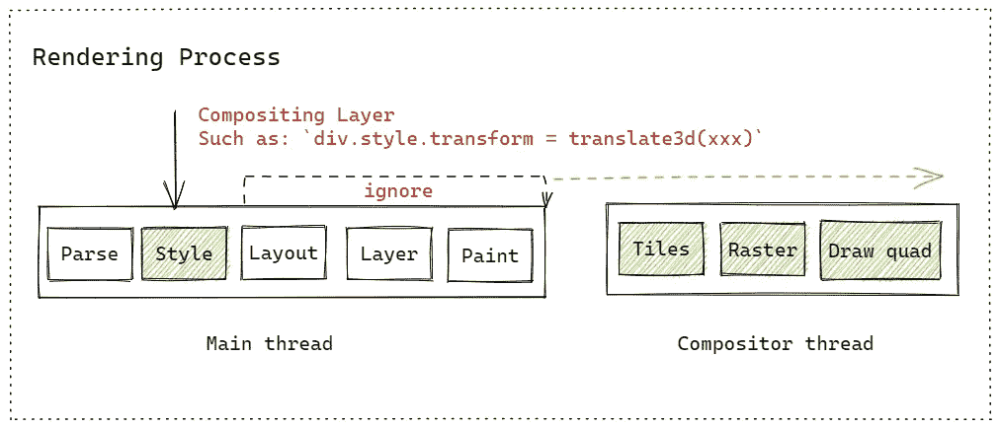

# 优化性能的 5 个技巧(客户端部分)

> 原文：<https://levelup.gitconnected.com/5-tips-for-optimizing-performance-client-section-df734dd6f694>

## 我们能做什么？


洛伦佐·埃雷拉在 [Unsplash](https://unsplash.com?utm_source=medium&utm_medium=referral) 上的照片

优化 web 应用程序的性能是一项麻烦的工作，因为其中涉及的知识很混乱。在上一篇文章中，我在网络部分介绍了优化技巧:

[](/11-tips-for-optimizing-web-application-performance-network-section-c03968f4b744) [## 优化 Web 应用程序性能的 11 个技巧(网络部分)

### 怎么做比较好？

levelup.gitconnected.com](/11-tips-for-optimizing-web-application-performance-network-section-c03968f4b744) 

本文将在客户端部分介绍优化技巧。

# 1.少了 JavaScript

由于呈现过程中的主线程同时负责执行 JavaScript 和呈现页面，所以它们是互斥的。一旦 JavaScript 的执行时间长了，用户感知到的就是页面的滞后。我有一篇关于它的详细文章:

[](https://javascript.plainenglish.io/will-running-javascript-in-the-browser-block-rendering-3e963bb1d2dd) [## 在浏览器中运行 JavaScript 会阻碍渲染吗？

### 浏览器里这个确定吗？

javascript.plainenglish.io](https://javascript.plainenglish.io/will-running-javascript-in-the-browser-block-rendering-3e963bb1d2dd) 

所以我们可以减少 JavaScript 代码量，比如用 Meta 标签或者用 CSS 效果(尤其是动画)代替 JavaScript。可以查看使用 Meta 标签的一些提示:

[](/metadata-elements-every-web-developer-should-know-60bbd0ffbb9f) [## 每个 Web 开发人员都应该知道的元数据元素

### 它有什么魔力？

levelup.gitconnected.com](/metadata-elements-every-web-developer-should-know-60bbd0ffbb9f) 

# 2.更快的 JavaScript

如上所述，除了减少代码量，我们还可以找到让我们的 JavaScript 更快的方法。由于 JavaScript 是一种解释型语言，其执行速度取决于解释器。Google 提供的 V8 解释器是目前的领导者。所以尽量使用带 V8 解释器的浏览器。但是我们不能帮用户决定。所以我们需要优化我们的 JavaScript 代码。

虽然网上有各种 JavaScript API 性能对比，比如“loop 和 forEach 哪个更快？”以及类似的问题。但我想说的一点是，不仅仅是 V8 解释器，其他各大平台的 JavaScript 解释器都会尽可能的优化 ECMA 规范的语法，长期来看比较 API 性能是没有意义的。

那么我们能做什么呢？

第一个也是最值得优化的是那些同步的 CPU 密集型任务。由于单线程，JS 无法利用多核的优势，所以一旦有大量的同步代码执行，JavaScript 的执行时间会很长。例如下面的简单代码:

```
let foo = 0;while (foo < Number.MAX_VALUE) {
  foo += 0.1;
}
```

在类似的情况下，无论我们把这个代码放在`setTimeout`还是`Promise.then`中，它都会严重阻塞主线程。因为这些 API 只是“推迟”它，所以主线程上的计算没有减少。所以我们可以用多线程来解决它。在 Node.js 中我们有类似[子进程](https://nodejs.org/api/child_process.html)的 API，在浏览器中我们可以使用 [Web Workers API](https://developer.mozilla.org/en-US/docs/Web/API/Web_Workers_API) 。

除此之外，还有一些零碎的东西可以提及:

例如，V8 使用的隐藏类借用了静态语言的特性，这些语言假定 JS 运行时中的对象是静态的。也就是说，不会添加新的属性，也不会删除任何属性。这使得可以使用每个属性相对于对象的偏移量来创建隐藏类。具有一致属性顺序的隐藏类也将被多个对象重用。这样，可以显著提高对象属性的访问速度。

然后您可以在编码时注意这个特性。以下是一些建议:

1.  尝试使用文字一次性初始化完整的对象属性。
2.  避免使用`delete`操作符删除对象属性，因为这会生成一个新的隐藏类。
3.  使用文字初始化对象时，最好确保属性的顺序一致。例如`{x:1,y:2}`和`{y:2,x:1}`不共享一个隐藏的类。

虽然隐藏类可以加快查找对象属性的速度，但在频繁搜索时，仍然有一个查找对象的隐藏类和基于隐藏类查找对象属性值的过程。因此 V8 引入了内联缓存(IC):将监听点埋在关键位置，并将信息缓存到反馈向量的槽中。这提高了重新执行的性能。但是，如果传递对象的隐藏类不同，就会出现多态性，影响效率。

因此，您得到的提示是:尝试用相同的输入参数类型编写函数。如果它是一个对象参数，那么最好保证它们是同一个隐藏类。

遵循这个技巧也将允许 V8 的编译器生成更多的机器代码，从而提高效率。

但是使用 TypeScript 能确保输入参数类型一致吗？不完全是。TypeScript 只是编译时的保证，也可以通过某些方式(如`ts-ignore`)忽略它，所以这并不意味着使用 TypeScript 会提高性能。最后，我们在写作时仍然需要注意逻辑。

需要注意的是，这几点是针对当前主流解释器的实现而提出的，在以后的更新中很可能会有所改动。

# 3.避免浏览器回流和重绘

这是一个经常谈论的优化技巧。但是在了解之前，你需要了解浏览器的渲染过程。我有一篇介绍性文章:

[](/what-happens-when-the-url-is-entered-in-the-address-box-until-the-browser-displays-it-159849f75cc0) [## 在地址栏中输入网址，直到浏览器显示出来，会发生什么？

### 这可能是你见过的最完整的回答了

levelup.gitconnected.com](/what-happens-when-the-url-is-entered-in-the-address-box-until-the-browser-displays-it-159849f75cc0) 

下面是我从中提取的渲染管道:


图片来自[作者](https://medium.com/gitconnected/what-happens-when-the-url-is-entered-in-the-address-box-until-the-browser-displays-it-159849f75cc0)

回流和重绘的区别:


回流


重新油漆

你可以看到 reflow 有更多的步骤，这意味着它没有 repaint 效率高。这里有一些好的做法:

*   缓存布局信息，并将对 DOM 的读写操作分开。这是因为一旦修改了 DOM，浏览器会将修改添加到渲染更新队列中。一旦 JS 被执行，队列中的更改将被取出，并呈现最新的页面。但是，如果您更改了 DOM，然后立即读取它，浏览器会停止执行 JS 并重新呈现，以保持读取时 DOM 信息是最新的。
*   使用诸如 [DocumentFragment](https://developer.mozilla.org/en-US/docs/Web/API/DocumentFragment) 之类的 API 一次插入元素。
*   将元素提升到启用 GPU 加速的合成层。具体来说，每个节点将直接或间接属于一个层。具有[堆叠上下文](https://developer.mozilla.org/en-US/docs/Web/CSS/CSS_Positioning/Understanding_z_index/The_stacking_context#the_stacking_context)属性的元素在一个单独的层中，滚动条在一个单独的层中，等等。这可以跳过布局和绘画，直接在合成线程中处理。



合成层

除了这些之外，我们可以使用虚拟 DOM 框架来最小化 DOM 操作和一次修改 DOM 等等。

# 4.写得很好的 HTML 和 CSS

HTML 解析器有很强的容错能力。而我们在渲染的时候又不得不依赖它，所以尽量按照规范使用，减少容错机制。第二，在编写 CSS 时，注意降低 CSS 选择器的复杂度，尽量使用短匹配，避免使用标签或通用选择器等。

# 5.优化代码逻辑

这个提示点看似空洞，但我们确实要注意业务逻辑的优化和重用。所以理解业务对于每个 JavaScript 开发者来说也是非常重要的。

对于高频操作，使用去抖或节流也可以是优化代码逻辑的一部分。除此之外你还有其他建议吗？

# 结论

我提到的优化点，从某种意义上来说，让你成为更好的 JavaScript 工程师。如果您的 web 应用程序存在性能问题，首先要做的是使用 Lighthouse 这样的性能测试工具来找出最关键的问题，比如加载许多或大型图像(最常见)、CPU 密集型任务等等。其次，如果想要持续优化应用性能，搭建性能监控平台，发现问题然后解决问题，通常是更好的选择。而不是编码时只关注这些细节。

玩得开心！请随意与我分享你的任何想法。

*感谢阅读。如果你喜欢这样的故事，想支持我，请考虑成为* [*中等会员*](https://medium.com/@islizeqiang/membership) *。每月 5 美元，你可以无限制地访问媒体内容。如果你通过* [*我的链接*](https://medium.com/@islizeqiang/membership) *报名，我会得到一点佣金。*

你的支持对我来说非常重要——谢谢。

# 分级编码

感谢您成为我们社区的一员！更多内容见[升级编码出版物](https://levelup.gitconnected.com/)。
跟随:[推特](https://twitter.com/gitconnected)，[领英](https://www.linkedin.com/company/gitconnected)，[通迅](https://newsletter.levelup.dev/)
升一级就是转型理工招聘👉 [**加入我们的人才集体**](https://jobs.levelup.dev/talent/welcome?referral=true)