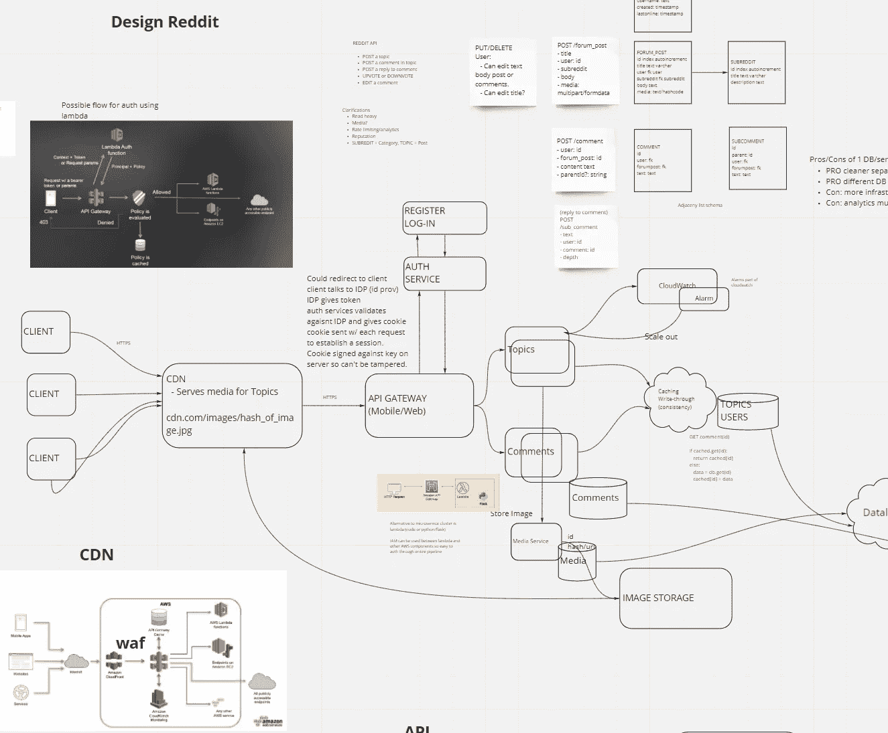
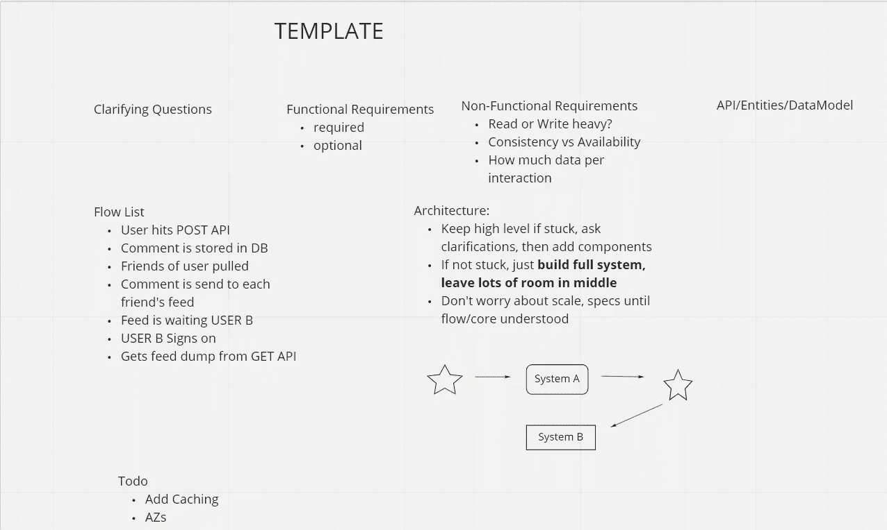

# 系统设计面试准备的 5 个技巧

> 原文：<https://levelup.gitconnected.com/5-tips-for-system-design-interview-preparation-90df3616fe2>

## 重点学习指南

系统设计面试问题将初级和高级工程角色分开。它们很难准备，因为不像算法问题，它们不能归结为一些规定的模式。相反，他们利用了大量的技术知识和经验。再加上高压面试的压力，我们中的许多人眼睁睁地看着梦想中的工作在可怕的白板前破灭就不足为奇了。

去年夏天，我苦于系统设计，这让我失去了在亚马逊和谷歌等公司的工作机会。最后，我在一家很有前途的初创公司找到了一份工作，但不到一年后，Covid 的到来让我丢掉了工作。然而，这一次我决心获胜。以下是我发现的五个具体的建议，可以帮助你为下一次设计做好准备。

# 1.收集在线资源

算法准备资源比系统设计资源多，但是平衡正在改变。在过去的两年中，专门的程序已经出现，取代了无休止地浏览 YouTube 剪辑的需要。

## 付费节目

1.  系统专家是我用过的付费资源。它由一位前谷歌员工制作，专注于模拟面试形式的视频内容。该计划还教授基本概念，如缓存、分片和共识协议。要体验系统专家的味道，请查看其中一节课的免费视频。

来自系统专家的免费视频—重点是模拟面试形式和前期问题/澄清。

2.[钻研系统设计面试](https://www.educative.io/courses/grokking-the-system-design-interview)是我经常听说的另一门课程。与系统专家相比，它有更多的[免费课程](https://www.educative.io/courses/grokking-the-system-design-interview/m2ygV4E81AR)，也更便宜，但似乎更强调基于文本的课程而不是视频。

3.最后，考虑付费参加一次专业的模拟面试。这里的资源很难获得，但 Pramp 提供了这些资源，而且很快就会进入面试环节。

**专业提示:这些项目的优惠券代码通常是可用的。**

## 免费资源

有一些非常可靠的 YouTube 频道致力于系统设计。我最喜欢的频道是[科技假人](https://www.youtube.com/channel/UCn1XnDWhsLS5URXTi5wtFTA)。看几分钟下面的视频，感受一下。这个家伙制作了几十个高质量的视频，老实说，我愿意花大价钱去买。

2019 年夏天，我在亚马逊的一次采访中搞砸了这个问题——真希望我能先看到这个！

其他真正高质量的频道包括[瓜拉夫森](https://www.youtube.com/channel/UCRPMAqdtSgd0Ipeef7iFsKw)和[科技成功](https://www.youtube.com/channel/UC-vYrOAmtrx9sBzJAf3x_xw)。

如果你喜欢亲自动手，试试 [LeetCode](https://leetcode.com/discuss/interview-question/system-design?currentPage=1&orderBy=hot&query=) 和 [InterviewBit](https://www.interviewbit.com/practice/) 上的免费系统设计课程。

**亲提示:用 1.5 甚至 2 倍的速度看视频，节省时间。**

# 2.像米罗一样使用在线白板

很长一段时间我都在学习使用铅笔和纸。严格来说我是个医生，所以我的书写很糟糕。重温这些笔记被证明是困难的，因为几乎不可能将系统图塞进标准的 8.5 英寸 x 11 英寸的纸上。

相反，试试 Miro，这是一个为个人和小团队提供的免费白板网站。Miro 很棒，因为你可以粘贴图像，例如前面提到的 YouTube 视频的截图，并轻松地对其进行注释。

今年夏天为找工作而学习时，我的实际 Miro 板的 1/10 的截图。

**Pro Tip(**[**Toma Ukleba**](https://medium.com/u/3299a7f8fb8f?source=post_page-----90df3616fe2--------------------------------)**):Miro 与类似**[**Star G640**](https://www.xp-pen.com/product/51.html)**的平板电脑配合良好。**

# 3.找一个面试伙伴

我的一个朋友最近也在找工作，碰巧我们都买了系统专家。我们刚刚开始使用这个程序，所以有很多其他人没有看到的问题。我们决定每人研究一个单独的问题，然后模拟面试另一个人。事实证明这非常有帮助。扮演面试官的角色意味着为预期的陷阱和澄清问题做好准备，这需要集中准备。与此同时，受访者并没有感受到实际采访中的那种压力和紧张。能够在整个面试过程中说“伙计，我他妈的不知道”是一种解脱！

如果没有同行，可以考虑像 Pramp 这样的付费面试服务。此外，一些 Twitch streamers 可以合作解决软件问题，并为这种关系奠定基础。

# 4.坚持一个模板

开始系统设计问题的一个好方法是参考脚本或模板。这是我在米罗做的一个:

我的米罗模板开始系统设计问题

共有七个部分:

*   **澄清问题**
*   **功能需求:** ie。**app 是干什么的？**
*   ****非功能性需求**:可伸缩性、延迟、可用性等**
*   ****API/实体/数据模型****
*   ****流程列表**:功能如何工作的逐步说明**
*   ****架构**:绘制系统组件**
*   **任何出现的事情，我们以后可能会回来**

**在实际的工作面试中，我真的把它复制到了 CodePair 中(征得了面试官的同意)，它非常有用。最重要的是，它会衡量什么对面试官来说是重要的。他们可能会说“让我们先关注 API”或“先不要担心规模”。此外，它给你一个喘息的机会，让你记住大局。例如，你问了足够多的澄清性问题吗？你仔细考虑过数据模型吗？可能没有必要使用所有这些部分，但只要将它们放在手边，就可以展示一定程度的准备并提供支持。**

****专业提示:大多数面试平台不允许复制/粘贴，所以准备好转录模板。****

# **5.拥有面试平台**

**Covid world 为数不多的好处之一是，系统设计面试不再发生在实际的白板上。相反，它们是通过 CodePair 和 Google Docs 等平台在线进行的(唉)。这实际上给了受访者更多的方法来准备面试。**

**首先，向招聘经理询问平台和问题格式。试着尽可能多地收集信息——例如，会有多少问题？分配了多少时间？等等…接下来，提前走上平台，解决一些实际问题。**这些平台上的白板工具通常很烂，**所以熟悉它至关重要；否则，面试的一半将会是在摸索。**

**提前几分钟登录面试，复制你的模板(见最后一节)。如果面试官对此有意见，他们可以直接删掉。准备好您的 Miro 便笺簿，以供参考。最好问一下是否允许使用参考资料，不过坦白说，他们是阻止不了你的。**

**做好准备并适应这个平台至关重要。我甚至有过代码配对会议失败的经历，但我通过分享我的 Miro 板并在那里解决问题，挽救了面试。有了这种偶然性，肯定会给我的面试官留下好印象，而且你永远不知道哪个小细节最终会让天平向你倾斜。**

****专业建议:购买一个像样的网络摄像头(** [**)我用的是这个**](https://www.amazon.com/Streaming-Computer-Microphone-with110-Degree-Recording/dp/B07T3S1TCG/ref=sxin_2?ascsubtag=amzn1.osa.6172a9ac-6313-45fb-99da-4f94209ccee3.ATVPDKIKX0DER.en_US&creativeASIN=B07T3S1TCG&cv_ct_cx=webcam&cv_ct_id=amzn1.osa.6172a9ac-6313-45fb-99da-4f94209ccee3.ATVPDKIKX0DER.en_US&cv_ct_pg=search&cv_ct_wn=osp-single-source-gl-ranking&dchild=1&keywords=webcam&linkCode=oas&pd_rd_i=B07T3S1TCG&pd_rd_r=15bf2061-6d20-4cb5-957a-58887aa4f97c&pd_rd_w=dLpvL&pd_rd_wg=uk1TG&pf_rd_p=69c78df1-b3ce-40ba-9ee0-ecaea903b011&pf_rd_r=2H54NT3K9VMMZ4CJ97FE&qid=1598044121&sr=1-3-d9dc7690-f7e1-44eb-ad06-aebbef559a37&tag=lifesavvyonsite-20) **)，避免给人留下充斥着麦克风问题和模糊视频的糟糕第一印象。****

***有什么提示或建议吗？*留下评论。**

# **分级编码**

**感谢您成为我们社区的一员！ [**订阅我们的 YouTube 频道**](https://www.youtube.com/channel/UC3v9kBR_ab4UHXXdknz8Fbg?sub_confirmation=1) 或者加入 [**Skilled.dev 编码面试课程**](https://skilled.dev/) 。**

** [## 编写面试问题

### 掌握编码面试的过程

技术开发](https://skilled.dev)**