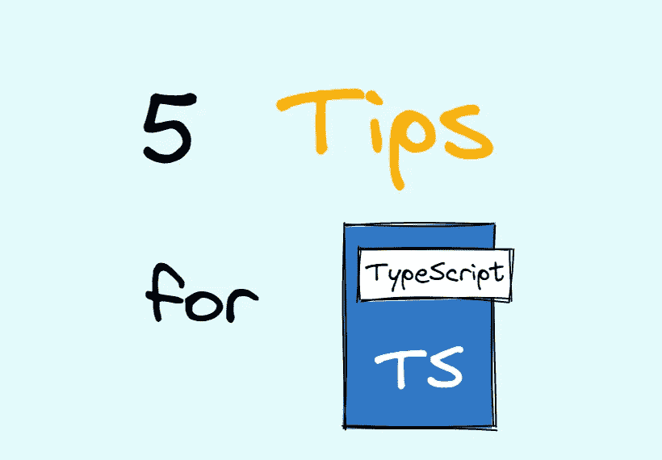

# 编写更好的类型脚本代码的 5 个技巧

> 原文：<https://levelup.gitconnected.com/5-tips-for-writing-better-typescript-code-42a41b09aa1c>

## 像专家一样写出更好的打字稿代码。



作者图片

TypeScript 是一把双刃剑，在让我们的代码健壮的同时也带来了一定的学习成本。如果使用不当，就会出现意想不到的 bug。如果你也想像专业人士一样优雅地编写 TypeScript 代码，请跟随我来看看开发时的一些最佳实践！

# 1.更喜欢`unknown`而不是`any`

将变量设置为类型`any`会导致 TypeScript 编译器跳过对该变量的类型检查，这与添加`@ts-ignore`相同。这很危险，因为它脱离了 TypeScript 的类型保护。除非您将 JavaScript 项目迁移到 TypeScript，否则尽量不要这样做。

如果你不知道变量是什么类型，或者你想接受任何类型的参数，优先使用`unknown`。这是因为在使用它之前，必须将其缩小到一个具体的类型，这通常意味着更安全，参见如下代码:

更多`unknown`功能，请查看我的另一篇文章:

[](https://betterprogramming.pub/secrets-of-unknown-types-in-typescript-2987cd1263f0) [## TypeScript 中“未知”类型的秘密

### 为什么在 TypeScript 中“unknown”比“any”更受欢迎？

better 编程. pub](https://betterprogramming.pub/secrets-of-unknown-types-in-typescript-2987cd1263f0) 

# 2.不要使用非原始的装箱对象

在 JavaScript 中，有一些非原语的装箱对象可以访问`Object.prototype`上的方法，用代码表示:

```
String | Number | Boolean | BigInt | Symbol;
```

即使在 JavaScript 中，它们也几乎从未被恰当地使用过，TypeScript 提供了应该使用的相应类型:

```
string | number | boolean | bigint | symbol;
```

# 3.尽可能使用常量枚举

常规枚举在运行时会产生额外的代码，这无疑会增加程序的运行成本，而用`const`声明的枚举会直接内联我们在代码中使用的枚举值。

但是常规枚举和`const`枚举有很多区别，我们不可能在所有场景下都使用`const`枚举。要了解更多信息，请查看我的另一篇文章:

[](/enums-features-you-must-know-in-typescript-d5b6a1288b42) [## 列举您在 TypeScript 中必须知道的功能

### 让你的打字稿代码更清晰易读。

levelup.gitconnected.com](/enums-features-you-must-know-in-typescript-d5b6a1288b42) 

# 4.利用最新功能进行优化

我们可以使用 TypeScript 中已经支持的最新 JavaScript 特性，可选链接(？。)和零化合并运算符(？？).

# 5.灵活使用高级实用程序类型

我们可以使用内置于 TypeScript 中的高级实用程序类型来减轻我们的开发负担，将它们结合起来实现几乎所有常见的类型转换。

上面的代码片段只展示了其中的一部分，我的文章中还有更多信息:

[](https://javascript.plainenglish.io/7-typescript-built-in-utility-types-you-must-know-d7a73a489d7) [## 您必须知道的 7 种 TypeScript 内置实用程序类型

### 提高对内置类型的理解。

javascript.plainenglish.io](https://javascript.plainenglish.io/7-typescript-built-in-utility-types-you-must-know-d7a73a489d7) 

今天就到这里。我是 Zachary，我将继续输出与 web 开发相关的故事。如果你喜欢这样的故事，想支持我，请考虑成为 [*中等会员*](https://medium.com/@islizeqiang/membership) *。每月 5 美元，你可以无限制地访问媒体内容。如果你通过* [*我的链接*](https://medium.com/@islizeqiang/membership) *报名，我会得到一点佣金。*

你的支持对我来说非常重要——谢谢。