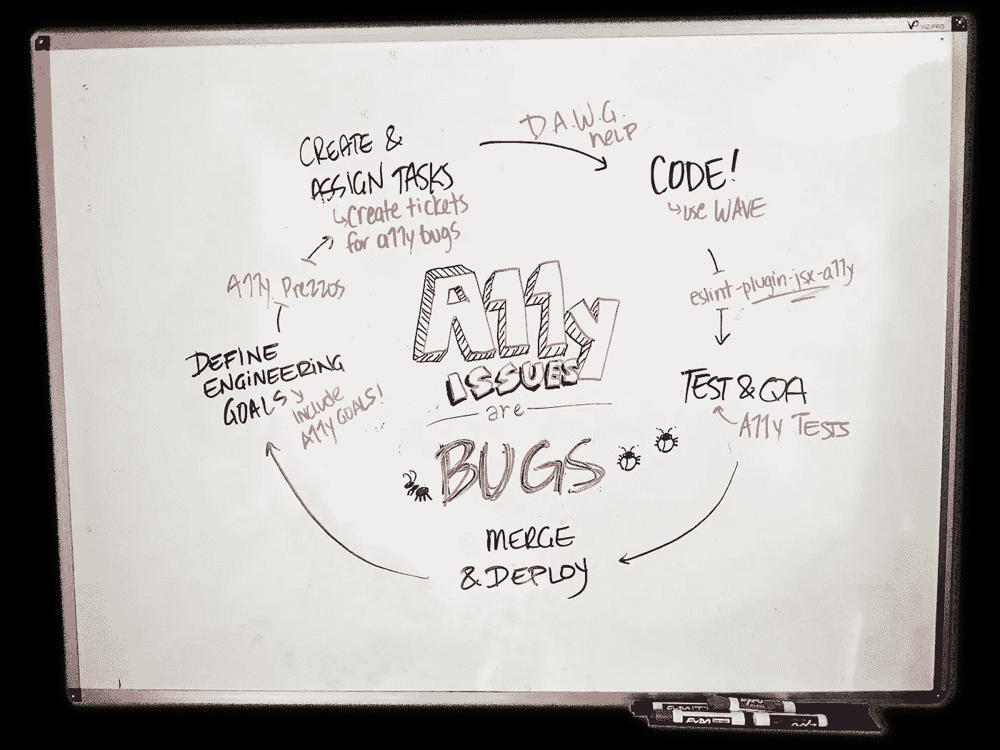
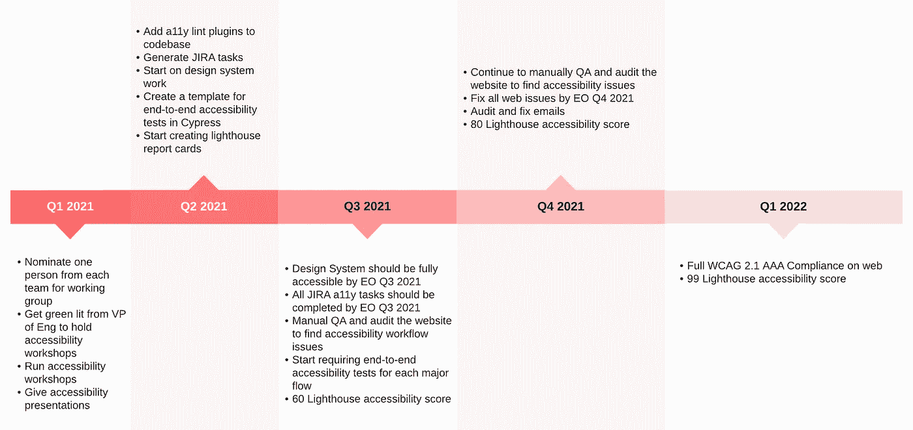
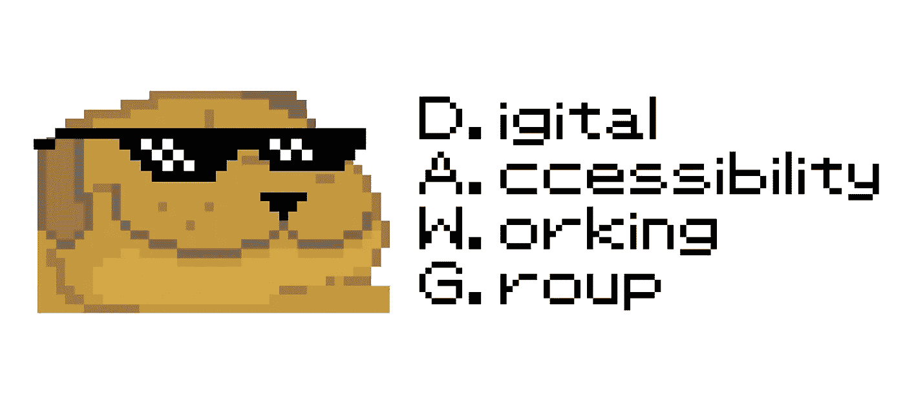

# 关于如何将网页可访问性整合到你的开发工作流程中的 5 个想法

> 原文：<https://levelup.gitconnected.com/5-tips-on-how-to-incorporate-web-accessibility-into-your-dev-workflow-74d831e92fba>

## 关于如何建立团队工作流程以解决可访问性的想法和理念

如果我们在没有专门的易访问性团队的小公司工作，我们如何将易访问性合并到我们的开发工作流中，以创建一个更加一致的环境，在其中我们可以处理易访问性？

 [## 停下来。你是#a11y 新人吗？

### 如果是这样，请查看第一篇“新手的网页可访问性”文章。它充满了基础知识和建议！

levelup.gitconnected.com](/web-accessibility-for-newbies-1098fa15f9f0) 

作为一名开发人员，我将**自动化易访问性度量视为测试覆盖度量** *。*在这两种情况下，我们都可以定义一个相对可量化的最终目标，并采取具体措施让我们更接近那个目标。此外，可访问性和测试工作对用户来说都是不可见的，但是会产生更无缝的产品，提供更好的整体用户体验。

理想的测试覆盖情况是，我们从一开始就建立我们的测试基础设施并定义我们的覆盖目标，在开发的同时开发一个肌肉来编写和改变测试。同样，理想的可访问性情况是，我们从一开始就定义了我们期望的 WCAG 合规级别，并设置了我们的基础设施(包括技术和非技术)来支持我们继续努力达到并保持该合规级别。

作为开发人员，我们非常熟悉[测试驱动开发](https://www.infoq.com/articles/test-driven-design-java/) (TDD)的概念，以至于我们甚至有了它的名字和缩写。可访问性应该是我们测试栈和哲学的一部分，因此也是 TDD 的一部分。正如我们在上周了解到的那样，我们有很多方法可以将可访问性作为一个可量化的指标。

将可访问性包含到您的 TDD 方法中有一个简单的原则:*可访问性问题是 bug。*

希望将可访问性添加到您团队的工作流中，但不知道如何引入它？这里有一些在我的职业生涯中帮助过我的团队的步骤和想法。我希望它们能激励你和你的团队提出自己的具体解决方案:

## 1.将可量化的可访问性目标添加到您的路线图中

如果您真的是从现有产品的零开始，为您的可访问性目标创建一个路线图可能是一个好主意。

您的最终目标可能是一个特定的 WCAG 合规性，或者一个 [Lighthouse 可访问性分数](https://web.dev/accessibility-scoring/)，中间目标如让您的设计系统完全合规:

易访问性路线图的一个基本例子

在一位前雇主接到 ADA 诉讼后，我们联合起来创建了一个遵从路线图，并提交给案件律师。尽管经历压力很大，有点仓促，但这是一个很好的练习，帮助我们澄清了所有必须做的事情，以使合规性成为可能。

显然，您不必创建一个全新的只支持可访问性的路线图。事实上，如果您将它编织到您当前的技术路线图中，并让它成为您所有其他工程优先级的同胞，这可能是最好的。

我强烈建议为您的可访问性之旅创建里程碑或目标，就像您为测试或性能目标所做的那样。落笔有助于优先考虑和明确你的无障碍之旅。希望不会因为 ADA 的诉讼而迫使你这么做！

> **别忘了:WCAG 合规就像 HIPAA 合规一样，永无止境！**不要停止关心可访问性，一旦你达到了你想要的合规性水平，继续在你的工作流程中整合和考虑它。

## **2。将 a11y linters 添加到您的代码库**

Linters [只捕获了所有可访问性问题的 20-25%](https://www.essentialaccessibility.com/blog/automated-accessibility-testing-tools-how-much-do-scans-catch),但是它们是一个开始。您可以做的任何类型的自动化都会在您的可访问性之旅的开始阶段对您有很大的帮助。这就是我们对我们的产品所做的:

1.  我们将`[eslint-plugin-jsx-a11y](https://www.24a11y.com/2017/reacts-accessibility-code-linter/)`添加到我们的 React 代码库中，并编写了一个小的节点脚本，在每个文件上运行它，为每个问题生成一张 JIRA 票证。我们根据 lint 规则类型为每张票据分配了一个优先级，并按照我们对其他产品 bug 进行分类的方式将它们分块委派。
2.  使用 [husky](https://typicode.github.io/husky/#/) ，我们让 eslint 作为预提交 git 挂钩的一部分运行。我们使得 a11y 插件只能在新添加的文件上运行，因为其余的从第一步开始就在 JIRA 记录了。以这种方式，我们可以确保新代码至少最低限度地满足可访问性 linter 的标准。
3.  我们让我们的持续集成框架在每个分支上运行它，只有当它通过时才允许合并。这样，如果有人绕过了预提交挂钩，我们仍然可以确保我们的主分支不会得到新的不可访问的代码。

然后，Scrum masters 被告知在每个 sprint 中至少优先处理几个易访问性 bug，就像处理普通 bug 一样。这听起来很激进，但是我们发现这种激进的方法使我们的可访问性提高了许多倍。

除了林挺，您还可以将自动化测试添加到许多端到端框架中，并创建一个完整的单元测试生态系统。我邀请您发挥创造力，将许多可用的辅助工具融入到您的堆栈和工作流中。

 [## Web 可访问性审计和工具开发指南

### 如果您想获得关于使用什么工具以及如何使用工具的更多指导，请查看我的关于工具和可访问性问题审计技巧的文章。

levelup.gitconnected.com](/the-developers-guide-to-web-accessibility-auditing-and-tooling-90e70fd95349) 

## 3.广泛共享资源，促进教育发展

突然有 200 个 JIRA bug 被分配到你的团队，而你却不知道如何修复它们，这可能是一件可怕的事情。所以我们优先考虑无障碍教育，让公司的每个人都可以参与。

我们做了一个“什么是网页可访问性？”在我们全体会议和工程月度会议上做的报告。我们还创建了一系列描述我们新工作流程的动态文档，其中包含指向我们最喜爱的资源的链接。每隔几天，我们会在我们的前端工程 Slack 频道发布一个新的可访问性提示。我们鼓励人们在 Slack 和我们每周的前端会议上公开讨论他们的易访问性工作，并进一步鼓励人们互相帮助，而不是一遍又一遍地依赖同一个专家。

如果你能培养一个没有评判的学习环境，人们会更愿意学习和采纳。尽管在林挺步骤中有消除错误的压力，但知道你可以接触到任何人，并且你们都在一起朝着更高的目标努力，这是一种激励。

## 4.创建一个无障碍工作组

当你对你的工作流程进行重大改变时，重要的是人们不仅要得到他们需要的支持，还要被鼓励回馈和支持生态系统。举行公开讨论并给人们一个发表意见的机会也很重要。所以，我们成立了一个工作组。

我为我上一个公司的可访问性工作组做的标识。我喜欢让事情变得有趣，尤其是在学习新事物的时候。

我们的公司被分成几个功能区，每个功能组都有一些工程师和设计师。我们要求每个团队提名一名前端工程师作为他们团队的“可访问性倡导者”，并加入我们的数字可访问性工作组(DAWG)。

这个小组每隔一周的星期一开会一个半小时。在这种情况下，我们会花半个小时教授一个新的可访问性概念，或者在我们的工作流程中引入一个新的内容，在接下来的一个小时里，我们会回答问题，举行办公时间，一起讨论和研究困难的可访问性问题。每件事都做得非常民主，以加强我们都在一起学习的理念，没有哪个功能团队比其他团队更重要。

倡导者然后会回到他们的团队，希望带着一些新知识和回答问题来帮助传播知识。毕竟，没有比自学更好的学习方法了！

## 5.改变你的发展心态，包括 a11y

在前端工作时，您经常会在开发时检查浏览器控制台的错误。错误*在你发展的时候*应该让你的心跳一下；什么？我把反应键忘在什么地方了？上帝保佑，别再来了！

是的，我知道很多网站已经过时了，游戏机基本上是白噪音。但是，我们应该始终争取一个干净的控制台。同样，我们应该始终争取一个干净的看起来[波](https://wave.webaim.org/extension/)或 [ANDI](https://www.ssa.gov/accessibility/andi/help/install.html) 输出。理想情况下，除了常规的开发和测试工具之外，我们还应该在我们的开发工具带上添加可访问性工具。这不应该感觉像是一件额外的苦差事，而应该感觉像是开发周期中的一个正常步骤。

我发现解决可访问性的最好方法是将其视为测试和 QA 的一个自然部分。只要记住*可访问性问题是 bug*，就像一个断开的链接或图片一样。一旦我们开始考虑它们，并以这种方式对待它们，我们将会看到网络上更少的可访问性问题。

我希望这些技巧对你有用，我也很想听听对你和你的团队有用的其他技巧。祝你的无障碍之旅好运，首先感谢你踏上了这条路！

 [## 喜欢这篇文章？考虑给我买杯茶吧！

### 我过去常常把我的文章放在中等收费的墙后面，但当谈到教育时，我完全关注可访问性，所以现在它们都是免费的。如果你觉得你从这篇文章中得到了一些东西，并且有一些闲钱，请考虑给我买杯茶来表示你的支持！🫖

www.buymeacoffee.com](https://www.buymeacoffee.com/karomancer)