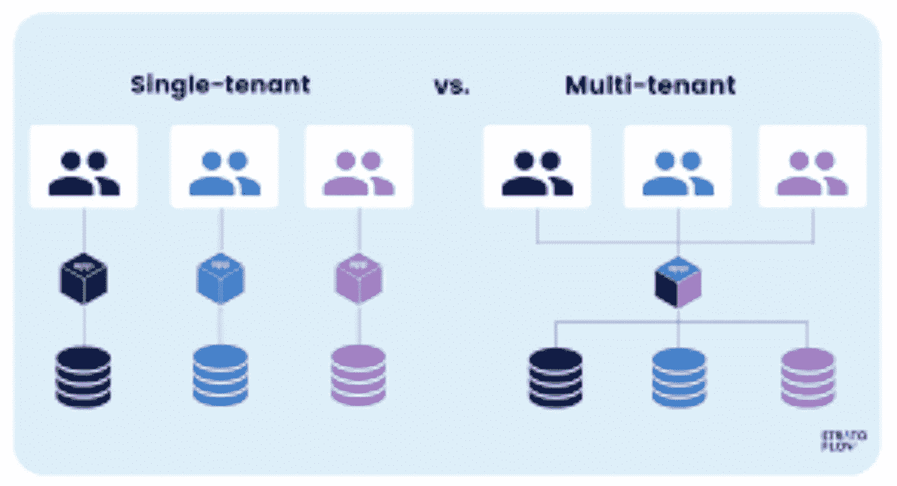

# 多租户架构设计的 5 个技巧

> 原文：<https://levelup.gitconnected.com/5-tips-to-design-for-multi-tenancy-architecture-5f7d55657d77>

电脑:StratoFlow

# 什么是多租户架构？

> 多租户架构是指允许多个应用程序实例在共享环境中运行的系统。尽管物理上是连接的，但实例(租户)在逻辑上是分离的。

为了表示不同用户或租户的不同用例，多租户架构被设计为在特定维度上可重新配置和灵活。尽管它们只有一个实现来防止重复，但它们支持计算资源、配置、规则和其他属性的共享使用。

租户是一组用户，他们对软件实例具有普通级别的访问权限和特权，并且能够设计和定制某些功能和服务。

在设计多租户应用程序时，需要考虑许多架构决策，包括租户隔离、多租户存储、计费和计量、身份和访问、测试、管理和监控。

# 为什么选择多租户架构？

多租户和多实例系统的区别在于，后者允许单个软件实例代表许多租户运行。在许多消费者之间共享资源的好处是很多的——

*   **节省硬件成本** —随着成本在用户之间分摊，开发人员环境和部署支持等功能共享，成本变得更低。
*   **节省软件成本** —由于费用由多个客户端分担，多租户降低了内存、处理开销、软件许可证等成本。
*   **扩展** —因为一个平台可以服务许多客户，所以服务可以更快地扩展到客户。
*   **监控** —系统指标在客户之间共享，但每个租户都可以自由捕获和分析他们自己的指标。
*   **数据聚合** —为了挖掘数据并寻找趋势，跨消费者运行查询变得更加简单。
*   **开发人员体验** —当硬件堆栈之间没有逻辑差异时，维护它们会更简单。

# 为什么不是多租户架构？

然而，多租户带来的一些缺点包括:

*   **认证&访问** —为了安全，需要更严格的认证和访问控制。应该有防止数据损坏的措施。
*   **安全测试**—由于多个客户的数据混杂在一起，必须始终保持数据隔离，因此安全测试必须更加严格。
*   **性能和负载测试** —需要跨租户影响测试、节流测试和入职测试。
*   **嘈杂的邻居影响** —大量使用系统的一个租户可能会降低其他租户的速度。
*   **停机影响** —如果一个租户经历停机，可能会影响到设备群中的其他租户。
*   **运行维护** —随着隔离级别的提高，运行负载往往会上升。
*   **发布管理** —对实例的更新可能会导致所有租户停机，即使该更新仅适用于一个租户。
*   **复杂性** —额外的定制复杂性和维护每租户元数据的需求需要更大的开发工作量。

# 多租户架构的数据库模型类型

在多租户系统中，通常有三种方法来构建数据库，具体取决于不同的复杂程度和成本:

*   单一共享相同模式数据库

所有租户的数据都存储在同一数据库中。因为使用的是集合资源，所以成本相当低廉。然而，它带来了数据并发、版本控制和操作挑战。

*   单一共享多模式数据库

该模型为每个租户使用同一数据库实例中的子数据库。每个租户模式都是不同的、单独操作的，并且是独立的。当需要对来自不同租户的数据进行不同的处理时，比如应用区域约束时，这是很有帮助的。这种架构的成本更高，每个数据库的开销也更大。

*   多模式数据库

第三种类型的多租户架构在多个数据库中托管数据。尽管它提供了最好的数据隔离，但它也增加了管理、维护和可伸缩性的复杂性，这是由部署多个数据库带来的。

# 实施细节/设计笔记

*   **可扩展性** —构建的特性需要对所有租户都是通用的和可扩展的。
*   **租户标识符** —设计需要在所有请求中包含强制 tenantId 属性。
*   **定制** —定制应作为配置选项引入，可供所有租户使用。任何代码逻辑都不应该直接引用租户，而应该只引用为租户启用的功能标志。
*   **启动** —租户应该能够独立启动和配置他们的应用。
*   **恢复** —恢复客户端应该是独立和隔离的。
*   **除垢/除垢** —每个租户可以独立于其他租户进行除垢或除垢。
*   **授权** —需要机制来实现基于租户的授权。
*   **缓存** —系统应该能够缓存特定于租户的数据。如果租户 X 在键 A 下缓存数据，而租户 Y 从缓存中读取相同键的数据，则不应向其提供租户 X 的数据。
*   **工具** —系统应该为每个客户提供可预测的性能、可用性，并在每个租户的粒度上实施配额。
*   **交通管制**—用户控制交通、优先车道等交通管制措施是必要的。
*   **监控** —监控指标应按租户进行划分。

> 多租户是指多个域/租户从同一个机箱接受服务，并且有很多(很多！)的方法。必须在完全隔离和单个租户影响整个设备群的风险之间取得平衡。

> 感谢您的阅读！如果您觉得这很有帮助，以下是您可以采取的一些后续步骤:

1.  这个博客是我的**系统设计系列的一部分。**查看该系列的[其他博客](https://iamkanikamodi.medium.com/design-principles-for-microservices-architecture-d637587cf394)！
2.  给我点掌声！👏
3.  在 Medium 上关注我，并在下面订阅，以便在我发布时获得通知！📨