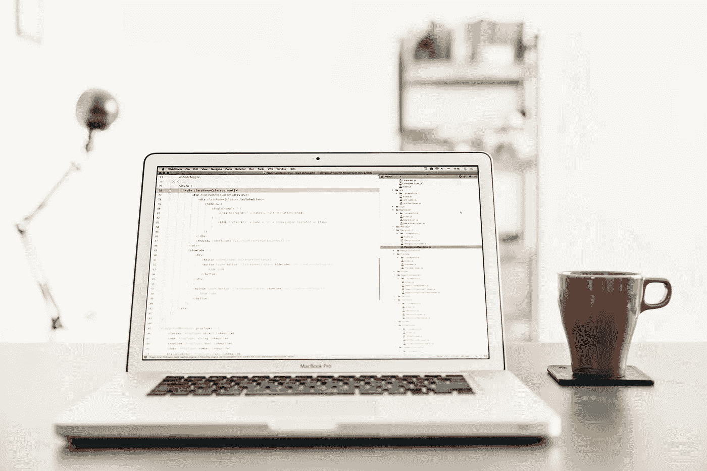

# 作为一名软件工程师，提高注意力和工作效率的 5 个技巧

> 原文：<https://levelup.gitconnected.com/5-tips-to-improve-your-focus-and-productivity-as-a-software-engineer-d9538aa43857>

## 5 个简单的技巧来增加你的产量

Artem Sapegin 在 [Unsplash](https://unsplash.com/photos/DErxVSSQNdM) 上拍摄的照片

作为一名软件工程师，工作必须是最好的工作之一，但当它涉及到实际生产和有效利用你的时间时，会有一些障碍。对于我们程序员来说，注意力经常是一个问题，因为我们的工作场所是在电脑前，这意味着只需点击一下鼠标就有很多容易分心的事情。

考虑到这一点，我想分享一些技巧，它们可以帮助我隔离干扰，真正完成一些深入的工作。现在，我不能保证对我有效的方法对你也有效，但是你只有亲自尝试过才能知道。

对于爱好者，我推荐一本名为《T4》的书，作者是 Cal Newport ，如果你想更深入地了解这个话题，这本书很不错。所以不要延长这个介绍，让我们开始吧。

**1。从你的工作设备上移除社交媒体**

很多时候，我会点击“Ctrl+T”(在 Chrome 上打开一个新标签页)，然后在 Instagram 或脸书上输入。这真的成了一种习惯，只是打开一个新的标签，看看是否有新的东西让我分心。

自从我觉得自己这么做了，我第一件要做的事情就是把脸书从 Instagram 上注销。你真的不需要删除或关闭你的账户，只需在你的工作设备上注销那些社交媒体账户就足够了，所以如果你真的想打开那个新标签，账户就会被注销，希望这会提醒你为什么会这样，并防止你浪费更多的精确时间。

**2。安排休息时间**

隔离社交媒体对很多人来说可能很难，所以我做的第二件事是安排小屏幕休息时间，比如说每小时一次。你可以用手机上的闹钟来做到这一点。

例如:工作了 55 分钟，闹钟响了，你出去伸了个懒腰，喝了杯咖啡，或者打了 5 分钟电话。5 分钟过后，你可以在 55 分钟后设置另一个闹钟。

通过这种方式，你仍然可以满足自己快速浏览社交媒体的渴望，但仅限于每小时一次，在休息时间你也可以工作一会儿，这样你就不会因为久坐而僵硬。

**3。扔掉手机**

好了，我们已经提到了更少的社交媒体和安排休息时间，所以第三件事是当我们设置闹钟倒计时到下一次休息的时间时，我们可以把手机扔在另一个房间，远离我们的手，当闹钟开始嗡嗡作响时去拿。

这里的想法是，如果你看不到你的手机，并且不容易拿到，那么你就不太可能拿起它。

**4。首先从困难的任务开始**

我们一天中所做的每一个选择都在消耗我们的精神，所以为了提高我们工作时的注意力，在早上从要求最高的任务开始是唯一合理的，这样我们就可以把它们处理掉，把要求较低的任务留到一天的晚些时候。

所以这个很简单。如果你有 4 项任务，而其中一项又大又复杂，需要你付出很多努力，那就在早上第一件事就开始吧。这会让你对任务有一个更清醒的头脑，也会让你在早期完成任务时感觉良好。之后处理更简单的任务来结束一天将会是一种享受。

**5。忽略你的邮件**

遵循上一点，我们还想把工作日的早些时候分配给那些困难的任务，并确保没有人会分散我们的注意力。所以，如果可能的话，通知你的团队你可能几个小时都不在，关掉你的邮件，关掉你的聊天，享受你内心的平静，不要被邮件或聊天分心。

如果你确实对没有查看邮件感到焦虑，你可以每小时拨出几分钟去查看是否有人联系过你，以及他们是否需要帮助。但是，如果他们的问题可以等，不要害怕告诉他们你现在很忙，会尽快回来找他们。

**6。工作前锻炼**

这个真的有点意外，因为它不一定能帮助我集中注意力，但我确实觉得这是一个很好的锻炼，在工作开始前洗个冷水澡。

它不需要很大的锻炼，可以是慢跑，或者你可以伸展一下，做一些俯卧撑，或者你可以冥想 10-15 分钟，然后洗个冷水澡来唤醒你的身体，当你坐在椅子上开始新的一天时，这不可避免地会让你的身心处于更好的状态。

## 结论

这些是我用来提高注意力和深度工作的主要方法，如果它们对你有帮助，我很乐意听到任何反馈，请随意分享你进入专注状态的技巧和诀窍。

如果你喜欢这篇文章，但还不是一个媒体成员，那么请随意使用我的推荐链接。

 [## 通过我的推荐链接加入 Medium-Ivan Stoev

### 你好，如果你对软件开发有热情，那你来对地方了！您的会员资格将直接…

medium.com](https://medium.com/@ivan.zstoev/membership)