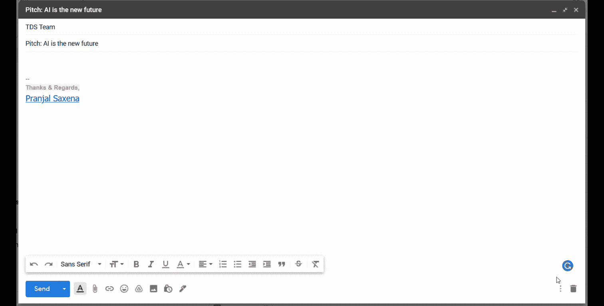
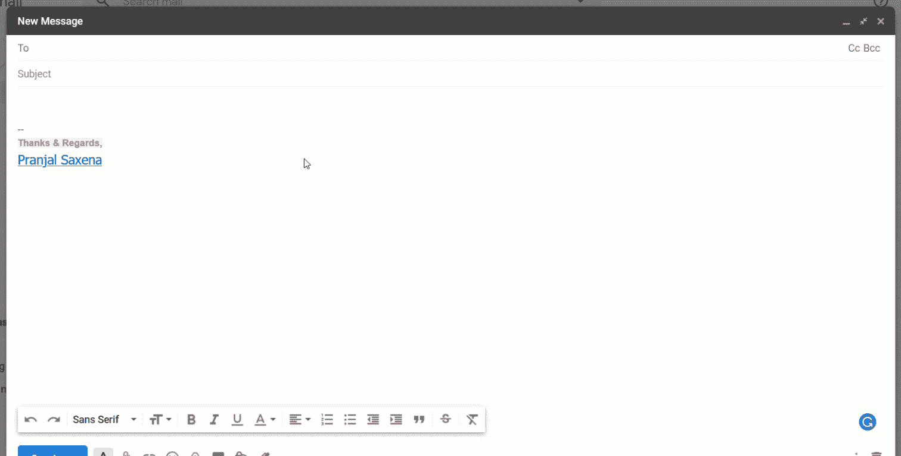
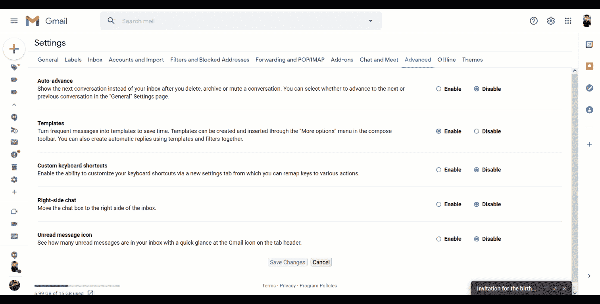
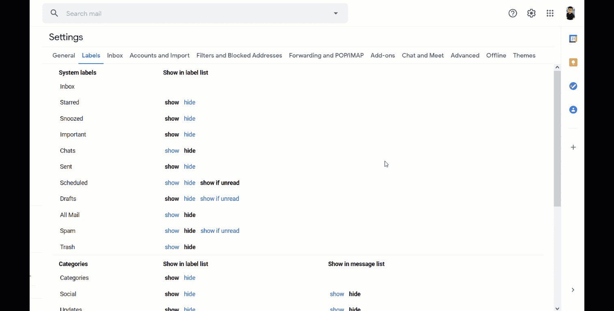

# 提高电子邮件效率的 5 个终极技巧

> 原文：<https://levelup.gitconnected.com/5-tips-to-manage-your-email-for-better-productivity-25a97707ed1b>

## 这些建议很快就能适应

照片由 [**cottonbro**](https://www.pexels.com/@cottonbro?utm_content=attributionCopyText&utm_medium=referral&utm_source=pexels) 发自 [**Pexels**](https://www.pexels.com/photo/photo-of-two-people-using-their-gadgets-4065137/?utm_content=attributionCopyText&utm_medium=referral&utm_source=pexels)

当我们跨入 20 多岁时，电子邮件成为我们生活中必不可少的一部分。每一次交流，无论是与你的工作还是你的副业有关，都是通过电子邮件进行的。因此，了解管理电子邮件的更好方法以在你的生活方式中实现更高的生产力是至关重要的。

在应用这些提高效率的技巧之前，我的邮箱里曾经有数千封未读邮件，我无法优先处理高质量的邮件。我们通常每天会收到 25-30 封电子邮件，它们每天都堆积在我们的邮箱里。

由于我的邮箱里已经有成千上万的未读邮件，我无法区分我最后查看的是哪些邮件。所以，一切都很混乱，我不能及时回复他们。这是我们大多数人的典型情况。

我知道了一些提高电子邮件效率的技巧。在这篇文章的后面，我将分享六个让你的邮件发挥最大效用的技巧。这些技巧将帮助你减轻工作压力，帮助你充分利用你的电子邮件。

# 1.稍后再查看你的邮件

你正在和客户开会，收到一封邮件，你知道这封邮件很重要，需要回复。但是，由于您正在开会或忙于其他活动，现在无法回复。

Gmail 有一个稍后“暂停”你的邮件的选项。暂停功能将隐藏您邮箱中的邮件，并在您希望的日期和时间向您发送新邮件。让我们了解一下如何设置该功能。

您可以选择任何特定的日期和时间来接收同一封电子邮件。比如说你晚上有空，你想晚上回复这封邮件。在这种情况下，您可以在晚上暂停发送邮件，这样您就会在晚上收到邮件通知。

# 2.将您的邮件安排在稍后的时间

你在午夜有了一个新的文章想法，你想把这个想法发送到你的出版物，但这不是正确的时间，因为他们这次可能不可用。但是，如果你等到第二天，这个想法可能会在你的脑海中消失，或者你醒来晚了，所以你可能会错过分享你的推销的正确时间。

为了解决这个问题，Gmail 提供了一个选项来安排你的邮件发送到收件人的时间。通过这种方式，你可以在邮件中提出你的想法，并安排在其他合适的时间。让我们看看如何使用这个特性。

简单对吗？😃现在让我们进入下一个阶段。

# 3.用你的邮件作为提醒

你正在开会，你知道你在任何特定的时间都有一些重要的任务要执行。如果你在某个地方注意到这一点，你肯定会忘记阅读细节，你也不会错过这个任务。

有时，我会在 iPhone 上制作提醒，但经常会错过这些提醒。可能有很多原因——可能是我的手机不在身边或者是静音模式。更好也是最积极的方式是使用你的 Gmail 随时提醒你有任务。因此，让我们看看如何使用这个特性。

这个技巧就是给自己安排一封邮件作为提醒。似乎很有趣，对吧？对于我们许多人来说，这是一个全新的想法。

# 4.启用重复模板

你在申请工作；你是任何出版物的编辑；你是一名招聘人员或任何人——大多数时候都需要分享类似的电子邮件。这个功能可以为你节省时间。

你需要做的只是为不同的场景创建不同的电子邮件模板，然后利用你的模板。让我们看看如何使用这个特性。

只需在 Gmail 中切换到您的设置，然后按照以下说明进行操作。

一旦你保存了模板，点击新邮件窗口中的三个点，你就可以加载模板了。

# 5.启用快捷方式功能

Gmail 还提供了许多操作的快捷方式列表，可以帮助我们加快工作速度。默认情况下，这些快捷键是禁用的。你用那些捷径；我们需要首先启用它们。

这些快捷方式可以帮助我们删除任何邮件，撰写新邮件，回复任何信件，选择任何对话，移动任何对话等等。

您可以在设置中启用它们。转到高级选项卡，选择自定义快捷方式。快捷键你可以根据我们的舒适度来改变。

# 最后的话

好了，这篇文章就到这里。我们已经演练了正确使用电子邮件以提高工作效率的实时技巧。无论你是在工作还是自由职业者，这些建议都可以在你的日常生活中帮助你。

我希望你喜欢这篇文章。更多精彩文章敬请期待。

谢谢你的阅读！