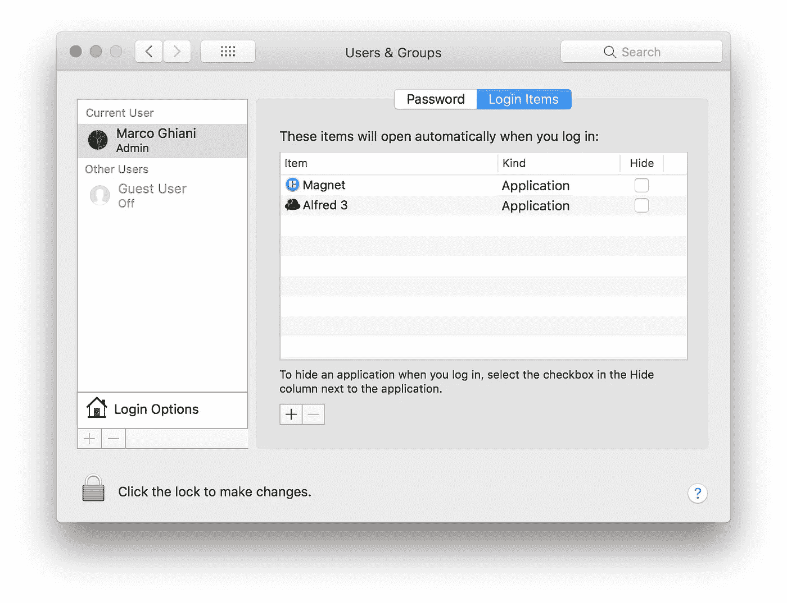
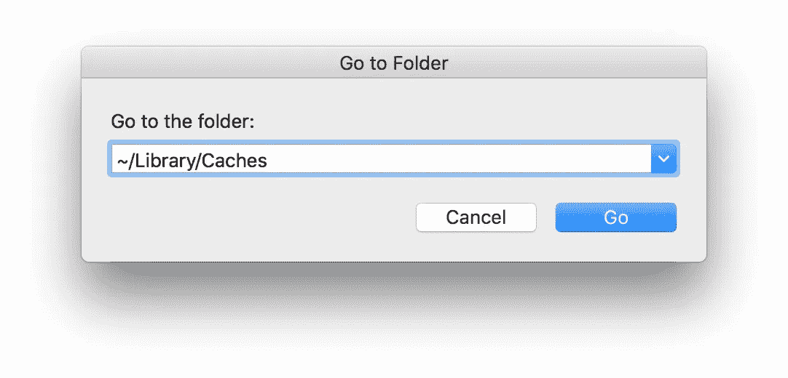
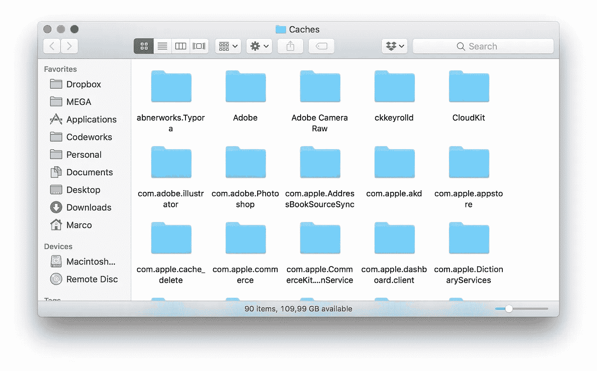

# 提高 MacBook 工作效率的 5 个技巧

> 原文：<https://levelup.gitconnected.com/5-tips-to-speed-up-your-macbook-productivity-9ef834d62201>

## 充分利用 MACBOOK 的最佳教程。

## 提高 MacBook 性能的提示集

经常维护 MacBook 可能会导致其耐用性大大延长。

差不多七年前，我买了我的第一台 MacBook，我现在还在用它写这篇文章。这是 12 年年中发布的第一款 MacBook Pro Retina，在做了一个夏天的货运装卸工并攒了必要的钱(当时我是一个没有工作的青少年)后，我终于买下了它！

这种感觉令人难以置信，那是我的第一台 MacBook，我真的很在乎我的东西。但是，如果没有任何维护，计算机很容易变得更慢、更旧，这也是事实。这就是为什么我总是寻找任何方法来提高我的 MacBook 性能，随着时间的推移，我学到了一些有趣的技巧，我想与你分享，让你的设备在这么多年后也能和我的一样快！🚀

# 1.禁用无用的启动进程

很多时候我们在安装应用的时候，会自动设置在你的 MacBook 启动的时候运行，即使没有必要，也是在后台运行。它们会消耗您的电池，缩短电池寿命，降低设备性能。

若要停用这些进程，您可以访问“系统偏好设置”中的“用户与群组”设置:

选择一个应用程序，并使用“-”按钮移除它。

# 2.重置 NVRAM 和 PRAM

当您开始添加许多设置，如默认扬声器音量、显示分辨率或更重要的信息(如内核紧急日志)时，这些设置可能会遇到一些故障。由于这些信息存储在 NVRAM(非易失性随机存取存储器)和 PRAM(参数 RAM)中，这可能是重置它们并恢复计算机正常行为的好时机。根据 Apple 支持页面，您可以按照以下流程进行操作:

按下此组合键可重置 NVRAM & PRAM。

*   关闭您的 Mac 电脑。
*   **开机，立即同时按住这四个键:Option、Command、P、r**
*   **您可以在大约 20 秒后释放按键，在此期间，您的 Mac 可能会重新启动。**

# 3.重置 SMC

一段时间后，您的 MacBook 开始毫无理由地变慢，显然没有任何问题。但实际上，它可能会发生，因为系统管理中的一些进程使机器性能恶化或开始以奇怪的方式运行。这可能意味着系统管理控制器(SMC)工作不正常，重置它可以解决这些问题。这个过程有点不同，所以我们应该注意两种不同的情况:

## 电池是不可拆卸的:

*   关闭你的苹果电脑。
*   **开机后立即同时按住 Shift、Control、Option 这四个键，然后同时按下电源按钮**。
*   **按住这些键和电源按钮 10 秒钟，然后松开。如果你有一台装有触控 ID 的 MacBook Pro，触控 ID 按钮也是电源按钮。**
*   **按下电源按钮重启你的 MacBook。**

## 电池是可拆卸的:

*   **关闭你的苹果电脑。**
*   **从 MacBook 上取下电池。**
*   **按住电源按钮 5 秒钟。**
*   **重新安装电池。**
*   **按下电源按钮重启 MacBook。**

# 4.清理系统缓存

日复一日，你的 MacBook 会在系统缓存中存储一些信息，如系统日志或大文件缓存，以便更快地启动，但从长远来看，它们变得毫无用处，只会占用硬盘空间。要释放一些内存空间，您可以访问包含所有这些文件的文件夹并删除它们:

*   **在~/Library/Caches 文件夹中输入。** *按下****Command+Shift+G****组合可以快速访问文件夹，复制/粘贴路径。*

**Command + Shift + G** 进入转到文件夹输入。

*   删除你认为不必要的文件。

缓存文件，如 Adobe 设置、卸载的应用程序。

# 5.用“吹扫”清理 RAM

在不重启 MacBook 的情况下，在同一个会话中打开许多应用程序或网页会在 RAM 中累积缓存文件，从而降低性能。要释放这个空间并为系统提供更多的可用内存，您可以在终端中使用一个简单的命令。打开后，输入 **" *sudo purge"*** 从 RAM 中删除所有未使用的文件。它将询问您运行此命令的管理员密码，当提示要求插入时输入密码，如下例所示:

# 结论

清洁您的 MacBook 将有助于延长其电池寿命，并始终保持最佳性能。

当然，我们可以对这个最终结果进行大量的其他优化，但是要一步一步来。五个技巧已经是一个很好的起点😉

关于这个话题的评论、分享和讨论总是很受欢迎，我很乐意回答你的任何问题！

> **随时联系我**[**Linkedin**](https://www.linkedin.com/in/marcoantonioghiani/)

在这里你可以找到我的一些文章

 [## 我是如何通过改变习惯快速学习的。

### 9 个有效的习惯可以让你学得更快，提高工作效率。一年多前，在我 25 岁的时候，我离开了我的…

marcoghiani.com](https://marcoghiani.com/blog/how-i-became-a-fast-learner-changing-my-habits)  [## 重构一个反应组件

### 使用最佳实践编写高效可读的 React 组件的 5 条规则 React.js 已经成为最流行的观点…

marcoghiani.com](https://marcoghiani.com/blog/refactoring-a-react-component)  [## 高级 Koa.js 样板文件

### 使用 Create Koa 应用程序组织代码的高级建议。一年半以前，我开始…

marcoghiani.com](https://marcoghiani.com/blog/advanced-koa-js-boilerplate)