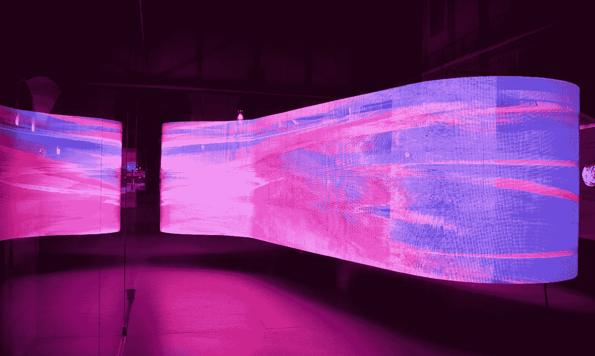
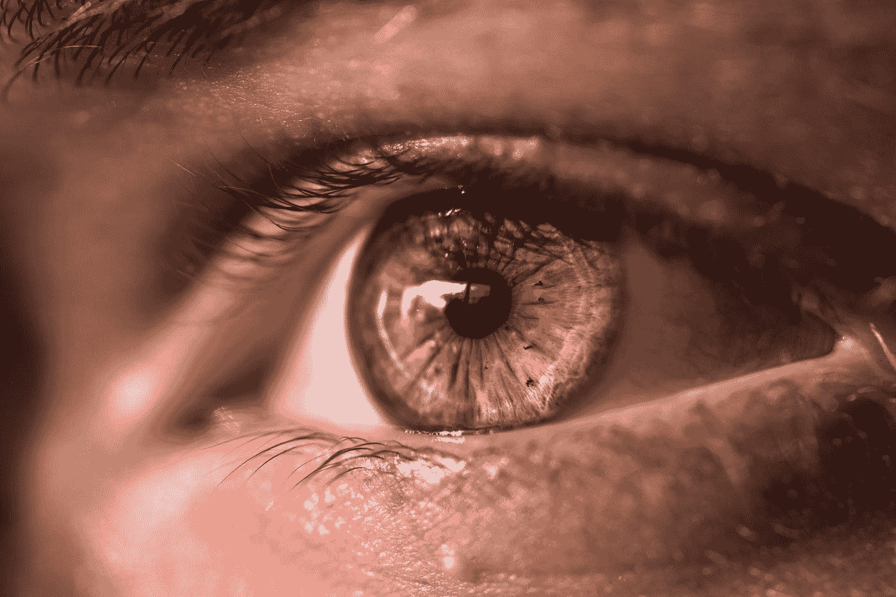

# 整天坐在电脑前保持健康的 5 个小贴士

> 原文：<https://levelup.gitconnected.com/5-tips-to-stay-healthy-while-being-on-the-computer-all-day-4de4254ef369>

## 在电脑上工作或学习时保持健康。

阿诺·塞纳尔在 [Unsplash](https://unsplash.com?utm_source=medium&utm_medium=referral) 拍摄的照片

虽然熟练使用计算机技术带来了许多好机会，如职业生涯、就业前景、晋升，甚至开创自己的事业，但许多健康风险也伴随着每天数小时盯着显示器的久坐不动的生活方式而来。在这篇文章中，我将分享五个帮助我保持健康和预防头痛、眼干、腕管综合征和低血压的技巧。作为一名软件开发人员，我每天都遵循这些提示，以确保我在工作之外也能正常工作。

照片由[乔尔·士迪佛立](https://unsplash.com/@nzsjoel?utm_source=medium&utm_medium=referral)在 [Unsplash](https://unsplash.com?utm_source=medium&utm_medium=referral) 上拍摄

## 1.让你的眼睛休息一下

根据 classicalvisioncare.com 的说法，整天盯着屏幕最明显的缺点之一是，你的眼睛最终会减少眨眼，导致眼睛干涩。此外，整天盯着像素会导致你的眼睛疲劳，这会导致“头痛、视力模糊、眼睛干涩、脖子和肩膀疼痛”我经常经历这些症状，我通过遵循 20–20–20 规则来避免它们，该规则规定，每盯着屏幕 20 分钟，你应该在连续眨眼的同时看着至少 20 英尺远的物体 20 秒。这有助于缓解眼睛疲劳，并提醒我和我的眼睛更频繁地眨眼，因为我们在观看屏幕时往往眨眼更少，如本 ebMD 中所述。除了 20-20-20 法则，你还应该在每两个小时的屏幕时间后休息 15 分钟，并在眼睛变干时使用人工泪液。我总是把眼药水放在桌子上，以备不时之需，在漫长的工作日里，它真的能让我的眼睛感觉更好。

奥占·阿克多安在 [Unsplash](https://unsplash.com?utm_source=medium&utm_medium=referral) 上的照片

## 2.确保你不要离屏幕太近

如果你出生在数字时代，你可能比任何人都先从你的父母那里听到这个建议。然而，这是一个真实的好建议。长时间坐在离电脑屏幕太近的地方[“会导致眼睛疲劳:烧灼感、干涩感和肌肉疼痛——所有这些不愉快的、潜在的丧失能力的症状都会持续下去。”](https://www.scientificamerican.com/article/is-sitting-too-close-to-screen-making-you-blind/#:~:text=Eyestrain%2C%20says%20Mark%20Bullimore%2C%20a,incapacitating%20symptoms%20while%20they%20last.)观看任何屏幕时，始终保持至少 25 英寸或两臂长的距离，并将屏幕放置在眼睛水平线以下 10-15 度的位置，以避免颈部劳损。我做到这一点的方法是，确保我使用的任何椅子都可以延伸到高于我的任何桌子，并且椅子有颈部支撑，这样我就不会无精打采或不自然地歪着头。因此，购买一把符合人体工程学的椅子可能会很贵，但如果你的工作需要你盯着屏幕，那就非常值得。

照片由[阿莱士·麦卡锡](https://unsplash.com/@4lexmccarthy?utm_source=medium&utm_medium=referral)在 [Unsplash](https://unsplash.com?utm_source=medium&utm_medium=referral) 上拍摄

## 3.锻炼

您可能已经听过无数次了，并且希望在本文中也能读到它。然而，运动的好处不能被夸大，尤其是如果你过着久坐的生活方式。坐或躺太久会增加你患慢性健康问题的风险，如心脏病、糖尿病和一些癌症，以及导致心理健康的风险。此外，当你在工作的时候，保持活跃听起来似乎是不可能的；然而，这与事实相去甚远。这是来自 geelongmedicalgroup.com[的练习列表。你不必做所有的事情；你可以一次合并一个，或者只合并两三个。另外，任何锻炼都比不锻炼好，你的身体和未来的自己都会为此感谢你。此外，我想补充一点，你应该尝试在工作场所之外进行更高强度、血压升高的锻炼。最普遍的建议是去健身房，但是你也可以在家锻炼，而且不需要很长时间。你可以做 10-15 分钟剧烈的有氧运动，并从中受益。](https://www.geelongmedicalgroup.com.au/2018/09/7-exercises-you-can-do-while-sitting-down)[这里](https://www.youtube.com/watch?v=aV-vgqCQFbU)是我关注的一个家庭锻炼视频，每次都让我心跳加速。

[Sasun Bughdaryan](https://unsplash.com/es/@sasun1990?utm_source=medium&utm_medium=referral) 在 [Unsplash](https://unsplash.com?utm_source=medium&utm_medium=referral) 上拍照

## 4.定期去看你的验光师和 PCP

每年或按照建议去看验光师或眼科医生是确保你知道如何保持健康的最重要的步骤之一。这篇文章中的建议非常笼统，虽然它对大多数人都适用，但并不是对所有人都适用。鉴于每个人都是独一无二的，最好的建议是根据你的具体需求量身定制的建议。确保你每年或根据需要与你的医生预约一次，这样你就可以从认识你并经常看你的人那里得到最好和最新的建议。此外，如果您必须更换医生，至少您有医疗记录来描述您对下一个提供者的需求。

## 5.把你的健康放在第一位，不要等待别人来为你做

如果你的工作不能提供你保持健康所需要的东西，确保你为自己辩护并要求这篇文章中提到的东西。如果这份工作不允许你有健康的工作习惯，你就不应该留在那个职位上，因为他们不关心你的健康，这种态度渗透到公司的其他方面。照顾好自己，因为作为一个成年人，没有人应该或愿意提供你应得的照顾。

## 资源

> [10 分钟锻炼视频](https://www.youtube.com/watch?v=aV-vgqCQFbU)
> 
> [坐下时可以做的 7 项运动](https://www.geelongmedicalgroup.com.au/2018/09/7-exercises-you-can-do-while-sitting-down)
> 
> [久坐的危险](https://www.betterhealth.vic.gov.au/health/healthyliving/the-dangers-of-sitting)
> 
> [坐得离电脑太近的影响](https://www.scientificamerican.com/article/is-sitting-too-close-to-screen-making-you-blind/#:~:text=Eyestrain,%20says%20Mark%20Bullimore,%20a,incapacitating%20symptoms%20while%20they%20last.)
> 
> [防止眼睛疲劳](https://www.webmd.com/eye-health/prevent-digital-eyestrain#:~:text=But%20researchers%20have%20found%20that,be%20hard%20on%20your%20eyes.)
> 
> [电脑眼睛疲劳](https://www.classicvisioncare.com/services/computer-eye-strain/)