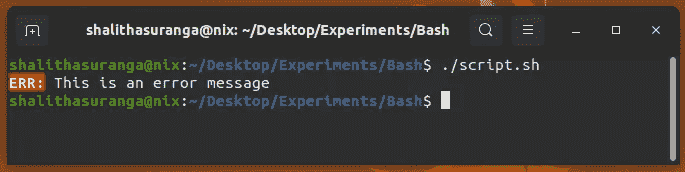

# 编写更好的 Bash 脚本的 5 个技巧

> 原文：<https://levelup.gitconnected.com/5-tips-to-write-better-bash-scripts-c5e1016ddbe2>

## 使用这些技巧来编写可管理的、干净的、自我解释的 shell 脚本。


由 [Sean Lim](https://unsplash.com/@seanlimm?utm_source=unsplash&utm_medium=referral&utm_content=creditCopyText) 在 [Unsplash](https://unsplash.com/s/photos/programming?utm_source=unsplash&utm_medium=referral&utm_content=creditCopyText) 上拍摄，由 Canva 编辑

程序员使用 Bash 编写 shell 脚本来自动化手动任务。Bash 是一种命令语言——它允许您通过输入二进制名称和参数，用更少的代码立即生成进程。它还提供了一些通用语言特性，比如结构化编程控制语句、内置的算术/比较特性以及基本的数据结构。

我们经常需要通过添加新的特性或者改变现有的逻辑来更新自动化脚本。编写可管理的、干净的 shell 脚本无疑是在 shell 脚本更新过程中节省时间的一个好方法。此外，包含编写良好的自动化脚本可以提高代码库的质量和整个自动化工作流程的质量。

在这个故事中，我将解释几个提高 Bash 脚本质量的技巧。通过使用这些技巧编写更好的 shell 脚本来提高您的编程效率！

# 将 Bash 脚本分解成多个函数

这个设计事实无疑是开发人员中众所周知的通用干净代码实践。 [SoC](https://en.wikipedia.org/wiki/Separation_of_concerns) (关注点分离)原则激励我们根据编程范例将代码段分解成过程或类。一些开发人员没有在使用 shell 脚本的 SoC 上投入时间，因为他们认为自动化脚本不需要太多的可管理性。但是，项目中的新人浏览这些脚本，您也需要用新特性扩展 shell 脚本，因此编写干净的自动化脚本对您自己和他人都有帮助。

在 Bash 中，您可以创建函数并为错误代码使用整数返回值，就像我们在 C:

```
#!/bin/bash

function process() {
    # ---
    # ---
    return $(( $RANDOM % 255 ))
}

process
echo "Exit code: $?"
```

上面的代码片段定义了我们可以在其他地方重用的`process`函数。Bash 函数是面向命令的——返回不在 0 到 255 整数之间的任意值是无效的。因此，我们可以生成一个子 shell 来传输字符串:

```
#!/bin/bash

function get_name() {
    echo "John"
}

name=$(get_name)
echo "Name: $name"
```

即使你没有从函数中返回任何东西，你仍然可以使用函数来保持你的脚本整洁。此外，如果您的 Bash 脚本在分解成几个过程后仍然很复杂，您可以考虑将它分割成单独的文件，并用`source`命令将它们合并。

# 使用一个详细记录的风格指南(或者制作一个)

使用特定的编码风格可以在许多方面帮助您提高生产率。样式指南提高了代码的可读性，帮助我们生成清晰的提交差异，减少合并冲突，并提高整体代码质量。Google Shell 风格指南为在 Bash 中开发更好的 Shell 脚本提供了一个很好的标准。如果你喜欢自己的编码风格，你不需要严格遵循特定的风格指南。然后，你可以从风格指南和你喜欢的编码风格中借鉴好的实践，制作你自己的指南！

如果你找到一个比谷歌指南更简单的，你可以查看这个风格指南。这些 Bash 风格指南通常建议您通过记住以下事实来编写 shell 脚本:

*   对函数名、变量、常量和源文件名使用一致、易读的命名约定。
*   选择内置而不是产生一个单独的进程。

例如，考虑在`sed`、`echo`、`awk`、`expr`等之上使用 [Bash 参数扩展](https://www.gnu.org/software/bash/manual/html_node/Shell-Parameter-Expansion.html)特性。：

```
#!/bin/bash

X=10
Y=15

# This invokes a process and looks complex
ans=$(expr $X + $Y)
echo $ans

# This uses an inbuilt feature and looks simple
ans=$(($X + $Y))
echo $ans
```

*   为需要解释或澄清的地方编写格式良好的代码注释。

下面的故事解释了一般的干净代码实践:

[](https://betterprogramming.pub/5-clean-code-practices-for-every-software-project-479443b31c3c) [## 每个软件项目的 5 个干净代码实践

### 提高前端、后端、CLI、桌面或移动应用程序代码库质量的想法

better 编程. pub](https://betterprogramming.pub/5-clean-code-practices-for-every-software-project-479443b31c3c) 

# 使用正确的输出流

自动化脚本通常将信息、错误和警告消息写入终端。在某些场景中，它们通过输出流为其他流程提供内容。当我们在没有正确重定向的情况下使用`echo`命令打印字符串时，Bash 通常会将数据写入标准输出流(`STDOUT`)。因此，如果我们使用`echo`来打印一个错误消息，它会进入标准输出流——而不是标准错误流(`STDERR`)。然后，如果另一个进程使用您的命令的输出作为输入，由于`STDOUT`中的错误消息(调试细节),它不会像预期的那样工作。

因此，当我们从 Bash 脚本中打印数据时，最好使用正确的输出流。请看下面的例子:

```
#!/bin/bash

echo "INFO: This message goes to STDOUT"
echo "ERR: This message goes to STDERR" >&2
```

在多个带有`echo`和消息前缀的地方使用`>&2`打破了[干](https://en.wikipedia.org/wiki/Don%27t_repeat_yourself)(不要重复自己)的原则。因此，我们可以创建如下的可重用函数:

```
#!/bin/bash

function info() {
    echo "INFO: $1"
}

function error() {
    echo "ERR: $1" >&2
}

function halt() {
    error "$1"
    exit 1
}

info "This message goes to STDOUT"
error "This message goes to STDERR"
halt "This message goes to STDERR, and script will halt"
info "This won't be executed"
```

# 争取更好的表现

Shell 脚本通常不像其他程序那样需要很高的性能。原因是它们通常作为自动化工作流中的后台作业来执行。例如，如果您编写一个 Bash 脚本来在 GitHub Actions 上生成一个软件版本，它的完成时间不会影响您的生产率。例如，如果你的发布包在 7 分钟内产生，你不会担心——而不是 5 分钟。

但是，我们经常在本地计算设备和低端服务器计算机(即预算容器)上运行 shell 脚本。然后，您需要考虑长时间运行的 shell 脚本的性能。此外，在任何地方应用性能实践是一个经验丰富的工程师的做法，甚至在 Bash 脚本中也是如此。

首先，尝试使用 Bash 内置，而不是调用单独的进程。现在，Bash 解释器版本带有许多[通用](/5-bash-syntax-for-going-beyond-traditional-shell-scripting-6904d3e71af6)语言特性。请看下面的例子:

```
#!/bin/bash

msg="I like scripting."
new_msg=$(sed s/scripting/Bash/g <<< $msg)
echo $new_msg

msg="I like scripting."
new_msg=${msg/scripting/Bash}
echo $new_msg
```

第二种方法使用内置特性来替换字符串，而不会产生另一个进程。

接下来，通过只使用必需的语句和子进程(即子 shell)来努力减少代码量。Bash 是一种解释型语言，所以脚本执行时间会随着您的 [LOC](https://en.wikipedia.org/wiki/Source_lines_of_code) (代码行数)而增加。

下面的故事解释了在编写高性能代码之前需要了解的事实:

[](/5-things-to-know-before-you-write-optimized-code-3ca424110db1) [## 写优化代码前要知道的 5 件事

### 这些事实有助于你用优化的代码给硬件和程序员留下深刻的印象

levelup.gitconnected.com](/5-things-to-know-before-you-write-optimized-code-3ca424110db1) 

# 超越传统的 Bash 脚本标准

早些时候，我们有复杂的 web 应用程序，有数百个表单元素和传统的 UI 组件。如今，现代的网络应用程序都有简单的现代用户界面，而且用户输入更少就能做更多的事情。类似地，老式的 Bash 脚本通常很复杂，会产生冗长的输出，不具有交互性，并且不会与操作系统级 GUI 层相连接。但是，您可以超越这些传统的 shell 脚本概念，创建用户友好的脚本。

通过使用更少但有效的输出、产生彩色输出、实现交互式动作以及与系统 GUI 层集成，可以使 shell 脚本现代化。例如，您可以显示彩色的错误信息，如下所示:

```
#!/bin/bash

RED_COL="\033[41;1m"
RESET_COL="\033[0m"

function error() {
    echo -e "${RED_COL}ERR:${RESET_COL} $1" >&2
}

error "This is an error message"
```

上述脚本在终端上呈现以下输出:



用 Bash 显示彩色输出。作者截图

如果您不喜欢这些颜色代码，您可以使用`tput`命令获得相同的彩色输出。

您也可以使用现代 shell 脚本来提高用户的工作效率。假设您用一个 shell 脚本启动了一个 web 服务器。如果您自动打开默认浏览器，而不是要求用户浏览 web 服务器 URL，会怎么样:

```
#!/bin/bash

# TODO: Conditionally use 'open' for Darwin with $OSTYPE
function open_browser() {
    xdg-open $1
}

open_browser "http://localhost:3000"
```

从下面的故事中学习如何通过添加 GUI 组件来更新 Bash 脚本:

[](https://medium.com/swlh/how-to-modernize-your-bash-scripts-by-adding-gui-cba613a34cb7) [## 如何通过添加 GUI 使 Bash 脚本现代化

### 厌倦了在控制台上显示原始文本？尝试 Zenity &通知-发送

medium.com](https://medium.com/swlh/how-to-modernize-your-bash-scripts-by-adding-gui-cba613a34cb7) 

感谢阅读。

# 分级编码

感谢您成为我们社区的一员！在你离开之前:

*   👏为故事鼓掌，跟着作者走👉
*   📰查看[升级编码出版物](https://levelup.gitconnected.com/?utm_source=pub&utm_medium=post)中的更多内容
*   🔔关注我们:[Twitter](https://twitter.com/gitconnected)|[LinkedIn](https://www.linkedin.com/company/gitconnected)|[时事通讯](https://newsletter.levelup.dev)

🚀👉 [**加入升级人才集体，找到一份惊艳的工作**](https://jobs.levelup.dev/talent/welcome?referral=true)