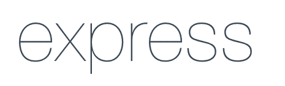

# 2021 年 5 大 NodeJS Web 框架

> 原文：<https://levelup.gitconnected.com/5-top-node-js-web-frameworks-in-2021-e2f472194ba0>

## Github 上最受关注的节点 JS 框架


作者:FAM

# 排名第一的快递公司(不仅仅是 53K⭐)

> node JS 的快速、非个性化、极简的 web 框架。



Express 的目标是为 HTTP 服务器提供小型、健壮的工具。这使得它成为单页面应用程序、网站、混合应用程序或公共 HTTP APIs 的优秀解决方案。该框架不强迫你使用特定的 ORM 或模板引擎。你可以自由选择你想要的。

## 特点:

*   鲁棒路由
*   专注于高性能
*   超高测试覆盖率
*   HTTP 助手(重定向、缓存等。)
*   支持 14+模板引擎的视图系统
*   用于快速生成应用程序的可执行文件

## 装置

这是一个 [Node.js](https://nodejs.org/en/) 模块，可以通过 [npm 注册表](https://www.npmjs.com/)获得。所以安装 Express 之前需要节点 JS。

***/！\*** *-如果这是一个全新的项目，确保先用* `[*npm init*](https://docs.npmjs.com/creating-a-package-json-file)` [*命令*](https://docs.npmjs.com/creating-a-package-json-file) *创建一个* `*package.json*` *。*

使用`[npm install](https://docs.npmjs.com/getting-started/installing-npm-packages-locally)` [命令](https://docs.npmjs.com/getting-started/installing-npm-packages-locally)完成安装:

```
npm install express
```

## 使用

```
const express = require('express')
const app = express()

app.get('/', function (req, res) {
  res.send('Hello World')
})

app.listen(3000)
```

# #2-流星/流星(超过 42K⭐)

> 流星，一个 JavaScript 应用平台。这是一个构建现代 web 应用程序的超简单环境。


## 特点:

*   **附带一个开发生态系统**(提供应用开发生命周期的所有工具，从设置和配置到 API 和部署)
*   这是一个全栈解决方案(集成了完整的客户端和服务器端解决方案)
*   **数据库集成** (MongoDB 数据库以及一个 Minimongo)
*   **前端反应**(带有在前端和后端之间通信的同构 API，允许轻松处理客户端-服务器管理和服务器会话管理)
*   **实时重新加载**(实时重新加载允许仅刷新网页上所需的 DOM 元素，而无需重新加载整个页面)

## 装置

```
npm install -g meteor
```

## 使用

使用以下内容创建和运行项目:

```
meteor create try-meteor
cd try-meteor
meteor
```

# #3- [Nestjs/nest](https://github.com/nestjs/nest) (超过 37K⭐)

> 一个渐进式 Node.js 框架，用于在 TypeScript 和 JavaScript (ES6、ES7、ES8)之上构建高效、可伸缩的企业级服务器端应用程序


Nest 是一个用于构建高效、可伸缩的服务器端应用程序的框架。它是用[类型脚本](http://www.typescriptlang.org/)构建的，结合了 OOP(面向对象编程)、FP(函数式编程)和 FRP(函数式反应编程)的元素。该建筑深受 ***棱角的启发。***

在幕后，Nest 使用了[***Express***](https://expressjs.com/)，并提供了与大量其他库的兼容性。

## 特征

*   Nest JS 更为 Angular 开发者所熟悉，因为它从 Angular 框架中获得了巨大的灵感。
*   就像 Angular 一样，Nest js 应用程序使用模块，并且易于测试。
*   Nest JS 提供了一个架构，帮助大型团队更加一致地构建复杂的后端。
*   Nest JS 类似于 Spring 和. NET，所以对于懂这些 techs 的开发者来说，学习成本低！
*   Nest JS 支持 REST、GraphQL、Websockets 等。
*   嵌套 JS 是用 TypeScript 编写的，提高了代码的可重用性。

## 装置

```
npm i -g @nestjs/cli
```

## 使用

```
nest new project-name
npm run start
```

## 一个“hello world”的例子

# #4- S [trapi/strapi](https://github.com/strapi/strapi) (比 37K⭐多)

> 开源 Node.js Headless CMS，轻松构建可定制的 API


Strapi 是一个免费的开源无头 CMS，可以将你的内容传送到你需要的任何地方。它是最先进的开源无头 CMS，可以快速构建强大的 API。

## 特征

*   现代管理面板:优雅，完全可定制，完全可扩展的管理面板。
*   **默认安全**:可重用策略、CORS、CSP、P3P、Xframe、XSS 等等。
*   **面向插件的**:在几秒钟内安装认证系统、内容管理、定制插件等。
*   超快的速度:Strapi 构建在 Node.js 之上，提供了惊人的性能。
*   **前端不可知**:使用任何前端框架(React、Vue、Angular 等。)，移动应用，甚至物联网。
*   强大的 CLI:动态的脚手架项目和 API。
*   **SQL & NoSQL 数据库**:与 MongoDB、PostgreSQL、MySQL、MariaDB 和 SQLite 一起工作。

## 装置

用纱线或 npm 安装 Strapi:

```
npx create-strapi-app my-project --quickstart
```

上面的命令生成一个全新的项目，具有默认的特性(身份验证、权限、内容管理、内容类型构建器和文件上传)。

***/！\ -顺便说一下，quickstart 命令使用 SQLite 数据库安装 Strapi，用于开发中的原型制作。***

支持多种操作系统:

*   Ubuntu LTS/Debian 9.x
*   森特/RHEL 8
*   马科斯·莫哈维
*   Windows 10
*   Docker — [Docker-Repo](https://github.com/strapi/strapi-docker)

# #5- K [oajs/koa](https://github.com/koajs/koa) (比 31K⭐多)

> 使用 ES2017 异步函数的节点 JS 表达中间件


Koa JS

node JS 的富于表现力的 HTTP 中间件框架，使 web 应用程序和 API 编写起来更加愉快。

只有几乎所有 HTTP 服务器通用的方法才被直接集成到 Koa 的小代码库中。这包括内容协商、节点不一致的规范化、重定向和其他一些事情。

## 特征

*   Koa 基于 ES6，通过提供许多新的类和模块，使得复杂应用程序的开发更加简单。这有助于开发者创建可维护的应用程序。
*   Koa 帮助开发者构建更瘦的中间件。
*   Koa 使用一个上下文对象，它是请求和响应对象的封装。
*   Koa 有一个内置的捕获器，所以它更擅长错误处理。

## 装置

Koa 需要节点 v7.6.0 或更高版本来支持 ES2015 和异步功能。

```
$ npm install koa
```

## 使用

```
const Koa = require('koa');
const app = new Koa();

// response
app.use(ctx => {
  ctx.body = 'Hello Koa';
});

app.listen(3000);
```

# 最后的想法…

**您知道或已经使用过以下哪一项？**对我来说，我对 Express JS 更有经验。我发现它非常直观、简单，而且有据可查。

**你应该学习所有这些技术吗？**当然不是。你的决定应该基于你的需求或者你的客户的需求，而不是受欢迎程度。流行因素对于了解 web 开发人员的技术趋势和为什么某种技术受欢迎是很重要的。如果它提供的东西符合你的需求，那么你可以考虑学习它。

除了知名度和客户需求，你还应该考虑其他因素吗？嗯，我认为你应该这样做。对我来说，一个重要的因素是文档(一个文档良好的框架对于开发人员和他们的学习曲线来说很重要)。第二个重要因素是框架的开放性问题(很多问题并不令人鼓舞)。第三个因素是支持框架的人(社区和背后的公司)。一个由一个巨大的社区和一个非常著名的公司如谷歌或脸书支持的框架显然是一个优势！你还应该考虑成本。它到底是不是一个开源框架？这对你来说重要吗？


这些数据基于本文发表时的 Github 数据

**你呢？**你还有其他因素吗？在这些之上你喜欢一个特定的 node JS 框架，还是更喜欢另一个？请与我们分享^^

## 资源:

*   [Github](https://github.com/webdevium/node-framework-stars)
*   [快递](https://expressjs.com/)
*   [流星](https://www.meteor.com/)
*   [巢](https://nestjs.com/)
*   [斯特拉皮](https://strapi.io/)
*   [Koa](https://koajs.com/)

# 尽情享受吧！


@the_frontend_world

亲爱的读者，我希望这是明确和有用的。我希望你和你的家人无论在哪里都平安！坚持住。明天会更好！

**让我们联系一下** [**中**](https://medium.com/@famzil/)**[**Linkedin**](https://www.linkedin.com/in/fatima-amzil-9031ba95/)**[**脸书**](https://www.facebook.com/The-Front-End-World)**[**insta gram**](https://www.instagram.com/the_frontend_world/)**[**Youtube**](https://www.youtube.com/channel/UCaxr-f9r6P1u7Y7SKFHi12g)**或**********

****[www.fam-front.com](http://www.fam-front.com/)****