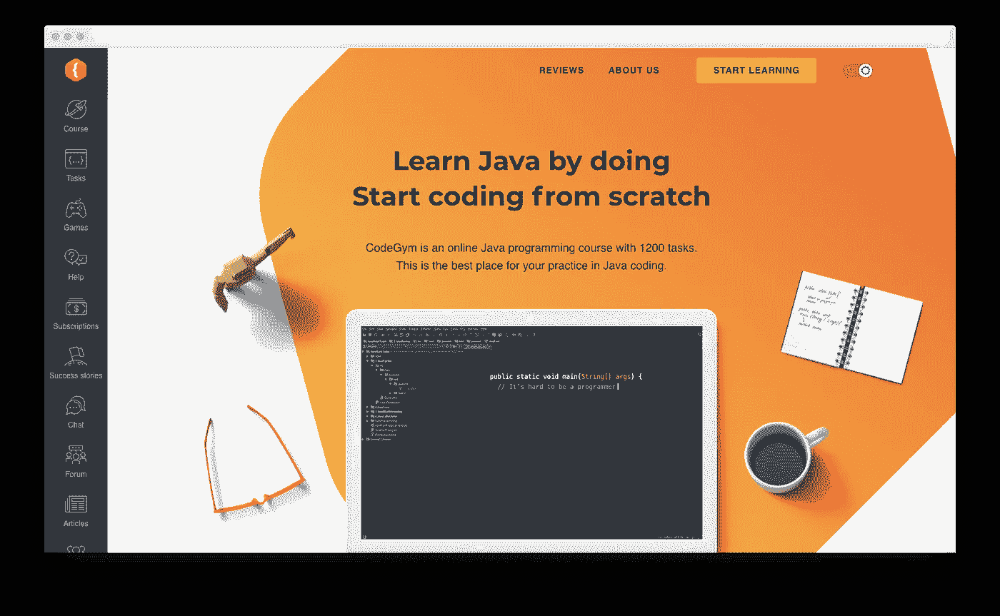

# 面向未来 Android 开发者的 5 门 Java 趋势课程

> 原文：<https://levelup.gitconnected.com/5-trending-java-courses-for-future-android-developers-c2a748970c13>

我不是来说服你成为 Android 开发者的。先说关键论点。

最近的[调查](https://www.glassdoor.com/Salaries/android-app-developer-salary-SRCH_KO0,21.htm#:~:text=The%20national%20average%20salary%20for,by%20Android%20App%20Developer%20employees.)显示，中层 Android 开发人员的平均年薪为 96，604 美元(税后和其他津贴)。要成为一名有经验的 Android 开发者，你需要用 Java 和 Kotlin 编程语言的知识来武装自己。他们绝对是目前 Android 开发中的顶尖高手。下面就让你轻松一下，复习一些对未来安卓开发者有益的课程。

# 如何选择合适的课程？

Java 在 Android 应用程序开发中发挥着巨大的作用，对于初学者来说是一个不错的选择。Kotlin 就像 Java 一样，运行在 JVM 上，现代的 Android 软件没有 Kotlin 几乎是不可能的。然而，如果一个新手不懂任何编程语言，Kotlin 对他们来说会很难。所以先学 Java，后来再去学 Kotlin 比较合理。这对有经验的 Java 和 Kotlin 开发人员来说是一个巨大的好处，因为他们不必从头开始学习任何新的东西，他们可以在了解一些 Android 知识后立即开始。

当你试图找到学习 Java 和 Android 的“正确”课程时，在你下定决心之前，请记住以下参数:

*   该课程应该结构良好，以便从基本变量和数据类型中获取每一点信息，从而通向高级编程。
*   它应该是实用的，而不是理论的。如果它有编码练习和它们的验证，这是最好的。有些课程旨在传授真正好的理论知识，但没有实际工作。
*   非常希望有专业的程序员来开发这个课程。

# [CodeGym](https://codegym.cc/)

CodeGym 是一个由专业 Java 开发人员设计的在线 Java 编程平台。它由 80%的实践任务和 20%的 Java 基本理论组成，以简短讲座的形式呈现，编织成一个有趣的情节。

CodeGym 提供了 1200 多个编码任务，您可以直接在内置 IDE 或专业 IDE IntelliJ IDEA 中解决(有一个专门的 CodeGym 插件用于此)。

课程分为 40 级，完成当前一级后才能进入下一级。当解决一个任务时，你把它发送给一个验证器。如果你的解决方案一切正常，你就可以得分，继续前进。如果出现问题，validator 会向您发送一些提示来帮助您完成任务。

让我们来看看 CodeGym 的一些优点和缺点，以便更好地了解它。

# 赞成的意见

*   这门课程结构合理。
*   从初级到高级的每一个概念都需要理解和练习。
*   包括对代码的验证。你还会得到一些帮助你完成任务的提示。
*   帮助部分。如果你被困在一个困难的任务中，你可以一键发送到“帮助”部分，并提出一个问题。其他 CodeGym 的学生或课程团队的人会帮助你。
*   这是一个游戏化的学习平台，你可以同时学习和娱乐。
*   一些新的水平从激励故事开始，激励有抱负的程序员的士气。

# 骗局

*   除了 CodeGym 的网页版在手机上对用户不太友好之外，没有什么值得一提的缺点。

# [Educative.io](https://www.educative.io/)

Educative.io 是一个相当新的在线学习平台。虽然列表中的其他平台都是基于视频或游戏化的，但这个平台完全是基于文本的。在 Educative.io 上注册后，你会看到许多问题陈述，如果你选择一个来解决，这个平台会教你一种最佳方式来分解整个问题陈述，然后一步一步地进行。

Educative.io 是一个自定进度的学习平台，提供几十个前端和后端学习教程，因此涵盖了大量的核心语言和框架。最棒的是，你不仅可以选择编程教程，还可以学习算法、数据库和服务器端框架的概念。

# 赞成的意见

*   Educative.io 是一个网络应用程序，可以自行配置整个编码环境，你需要做的就是停止滚动，开始编码。
*   你将学习三种解决编程问题的方法，从递归、自上而下的记忆和自下而上的填充技术开始。
*   这些课程是根据最佳的学习轨迹组织的，你总是知道下一步该怎么做。
*   由于这是一个基于文本的平台，许多人更喜欢 Educative.io，只是因为它能让你为即将到来的面试做好准备。

# 骗局

*   该平台是基于文本的，这对于面向视觉的用户来说很难操作。

# [Udemy](https://www.udemy.com/)

列出顶尖的 Android 相关学习门户，而跳过 Udemy，这显然是不公平的。

Udemy 的基本优势是它是一个综合市场，你可以从大量的课程中选择自己学习的课程。你所要做的就是注册 Udemy 并支付你想学的课程的费用。

你可以在那里找到大量的 Java、Kotlin 和 Android 课程。

以下是其中的一些。有一门课程叫[软件开发人员 Java 编程大师班](https://www.udemy.com/course/java-the-complete-java-developer-course/)，评分 4.6。这个已经被超过 150，000+的学生使用了。如果你想从初学者开始，[面向完全初学者的 Java 编程](https://www.udemy.com/course/java-programming-tutorial-for-beginners/)课程会教你一切从零开始。

让我们深入了解 Udemy 的明显优缺点，以便让您有更好的理解。

# 赞成的意见

*   除了结构化教程，还有一些专业化课程，教你从基础到高级水平。
*   它有免费的课程，但大多数都是基础课程。
*   Udemy 提供结业证书，你可以把它装饰在你的专业档案上，以获得更好的前景。

# 骗局

*   虽然这是一个有许多课程的市场，但有各种各样的课程已经过时。
*   课程作者没有底线，这就是为什么有些课程的大纲相对不规范的原因。

# [Coursera](https://www.coursera.org/)

Coursera 是另一个很棒的在线学习平台，提供了几门关于 Java 学习的课程。此外，他们还与世界各地的一些教育机构和技能发展组织建立了合作伙伴关系。

Coursera 上的一些课程是免费的，如果你最后需要一个结业证书，他们只收取最低的费用。此外，他们的专业课程也在更新，如果你申请经济资助计划，你可以享受免费会员待遇。这真是一个伟大的创举，为学生提供了广泛的选择。

杜克大学的教师开设了一门名为 [Java 编程和软件工程基础专业化](https://www.coursera.org/specializations/java-programming)的课程，它涵盖了从基础到高级 Java 的所有内容。完成本课程的人可以继续学习 Java 特殊化中的[面向对象编程](https://www.coursera.org/specializations/object-oriented-programming)，进一步了解 OOP 概念。

然而，有些课程包含过时的信息，有些领域，如技术和信息，需要修订和更新。

# 赞成的意见

*   互动学习和点对点社交的完美融合。
*   每一项作业或提交的作品都由你的同伴评分，然后由老师打分。
*   如果你买不起任何课程，经济资助计划真的很有帮助。

# 骗局

*   有一些过时的课程应该修改。

# [编码忍者](https://www.codingninjas.com/)

CodingNinjas 与超过 170 家招聘合作伙伴合作，是一个在线职业发展学习平台，不仅提供课程，还为您提供从面试体验模块中受益的选项。

Android 开发课程属于高级类别，它给你一个机会从完善你的 Java 编程概念开始。除了 Android 开发，你还可以找到很多关于计算机科学基础、算法和高级框架的课程。

# 赞成的意见

*   CodingNinja 还提供一些非常酷的全栈开发课程。
*   使用 Kotlin 教授 Android 开发。
*   演示课程的完成和可用性证书。

# 骗局

*   与其他训练营相比，这些课程很贵。

# 包扎

所以，这些是 Android 开发者的前 5 名 Java 课程。现在由你来选择最适合你的目的。比较价格，尝试免费试用，阅读以前学生的评论。

请记住，纯理论很难帮助你成为一名软件开发人员。一门好的学习课程包括实践部分，在这一部分中，学生尝试编写代码，然后提交给评审。在上面的列表中，你可以找到未来 Android 开发者的下降课程。