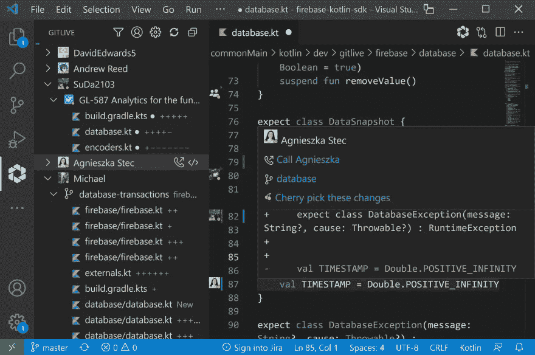
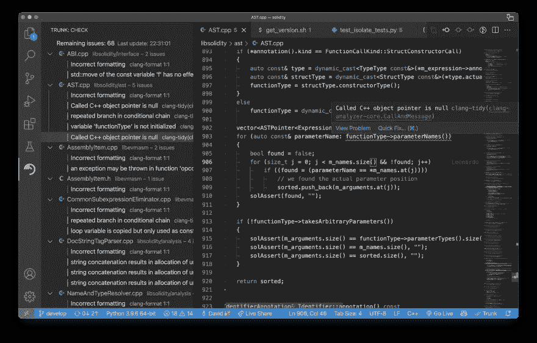
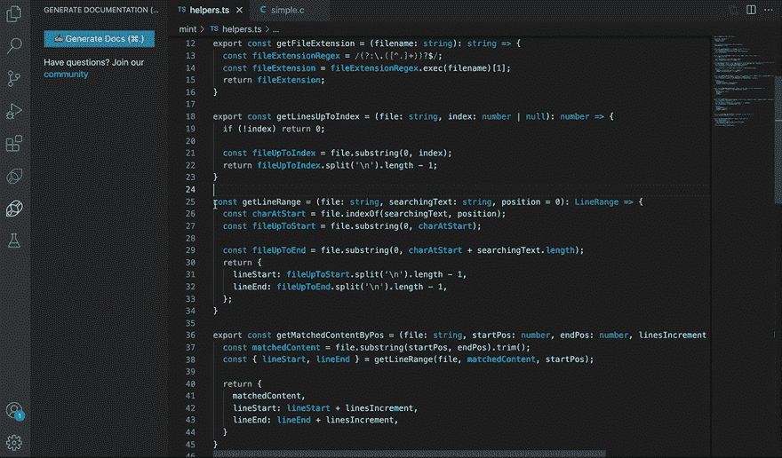
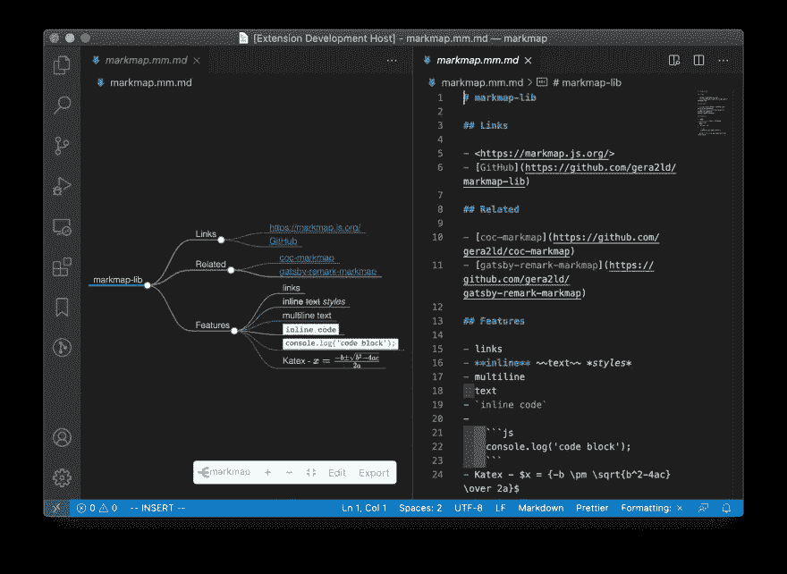
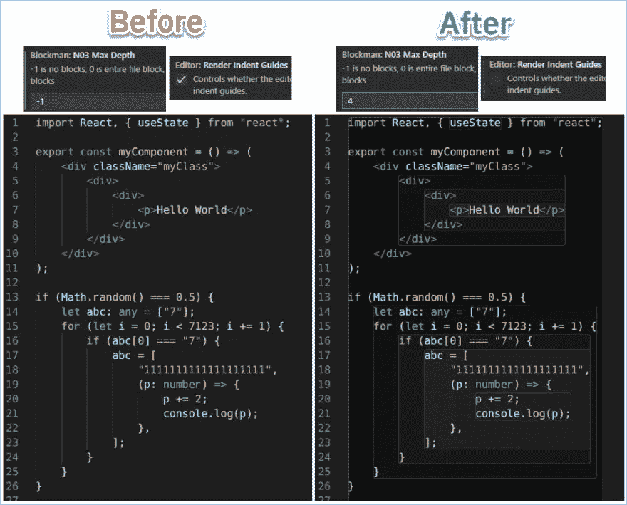

# 5 趋势与生产力代码扩展

> 原文：<https://levelup.gitconnected.com/5-trending-vs-code-extensions-for-productivity-92db5539c5c9>

作者图片

作为一名开发人员，我一直在寻找可以帮助我改进日常工作流程的解决方案，所以我努力跟上市场上的新奇事物(另一个原因是后来在它们变得很酷之前就吹嘘使用它们)。今天，我从 VS 代码市场中挑选了一些相对较新的、有趣的扩展，这些扩展最近越来越受欢迎。我的目标是找到不太为人所知但高质量的扩展，这些扩展可以真正改变您的开发人员工作流程。看看我的列表，谁知道呢，也许你会发现你下一个最喜欢的工具！

# [GitLive](https://marketplace.visualstudio.com/items?itemName=TeamHub.teamhub)

GitLive 是一个很棒的扩展，它增强了 IDE 的内置 Git 功能，具有实时特性，例如团队成员的在线状态和即时合并冲突检测。

**团队成员的在线状态。**IDE 插件增加了一个团队边栏/工具窗口，您可以在其中看到团队中谁在线，他们正在处理哪些问题和分支，以及他们对这些分支所做的更改。这对于远程团队来说非常好，当您想要查看或共享正在进行的工作，而不需要求助于屏幕共享或剪切并粘贴代码片段到 Slack 或团队中时，这真的很有帮助。

**即时合并冲突检测。**编辑器中的指示器显示您的更改和其他人的更改之间的差异。这些会在您和您的队友编辑时实时更新，并提供潜在合并冲突的早期警告。这是一个很好的方式，可以在不被打扰的情况下提前了解你同事的潜在重叠工作。

GitLive

# [主干](https://marketplace.visualstudio.com/items?itemName=Trunk.io)

许多开发人员都梦想有一个好的工具来可伸缩地检查、格式化和监控代码。如果你是其中之一，你应该看看 Trunk——快速易用的元代码检查器和格式化器，具有很酷的功能，如**缓存**、**预先存在的问题检测**、一个**守护进程**和一个**语言服务器**。它完全通过 config-as-code 来管理，因此您可以轻松地将您的 repo 绑定到特定版本的 linters、formatters 和 static analyzers。这将提高你的代码质量和一致性，你可以确信你的设置将与项目中其他人的相匹配。它非常稳定，只需几分钟即可安装完毕，并且可以在您的 IDE、CLI 或 CI 平台上运行。

树干

# [Mintlify 文档编写器](https://marketplace.visualstudio.com/items?itemName=mintlify.document)

Mintlify 对于我们这些认为写文档是最无聊的任务的人来说是一个很好的工具。使用 Mintlify，您只需突出显示代码，就可以看到奇迹发生了！

超级好用，**自动生成单据**节省的时间可以以小时计算！如果你担心隐私，Mintlify 团队会确保你的代码是完全加密的，不会被存储，也不会用于训练。

Mintlify 文档编写器

# [标记图](https://marketplace.visualstudio.com/items?itemName=gera2ld.markmap-vscode)

Markmap 是一个有趣的扩展，可以帮助你为你的 markdown 文件创建可视化效果(这个工具的名字是 markdown 和 mindmap 的组合)。它解析 markdown 内容，提取其内在的层次结构，并呈现一个交互式思维导图，也称为 markmap。

该工具最有用的功能包括**预览 markdown 文件作为 markmap** 的可能性，以及**在文本编辑器**中编辑 markdown 文件的可能性，markmap 将动态更新，也可以离线更新。如果您想测试它，您只需将您的 markdown 内容加载到[试用页面](https://markmap.js.org/repl)，并在右侧查看您的 markmap。

标记地图

# [哨兵](https://marketplace.visualstudio.com/items?itemName=leodevbro.blockman&ssr=false#overview)

在编码的时候，你经常需要关注特定的区域，可视化的帮助隔离代码块可能感觉像一个救生员。

Blockman 是一个 VS 代码扩展，用于**嵌套块高亮显示**，这使得导航代码变得非常容易。
支持一堆非缩进的语言像 JavaScript，JSX，TypeScript，TSX，C，C#，C++，Java，PHP，R，Go (Golang)，Dart，Rust，Swift，PowerShell，SQL，HTML，CSS，LESS 和 CSS。此外，它目前支持两种基于缩进的语言:Python 和 Yaml。

布洛克曼

感谢您的阅读，我希望趋势与代码扩展的列表是有用的，并且您发现了一些引起您注意的东西。请在评论中告诉我你对我的选择的看法，如果能得到你的反馈，那就太好了！

# 分级编码

感谢您成为我们社区的一员！升级正在改变技术招聘。 [**在最好的公司找到你的完美工作**](https://jobs.levelup.dev/talent/welcome?referral=true)**。**

** [## 升级—转变技术招聘

### 升级—转变技术招聘🔥使软件工程师能够找到完美的角色…

作业. levelup.dev](https://jobs.levelup.dev/talent/welcome?referral=true)**