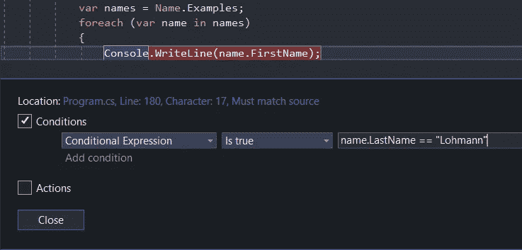

# 在 Visual Studio 中更好地调试的 5 个技巧

> 原文：<https://levelup.gitconnected.com/5-tricks-for-better-debugging-in-visual-studio-1f4b896577c1>


安德烈斯·西蒙在 [Unsplash](https://unsplash.com?utm_source=medium&utm_medium=referral) 上拍摄的照片

对于大多数开发人员来说，调试往往是一种痛苦的经历。在本文中，我将向您展示一些技巧，它们将使您的调试体验更加舒适。我将用 C#做例子，但是这些方法也应该适用于 Visual Studio 支持的其他语言。

# 重写 ToString 方法:

Visual Studio 调试器将实际使用此方法在 IDE 中显示对象的字符串表示形式。因此，让我们假设您已经实现了一个 Name 类，它具有名和姓的属性，看起来可能像这样。

现在您想在调试器中检查示例数组。您可能会看到类似这样的内容:


虽然您可以选择展开所有 name 对象并检查字段是否包含您期望的值，但这有点乏味。相反，让我们覆盖 Name 类上的 ToString 方法，这样代码看起来像这样:

当我们再次调试相同的代码路径时，我们的“局部变量”窗口提供了一个更好的概览，显示正在发生的事情:


现在，数组中的每个元素都提供了对象所包含内容的描述性字符串，您不需要展开它就可以看到内容。选择一个描述性的文本并不总是简单的，特别是当你有很多属性的复杂对象的时候。对于简单的对象，我一般推荐这种方法。这是因为它也将很好地复合。当检查更复杂的对象时，如果这些对象的属性已被 ToString 方法覆盖，则不必在对象结构中深入几层来查找要查找的数据。您越快了解数据的大致情况，就能越快地进行调试。

# 使用条件断点:

在你作为软件开发人员的职业生涯中，你可能设置了很多断点，但是其中有多少是有条件的呢？顾名思义，条件断点是一个只有在执行到达断点时某个条件成立时才会中断的断点。

这对于那些令人讨厌的情况非常有用，在这些情况下，您在一个循环中有一个断点，然后必须在每次迭代中检查数据。所以最后你自己做了一个循环，检查，F5，检查，F5，检查，F5…哎呀，你是不是不小心按了 F5，跳过了相关的点？请重试并重新开始。这是一个麻烦，条件断点将把你从这个麻烦中解救出来。

要设置条件断点，请放置常规断点，然后右键单击它，选择 conditions，输入您的条件，最后点击 close。注意你的断点现在有一个加号，表示它是有条件的。在本例中，只有当 Name 对象的 LastName 属性与“Lohmann”匹配时，循环中的断点才会中断执行。



使用条件断点还可以省去在循环中编写空条件的麻烦，这些条件只用于触发简单的断点。完成调试会话后，必须再次移除的代码。

# 使用手表

监视是一项功能，调试器将在执行过程中跟踪对象的某些属性的变化。如果您在一个代码库上工作，其中复杂的对象被传递给许多不同的方法，这些方法改变了这些对象的状态，那么这就特别有用。在调试会话期间，当执行在断点处停止时，可以放置一个监视器。手表至少有两种摆放方式。第一种是在调试会话期间右键单击变量或字段，然后选择 Add Watch。


在本例中，我为 Name 变量的 FirstName 属性添加了一个监视。但是，我可能没有确切的属性来直接监视代码中断点附近的访问，在断点处停止执行。这就是放置手表的第二种方式变得方便的地方。你可以在你的本地窗口放置一块手表。假设我们想要监视 LastName 属性，该属性在断点所在的代码中不存在。在这种情况下，我们在调试器中向前跳几步，直到 name 变量被初始化，并使用“局部变量”窗口检查它。这里我们找到了 LastName 属性，右键单击并选择 Add Watch。


这将在 LastName 属性上放置一个监视，然后您可以对其进行跟踪。一旦为给定的变量或属性创建了监视，它将出现在监视选项卡中，在上面的示例中也可以看到。每次该值改变时，该窗口都会用新值更新。这允许您简单地单步执行代码，并在值发生变化时进行调查。您也可以右键单击监视，让调试器在监视值发生变化时中断执行。

# 在执行中来回跳转

当您在调试器中运行代码时，控制流不是单行道。您可以随意在当前方法中来回移动指令指针。通过向左前后拖动黄色小箭头，可以跳过部分代码，或者重复已经执行过的部分。这对于重新运行你知道没有副作用的部分可能是有用的，你想更好地理解它。它对于检查代码的某一部分是否显示幂等属性也很有用。

# 修改本地数据

您的调试器还赋予您修改数据的能力，您可以右键单击可修改的局部变量，并为它们选择另一个值。这允许您试验您的代码在不同环境下的行为，或者快速跟踪执行到有趣的事情发生的状态。请注意，这里您并不局限于原语。要为上一示例中的 name 变量指定一个新值，您可以输入:

```
new Name("Claes Jacob", "Baunspieler")
```

name 变量将被赋给一个用上面使用的参数构造的新对象。您还可以引用执行上下文中的现有变量，包括数组中的元素，这些变量可以使用索引器来访问。

# 额外提示:编写一个单元测试

既然您已经深入研究了您的代码，并且确定了您要寻找的 bug 最初是在哪里以及如何出现的，那么深呼吸一下。在您着手修复它之前，您应该考虑为它编写一个测试用例。首先，通过为这个问题编写一个测试用例，并观察它的失败，您验证了您已经正确地识别了这个问题，以及导致它的输入。第二，如果有人后来不小心重新引入了这个 bug，它现在会显示为一个小的失败测试用例。这应该有望让开发人员清楚地识别出他或她破坏了什么，从而消除了长时间调试会话的需要。记住，毕竟最好的调试会话是那些你不必做的。

## 结论

Visual Studio 调试器是一个强大的工具，它提供了相当多的功能，可以帮助您跟踪代码中的问题。其中一些我看到人们经常使用，其他的不太常用。我希望这个简短的指南已经用足够的新知识武装了你，这样你将会有更短但更有成效的调试会话。