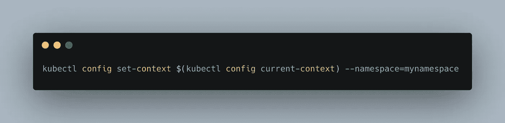
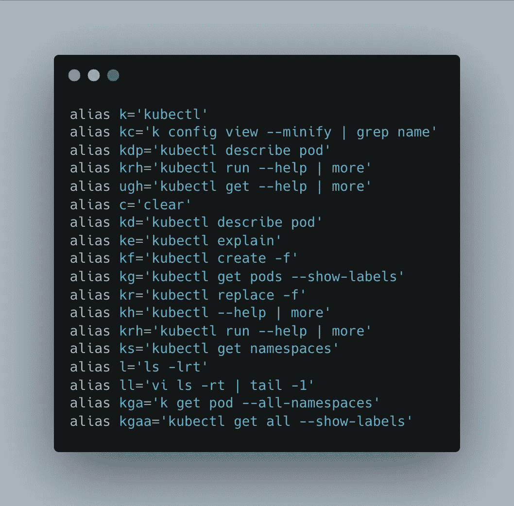
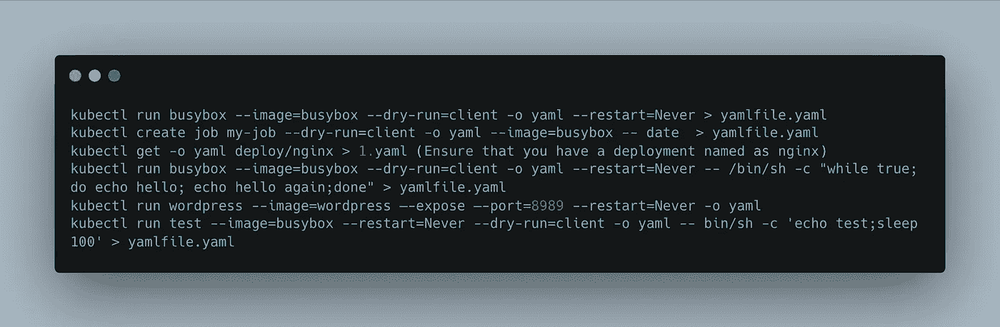
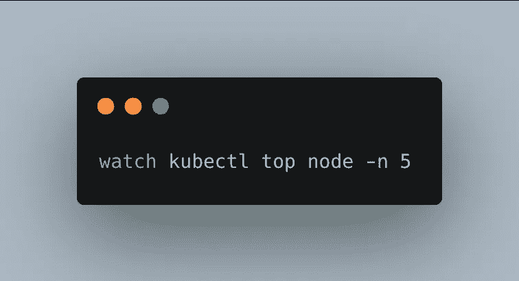

# 5 个技巧让你的 Kubernetes 技能更上一层楼

> 原文：<https://levelup.gitconnected.com/5-tricks-to-take-your-kubernetes-skills-to-the-next-level-a5541baeb18e>

## 无论你喜欢 Python、Java 还是其他语言，你都可能需要 Kubernetes

Kubernetes 使用起来很流畅，但这些技巧可能会让它更流畅。作者图片

  W 当你搜索 *Kubernetes* 时，前五篇几乎都是专门针对[完全初学者](https://betterprogramming.pub/getting-started-with-kubernetes-for-python-254d4c1d2041)的。有一定道理；大多数人宁愿缩短与 Kubernetes 的交互，而是专注于开发代码。

然而，可能会有那么一天，你和 Kubernetes 在一起的时间比你希望的要长。那不是你想要生活的地方。

不要误会我；Kubernetes 超级光滑，易于使用。至少在大多数时候，与它一起工作不会是一种折磨。

然而，作为软件工程师，有一样东西是我们最喜欢的:*自动化。*

Kubernetes 本身就是一种自动化。它使应用程序的部署、扩展和管理比手动操作简单十倍。

然而，许多程序员不知道自动化并不止于此。你可以让 Kubernetes 更快，更甜，更容易使用。

愿这些招数对你有所帮助！

# 1-设置默认名称空间

Kubernetes 中最重要的命令集之一是`kubectl`。它很简单，功能多样，而且非常强大。

但是`kubectl`有一个很大的不便。无论何时输入，您都需要添加选项`--namespace`来指定您想要在哪里构建您的 pod、服务或部署。

如果你忘记了这个选项，你可能会把你的对象放在错误的地方。

您可以通过使用以下命令来解决这个问题:

这条命令之后的所有`kubectl`命令都将位于名为`mynamespace`的名称空间中。

# 2-创建大量别名

正如您在上面的例子中可能已经注意到的，Kubernetes 命令可能非常冗长。所以，如果你不是那种每秒打 30 个字的人，你可能会考虑使用化名，让你可怜的手指休息一下。

以下是一些非常有用的别名(不是我自己的，是从 IBM 博客上偷来的):

只需将所有这些别名放入您的`.bash_rc`或`.bash_profile`文件——您需要的文件取决于您的操作系统——并打开一个新的终端会话即可开始。

当你还在习惯这些别名的时候，也许可以把它们贴在便利贴上。

# 3-从 kubectl 命令创建 YAML 文件

处理 YAML 的文件没什么意思。它们冗长、难以阅读，而且几乎不可能从头开始创建。

大多数人在网上搜索 YAML 文件模板，然后根据自己的需要进行调整。

但是有更有效的方法。您可以使用`kubectl`的强大功能来创建 YAML 文件！

下面是创建一个名为`yamlfile`的 YAML 文件需要做的事情:

请注意，最后一个命令中的选项`--bin`是定义特征，因为 YAML 文件是在该点创建的。

这仍然有很多代码，但是您可以将内容安全地保存在本地文件中，并在需要编写新的 YAML 文件时重用它。

# 4-使用自动完成

您可以在 Kubernetes 中自动完成事情！这确实需要五分钟左右的时间来设置，但是前期的花费是值得的。

首先您必须设置 bash 自动完成，然后您也可以获得`kubectl`自动完成。这在您的别名可能不够或者您懒得写下整个命令的情况下非常有用。

这些说明在一定程度上取决于您的操作系统。这里是你在 Linux 上需要做的事情。

# 5-观察正在发生的事情

有史以来最被低估的 bash 命令之一是`top`。它告诉你你的电脑一直在做什么。

许多开发人员和 DevOps 工程师在后台的一个单独的窗口中运行`top`，特别是当他们需要保持对他们系统上运行的许多作业的概述时。

如果你不想要独立的窗户，不要烦恼。如果你愿意，你可以每五秒钟显示一次`top`的结果，就像这样:

但是，请确保您已经安装了附件`heapster`；不然不行。您还需要为您的环境下载`watch`命令。

# 吹牛

这些建议中有许多需要你花几分钟时间作为前期投资。然而，如果你经常与 Kubernetes 互动，这将带来巨大的收益。

像创建别名这样的事情可以扩展到各种技术。例如，我有很多我喜欢使用的地址的别名。我的一个同事甚至化名`cd ..`成为`..`，因为她发现`cd`部分花了她太多的时间打字。天空是无限的！

其他技巧是 Kubernetes 特有的。

还有更多的[技巧和最佳实践](https://faun.pub/top-10-kubernetes-tips-and-tricks-d07d38700a70)。但我希望这五分钟足以节省你生命中许多宝贵的时间。

编码快乐！

*成为* [*中等会员*](https://arijoury.medium.com/membership) *对我的内容进行完全访问。*

# 分级编码

感谢您成为我们社区的一员！在你离开之前:

*   👏为故事鼓掌，跟着作者走👉
*   📰查看[升级编码出版物](https://levelup.gitconnected.com/?utm_source=pub&utm_medium=post)中的更多内容
*   🔔关注我们:[Twitter](https://twitter.com/gitconnected)|[LinkedIn](https://www.linkedin.com/company/gitconnected)|[时事通讯](https://newsletter.levelup.dev)

🚀👉 [**加入升级人才集体，找到一份惊艳的工作**](https://jobs.levelup.dev/talent/welcome?referral=true)