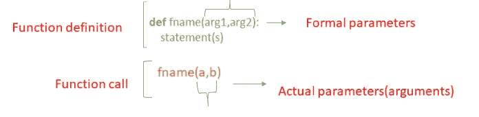
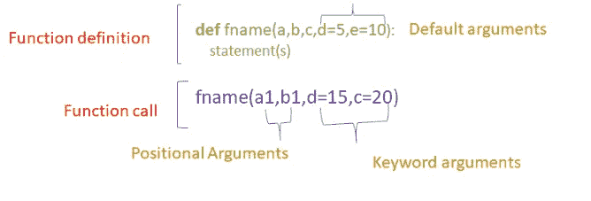
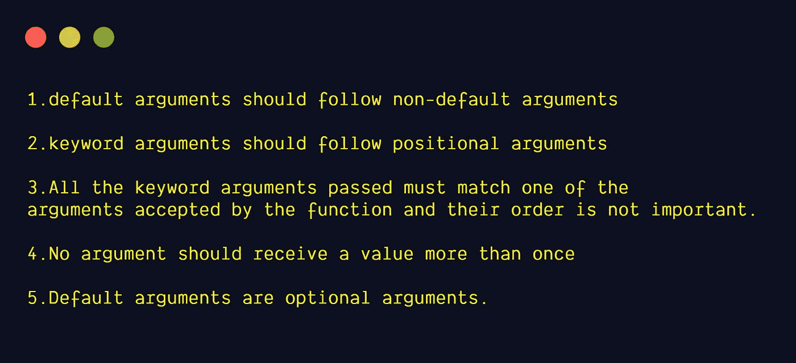
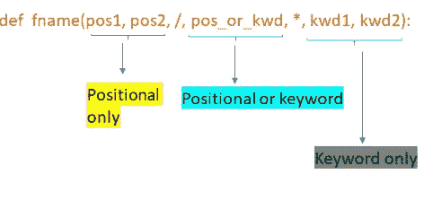

# Python 函数定义中的 5 种参数类型

> 原文：<https://levelup.gitconnected.com/5-types-of-arguments-in-python-function-definition-e0e2a2cafd29>

## 了解 python 函数定义中使用的不同类型的参数


照片由[莎伦·麦卡琴](https://www.pexels.com/@mccutcheon?utm_content=attributionCopyText&utm_medium=referral&utm_source=pexels)从 [Pexels](https://www.pexels.com/photo/person-s-hand-with-paints-1174932/?utm_content=attributionCopyText&utm_medium=referral&utm_source=pexels) 拍摄

## Python 函数定义中的 5 种参数类型:

1.  `default arguments`
2.  `keyword arguments`
3.  `positional arguments`
4.  `arbitrary positional arguments`
5.  `arbitrary keyword arguments`

## **Python 函数定义:**

> 函数定义以关键字`def`开始。它后面必须是函数名和带括号的形参列表。构成函数体的语句从下一行开始，必须缩进。— [python 文档](https://docs.python.org/3/tutorial/controlflow.html#defining-functions)



**函数定义中提到了形参**。**实际参数(实参)**在函数调用过程中传递。

我们可以定义一个参数数量可变的函数。

## **1。默认参数:**

*   默认参数是定义函数时提供的值。
*   赋值操作符`=`用于给参数赋值。
*   在函数调用过程中，默认参数变成可选的。
*   如果我们在函数调用期间为默认参数提供一个值，它会覆盖默认值。
*   该函数可以有任意数量的默认参数
*   默认参数应该跟在非默认参数后面。

**例如:**

在下面的例子中，默认值被赋予参数`b`和`c`

```
**def** add(a,b=5,c=10):
    **return** (a+b+c)
```

这个函数可以通过三种方式调用

1.  **只给出强制参数**

```
print(add(3))
*#Output:18*
```

**2。给出一个可选参数。**
3 分配给`a`，4 分配给`b`。

```
print(add(3,4))
*#Output:17*
```

**3。给出所有的论点**

```
print(add(2,3,4))
*#Output:9*
```

**注意:**默认值仅在定义作用域的函数定义点被评估一次。因此，当我们将可变对象(如 list 或 dictionary)作为默认值传递时，就会有所不同。

## 2.关键字参数:

也可以使用形式为`kwarg=value`的关键字参数调用函数。

在函数调用期间，通过参数传递的值不需要按照函数定义中参数的顺序。这可以通过关键字参数来实现。但是所有的关键字参数都应该与函数定义中的参数相匹配。

**举例:**

```
**def** add(a,b=5,c=10):
    **return** (a+b+c)
```

通过给出关键字参数调用函数`add`

1.  所有参数都作为关键字参数给出，因此不需要保持相同的顺序。

```
print (add(b=10,c=15,a=20))
*#Output:45*
```

2.在函数调用过程中，只给出强制参数作为关键字参数。跳过可选的默认参数。

```
print (add(a=10))
*#Output:25*
```

## **3。位置参数**

在函数调用期间，通过参数传递的值应该按照函数定义中参数的顺序。这被称为**位置自变量。**

关键字参数应该只跟在位置参数后面。

**示例:**

```
**def** add(a,b,c):
    **return** (a+b+c)
```

上述函数可以通过两种方式调用:

1.  在函数调用期间，所有参数都作为位置参数给出。通过实参传递的值按其位置传递给参数。`10`被分配到`a`，`20`被分配到`b`，`30`被分配到`c`。

```
print (add(10,20,30))
*#Output:60*
```

2.给定位置参数和关键字参数的混合，关键字参数应该总是跟在位置参数后面

```
print (add(10,c=30,b=20))
*#Output:60*
```

**默认 vs 位置 vs 关键字参数:**



**需要记住的要点:**



作者照片

**1。默认参数应该跟在非默认参数后面**

```
**def** add(a=5,b,c):
    **return** (a+b+c)

*#Output:SyntaxError: non-default argument follows default argument*
```

**2。关键字参数应该跟在位置参数之后**

```
**def** add(a,b,c):
    **return** (a+b+c)

print (add(a=10,3,4))
*#Output:SyntaxError: positional argument follows keyword argument*
```

**3。传递的所有关键字参数必须与函数接受的参数之一匹配，它们的顺序并不重要。**

```
**def** add(a,b,c):
    **return** (a+b+c)

print (add(a=10,b1=5,c=12))
*#Output:TypeError: add() got an unexpected keyword argument 'b1'*
```

**4。任何参数都不应接收一个值超过一次**

```
**def** add(a,b,c):
    **return** (a+b+c)

print (add(a=10,b=5,b=10,c=12))
*#Output:SyntaxError: keyword argument repeated*
```

**5。默认参数是可选参数**

**示例 1:** 仅给出强制参数

```
**def** add(a,b=5,c=10):
    **return** (a+b+c)

print (add(2))
*#Output:17*
```

**示例 2:** 给出所有参数(可选和强制参数)

```
**def** add(a,b=5,c=10):
    **return** (a+b+c)

print (add(2,3,4))
*#Output:9*
```

## 可变长度参数

可变长度参数也称为**任意参数**。如果我们事先不知道函数所需的参数数量，我们可以使用任意参数

**两种类型的任意论证**

1.  任意位置参数
2.  任意关键字参数

## **4。任意位置参数:**

对于任意位置的参数，在函数定义中的参数之前放置一个**星号(*)** ，它可以保存非关键字的变长参数。这些参数将被包装在一个**元组**中。在可变数量的参数之前，可能会出现零个或多个普通参数。

```
**def** add(*b):
    result=0
    **for** i **in** b:
         result=result+i
    **return** result

print (add(1,2,3,4,5))
*#Output:15*print (add(10,20))
*#Output:30*
```

## **5 .任意关键字参数:**

对于任意位置参数，一个**双星号(**)** 被放在一个函数的参数之前，该函数可以保存关键字可变长度参数。

**例如:**

```
**def** fn(**a):
    **for** i **in** a.items():
        print (i)
fn(numbers=5,colors=**"blue"**,fruits=**"apple"**)
**'''
Output:
('numbers', 5)
('colors', 'blue')
('fruits', 'apple')
'''**
```

## 特殊参数:

根据 [Python 文档](https://docs.python.org/3/tutorial/controlflow.html#special-parameters):

> 默认情况下，参数可以通过位置或通过关键字显式传递给 Python 函数。为了可读性和性能，限制参数的传递方式是有意义的，这样开发人员只需查看函数定义就可以确定是通过位置、位置或关键字还是关键字来传递项。

函数定义可能看起来像:



作者照片

其中`/`和`*`是可选的。如果使用，这些符号通过参数传递给函数的方式来指示参数的类型:仅位置、位置-或-关键字和仅关键字。

1.  位置或关键字参数
2.  仅位置参数
3.  仅关键字参数

## 1.位置或关键字参数

如果`/`和`*`没有出现在函数定义中，参数可以通过位置或关键字传递给函数

```
**def** add(a,b,c):
    **return** a+b+c

print (add(3,4,5))
*#Output:12* print (add(3,c=1,b=2))
*#Output:6*
```

**2。仅位置参数**

在函数定义中，仅位置参数放在`/`(正斜杠)之前。`/`用于在逻辑上将仅位置参数与其余参数分开。`/`之后的参数可以是*位置或关键字*或*关键字专用*。

```
**def** add(a,b,/,c,d):
    **return** a+b+c+d

print (add(3,4,5,6))
*#Output:12* print (add(3,4,c=1,d=2))
*#Output:6*
```

如果我们只为位置参数指定关键字参数，将会引发 **TypeError。**

```
**def** add(a,b,/,c,d):
    **return** a+b+c+d

print (add(3,b=4,c=1,d=2))
*#Output:TypeError: add() got some positional-only arguments passed as keyword arguments: 'b'*
```

## 3.仅关键字参数

要将参数标记为仅含*关键字的*，请在参数列表中第一个仅含*关键字的*参数之前放置一个`*`。

```
**def** add(a,b,*,c,d):
    **return** a+b+c+d

print (add(3,4,c=1,d=2))
*#Output:10*
```

如果我们为只有关键字的参数指定位置参数，将会引发 **TypeError。**

```
**def** add(a,b,*,c,d):
    **return** a+b+c+d

print (add(3,4,1,d=2))
*#Output:TypeError: add() takes 2 positional arguments but 3 positional arguments (and 1 keyword-only argument) were given*
```

**所有 3 个调用约定都在同一个函数**中使用

在下面给出的例子中，函数`add`具有所有三个参数

`a`、`b` —仅位置自变量
、`c`—位置或关键字自变量
、`d`—仅关键字自变量

```
**def** add(a,b,/,c,*,d):
    **return** a+b+c+d

print (add(3,4,1,d=2))
*#Output:10*
```

**需要记住的要点:**

1.  如果用户不想看到参数名，使用**仅定位**。当参数名没有实际意义时，这很有用。
2.  如果您想在调用函数时强制参数的顺序，请使用**仅位置**。
3.  当名称有意义并且函数定义通过明确的名称更容易理解时，使用**仅关键字**。
4.  当您想要防止用户依赖于被传递的参数的位置时，使用**仅关键字**。

## 我的其他博客链接

[关于 Python Return 语句你想知道的一切](https://medium.com/better-programming/everything-you-ever-wanted-to-know-about-python-return-statements-c14f6c749ff2)

## 资源(Python 文档):

[定义功能](https://docs.python.org/3/tutorial/controlflow.html#defining-functions)

[默认论点](https://docs.python.org/3/tutorial/controlflow.html#default-argument-values)

[关键字参数](https://docs.python.org/3/tutorial/controlflow.html#keyword-arguments)

[特殊参数](https://docs.python.org/3/tutorial/controlflow.html#special-parameters)

[任意参数列表](https://docs.python.org/3/tutorial/controlflow.html#arbitrary-argument-lists)

更多关于 Python 和数据科学的文章，敬请关注。如果你喜欢多看我的教程，就关注我的 [***中***](https://medium.com/@IndhumathyChelliah)[***LinkedIn***](https://www.linkedin.com/in/indhumathy-chelliah/)*[***推特***](https://twitter.com/IndhuChelliah) ***。****

*感谢阅读！*

# *分级编码*

*感谢您成为我们社区的一员！升级正在改变技术招聘。 [**在最好的公司**找到你最理想的工作](https://jobs.levelup.dev/talent) **。***

*[](https://jobs.levelup.dev/talent) [## 提升——改变招聘流程

### 🔥让软件工程师找到他们热爱的完美角色🧠寻找人才是最痛苦的部分…

作业. levelup.dev](https://jobs.levelup.dev/talent)*