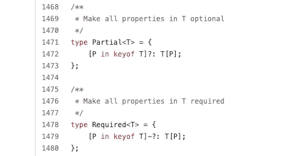
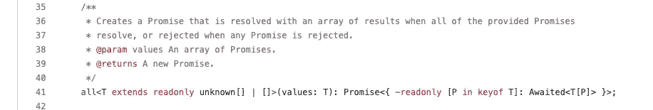
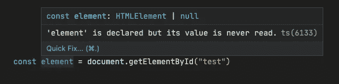
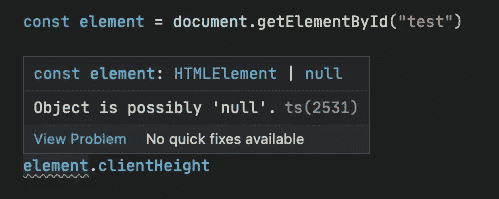
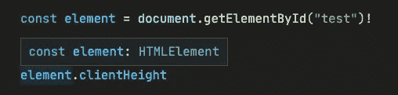
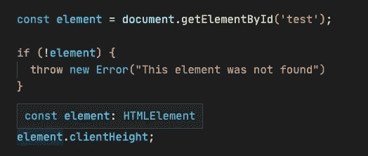
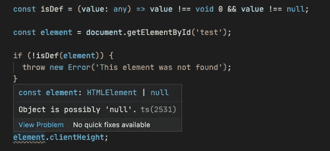
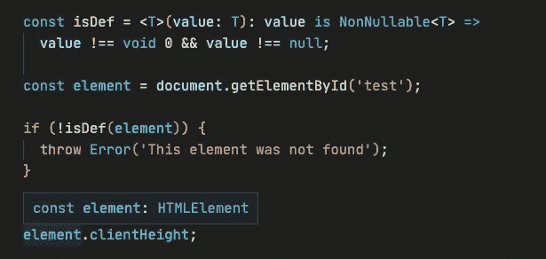
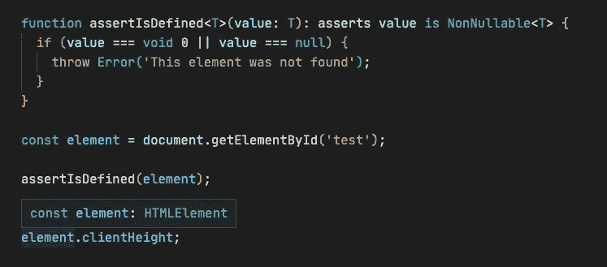

# 你可能忽略的 5 个打字稿编码技巧

> 原文：<https://levelup.gitconnected.com/5-typescript-coding-tips-you-might-ignore-ac16b1fe9699>

## 希望对你有帮助


照片由[鲁本·莱贾](https://unsplash.com/@rleija_?utm_source=medium&utm_medium=referral)在 [Unsplash](https://unsplash.com?utm_source=medium&utm_medium=referral) 上拍摄

TypeScript 让前端开发更加严谨，让我们的重构更加容易。它实际上非常灵活，本文将介绍你可能忽略的 5 个小技巧。

# 1.更好的评论

类型可以用`/** */`注释来标记，编辑器会有更好的提示:

看上面的例子，把鼠标移到使用的地方，就可以查看我们写的评论了。

注释可以让我们的代码更容易理解。但是并不是所有的代码都需要注释，查看这篇文章可以写出更好的注释:

[](/stop-commenting-bad-code-rewrite-it-d469079fa55b) [## 停止评论糟糕的代码。重写一遍。

### 如何写出更好的评论？

levelup.gitconnected.com](/stop-commenting-bad-code-rewrite-it-d469079fa55b) 

# 2.`this`参数

先看代码:

上面的例子打印的是`fake`而不是`test`，这不是我想要的结果。但是 TypeScript 没有给我任何提示。我们可以给这个方法添加`this`类型。像下面这样:

```
class Test {
  name = 'test'; printName(this: Test) {
    console.log(this.name);
  }
}const test = new Test();// Argument of type '{ name: string; }' is not assignable to parameter of type 'Test'.
test.printName.call({ name: 'fake' });
```

此时，TypeScript 会抱怨我们的行为。

但是注意箭头功能不能添加`this`类型。我们使用`call`、`apply`等方式。改变`this`也不起作用。箭头功能和传统功能的区别:

[](/7-differences-between-an-arrow-function-and-a-traditional-function-bbf8a6dc8ca4) [## 7 箭头功能和传统功能的区别

### 箭头函数能完全取代传统函数吗？

levelup.gitconnected.com](/7-differences-between-an-arrow-function-and-a-traditional-function-bbf8a6dc8ca4) 

# 3.通用参数默认值

泛型可以提高语言的灵活性，但在某些情况下，显式输入可以省略，这使我们的代码更干净。

# 4.`-`修改器

我们可以使用 TypeScript 中内置的`Partial<T>`使可索引类型的所有属性都是可选的。同样，它也提供了`Required<T>`来使所有的属性成为必需的。

他们的定义是[这里](https://github.com/microsoft/TypeScript/blob/main/lib/lib.es5.d.ts#L1471):



可以看到大家熟悉的`?`修饰语，那么`-?`其实就是一个组合修饰语，意思是将*去掉* `*?*`。

类似于`-readonly`:



图片来自 [GitHub](https://github.com/microsoft/TypeScript/blob/v4.7.4/lib/lib.es2015.promise.d.ts#L41)

内置高级类型介绍:

[](https://javascript.plainenglish.io/7-typescript-built-in-utility-types-you-must-know-d7a73a489d7) [## 您必须知道的 7 种 TypeScript 内置实用程序类型

### 提高对内置类型的理解。

javascript.plainenglish.io](https://javascript.plainenglish.io/7-typescript-built-in-utility-types-you-must-know-d7a73a489d7) 

# 5.断言函数

一个经典的例子是当我们使用`document.getElementById`或`document.querySelector`得到一个元素时，我们得到类型`HTMLElement | null`。



然后如果我们要对这个选择元素进行操作，比如绑定事件，获取信息等。，我们需要确保它不是`null`。

那么我们可以先使用非空断言操作符`!`



但是使用非空断言操作符是不安全的，在编译成 JavaScript 代码时会被移除。在这种情况下，如果元素不存在，就会发生错误。不建议使用非空断言操作符，除非您确实确保它存在。

除此之外，我们可以在使用它之前做一个空检查。



当我们编写一个公共函数来完成这个任务时:



虽然代码逻辑很好，但 TypeScript 编译器会抱怨。此时，我们可以使用`is`关键字进行类型断言，以消除空值。



除此之外，您还可以编写断言函数:



以这种方式使用函数声明(函数表达式需要显式类型注释)让 TypeScript 显式地知道`assertIsDefined`是一个断言函数。该函数断言该值为非空，否则将引发错误。关键字`asserts`帮助我们做到这一点。

不仅断言非空，我们还可以用它来断言其他需要的类型。

*感谢阅读。如果你喜欢这样的故事，想支持我，请考虑成为* [*中会员*](https://medium.com/@islizeqiang/membership) *。每月 5 美元，你可以无限制地访问媒体内容。如果你通过* [*我的链接*](https://medium.com/@islizeqiang/membership) *报名，我会得到一点佣金。*

你的支持对我来说很重要——谢谢。

感谢您成为我们社区的一员！在你离开之前:

*   👏为故事鼓掌，跟着作者走👉
*   📰查看[升级编码出版物](https://levelup.gitconnected.com/?utm_source=pub&utm_medium=post)中的更多内容
*   🔔关注我们:[Twitter](https://twitter.com/gitconnected)|[LinkedIn](https://www.linkedin.com/company/gitconnected)|[时事通讯](https://newsletter.levelup.dev)

🚀👉 [**加入升级达人集体，找到一份惊艳的工作**](https://jobs.levelup.dev/talent/welcome?referral=true)