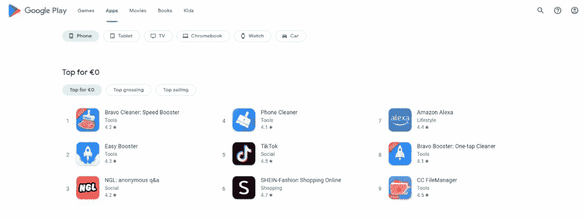

# 5 我在做网站开发人员的早期犯的 UI 和 UX 错误

> 原文：<https://levelup.gitconnected.com/5-ui-and-ux-mistakes-i-made-in-my-early-days-as-a-web-developer-a2b450147615>

## 如何避免它们，我希望我已经知道了什么

Photo by [傅甬 华](https://unsplash.com/@hhh13?utm_source=medium&utm_medium=referral) on [Unsplash](https://unsplash.com?utm_source=medium&utm_medium=referral)

我最近不得不花一些时间在我本科时于 2018 年开发的第一个项目上。这让我有机会看看代码库，看看我犯的所有错误。因此，我写了“ [5 个我在 Web 开发早期犯下的错误](https://betterprogramming.pub/5-mistakes-i-made-in-my-early-days-as-a-web-developer-26d9a6707c51)”，我希望这篇文章能帮助其他开发人员避免犯和我一样的错误。

类似地，我最近不得不重新设计那个应用程序的 UI 和 UX。在开始开发之前，我参观了几年前在大学开发的平台。毫不奇怪，考虑到该项目的整体质量较低，我立即发现了一些明显的 UI 和 UX 问题。

虽然我不是一个 UI/UX 设计师，但我已经和他们一起工作了很多年，并因此学会了如何构建更有用的应用程序。有一定的原则可以遵循，而我的项目几乎没有遵循任何一条。例如，通过简单地像用户一样思考，我可以避免大多数错误。

让我们更深入地研究一下我在 web 开发早期犯的 5 大 UI 和 UX 错误，以及如何避免它们。

# 1.没有为用户提供清晰的流程

网页不应该仅仅是一个信息库。相反，它应该有一个目的，引导用户实现他们的目标。在 web 应用程序、登录页面或博客页面中尤其如此。如果你在写一个没有明确目标的网页，你需要后退一步，想想你为什么要开发这个页面。

换句话说，在编写网页代码之前，先考虑一下最终用户。理解、设计和定义你希望用户如何与你的页面交互。这对于你的网络应用或网站的成功是至关重要的。忽视这一点通常会导致糟糕的 UX，糟糕的 UX 会导致用户放弃你的平台或坏名声。

我的第一个 web 应用程序中最重要的页面。除了意大利语，你能理解这个页面的目标是什么吗？

此外，请记住，你不必重新发明轮子。说到 UI，可以利用网上提供的几个 web 组件 UI 库。你可以在这里找到我个人的初学前三名。这些组件 UI 库提供的组件允许您不费吹灰之力就获得良好的 UI 质量。

# 2.喜欢桌子，不喜欢卡片

当我开始开发时，我用表格填充我所有的项目。每当我需要显示元素列表时，我会通过表格将它们呈现给最终用户。表格似乎是一个很好的解决方案，这是有原因的:在我大学的 web 开发课程中，我花了很多时间研究如何定义和使用 HTML 表格。同样的课程，从来没有提到卡。

桌子有几个问题。第一，它们比卡片刚性大得多。这是因为在样式和数据表示方面，表格提供的可能性比选项卡少得多。其次，它们不会随着列数的增加而扩展。有几列的表格几乎无法使用。特别是，表格可能需要垂直和水平滚动，这意味着它们不是响应式设计的好解决方案。

在有限和特定的例子中，比如后台平台，表格是可以的，并且大多数时候可以避免。看看下面的例子。

包含存储在表格中的数据的网页如下所示:

表中显示的产品列表[ [来源](https://www.prestashop.com/forums/topic/395477-add-backoffice-columns-products-list-in-the-table-to-display-more-fields/)

这是同一个网页使用卡片后的样子:

卡片网格中显示的产品列表[ [来源](https://help.sap.com/docs/SAP_COMMERCE/9d346683b0084da2938be8a285c0c27a/4ac2909f91154890819988ee179ffa61.html?version=2005)

作为用户你会觉得哪个更直观更喜欢？

# 3.响应并不困难

我曾经认为设计响应性 web 应用程序太难了。因此，我倾向于放弃响应式设计，构建只在桌面上提供良好体验的 web 应用程序。这种网页设计方法背后的原因是我使用了错误的工具，而不是响应困难。

显然，设计一个响应性网站或 web 应用程序需要更多的时间。另一方面，通过避免使用难以响应的组件，如表格，并花更多的时间考虑用户应该如何与站点交互，响应变得更容易。

此外，有几个库可以用来构建响应性组件，这些组件可以自动适应任何屏幕宽度。这一点尤其重要，因为它允许您构建一个响应式组件的组合，您可以在许多项目中重用它。特别是，我发现`[react-textfit](https://www.npmjs.com/package/react-textfit)` JavaScript 库特别有用。`react-textfit`使您能够根据可用空间自动调整文本字体。了解更多关于如何使用它来构建可重用的响应组件[在这里](https://www.sitepoint.com/responsive-react-components-textfit/)。

# 4.使用警告和模态代替通知来提供反馈

向用户提供反馈对于让他们知道正在发生或已经发生的事情是至关重要的。有几种方法可以做到这一点，而且并不都是一样的。

最初，我倾向于使用原生警报向用户提供反馈。这是我在大学课程中被告知的。本机警报被阻止，这意味着最终用户必须处理它们才能继续与您的网站或 web 应用程序进行交互。这极大地限制了用户体验，在提供反馈时应该避免。

用于反馈的本机警报

然后，我开始使用情态动词向用户提供反馈。与原生警报相比，模态是更通用、更美观、更高级的工具。然而，它们仍然太具侵入性。此外，模态可能会占用大量空间，可能只有在桌面上才是一个好的解决方案。在我们生活的移动优先的世界里，它们可能不是最好的解决方案。

具体来说，我倾向于使用如下情态动词:

我过去如何使用情态动词向用户提供反馈。请注意，虽然模式显示“正在加载…”消息，但用户不能与页面交互

当用户通过 AJAX 执行调用 API 的操作时，我会显示一个加载模式来阻止用户交互，直到收到服务器的响应。然后，我使用相同的模态来显示操作的结果。这是我从几个网站偷来的一个互动。

然而，AJAX 调用通常是异步的。换句话说，AJAX 调用不应该被阻塞。这意味着在响应到达之前阻止用户与网页交互是不正确的。大多数情况下都是这样。尤其是当您考虑到服务器可能需要很长时间来响应时。用户不想浪费时间等待，也不应该这样对用户。

相反，可以考虑使用通知。这是一个 [Antd 通知](https://ant.design/components/notification/)的样子:

运行中的 Antd 通知

正如您所看到的，通知组件允许您向用户提供反馈，同时保持与 web 页面的交互。此外，它们信息丰富，比警告和模态少得多。

# 5.设计长页面仅仅依靠滚动而不是使用标签

依靠滚动并不总是最好的解决方案。当一个网页变得太长并且包含几个关键特征时尤其如此。在这种情况下，页面部分一个接一个地放置。这带来了一个风险，即一个重要的特性不能直接看到，只能通过向下滚动页面才能到达。

换句话说，用户可能在发现他们正在寻找的功能只差几个像素之前就离开了页面。相比之下，使用标签系统，你可以将所有重要的功能放在同一个 x 上。网页除了垂直开发之外，还以虚拟的方式水平开发，一次一个标签。

Google Play 用户界面是基于标签的

正如您所看到的，这种方法可以使访问 web 应用程序的各个部分更加直观和清晰。此外，选项卡在用作过滤器时非常有效。

# 结论

在这里，你看到了我作为一名 web 开发人员早期所犯的 5 个最重要的 UI 和 UX 错误。在最近运行我多年前开发的第一个 web 应用程序时，我有机会发现了它们。在这里，我与世界分享了它们。我犯的大多数 UI 和 UI 错误肯定是可以避免的，在本文中，您看到了如何避免它们。

感谢阅读！我希望这篇文章对你有所帮助。

# 分级编码

感谢您成为我们社区的一员！在你离开之前:

*   👏为故事鼓掌，跟着作者走👉
*   📰查看[级编码出版物](https://levelup.gitconnected.com/)中的更多内容
*   🔔关注我们:[推特](https://twitter.com/gitconnected) | [LinkedIn](https://www.linkedin.com/company/gitconnected) | [时事通讯](https://newsletter.levelup.dev)
*   🚀👉 [**软件工程师的顶级工作**](https://jobs.levelup.dev/)