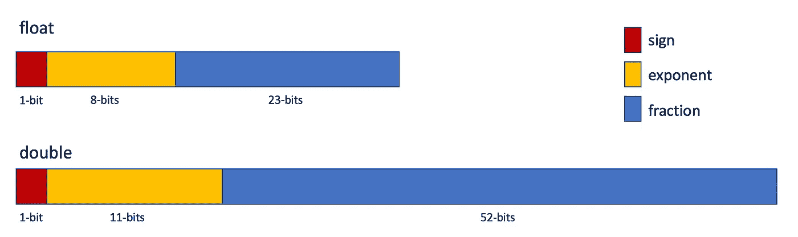

# 每个计算机科学家都应该学习的 5 个基本机制

> 原文：<https://levelup.gitconnected.com/5-underlying-mechanisms-every-computer-scientist-should-learn-8dd803e9334b>

> 这个故事将与我的常规帖子略有不同。首先，我需要说，这个列表中的每一个条目都比这里写的更深入，值得单独张贴。然而，由于我没有那么多时间，并且看到人们真的喜欢阅读他们可以快速消化的愚蠢事情的列表，我决定给这种 clickbait 标题格式一个机会。我还有四个小时的火车旅程，我会努力在到达目的地之前完成它。


斯蒂芬·斯坦鲍尔在 [Unsplash](https://unsplash.com?utm_source=medium&utm_medium=referral) 上拍摄的照片

在这里，我把一堆东西捆绑在一起，其中至少有几个可能是你们大多数人都不知道的。这些条目之间没有实际的联系，除了它们有一条共同的主线，那就是如此普通，以至于你永远不会想到有一天你可能不得不面对的问题。

所以，这里是我列出的 5 件蠢事，它们的潜在工作机制比你知道的更复杂。

## 1.浮点运算

> 第一个例子相当奇怪，它是关于 **float** 和 **double** 原语类型的。浮点类型如此简单，如此普遍，以至于在使用它们执行操作之前，您无需三思。然而，无数的软件开发人员仍然没有意识到，浮点运算充满了陷阱，如果你不小心就会被咬到。

你经历过这样的事情吗？

```
float x = 13.438;
float y = 4.562;
```

```
cout << "Result: " << x + y << endl;
```

```
------------------------------------
> Result: 17.99999999997
```

让我猜猜，你有过，第一次发生的时候你很惊讶，但是你已经看到这种行为很久了，你只是不再关心了，因为事情就是这样。我很确定当这种情况发生时你会开始关心(相信我，它会发生的):

```
if (x + y == 18) {
    cout << "Yay!" << endl;
} else {
    cout << "Oh crap!" << endl;
}
```

```
--------------------------------
> Oh crap!
```

如果你在处理计算机图形，你会一直处理这种浮点错误。要理解浮点运算，首先，你需要理解浮点数是如何存储的。

逛一会你的中学数学资料。你学到了在数字 0 和 1 之间有无穷多个数字。如何用有限的位数来表示无限多的数字呢？一个**浮点型**包含 32 位，一个**双浮点型**包含 64 位。所以，你只能表示有限数量的实数，除非你有无限的空间。

你的祖先——书呆子，而不是制作木制工具来捕猎动物的人——想出了一个巧妙的技巧来表示浮点数。他们将比特分成三部分:符号、指数和分数。



然后根据公式计算:


因此，浮点数表示为-1.56473 *。因为不是所有的实数都可以用浮点数或双精度数来表示，所以你需要小心操作它们。`*>*`和`*<*`操作符仍然会像预期的那样工作，但是当你做相等检查时，你必须格外小心。

检查浮点数之间相等性的一个常见策略是使用一个允许少量精度误差的**ε值**。分配给 epsilon 变量的数量取决于您的应用需求，但它是这样工作的:

```
final float EPSILON = 0.00001;
```

```
float x = ...
float y = ...
```

```
if (abs(x - y) < EPSILON) {
    return true;
}
```

这样你就可以避开可忽略的精度误差。在这一点上，非常重要的是要明白**当精度很重要的时候**，你永远不应该使用浮点数和双精度数，例如为了表示钱。许多编程语言都支持这类操作的 BigDecimal 接口，它使用字符串，运行速度较慢，但能保证结果的准确性。您也可以简单地使用整数，然后在需要打印时格式化它们。

## 2.随机数生成

> 就像浮点数一样，随机数在我们的日常开发活动中也经常使用。而且就像浮点数一样，随机数有着比乍看起来更复杂的内在逻辑。

大多数编程语言都支持 API 来生成随机数，我们所要做的就是调用相应的函数。如果你使用的是 **C++** ，你需要做的就是

```
int value = rand();
```

Java 的**版本和**版本差别不大:

```
int value = random.nextInt();
```

许多编程语言都打包了这种标准 API 功能，以使您的生活更加轻松。不利的一面是，许多软件工程师倾向于忽略这些概念，因为它们只是简单地放在银盘子里。但是计算机是如何产生随机数的呢？在继续前进之前，你可能想先思考一会儿…

随机数生成实际上是计算机科学中一个非常难的问题。原因是，生成一系列统计上独立的数字是一项**非确定性的**工作，但是我们使用的计算机是**确定性的**，这意味着对于相同的输入条件，你总是会得到相同的结果。出于这个原因，如果没有一些使用不断变化的物理世界数据的嵌入式设备的帮助，你就无法生成真正的随机数。这种行为实际上不可能在我们的计算机中模拟，因为有无限多的条件。

相反，我们使用**伪随机数发生器(PRNG)** 。他们生成的数字看起来是随机的，但实际上是预先确定并经过数学计算的。您为 PRNG 提供一个初始种子，随机数序列中的每个值都是根据给定的公式计算出来的。这意味着，只要知道 PRNG 的种子和状态，就可以确定该函数将生成的每个值。

[线性同余法](https://en.wikipedia.org/wiki/Linear_congruential_generator)广泛用于生成数值。公式看起来像这样


其中，x₀是功能种子。

理解真随机性和伪随机性之间的区别很重要。PRNGs 通常可以满足您日常编码的需要。但是要小心，它们非常容易预测，无法满足你更复杂的需求。例如，随机性对于加密安全的应用程序非常重要，除非您希望您的应用程序受到威胁，否则您应该使用更复杂的方法。

## 3.行主要和列主要排序

> 如果不知道数据是如何存储在内存中的，那么即使是简单的数组遍历也会有问题。

行主和列主顺序是关于多维数组在内存中的存储方式。考虑下面给出的 2D 阵列:


在行优先排序中，一行中的**连续元素**被**连续存储在内存中**，如下图所示。


对于列主排序中的列也是如此。


像 C++这样的编程语言使用行优先顺序，而 Fortran 这样的编程语言使用列优先顺序。根据您使用的编程语言，您如何遍历多维数组将会影响算法的性能，因为访问内存中的连续位置会更快。

当您逐行访问元素时，行优先顺序工作得更快:

```
for (int i = 0; i < rowCount; i++) {
    for (int j = 0; j < colCount; j++) {
        int element = arr[i][j];
        // Do something
    }
}
```

同样，列优先顺序逐列运行速度更快:

```
for (int i = 0; i < colCount; i++) {
    for (int j = 0; j < rowCount; j++) {
        int element = arr[j][i];
        // Do something
    }
}
```

## 4.字节序

> 数据表示可能会在网络上改变，您需要处理它。否则，你可能会得到被误解的信息。

字节顺序是存储在内存中的数据字节的顺序。我们将面临两种选择，**小端**和**大端。**我们用随机整数 1682348653，十六进制等于 **0x64469A6D** 。

*   一个**小端**系统在最大地址存储最高有效字节。


*   一个**大端**系统在最小的内存地址存储最高有效字节。


基本上，大端是从左向右读，而小端是从右向左读。

处理字节序可能会有问题。例如，如果您正在编写一个用于网络传输的低级序列化/反序列化算法，您需要确保在通信的两端使用相同的方法，否则，您将会得到错误的数据。

## 5.分支预测

> 在现代编程语言中，我们大量使用 **if 语句**，因为它们只有`*O(1)*`算法复杂度。但是算法的复杂性可能是欺骗性的。实际上，`*O(nlogn)*`算法可能比`*O(n)*`算法工作得更快，这取决于它所做的运算。分支在组装级别上并不是没有代价的。

分支在程序集级别是如何工作的？你看，每次我们遍历一个 if 语句，处理器都需要决定是执行**条件跳转**到一个不同的语句，还是只执行下面的语句。但是这个决定是如何减缓执行的呢？因为处理器使用**流水线**，并行运行指令以增加吞吐量。当处理器遇到条件跳转时，它根本不知道哪个指令将被添加到流水线中。

这就是为什么现代微处理器有一种叫做**分支预测**的机制。分支预测器试图猜测是否进行了转移。那么最有可能的指令将被预先推测性地执行。一旦到达条件跳转，就检查条件，如果猜对了，程序就继续执行语句。如果猜测是错误的，已执行的语句将被丢弃，管道将通过损失一些时间从正确的分支重新开始。

分支预测器通过跟踪执行的条件来实现这一点。所以一开始，真的没什么好猜的。随着时间的推移，他们越来越擅长猜测，因为有更多的历史数据可供随意使用。预测器的成功率会影响程序的效率，并且在有限的资源环境中，分支的成本可能比您想象的要高。

如果你读到这里，你应该已经注意到这个列表中的每一个条目都涉及到你在成为软件工程师的头几个月里学到的非常简单的概念:原始类型、If 语句、for 循环……所以，你永远不要低估你的敌人。

> 恭喜你，你已经是一个比昨天更好的开发者了。我还有一个小时空闲。网飞和希尔？

# 分级编码

感谢您成为我们社区的一员！在你离开之前:

*   👏为故事鼓掌，跟着作者走👉
*   📰查看[级编码出版物](https://levelup.gitconnected.com/?utm_source=pub&utm_medium=post)中的更多内容
*   🔔关注我们:[推特](https://twitter.com/gitconnected) | [LinkedIn](https://www.linkedin.com/company/gitconnected) | [时事通讯](https://newsletter.levelup.dev)

🚀👉 [**加入升级人才集体，找到一份惊艳的工作**](https://jobs.levelup.dev/talent/welcome?referral=true)