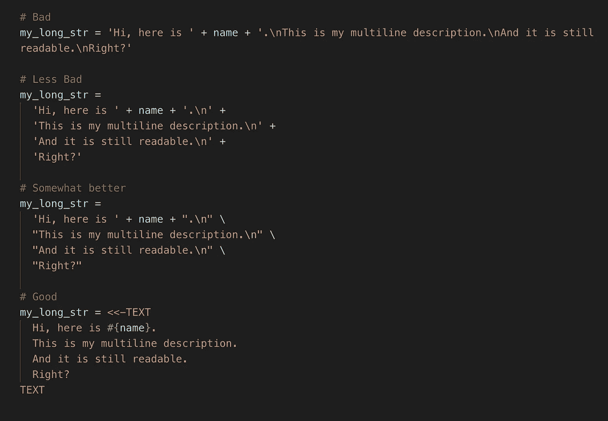

# 使复杂的红宝石字符串可读的 5 个技巧

> 原文：<https://levelup.gitconnected.com/5-underrated-tips-to-make-complex-ruby-strings-readable-38610519787f>

## 最佳实践

## 如何编写让你感到自豪的代码

**String** 是 Ruby 中最基本、最流行的数据类型之一。因此，字符串构造是最常见的操作之一。然而，当字符串变长时，代码开始变得复杂，尤其是当涉及大量底层逻辑时。

下面是一些技巧和窍门，在构建 Ruby 字符串时，它们将极大地帮助提高代码的**可读性**和**可测试性**。

# 1.级联内插

[查看要点](https://gist.github.com/ntd251/a4e740c251959c9f1f8af34a6cce0fdd#file-mrsga__interpolation-rb)

# 2.HEREDOC 用于多行字符串

[要点视图](https://gist.github.com/ntd251/f27e86af54d36aacda1065735bb09c0e#file-mrsga__heredoc_multiline-rb)

# 3.这里是语法高亮显示的文档

作为一种脚本语言，人们经常使用 Ruby 为其他语言生成代码。

*   **SQL** (数据库迁移、查询等)
*   **标记** (HTML，XML，…)
*   **Lua** (Redis 脚本，…)。

**HEREDOC** 块支持大多数 ide 中的语法高亮显示(Sublime，VS Code，…)

VS 代码截图

# 4.将数据操作与表示层分开

这将允许数据操作和字符串构造(即，表示逻辑)被单独和更简单地测试。

[要点视图](https://gist.github.com/ntd251/35a2d54c3aec9cac942b0db919b9661a#file-mrsga__data_presentation-rb)

# 5.使用域库构建域字符串

在为特定领域的场景(如 URI、XML 等)构建字符串时，确保满足这些领域的要求和验证是很重要的。

举个例子

*   URIs 中的特殊字符应该被编码成安全的格式
*   XML 文档应该是格式良好的，并根据 XML 规范进行验证

因此，建议在这些场景中使用特定于领域的库。这也有助于避免重复发明轮子。

## URI 建筑

大多数 HTTP 客户端 gem 应该适合这个目的。

[观点要点](https://gist.github.com/ntd251/43516a52823fa2ebad9a84a07d38f8cb#file-mrsga__uri-rb)

## XML 构造

# 结论

感谢阅读。我错过了什么吗？你有哪些处理长串的经验？

我很高兴收到你的来信。