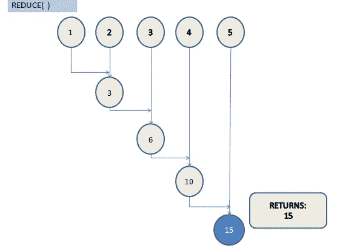

# 5 独特的 Python 函数

> 原文：<https://levelup.gitconnected.com/5-unique-python-function-7f99c927523b>

## 学习这些使用列表 Python 函数


Emile Perron 在 [Unsplash](https://unsplash.com?utm_source=medium&utm_medium=referral) 上的照片

函数是一些操作的预定义代码，在 Python 编程中起着至关重要的作用。在本文中，了解一些使您能够处理列表的功能。学会使用 Python 中的列表或 iterable 是至关重要的。这里有几个函数可以让你做到这一点。

# 1.累积:

accumulate 函数处理类似字典、列表或元组的可迭代对象。当您需要每次迭代的中间步长值时，使用此函数。请看图表，以便更好地理解；它展示了累加功能的工作原理。

```
**Syntax**: itertools.accumulate(iterable[, function, initializer])
```

**代号:**

```
from itertools import accumulate

list1 = [1,2,3,4,5]

def function(x, y):
    return x+y

print(list(accumulate(list1,function)))
```

**工作:**

*   为了理解 accumulate()函数的工作原理，我们有一个从 itertools 模块导入 accumulate 的基本程序。
*   在程序中，我们考虑了一个简单的列表和一个求和函数。
*   第一步从列表中返回值 1。
*   以下步骤返回返回值和列表中下一个值的总和，形成值 3、6、10 和 15。
*   在所有的迭代之后，它形成一个新的列表[ 1，3，6，10，15]作为输出。


# 2.列举:

Enumerate 是一个内置函数，它在不使用任何循环的情况下向 iterable 添加一个计数器。一个列表被转换成一个带有索引和它的值对的对象。请看展示枚举函数工作原理的图表。

```
**Syntax**: enumerate(iterable, start)
```

**代码**:

```
list1 = ['A', 'B', 'C', 'D', 'E']
object1 = enumerate(list1)
print(list(object1))
```

**工作**:

*   枚举函数向 iterable 添加计数器。我们有一个程序来理解这个功能。
*   枚举函数将一个列表变成一个对象。
*   该对象由一组对组成；每对都由索引值及其列表元素组成。
*   您可以指定起始索引值，或者默认情况下，它从零开始。


# 3.Reduce():

Reduce 是一个函数，它对所有列表元素执行相同的操作，并在所有迭代后最终返回单个元素。为了更好地理解，请看图表。它展示了 reduce()函数的工作原理。

```
**Syntax:** reduce(function,sequence)
```

## 代码:

```
import functools
def sum(a,b):
    return a+b

numbers = [1,2,3,4,5]
result = functools.reduce(sum, numbers)
print(result)
```

**工作:**

*   Reduce 函数在 functools 模块中可用。
*   我们有一个程序来理解 reduce 函数，其中我们考虑了一个简单的列表[1，2，3，4，5]和一个添加两个元素的函数。
*   在每一步，它接受两个输入并返回一个元素。
*   列表的总和将是输出 15。



# 4.邮编:

Zip 是一个很棒的内置函数，对于合并两个或更多数据集很有用。这个函数将两个或更多的 iterable 作为输入，并对它们进行压缩，形成一个元组列表。请看展示 zip 函数工作原理的图表。

```
Syntax:zip(*iterables)
```

**代码:**

```
key = ["First_Name", "Last_Name", "Location", "Age"]
value = ["Mick", "John", "USA", "40"]
user_info = list(zip(key, value))
print(user_info)
```

**工作:**

*   在这个例子中，我们将两个简单的集合组合成另一个数据集。
*   Zip 函数映射列表并将其转换为元组。
*   每一对都是根据索引值从提供给 zip 函数的列表中派生出来的。
*   您还可以使用相同的 zip 函数解压缩元组列表。


# 5.地图:

Map()是一个内置函数，它将指定的函数应用于 iterable 中的所有项。该映射可以将一个或多个可迭代对象作为输入。map 对所有元素使用相同的操作，并返回与 iterable 相同数量的元素。请看展示地图功能工作原理的图表。

```
**Syntax:** map(function,iterables)
```

**代号:**

```
def add_list(a,b):
    return a+b
res = list(map(add_list, [1,  2, 3], [ 4, 5,6]))
print(res)
```

**工作:**

*   我们有一个简单的程序来理解映射函数，其中我们考虑了两个列表[1，2，3]，[ 4，5，6]。
*   我们已经定义了一个函数来添加两个列表中的元素。
*   它产生一个输出[5，7，9]。


这里有一个订阅链接，可以用 Medium 阅读数千篇文章。请考虑订阅并支持许多作者:

[](https://swathiarun63.medium.com/membership) [## 通过我的推荐链接加入媒体

### 作为一个媒体会员，你的会员费的一部分会给你阅读的作家，你可以完全接触到每一个故事…

swathiarun63.medium.com](https://swathiarun63.medium.com/membership)