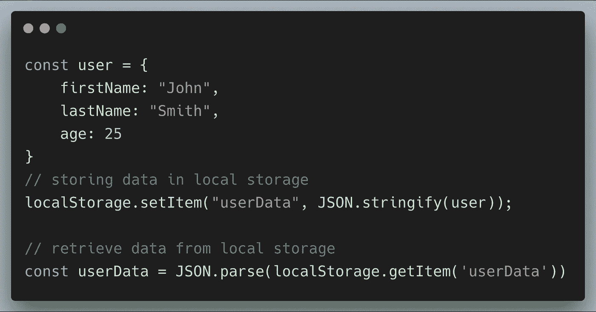
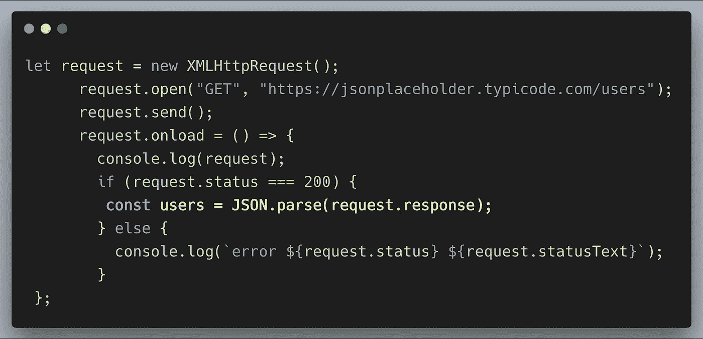
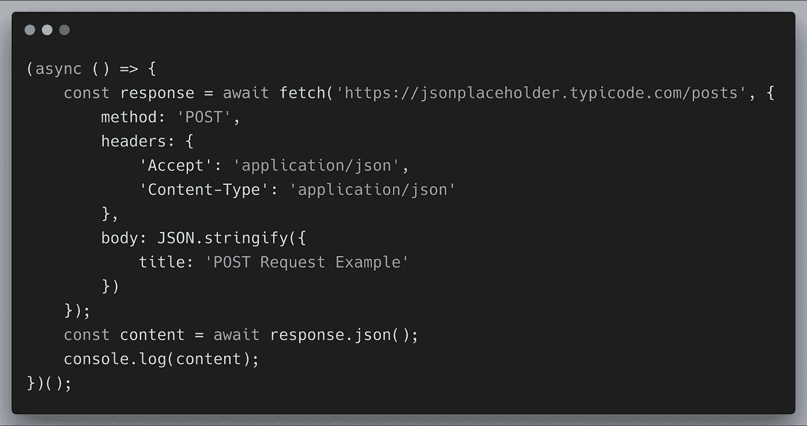
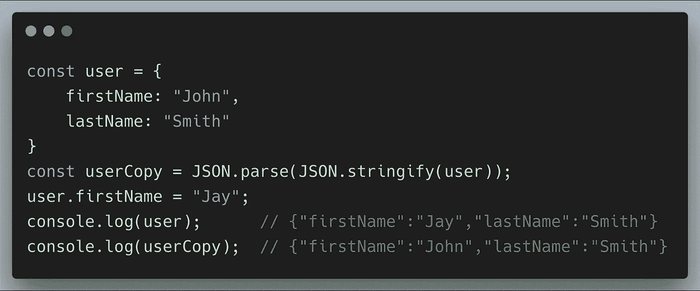
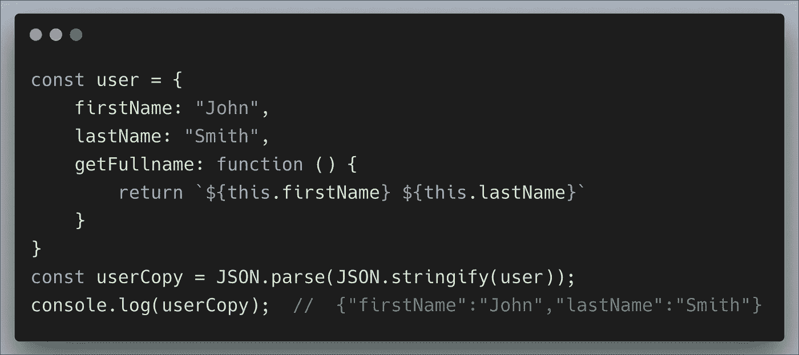
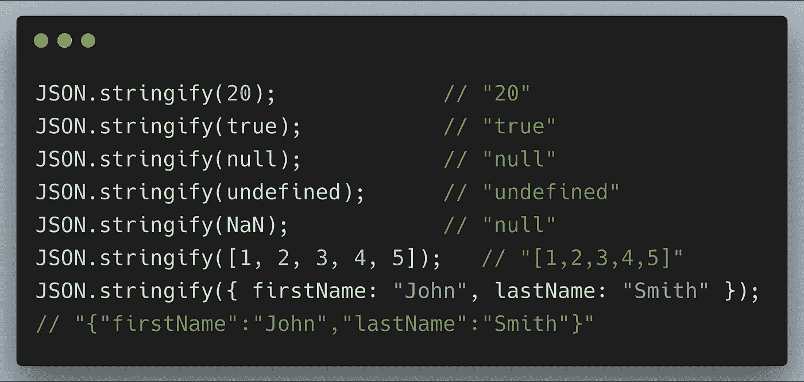

# 我们可以使用 JSON.stringify 和 JSON.parse 的 5 个地方

> 原文：<https://levelup.gitconnected.com/5-uses-of-json-stringify-json-parse-9b79cb4d9645>

JSON **(JavaScript 对象符号)**是一种将数据表示为对象的通用格式，它模仿了 JavaScript 的对象格式。最初，它只适用于 JavaScript，但是很多其他语言，比如 Java、Python 和 Go，都使用这种格式在客户机和服务器之间共享数据。

我们来讨论一些真实的用例。

## **从本地存储或会话存储中存储和检索数据**

`localStorage`和`sessionStorage`属性允许我们在 web 浏览器中保存键/值对。

本地存储只能保存字符串，因此存储对象需要在存储之前使用`JSON.stringify`将其转换为字符串。你不能要求本地存储直接存储一个对象，因为它会存储**【Object Object】。**

此外，当从本地存储中检索数据时，我们需要运行`JSON.parse`。让我们看看下面的例子:

## `XMLHttpRequest`从服务器获取数据

当从 API 中检索响应时，默认情况下响应是字符串格式的，我们需要将它`parse`到 JSON 中。

## 发出 POST 请求时字符串化正文

当向服务器发送 POST 请求时，我们需要`stringify`body 对象。让我们看看下面的例子。

## **深度克隆一个 JavaScript 对象**

用 JavaScript 复制对象可能很棘手。执行浅层复制有不同的方法，这是大多数情况下的默认行为。然而，创建对象的深层副本可能更具挑战性。

通过使用`JSON.stringify`，我们可以在 JavaScript 中创建一个对象的深度克隆。

在 JSON 中，函数不允许作为对象值。`JSON.stringify()`将从 JavaScript 对象中移除任何函数，包括键和值。因此，这种深度克隆仅用于数据属性。

所有主流浏览器都支持`JSON.stringify()`功能。

## 将任何数据类型转换为字符串

我们可以通过使用`JSON.stringify`将任何类型的数据类型值转换成字符串。

在使用 JavaScript 开发应用程序时，很多时候需要将数据序列化为字符串，以便将数据存储到数据库中或将数据发送到 API。数据必须是字符串的形式。

就是这样！我希望这篇文章能帮助您增加对 JSON 的理解。

感谢阅读:)