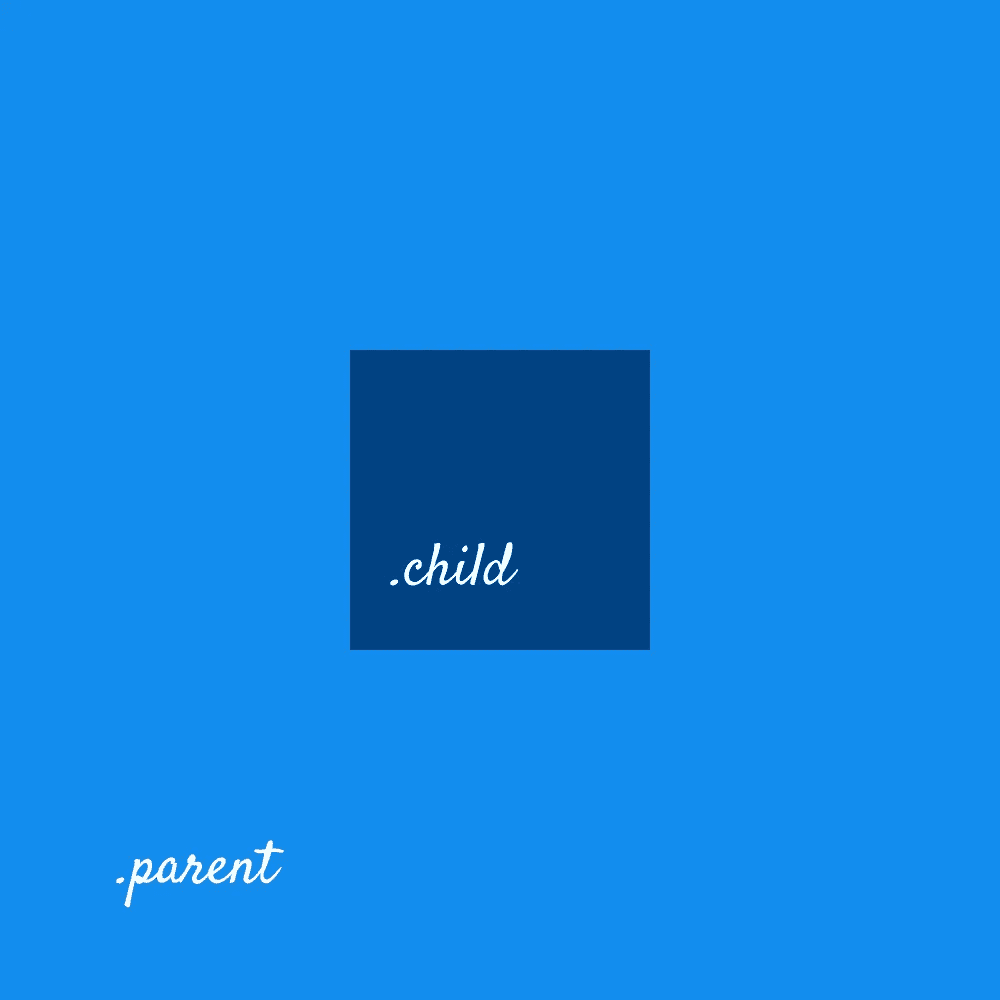

# 使用 CSS 居中 div 的 5 种方法。

> 原文：<https://levelup.gitconnected.com/5-ways-to-center-a-div-using-css-fcd790524708>


让我告诉你一个叫钱德的家伙。钱德勒是一名优秀的程序员。他过去常常编写干净的解耦代码。他过去常常构建健壮且可扩展的设计系统。他受到所有人的爱戴。

有一天，他想将一个 div 居中，对他来说一切都变了…

老实说，我们都与 CSS 斗争，并试图找到我们的和平与它。我们都发现自己对在 CSS 中居中感到沮丧。

请允许我快速地告诉你 5 种方法，通过它们你可以垂直和水平地将一个 div 居中

# 问题陈述

我们有两个 div`parent`和`child`，我们需要将`child`相对于`parent`居中。

```
<div class="parent">
  <div class="child"></div>
</div>
```



它应该是什么样子

# 1.使用 Flexbox

灵活的框布局模块，使得不使用浮动或定位就能更容易地设计灵活的响应布局结构。

对`.parent`应用以下属性将使`.child`水平和垂直居中。

```
.parent {
  display: flex;
  justify-content: center;
  align-items: center;
}
```

完整代码:

# 2.使用位置

属性指定用于元素的定位方法的类型(静态、相对、固定、绝对或粘性)。

将位置`relative`应用到`.parent`:

```
.parent {
  position: relative; 
}
```

对于`.child` div，应用位置`absolute`并使用`top`、`left`和`transform`属性使内容居中:

```
.child {
  position: absolute;
  top: 50%; 
  left: 50%; 
  transform: translate(-50%, -50%);
 }
```

完整代码:

# 3.使用 CSS 网格

CSS 网格布局模块提供了一个基于网格的布局系统，具有行和列，使得设计网页更加容易，而不必使用浮动和定位。

将以下属性应用于`.parent`将使`.child`水平和垂直居中。

```
.parent {
  display: grid; 
  justify-content: center; /*horizontal*/ 
  align-content: center; /*vertical*/
 }
```

完整代码:

# 4.使用表格

曾经有一段时间，表格是构建 HTML 的唯一真正的方法，即语法。但是使用 CSS 样式，我们可以使元素，比如`<div>`标签的行为类似于`<table>`和`<td>`标签。

将以下属性应用于`.parent`

```
.parent {
  display: table-cell; 
  text-align: center; /*horizontal*/
  vertical-align: middle; /*vertical*/
}
```

将以下属性应用于`.child`

```
.child {  
  display: inline-block;
}
```

完整代码:

# 5.弹性项目上的自动边距

在 flex 项目上使用`margin: auto`,不仅会像在块布局中一样将元素水平居中，还会将其在垂直轴上居中:

在`.parent`和`.child`上应用以下属性:

```
.parent {
  display: flex;
}.child {
  margin:auto;
}
```

完整代码:

谢谢你花时间滚动到最后😊

关注我，了解更多精彩内容。让我们通过 [Twitter](https://twitter.com/satyam_saluja) 或 [LinkedIn](https://www.linkedin.com/in/satyam04/) 联系

# 分级编码

感谢您成为我们社区的一员！ [**订阅我们的 YouTube 频道**](https://www.youtube.com/channel/UC3v9kBR_ab4UHXXdknz8Fbg?sub_confirmation=1) 或者加入 [**Skilled.dev 编码面试课程**](https://skilled.dev/) 。

[](https://skilled.dev) [## 编写面试问题+获得开发工作

### 掌握编码面试的过程

技术开发](https://skilled.dev)